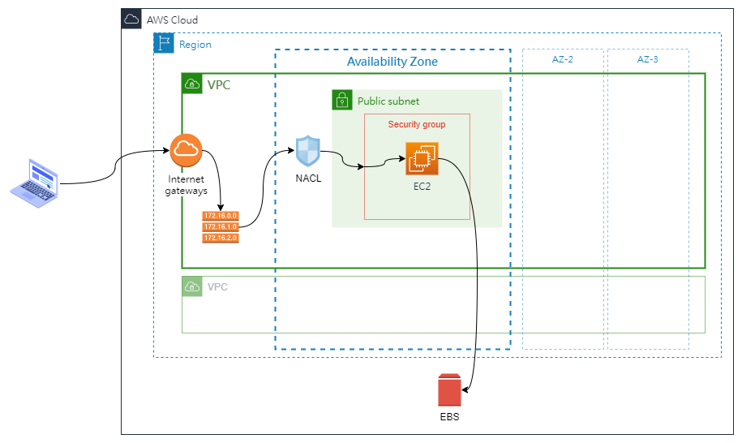
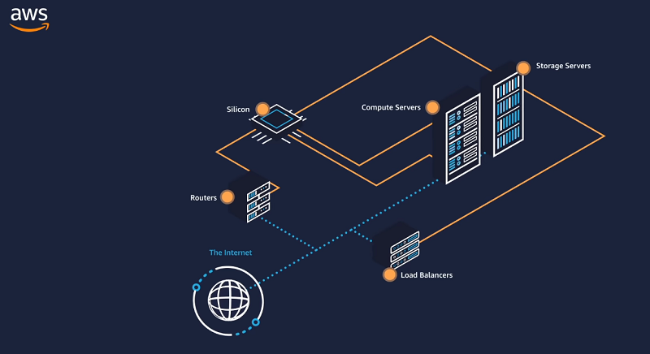
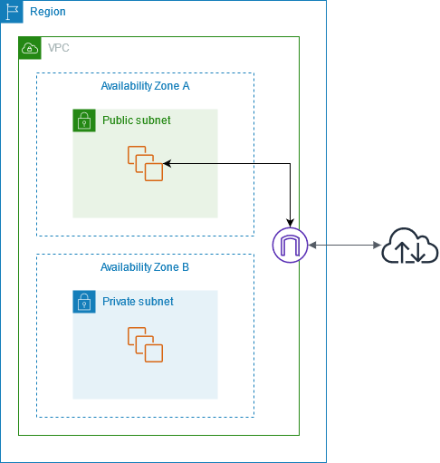
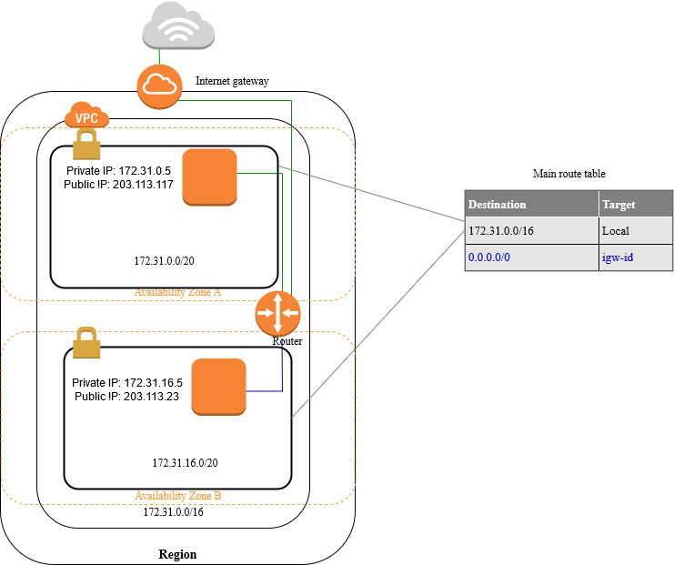
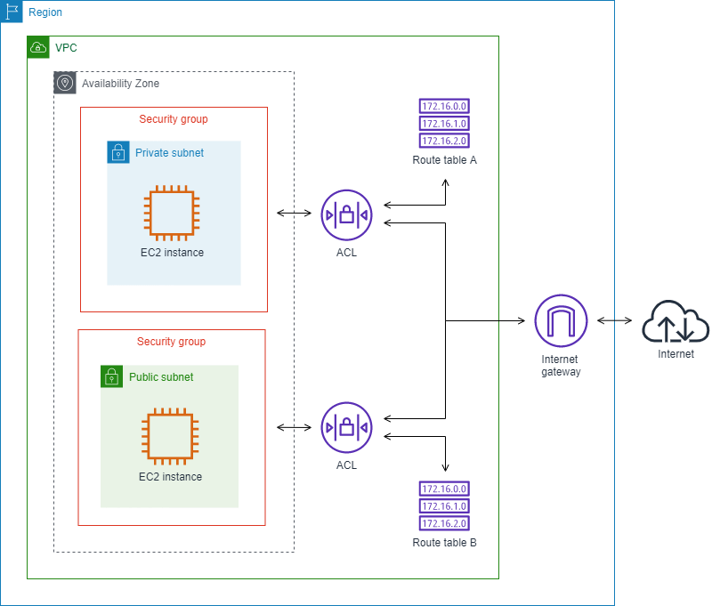
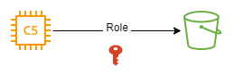
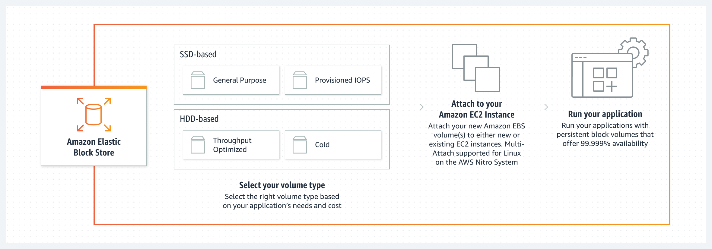

---
title: 系統架構演進與 AWS 雲端服務結合(1) - 內部系統快速驗證
tags:
  - AWS
  - 系統架構
  - Cloud
date: 2022-06-24T01:17:18.867Z
categories:
  - 架構
  - 雲端學習手札
keywords:
  - 雲端
  - AWS
  - EC2
  - EBS
  - VPC
description: 本文章藉由同一機器的地端架構對應 AWS 雲端服務，學習與理解雲端可支援的服務項目。
lastmod: 2022-06-26T16:45:14.386Z
slug: mvp-vaification
---

假設新創的網路服務提供商，隨著業務的發展，提供服務的軟體系統，從最初的簡易架構，依據面臨的挑戰與需求，不停調整擴充系統架構。

系統若建立在雲端，隨著系統架構的演進的同時，所對應雲端服務供應商的服務。本文章僅為個人學習與理解雲端服務的手札，有任何更好的建議都歡迎告知。

<!--more-->

系統架構演進階段

- **內部系統快速驗證**

---

## 一、情境背景

今天，有一個新創的網路服務提供商，老闆想要在正式推出產品前，先建立服務的雛形。提供之前參與 MVP(最小可行性產品) 的外部關係人，可以搶先體驗服務，並協助提供意見與優化方向。

老闆希望在系統開發的初期，以最高的成本效率進行驗證。在與團隊溝通討論後，決定採用雲端服務平台，減少初期投入成本過高的問題。

目前公司組成，除了老闆、業務外，技術團隊內，只有三名開發人員，其中一名開發人員兼任雲端服務管理員。

開發團隊統整老闆在這個時期對系統的要求如下

- 硬體支出成本盡可能的低。
- 快速驗證系統可行性，提供外部關係人試用。
- 產品正式上線前，需將站台與資料庫分開，並清空所有的資料。
- 在三個月內要完成 MVP 開發與驗證，視結果決定是否展開下一步。

## 二、地端系統架構

基於上述需求統整過的需求，團隊決定在測試開發階段，為減入系統複雜度與硬體成本，暫時將站台、資料庫全部都架設在同一台伺服器(實體機/虛擬機)。

與機敏相關的會員帳號，由開發人員建立假資料，提供給外部關係人試用。

此架構下，就可以滿足基本的站台服務，提供開發人員與相關人員進行測試。

| 優點                   | 缺點                               |
| ---------------------- | ---------------------------------- |
| 可以快速的建立一個站台 | 使用者必需知道 IP 位置才能連上站台 |
| 最少的硬體投入成本     | 資料有公開的風險                   |

---

## 三、基於 AWS 服務的雲端架構

接著，將地端的架構遷移至雲端，依 AWS 提供的服務，建立出來的雲端架構如下。

### 基礎架構設定

雲端管理員在使用 Email 在 AWS 註冊後，此帳號為 `root user`，擁有最高權限。

接著，雲端管理員要讓其他人員有限制的使用 AWS 上的資源，必需使用 IAM(Identity and Access Management) 進行存取權限(permission)的設定。IAM 主要由 `User`、`User Group`、`Role`、`Policy` 4 個元素組成，其關係為如下。

- `Policy` 定義一到多個可供授予存取的資源權限。
- `User Group` 集合多許多 `User`，可以藉由直接將 Policy 附加到 User Group 身上，讓群組內所有的 User 都使用相同的 Policy。
- 當 AWS 內的系統資源之間，互相調用資源時，利用已添加  `Policy` 的 `Role`，暫時授予系統資源間的存取權限。

AWS 已預先定義 AWS managed policies，提供許多常見的使用案例。以 IAM 為例，AWS managed policies 會提供 `User` Readonly 的 `Policy`，此時無法操作任何的雲端資源。若想要近一步設定權限，需要再行撰寫 Policy 進行權限的管理。

IAM 所使用的傳統授權模型為 **角色類型存取控制(Role-Based Access Control, RBAC)** 設計的，可以建立 User/ User Groups，並將權限給予到 Group 等級。但為面對日益雜的資源權限管理問題，也支援 **屬性類型存取控制(Attribute-based access control, ABAC)** 的管理方式。，

接著，為了便宜，先不考慮距離造成的網站延時，Region 選取美國西部的奧勒岡。

在建立 VPC 後，直接選用 AWS 預建的 public subnet，並設定 NCAL、Security Group 的安全規則設定，僅允許 80 與 443 Port 的連入。

選好 Region、AZ、VPC 與 subnet 後，接著來建立 EC2 (Elastic Compute Cloud)，在建立 EC2 時，會經過幾個步驟。

- 指定 Instance 名稱與 Tag
- 選擇 AMI: 依應用決定所使用的作業系統映像 AMI(Amazon Machine Image)
- 擇擇 Instance Type: 需要考量機器的實際用途。
- 設定 User Data: 機器運行後，自動載入的設定或軟體。
- 設定 Security Group: 指定連線的連出入規則(Inbound/Outbound rules)
- 指定 ENI (Elastic network interfaces): 指定 EC2 所使用的網路元件
- 指定 EBS (Elastic Block Store): EC2 本身的 Instance storage 會隨著機器的關閉而消失的特性，為了確保資料的持久性，搭配 EBS 進行使用。

為減少開發與機器的成本，選取 Linux base 的 AMI ，以及尋找第三方售出的 Reserved Instances，有機會可以用更低的價格租借到機器。

### 釐清脈絡

接著釐清脈絡，確認從使用者發出請求，到 EC2 接受請求，途中行經過程。

- 從 `Internet Gateway` 進入 VPC。
- 接著 `Router` 依據 `Route Tables` ，判斷進入那個 `subnet`。
- 在進入 `subnet` 前，需經過 `Network Access Control List(NACL)` 判斷請求的合法性。
- 進入 `subnet`。
- 經過 `Security Groups` 確認請求是否符合安全規則。
- 進入 `EC2`。

### 注意事項

- EC2 每次開關機，Public/Private IP 都會變更
- NACL 為 Stateless 防火牆，進出都需要進行規則核驗。
- Security Groups 為 Stateful 防火牆，只要成功進來，無需核驗就可直接出去；反之相同。

---

## 四、AWS 服務簡介

接著視界從大到小的瀏覽 AWS 的資訊。從訪問的鏈路逐一探訪 Region -> AZs -> VPC -> EC2。

### Infrastructure

#### Region

AWS 於世界各地建立了大型實體機房，這些機房可視為資料中心，資料中心依所在位置，組成 Availability Zones，簡稱 AZ。

這些 AZ 彼此之間相互隔離、物理上分離，並將同一個地理區域內的多個 AZ 組成 Region。以確保可在同一 Region 內，橫跨多個 AZ 部署應用程式，以提升容錯能力和降低延遲的情況。

也就是，每個 Region 內，至少包含三個以上的 AZ。每個 AZ 內包括一個到多個資料中心。

至 2022 年 6 月為止，共有 26 個 Region 可以使用。因各地區基礎建設成本差異，導致 Region 的價格也有所不同。

Region 與 Region 間的通訊，使用 AWS 的骨幹網路基礎設施。提供完整的冗餘網路連接，確保不會出現`單點故障`的情況，導致該 Region 內的服務失效。

選擇使用 Region 的原則，可以著眼於幾個面向。

- 資料控管、法規要求
- Region 可用的服務
- 使用成本
- 使用服務的客戶距離

#### Availability Zones, AZs

圖片來源: [Youtube: AWS Global Cloud Infrastructure](https://www.youtube.com/watch?v=RPis5mbM8c8)

每個 AZ 內，包含一個以上的資料中心組成。並透過高頻寬、低延遲網路與完全冗餘的專用都會光纖，達到 AZ 之間提供高輸送量、低延遲的網路品質。便於輕鬆地建構能在 AZ 之間自動容錯移轉的應用程式，而不會發生中斷。

圖片來源: [Youtube: AWS Global Cloud Infrastructure](https://www.youtube.com/watch?v=RPis5mbM8c8)

同時，每個 AZ 內的資料中心，都具有獨立的電源、散熱和物理安全性，並透過冗餘電源與冗餘的超低延遲與高頻寬的網路連接，確實可以持續提供服務。

採用獨立的資料中心，是以安全為第一原則，避免因為人為意外或天災造成的影響。

### Network

#### Amzon VPC

Amazon Virtual Private Cloud(Amazon VPC)，AWS 虛擬私有網路，類似於資料中心的傳統網路。

一個 VPC 橫跨 Region 內所有的 AZ。

VPC 為是用戶創建網環境的基礎元件，AWS 建議在建構基礎設施時，可以考慮一次部署橫跨多個 AZ 提高可用性。

需注意的是，橫跨不同 AZ 的連線流量，是需要額外收取流量費用的。

##### Internet Gateways

若外部流量要進入 VPC 時，必需需要經過 Internet Gateways(IGW)。IGW 提供了整個 vpc  內的資源與外部公開網路的通訊。

當 IGW 使用的 route table 與 subnet 有關連，意味著公開網路可以經由 IGW 與 subnet 建立通訊，該 subnet 為 public subnet。反之，若 subnet 與 IGW 的 route table 沒關連，則為 private subnet。

圖示來源: [AWS](https://docs.aws.amazon.com/vpc/latest/userguide/VPC_Internet_Gateway.html)

##### Route tables

用於決定 VPC 的網路流量(Network traffic)會流向何處，Route Table 內的每條 Rule 均指定網段，以及傳送流量 (目標) 的閘道、網路界面或連線。

圖示來源: [AWS](https://docs.aws.amazon.com/vpc/latest/userguide/how-it-works.html)

##### Network Access Control List, NACL

屬於 [OSI Level 4: Transport Layer]() 層級的操作，如同防火牆一般，可控制一或多個 subnet 的傳入和傳出流量。

##### subnet

一個 subnet 只能存在一個 AZ 之中，不能跨區。VPC 預設會有一個 public subnet。

subnet 可分為 public、private 或 VPN-only。

Public subnet: subnet 流量經由 internet gateway 路由到公開網路。

Private subnet: subnet 流量無法經由 internet gateway 到達公開網路，要存取公開網路必需使用 NAT 裝置。

##### Security Group, SG

作用相當於虛擬防火牆，控制群組內資源的連入與離開的流量。例如，將安全群組與 EC2 執行個體相關聯後，就會控制執行個體的傳入和傳出流量。

建立 VPC 時，有一組預設的安全群組，也可以額外建立新的安全群組。

每個安全群組，可依據協定和連接埠編號控制流量，對傳入流量和傳出流量建立不同的規則集合。

因為可依據協定和連接埠編號控制流量，應屬於 OSI Level 3: Network Layer / [OSI Level 4: Transport Layer]() 層級的操作。([參考來源](https://stackoverflow.com/questions/65507894/at-what-osi-layer-do-aws-security-groups-operate))

##### Security Group v.s. NACL

| Security Group                                                                                   | NACL                                                                                              |
| ------------------------------------------------------------------------------------------------ | ------------------------------------------------------------------------------------------------- |
| 在執行個體層級運作                                                                               | 在子網路層級運作                                                                                  |
| 僅支援允許規則                                                                                   | 支援允許規則和拒絕規則                                                                            |
| 具狀態：自動允許傳回流量，不受任何規則影響                                                       | 無狀態：傳回流量必須經規則明確允許                                                                |
| 在決定是否允許流量前，先評估所有規則                                                             | 在決定是否允許流量時，依序處理規則，從編號最低的規則開始                                          |
| 若某人於啟動執行個體時指定安全群組，或在啟動後將安全群組與執行個體建立關聯，才會套用至執行個體。 | 自動套用至子網路與其相關聯的所有執行個體 (因此，如果安全群組規則太過寬鬆，則它會提供額外一層防禦) |

圖示來源: [AWS](https://docs.aws.amazon.com/vpc/latest/userguide/VPC_Security.html)

##### Elastic network interfaces, ENI

為 VPC 內的邏輯網路元件，可視為虛擬網路卡。

可附屬或拔除於 EC2 instance，或是換到另一個 EC2 instance。當 ENI 換到新的 instance 時，流量也會自動流向新的 instance。

### Security

#### IAM

用於管理誰可以通過身份驗證（登錄）和授權（有權）使用 Amazon 資源。

首次建立的帳戶，其身份為 `root user`，可操作 AWS 內所有的服務與資源。為了安全，請勿使用 `root user` 進行日常任務的操作。

##### Policy

AWS 內的存取管理，是藉由建立 Policy 並附加於 IAM 身份(`user`、`user group`、`roles`) 或 AWS 的資源身上，來定義他們的存取權限。而 Policy 內的權限，會決定請求是被允許或是拒絕。

AWS 支援六個類型的 Policy，使用頻率的從高到低，分別如下。

- Identity-based policies
  
  將 Policy 附加於 IAM 身份，來授予他們的權限。

- Resource-based policies
  
  將 Policy 附加於資源身上，授予資源的存取權限。

- 權限邊界(Permissions boundaries)
  
  用於管理 `user`、`role` 的 Policy 的最大權限，但只能用於 Identity-based 的 Policy。

- Organizations SCPs
  
  全名 Organizations service control policy (SCP) ，用於定義組織內的帳戶成員最大權限。
  
  可用於 Identity-based 與 Resource-based 的 Policy，但要注意的是，它只是**限制**可授予的最大權限，並非授予權限。

- 存取控制清單(Access control lists, ACLs)
  
- Session policies
  
##### Role

使用 `role` 將訪問權限委派給無法訪問您的 AWS 資源的用戶、應用程序或服務。

`role` 在存取連線的過程中，只會提供暫時性的安全憑證，不會使使用標準長時效的憑證。

##### User Group

`User Group` 可以集中管理 `User` 的權限。只要將 Identity-based 的 Policy 附加到 `User Group`，在群組內所有的 `user` 都會使用相同的 Policy。

`User Group` 有一些重要的特質。

- 一個 `User Group` 包含多個 `User`，而且一個 `User` 也可以隸屬多個 `User Group`。
- `User Group` 無法包含其他 `User Group`

圖示來源: [AWS](https://docs.aws.amazon.com/vpc/latest/userguide/how-it-works.html)

`Users` 或 `User Group` 可以附加多組不同權限的 Policy，此次 `User` 的權限由 Policy 組合出來。

### Compute

#### Amzon EC2

Amazon EC2 全名 Amazon Elastic Compute Cloud，

可將 EC2 視為一台 Virtual Machine，依據不同的使用情境，以提供各種最佳化執行個體類型。

|               |      一般用途      | 運算最佳化 |  記憶體最佳化   |      加速運算      |   儲存最佳化   |
| ------------- | :----------------: | :--------: | :-------------: | :----------------: | :------------: |
| Instance Type | a1, m4, m5, t2, t3 |   c4, c5   | r4, r5, x1, z1  | f1, g3, g4, p2, p3 |   d2, h1, i3   |
| 用途範例      |        多元        |   高效能   | Memory Database |      機器學習      | 分散式檔案系統 |

收費方式與適用場景

- 隨需(On-Demand)
  - 偏好擁有低成本和 Amazon EC2 提供的靈活性，但不打算支付預付款或簽署長期合約的使用者
  - 具有短期、難應付或無法預測的工作負載且該工作負載不能被中斷的應用程式
  - 按小時支付運算容量費用，無最低承諾的要求。
- 競價(Spot)
  - 具有彈性的啟動和結束時間的應用程式
  - 只在非常低的運算價格才適用的應用程式
- 預留(Reserved)
  - 預留執行個體是由 AWS 和第三方賣方出售，有時會提供較低的價格和較短的期間。
  - 需決定執行的執行個體數量和期間長度 (1 或 3 年)。
- Save Planing
  - 比預留有更靈活的計費方式
- 專用主機(dedicated-hosts)
  - 專供使用的實體 EC2 伺服器，以使用現有繫結伺服器的軟體授權，以協助降低成本與符合規範要求。
  - 可以用預留的形式購買，最高可享有隨需價格 70% 的折扣。

|       | 隨需(On-Demand) |       競價(Spot)       | 預留(Reserved) | Save Planing | 專用主機(dedicated-hosts) |
| :---: | :-------------: | :--------------------: | :------------: | :----------: | :-----------------------: |
| 價格  |      最貴       | 最便宜 ( 最多 90% Off) | (最多 72% Off) |  (72% Off)   |         (70% Off)         |

### Storage

#### Amazon EBS

Amazon Elastic Block Store (Amazon EBS) 是易於使用、可擴展的高效能區塊儲存服務，屬於 block-level Storage，用於 EC2 Instance 的持久性區塊儲存。

圖片來源: [AWS](https://aws.amazon.com/tw/ebs/)

依價格由高至低，列出 4 種類型。

- 一般用途(General Purpose) SSD 磁碟區 (gp2 和 gp3)
  - 平衡各種交易工作負載的價格與效能。
  - 適合用於開機磁碟區、中型單一執行個體資料庫，以及開發與測試環境等使用案例。

- 佈建 IOPS SSD 磁碟區(Provisioned IOPS SSD)
  - 專門為有大量輸入 / 輸出並且對儲存效能和一致性敏感的工作負載而設計。
  - 可指定的 IOPS 速率，並且保持穩定。

- 輸送量最佳化 HDD (Throughput Optimitzed HDD)
  - 提供低成本的磁性儲存體，它按照輸送量而非 IOPS 來定義效能。
  - 適合循序的大型工作負載，例如 Amazon EMR、ETL、資料倉儲和日誌處理。

- 冷 HDD (Cold HDD)
  - 供低成本的磁性儲存體，它按照輸送量而非 IOPS 來定義效能。
  - 適合不需要頻繁存取資料。

## 五、延伸知識與補充資料

- Virtual Machine, VM
- AWS 官方文件
  - [Amazon Virtual Private Cloud](https://docs.aws.amazon.com/vpc/index.html), VPC
  - [Public/Private subnet](https://docs.aws.amazon.com/vpc/latest/userguide/configure-subnets.html)
  - [VPC Internet gateway](https://docs.aws.amazon.com/vpc/latest/userguide/VPC_Internet_Gateway.html)
  - [Amazon Elastic Block Store](https://docs.aws.amazon.com/ebs/), EBS
  - [AWS Identity and Access Management (IAM)](https://docs.aws.amazon.com/iam/index.html)
