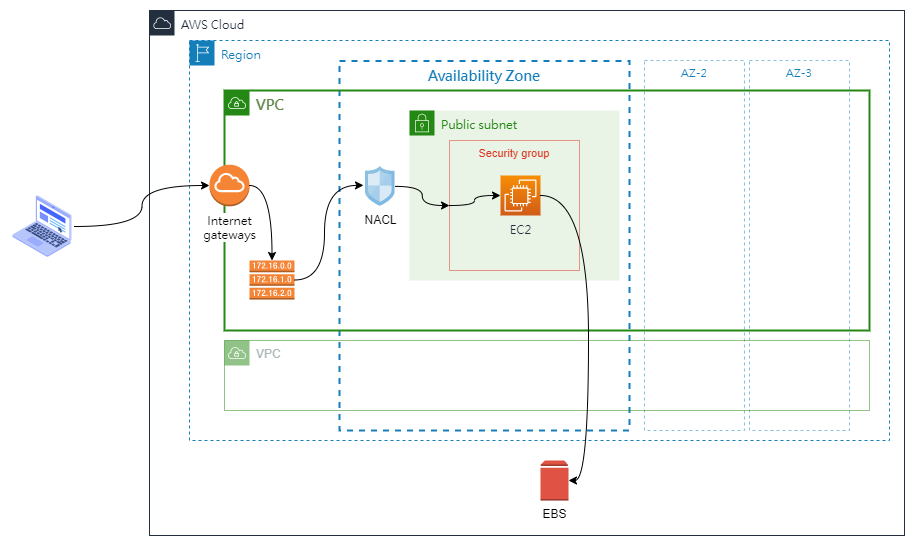
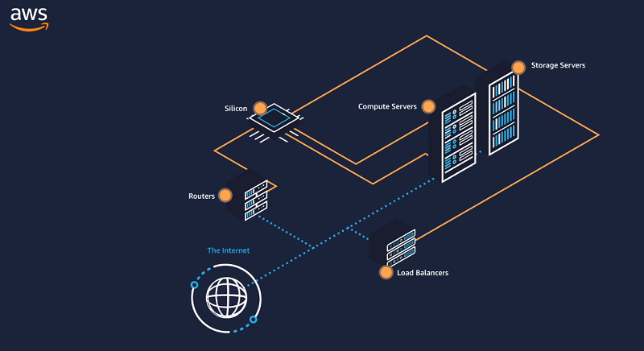
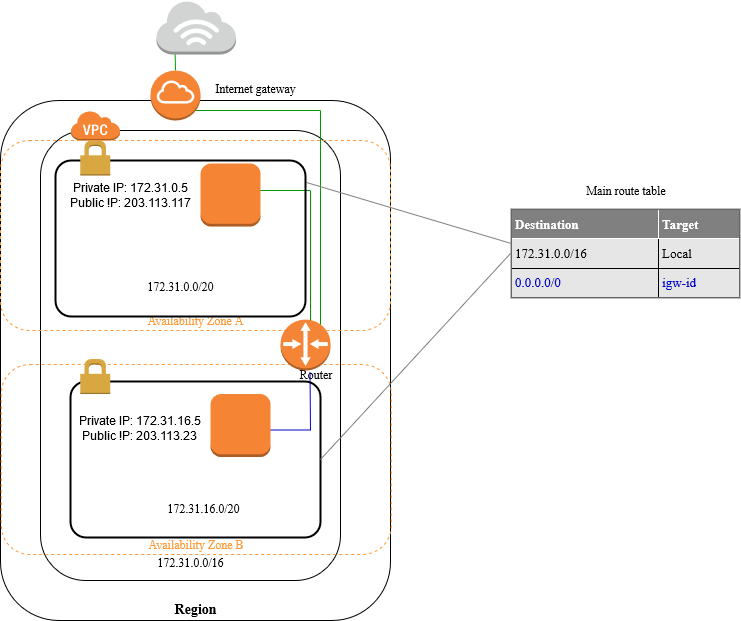
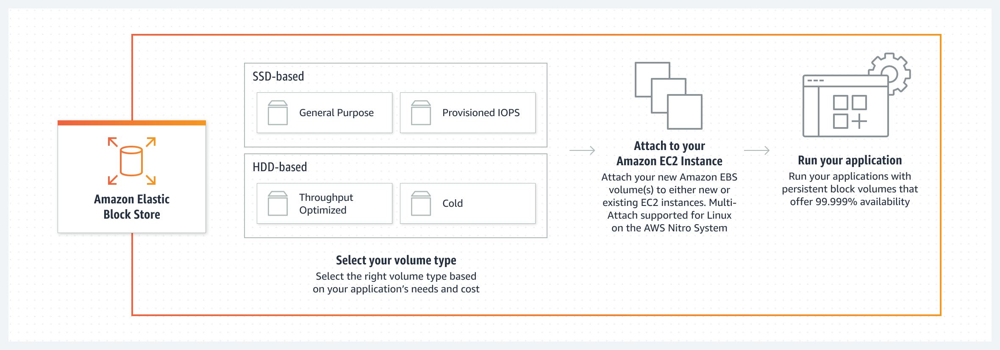

假設新創的網路服務提供商，隨著業務的發展，提供服務的軟體系統，從最初的簡易架構，依據面臨的挑戰與需求，不停調整擴充系統架構。

系統若建立在雲端，隨著系統架構的演進的同時，所對應雲端服務供應商的服務。本文章僅為個人學習與理解雲端服務的手札，有任何更好的建議都歡迎告知。

<!--more-->

系統架構演進階段

- **內部系統快速驗證**
- [系統上線]()

---

## 一、情境背景

今天，有一個新創的網路服務提供商，老闆想要在正式推出產品前，先建立服務的雛形。提供之前參與 MVP(最小可行性產品) 的外部關係人，可以搶先體驗服務，並協助提供意見與優化方向。

老闆希望在系統開發的初期，以最高的成本效率進行驗證。在與團隊溝通討論後，決定採用雲端服務平台，減少初期投入成本過高的問題。

目前公司組成，除了老闆、業務外，技術團隊內，只有三名開發人員，其中一名開發人員兼任雲端服務管理員。

開發團隊統整老闆在這個時期對系統的要求如下

- 硬體支出成本盡可能的低。
- 快速驗證系統可行性，提供外部關係人試用。
- 產品正式上線前，需將站台與資料庫分開，並清空所有的資料。
- 在三個月內要完成 MVP 開發與驗證，視結果決定是否展開下一步。

## 二、地端系統架構

基於上述需求統整過的需求，團隊決定在測試開發階段，為減入系統複雜度與硬體成本，暫時將站台、資料庫全部都架設在同一台伺服器(實體機/虛擬機)。

與機敏相關的會員帳號，由開發人員建立假資料，提供給外部關係人試用。

此架構下，就可以滿足基本的站台服務，提供開發人員與相關人員進行測試。

| 優點                   | 缺點                               |
| ---------------------- | ---------------------------------- |
| 可以快速的建立一個站台 | 使用者必需知道 IP 位置才能連上站台 |
| 最少的硬體投入成本     | 資料有公開的風險                   |

---

## 三、基於 AWS 服務的雲端架構

接著，將地端的架構遷移至雲端，依 AWS 提供的服務，建立出來的雲端架構如下。

### 基礎架構設定

雲端管理員在使用 Email 在 AWS 註冊後，此帳號為 `root user`，擁有最高權限。

接著，雲端管理員要讓其他人員有限制的使用 AWS 上的資源，必需使用 IAM(Identity and Access Management) 進行存取權限(permission)的設定。IAM 主要由 `User`、`User Group`、`Role`、`Policy` 4 個元素組成，其關係為如下。

- `Policy` 管控 `User Group` 可操作的權限。
- `User Group` 負責統一控制 `User`。
- `Role` 讓同時隸屬多個 `User Group` 的 `User` 可以切換當下所屬的群組。

AWS 已預先定義 AWS managed policies，提供許多常見的使用案例。以 IAM 為例，AWS managed policies 會提供 `User` Readonly 的 `Policy`，此時無法操作任何的雲端資源。若想要近一步設定權限，需要再行撰寫 Policy 進行權限的管理。

IAM 所使用的傳統授權模型為 **角色類型存取控制(Role-Based Access Control, RBAC)** 設計的，可以建立 User/ User Groups，並將權限給予到 Group 等級。但為面對日益雜的資源權限管理問題，也支援 **屬性類型存取控制(Attribute-based access control, ABAC)** 的管理方式。，

接著，為了便宜，先不考慮距離造成的網站延時，Region 選取美國西部的奧勒岡。

在建立 VPC 後，直接選用 AWS 預建的 Public Subnet，並設定 NCAL、Security Group 的安全規則設定，僅允許 80 與 443 Port 的連入。

選好 Region、AZ、VPC 與 Subnet 後，接著來建立 EC2 (Elastic Compute Cloud)，在建立 EC2 時，會經過幾個步驟。

- 指定 Instance 名稱與 Tag
- 選擇 AMI: 依應用決定所使用的作業系統映像 AMI(Amazon Machine Image)
- 擇擇 Instance Type: 需要考量機器的實際用途。
- 設定 Security Group: 指定連線的連出入規則(Inbound/Outbound rules)
- 指定 ENI (Elastic network interfaces): 指定 EC2 所使用的網路元件
- 指定 EBS (Elastic Block Store): EC2 本身的 Instance storage 會隨著機器的關閉而消失的特性，為了確保資料的持久性，搭配 EBS 進行使用。

為減少開發與機器的成本，選取 Linux base 的 AMI 與 二手的 Reserved Instances，有機會可以用更低的價格租借到機器。

### 釐清脈絡

接著釐清脈絡，確認從使用者發出請求，到 EC2 接受請求，途中行經過程。

- 從 `Internet Gateway` 進入 VPC。
- 接著 `Router` 依據 `Route Tables` ，判斷進入那個 `Subnet`。
- 在進入 `Subnet` 前，需經過 `Network Access Control List(NACL)` 判斷請求的合法性。
- 進入 `Subnet`。
- 經過 `Security Groups` 確認請求是否符合安全規則。
- 進入 `EC2`。

### 注意事項

- EC2 每次開關機，Public/Private IP 都會變更
- NACL 為 Stateless 防火牆，進出都需要進行規則核驗。
- Security Groups 為 Stateful 防火牆，只要成功進來，無需核驗就可直接出去；反之相同。

---

## 四、AWS 服務簡介

接著視界從大到小的瀏覽 AWS 的資訊。從 Region -> AZs -> VPC -> IAM -> EC2 逐一探訪。

### Infrastructure

#### Region

AWS 於世界各地建立了大型實體機房，這些機房可視為資料中心，資料中心依所在位置，組成 Availability Zones，簡稱 AZ。

這些 AZ 彼此之間相互隔離、物理上分離，並將同一個地理區域內的多個 AZ 組成 Region。以確保可在同一 Region 內，橫跨多個 AZ 部署應用程式，以提升容錯能力和降低延遲的情況。

也就是，每個 Region 內，至少包含兩個以上的 AZ。每個 AZ 內包括一個到多個資料。

至 2022 年 6 月為止，共有 26 個 Region 可以使用。因各地區基礎建設成本差異，導致 Region 的價格也有所不同。

Region 與 Region 間的通訊，使用 AWS 的骨幹網路基礎設施。提供完整的冗餘網路連接，確保不會出現`單點故障`的情況，導致該 Region 內的服務失效。

選擇使用 Region 的原則，可以著眼於幾個面向。

- 資料控管、法規要求
- Region 可用的服務
- 使用成本
- 使用服務的客戶距離

#### Availability Zones, AZs

圖片來源: [Youtube: AWS Global Cloud Infrastructure](https://www.youtube.com/watch?v=RPis5mbM8c8)

每個 AZ 內，包含一個以上的資料中心組成。並透過高頻寬、低延遲網路與完全冗餘的專用都會光纖，達到 AZ 之間提供高輸送量、低延遲的網路品質。便於輕鬆地建構能在 AZ 之間自動容錯移轉的應用程式，而不會發生中斷。

圖片來源: [Youtube: AWS Global Cloud Infrastructure](https://www.youtube.com/watch?v=RPis5mbM8c8)

同時，每個 AZ 內的資料中心，都具有獨立的電源、散熱和物理安全性，並透過冗餘電源與冗餘的超低延遲與高頻寬的網路連接，確實可以持續提供服務。

採用獨立的資料中心，是以安全為第一原則，避免因為人為意外或天災造成的影響。

### Network

#### Amzon VPC

Amazon Virtual Private Cloud(Amazon VPC)， AWS 虛擬私有網路，對應地端機房(On-Premises)大概就是內網的概念。

- VPC 屬於 Region 級別，可以橫跨不同 AZ。
- 外部網路可以經由 Internet Gateway 連到 VPC 中的 Instance 的話，該 instance 屬於 Public subnet。
- 反之，若外部網路無法連到 VPC 內的 instance，該 instance 為 private subnet
- 在 VPC 建立的同時，AWS 會預設建立一個 Public Subnet。

##### Internet Gateways

所有外部流量要進入 VPC 時，都需要經過 Internet Gateways(IGW)

##### Route tables

用於決定 VPC 的網路流量(Network traffic)會流向何處，Route Table 內的每條 Rule 均指定網段，以及傳送流量 (目標) 的閘道、網路界面或連線。

圖示來源: [AWS](https://docs.aws.amazon.com/vpc/latest/userguide/how-it-works.html)

##### Network Access Control List, NACL

屬於 [OSI Level 4: Transport Layer]() 層級的操作，如同防火牆一般，可控制一或多個 Subnet 的傳入和傳出流量。

##### Subnet

一個 Subnet 只能存在一個 AZ 之中，VPC 預設會有一個 Public Subnet。

##### Security Group, SG

作用相當於虛擬防火牆，控制群組內資源的連入與離開的流量。例如，將安全群組與 EC2 執行個體相關聯後，就會控制執行個體的傳入和傳出流量。

建立 VPC 時，有一組預設的安全群組，也可以額外建立新的安全群組。

每個安全群組，可依據協定和連接埠編號控制流量，對傳入流量和傳出流量建立不同的規則集合。

因為可依據協定和連接埠編號控制流量，應屬於 OSI Level 3: Network Layer / [OSI Level 4: Transport Layer]() 層級的操作。([參考來源](https://stackoverflow.com/questions/65507894/at-what-osi-layer-do-aws-security-groups-operate))

##### Security Group v.s. NACL

| Security Group                                                                                   | NACL                                                                                              |
| ------------------------------------------------------------------------------------------------ | ------------------------------------------------------------------------------------------------- |
| 在執行個體層級運作                                                                               | 在子網路層級運作                                                                                  |
| 僅支援允許規則                                                                                   | 支援允許規則和拒絕規則                                                                            |
| 具狀態：自動允許傳回流量，不受任何規則影響                                                       | 無狀態：傳回流量必須經規則明確允許                                                                |
| 在決定是否允許流量前，先評估所有規則                                                             | 在決定是否允許流量時，依序處理規則，從編號最低的規則開始                                          |
| 若某人於啟動執行個體時指定安全群組，或在啟動後將安全群組與執行個體建立關聯，才會套用至執行個體。 | 自動套用至子網路與其相關聯的所有執行個體 (因此，如果安全群組規則太過寬鬆，則它會提供額外一層防禦) |

圖示來源: [AWS](https://docs.aws.amazon.com/vpc/latest/userguide/VPC_Security.html)

##### Elastic network interfaces, ENI

為 VPC 內的邏輯網路元件，可視為虛擬網路卡。

可附屬或拔除於 EC2 instance，或是換到另一個 EC2 instance。當 ENI 換到新的 instance 時，流量也會自動流向新的 instance。

### Security

#### IAM

用於管理誰可以通過身份驗證（登錄）和授權（有權）使用 Amazon 資源。

首次建立的帳戶，其身份為 `root user`，可操作 AWS 內所有的服務與資源。為了安全，請勿使用 `root user` 進行日常任務的操作。

##### Policy

https://docs.aws.amazon.com/IAM/latest/UserGuide/access_policies.html
You manage access in AWS by creating policies and attaching them to IAM identities (users, groups of users, or roles) or AWS resources. A policy is an object in AWS that, when associated with an identity or resource, defines their permissions. AWS evaluates these policies when an IAM principal (user or role) makes a request. Permissions in the policies determine whether the request is allowed or denied. Most policies are stored in AWS as JSON documents. AWS supports six types of policies: identity-based policies, resource-based policies, permissions boundaries, Organizations SCPs, ACLs, and session policies.

IAM policies define permissions for an action regardless of the method that you use to perform the operation. For example, if a policy allows the GetUser action, then a user with that policy can get user information from the AWS Management Console, the AWS CLI, or the AWS API. When you create an IAM user, you can choose to allow console or programmatic access. If console access is allowed, the IAM user can sign in to the console using a user name and password. Or if programmatic access is allowed, the user can use access keys to work with the CLI or API.

Policy types
The following policy types, listed in order from most frequently used to less frequently used, are available for use in AWS. For more details, see the sections below for each policy type.

Identity-based policies – Attach managed and inline policies to IAM identities (users, groups to which users belong, or roles). Identity-based policies grant permissions to an identity.

Resource-based policies – Attach inline policies to resources. The most common examples of resource-based policies are Amazon S3 bucket policies and IAM role trust policies. Resource-based policies grant permissions to the principal that is specified in the policy. Principals can be in the same account as the resource or in other accounts.

Permissions boundaries – Use a managed policy as the permissions boundary for an IAM entity (user or role). That policy defines the maximum permissions that the identity-based policies can grant to an entity, but does not grant permissions. Permissions boundaries do not define the maximum permissions that a resource-based policy can grant to an entity.

Organizations SCPs – Use an AWS Organizations service control policy (SCP) to define the maximum permissions for account members of an organization or organizational unit (OU). SCPs limit permissions that identity-based policies or resource-based policies grant to entities (users or roles) within the account, but do not grant permissions.

Access control lists (ACLs) – Use ACLs to control which principals in other accounts can access the resource to which the ACL is attached. ACLs are similar to resource-based policies, although they are the only policy type that does not use the JSON policy document structure. ACLs are cross-account permissions policies that grant permissions to the specified principal. ACLs cannot grant permissions to entities within the same account.

Session policies – Pass advanced session policies when you use the AWS CLI or AWS API to assume a role or a federated user. Session policies limit the permissions that the role or user's identity-based policies grant to the session. Session policies limit permissions for a created session, but do not grant permissions. For more information, see Session Policies.

Identity-based and resource-based policies

Identity-based policies control what actions the identity can perform, on which resources, and under what conditions. 

Resource-based policies control what actions a specified principal can perform on that resource and under what conditions. Resource-based policies are inline policies, and there are no managed resource-based policies. To enable cross-account access, you can specify an entire account or IAM entities in another account as the principal in a resource-based policy.

##### Role

An IAM role is an IAM identity that you can create in your account that has specific permissions. An IAM role is similar to an IAM user, in that it is an AWS identity with permission policies that determine what the identity can and cannot do in AWS. However, instead of being uniquely associated with one person, a role is intended to be assumable by anyone who needs it. Also, a role does not have standard long-term credentials such as a password or access keys associated with it. Instead, when you assume a role, it provides you with temporary security credentials for your role session.

You can use roles to delegate access to users, applications, or services that don't normally have access to your AWS resources. For example, you might want to grant users in your AWS account access to resources they don't usually have, or grant users in one AWS account access to resources in another account. Or you might want to allow a mobile app to use AWS resources, but not want to embed AWS keys within the app (where they can be difficult to rotate and where users can potentially extract them). Sometimes you want to give AWS access to users who already have identities defined outside of AWS, such as in your corporate directory. Or, you might want to grant access to your account to third parties so that they can perform an audit on your resources.

For these scenarios, you can delegate access to AWS resources using an IAM role. This section introduces roles and the different ways you can use them, when and how to choose among approaches, and how to create, manage, switch to (or assume), and delete roles.

##### User Group

An IAM user group is a collection of IAM users. User groups let you specify permissions for multiple users, which can make it easier to manage the permissions for those users. For example, you could have a user group called Admins and give that user group typical administrator permissions. Any user in that user group automatically has Admins group permissions. If a new user joins your organization and needs administrator privileges you can assign the appropriate permissions by adding the user to the Admins user group. If a person changes jobs in your organization, instead of editing that user's permissions you can remove him or her from the old user groups and add him or her to the appropriate new user groups.

You can attach an identity-based policy to a user group so that all of the users in the user group receive the policy's permissions. You cannot identify a user group as a Principal in a policy (such as a resource-based policy) because groups relate to permissions, not authentication, and principals are authenticated IAM entities. For more information about policy types, see Identity-based policies and resource-based policies.

Here are some important characteristics of user groups:

A user group can contain many users, and a user can belong to multiple user groups.

User groups can't be nested; they can contain only users, not other user groups.

There is no default user group that automatically includes all users in the AWS account. If you want to have a user group like that, you must create it and assign each new user to it.

The number and size of IAM resources in an AWS account, such as the number of groups, and the number of groups that a user can be a member of, are limited. For more information, see IAM and AWS STS quotas, name requirements, and character limits.

You can organize IAM users into IAM groups and attach a policy to a group. In that case, individual users still have their own credentials, but all the users in a group have the permissions that are attached to the group. Use groups for easier permissions management, and to follow our Security best practices in IAM.

圖示來源: [AWS](https://docs.aws.amazon.com/vpc/latest/userguide/how-it-works.html)

Users or groups can have multiple policies attached to them that grant different permissions. In that case, the permissions for the users are calculated based on the combination of policies. But the basic principle still applies: If the user has not been granted an explicit permission for an action and a resource, the user does not have those permissions.

### Compute

#### Amzon EC2

Amazon EC2 全名 Amazon Elastic Compute Cloud，

可將 EC2 視為一台 Server

// 好處

// 特色

// Instance Store

##### 類型

|               |      一般用途      | 運算最佳化 |  記憶體最佳化   |      加速運算      |   儲存最佳化   |
| ------------- | :----------------: | :--------: | :-------------: | :----------------: | :------------: |
| Instance Type | a1, m4, m5, t2, t3 |   c4, c5   | r4, r5, x1, z1  | f1, g3, g4, p2, p3 |   d2, h1, i3   |
| 用途範例      |        多元        |   高效能   | Memory Database |      機器學習      | 分散式檔案系統 |

##### 花費

|      | On-Demand 隨需 | Save Plan 儲存計劃 | Spot Instances | Reserved Instances | dedicated-hosts |
| ---- | -------------- | ------------------ | -------------- | ------------------ | --------------- |
|      |                |                    |                |                    |                 |
|      |                |                    |                |                    |                 |
| 價格 |                |                    |                |                    |                 |

估算 Amazon EC2 成本
當您開始估算使用 Amazon EC2 的成本時，請考慮以下事項：

伺服器時間的時鐘小時數：資源在執行時會產生費用，例如，從 Amazon EC2 執行個體啟動到終止，或從配置彈性 IP 地址到取消配置時為止。

執行個體類型：Amazon EC2 提供各式各樣的最佳化執行個體類型，以滿足不同的使用案例。執行個體類型由不同的 CPU、記憶體、儲存和聯網容量組合而成，讓您有靈活性可應用程式選擇適當的資源組合。每種執行個體類型都包含至少一個執行個體大小，允許您根據目標工作負載的需求擴展資源。

定價模式：使用隨需執行個體，您可以按小時支付運算容量費用，無最低承諾的要求。

執行個體數：您可以佈建 Amazon EC2 和 Amazon EBS 資源的多個執行個體來處理尖峰負載。

負載平衡：您可以使用 Elastic Load Balancing 在 Amazon EC2 執行個體之間分散流量。Elastic Load Balancing 執行的小時數及其處理的資料量會導致每月成本。

詳細監控：您可以使用 Amazon CloudWatch 來監控 EC2 執行個體。預設會啟用基本監控。對於固定的每月費率，您可以選擇詳細監控，其中包括每分鐘記錄一次的七個預先選取的指標。部分月份會依每小時按比例收費，按每一執行個體小時費率計算。

Amazon EC2 Auto Scaling：Amazon EC2 Auto Scaling 會根據您定義的擴展政策自動調整您的部署中 Amazon EC2 執行個體的數量。除 Amazon CloudWatch 費用外，此服務不會收取額外費用。

彈性 IP 地址：您可以免費將一個彈性 IP 地址與執行的執行個體相關聯。

授權：若要在 AWS 上執行作業系統和應用程式，您可以以依用量計費的方式從 AWS 取得各種軟體授權，其完全符合要求，且您不需管理複雜的授權條款和條件。但是，如果您與軟體廠商簽訂現有的授權協議，則可以將符合條件的授權帶至雲端，以降低總體擁有成本 (TCO)。AWS 提供 License Manager，可讓您輕鬆跨越 AWS 和內部部署環境管理 Microsoft、SAP、Oracle 和 IBM 等軟體廠商的軟體授權。

### Storage

#### Amazon EBS

圖片來源: [AWS](https://aws.amazon.com/tw/ebs/)

Amazon EBS(Amazon Elastic Block Store) 是易於使用、可擴展的高效能區塊儲存服務，專為與 Amazon EC2 搭配使用而設計。

|      | SSD |     |     |     | HDD |     |
| ---- | --- | --- | --- | --- | --- | --- |
| IOPS |     |     |     |     |     |     |
|      |     |     |     |     |     |     |
| 價格 |     |     |     |     |     |     |

## 五、延伸知識與補充資料

- Virtual Machine, VM
- AWS 官方文件
  - [Amazon Virtual Private Cloud](https://docs.aws.amazon.com/vpc/index.html), VPC
  - [Public/Private subnet](https://docs.aws.amazon.com/vpc/latest/userguide/configure-subnets.html)
  - [Amazon Elastic Block Store](https://docs.aws.amazon.com/ebs/), EBS
  - [AWS Identity and Access Management (IAM)](https://docs.aws.amazon.com/iam/index.html)