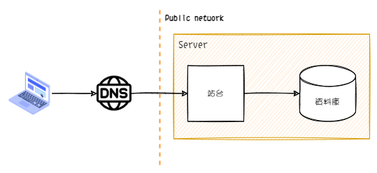
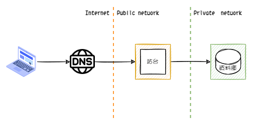

系統架構演進階段

- [內部系統快速驗證]()
- **系統上線**

<!--more-->

重點:

- IAM
- Route53
- VPC's Private subnet

## Phase.2 增加 Domain Name 與 資源監控

資料庫與站台分離 -> VPC 的 private subnet
-> Route Table

### 情境

### 新增元素

- DNS

### 優點

### 缺點

### AWS 雲端服務

---

## Phase.3 保護資料，將站台與資料庫分離

### 情境

因為原本的架構，需要將伺服器暴露在公開的網路，為確保資料的安全。所以將資料庫從原先的機器獨立出來，移到獨立的機器。

同時，將資料庫所在的機器設定為 Private Subnet。原本的機器維持對外的公開網路。

### 新增元素

- Load Balance
- Proxy

### 優點

### 缺點

### AWS 雲端服務

#### 服務架構圖

#### 資料庫

資料庫的部份，移到雲端有三種方式

##### 自建

在 EC2 中自建資料庫

...

##### AWS RDS

....

##### Amazon Aurora

....

|      | AWS EC2 | Amzon RDS | Amzon Aurora |
| ---- | ------- | --------- | ------------ |
| 優點 |         |           |              |
| 限制 |         |           |              |

### 延伸知識點

---

臨時需求

1. 想吧 DNS 加入控制 -> Route53
