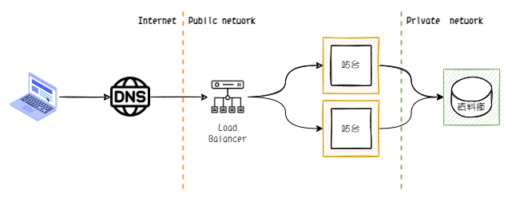

<!--more-->

## Phase.4 不想讓客戶端得知站台主機的實際資訊

### 情境

### 新增元素

- Load Balance
- Proxy

### 優點

### 缺點

### AWS 雲端服務

反向代理+主機+資料庫

一台主機無法負擔請求數量
Q: 反向代理的主要作用？
Q: Loading Banalance?
[ELB](https://aws.amazon.com/tw/elasticloadbalancing/features/)

#### 服務架構圖

---

## Phase.5 靜態檔案過多，影響到站台的穩定

### 情境

當站台提供下載的檔案過多時，放在原本站台的主機上，可能不定期發生硬體容量不足的情境。
在評估後，想要把這些靜態檔案放到另一個儲存空間，確保檔案的增加不會影響到原本站台主機的運行。

### 優點

### 缺點

### AWS 雲端服務

#### 服務架構圖

Amzon S3
Amzon EFS
EC2
CDN?

---

## Phase.5 重覆資料的請求量或計算量過大

### 情境

重覆資料的請求量或計算量過大，加入 Cache 機制

### 優點

### 缺點

### AWS 雲端服務

Amzon
Amazon ElastiCache

#### 服務架構圖

----

---

## Phase.6 不定期會有巨量的請求湧入

### 情境

### 優點

### 缺點

### AWS 雲端服務

EC2 auto scaling

#### 服務架構圖

---

## Phase.7 監控系統穩健度

### 情境

### 優點

### 缺點

### AWS 雲端服務

SMS
SQS

#### 服務架構圖

---

## Phase.8 針對越來越多的行批次作業，改為粒子度小的即時作業

### 情境

### 優點

### 缺點

### AWS 雲端服務

SQS

#### 服務架構圖

---

## Phase.9 資料封存

### 情境

### 優點

### 缺點

### AWS 雲端服務

SMS
SQS

#### 服務架構圖

---

## Phase.10 法規異動，機敏性資料需要放在地端

### 情境

### 優點

### 缺點

### AWS 雲端服務

VPN

#### 服務架構圖

---

## Phase.10 針對越來越多的行批次作業，改為粒子度小的即時作業

### 情境

### 優點

### 缺點

### AWS 雲端服務

SMS
SQS

#### 服務架構圖

---

