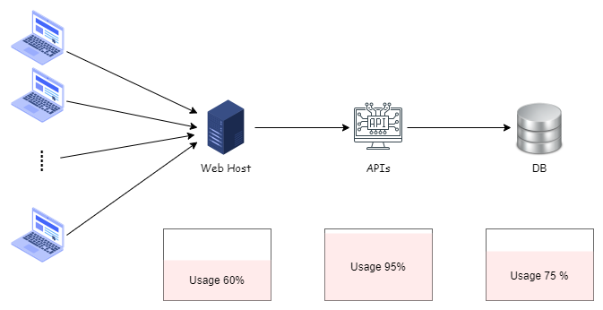

我們常常會因為決策當下的種種限制條件，造成我們必需考處限制條件下的調整

在系統遇到麻煩或困難或瓶頸時，我們提出的做法, 必須在某些先天上的限制下, 去進行優化

有限的的資源，最大的效率或收益

發現造成麻煩的瓶頸，分析如何解除瓶頸的問題？

要考慮整個系統, 有時, 你認為的瓶頸不是真的瓶頸

可以運用限制理論去找出問題環節，配合 80/20 法則找出影響力最大的點，然後處理它。

<!--more-->

## 情境

若今天有一個電商站台，採用三層式架構如下 其連線請求的資料流為，由 Web 呼叫 API呼叫資料庫。
當少數人使用站台時, 系統可以在理想的時間內，將資料順利回傳到使用者的瀏覽器確上，假定請求時間為 1.5 秒
但同時訪問人數，提升到 300 QPS(Query Per Secend)時，開始發現等待時間變的很久，站台每個動作都真很久。

我們的需求是可以支援 300 人同時線上交易時，系統可以正常穩定的提供服務

### 系統負載

這時去檢查各個系統節點，發現每個請求，所有的主機的 CPU/Memeory 都升高

我們發現光是 300 人同時檢視首頁與商品清單與商品頁時，系統就已經滿載，無法進行任何的交易行為

在這業務的程面, 是一定不行的

為解決這個方式，增加機器來分擔現行主機上的壓力，無疑是最快的方式，但是因為資金或交貨時間延誤等因素，目前無法立即擴充硬體主機。

換角度來說，API 主機本身最大可處理的請求數，假設就只有 300 QPS。

我們要如何在這個先天的限制下，提升服務的穩定度與要求？

### 資料限制下的分析

在[限制理論](#限制理論)中提到的五步對焦法，提到要先找到系統的瓶頸點。

在原本的架構中，我們發現所有的資料，都要從資料庫取得資料，就算是固定或久久才變更的資料，也要從DB取得。

對 DB 主機的 Loading 很大, 而且這些存取, 是種泿費

所以發現第一個瓶頸點, DB 的資源無法面對大量的查詢。

接著, 發現當 DB 執行動作慢時, API 需等DB 查詢完成才會回應 API，當DB 查詢慢時, API 的主機資源使用率就會上升，並花費大量時間在等候。

發現第二固瓶頸點, API 等待時間過久.

乍看好像針對這兩個瓶頸點排除, 就可以達成目標了。

所以直接調整 API 或 DB 效能?

但只從系統面來找問題，可能有些偏頗，所以我們從使用場景來分析

一個消費者進入購物平台，可能有 80% 以上的時間都在瀏覽商品，但真正能為我們服務帶來價值的，只有在消費者進行購買交易的行為。而這可行為可能不到 5% 的時間。

從使用者行為來分析，可以發現對 API 的從請求內容來看. 發現有大量的請求都與首頁、商品清單與商品頁相關。真正需要用到交易相關的 API 次數，不到總體請求量到 3~5%

依 [80/20 法則](#8020-法則) 交易請求的數量最小，確是可以為平台帶來最大利益的行為。所以 API 主機用 80% 的效能，來服務這 20 % 的交易，也是合理的。

到此，我們找出三個瓶頸時

- DB 的存取過於頻繁，DB 主機無法負擔
- API 主機服務，可能會能因為 DB 回應緩慢，造成負擔
- 非交易行為的 API 吃掉 API/DB 主機八成以上的資源。導到交易行為無法正常動作。

會發現這三個瓶頸，環環相扣。但最主要的問題在於過於大量的查詢作業，需要大量使用到 DB 資源，造成一連串的影響。

### 資料分流

最快而且不用調整服務架構的做法，當然是添加新的 API 主機與 DB 主機。交易行為與非交易行為分不同主機處理。
說白了，就是用錢去拉服務的效能。

為解決這個方式，增加機器來分擔現行主機上的壓力，無疑是最快的方式，但是因為資金或交貨時間延誤等因素，目前無法立即擴充硬體主機。

所以這條路走不通。

我們只好再進一步的分析最大量的請求內容，評估

所以我們有沒有辨法減少與首頁、商品清單與商品頁相關的請求，對 AP 主機或 DB 主機的負擔呢？我們觀察這些 API 的行為，發現他們取得的資料內容大多重覆。再者，這些資料的更新頻率不高，基本上只有新商品上架或宣傳文案更新時，才會取得更動後的資料。

在知道這個資料的特性，我們可以等會重覆存取的東西暫存在一個地方，避免每次都要跟資料庫要資料。
而且，我們還要可以手動或定期的去跟資料庫要最新的資料，避免取到舊的資料。

這東西就是 Cache 機制

我們使用 Cache 機制，去進行資料的分流，減少直接對資料庫重覆資料的存取。

### 優化後的架構

在調整服務架構後，對於首頁、商品清單與商品頁相關的請求，可以直接從 Cache 取得資料，當 Cache 內資料不存在或過期了，再去跟 DB 取資料。

而 API 主機與DB 主機，就可專心處理大部份與交易相關的請求。

題外話，可能會有人說為什麼不用 CDN？ 用 CDN 就可以處理掉這個問題了。
主要是基於風險控管，我們不法保證使用的 CDN 廠商永遠不會出問題，萬一發生異常，那很有可能直接影響到我們的服務。

## 限制理論

限制理論(Theory of Constraints，TOC)是高德拉特想出來解決系統問題的方法。他的解題步驟是 (Five Focusing Steps，五步聚焦法):

步驟一、找出系統的瓶頸。

步驟二、決定如何利用瓶頸。

步驟三、根據上述的決定，調整其他的一切。

步驟四、把系統的的瓶頸鬆綁。(就是解決它)

步驟五、假如步驟四打破了系統原有的瓶頸，那麼就回到步驟一。

TOC 也是一套能用邏輯、系統的思考方式去解答我們在持續改善時，所產生以下的問題：

　　　1. 要改變什麼？(What to Change？)

　　　2. 要改變成什麼？(What to Change to？)

　　　3. 如何改變？(How to Cause the Change？)

## 80/20 法則

儘管 80/20 法則幾乎可應用在每一個產業，但帕雷托法則卻最常用於商業和經濟。這是因為 80/20 法則有助於判斷應該專心致志於哪些地方，才能將輸出最大化。

帕雷托法則的基礎概念是，80% 的結果來自於 20% 的行動。若有任何一種能夠分解成更小部分的工作，帕雷托法則就能協助您辨別，哪一部分的工作最具影響力。

## 延伸閱讀

### 限制理論

- [目標](https://www.books.com.tw/products/0010898249?loc=P_0004_082)
- [工程師的機會成本](https://ruddyblog.wordpress.com/2020/09/14/%e5%b7%a5%e7%a8%8b%e5%b8%ab%e7%9a%84%e6%a9%9f%e6%9c%83%e6%88%90%e6%9c%ac/)

### 80/20 法則

- [80/20 法則：只要有資源分配問題，你就用得上它](https://www.managertoday.com.tw/articles/view/1211)
- [《80/20 法則》：關鍵少數 vs. 無用多數，向混沌理論找答案](https://www.thenewslens.com/article/111804/fullpage)
