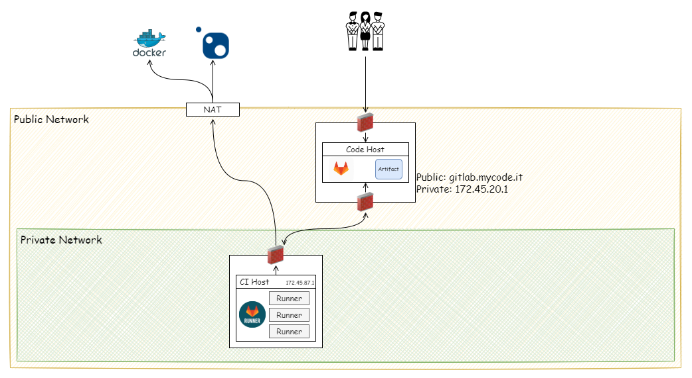

延續上一篇 [GitLab CI 實作記錄 - 使用 Docker 在同台主機運行 GitLab 與 GitLab-Runner]() 的結果，接著要開始進行 GitLab CI 的環境架設。

架設的環境

- Gitlab EE
- Gitlab Runner ver.1.5.1
- OS: Ubuntu 20.4

<!--more-->

## 網路架設與規劃

在開始架設之前，有幾個要求點

- CI/CD 的主機不可以暴露於公開環境
- CI 主機對外連線需要控管。



## 建立 Gitlab Server

直接使用 docker-compose 來架設 GitLab

``` yml
version: '3.6'
services:
  web:
    image: 'gitlab/gitlab-ee:latest'
    restart: always
    hostname: 'gitlab.mycode.it'
    environment:
      GITLAB_OMNIBUS_CONFIG: |
        external_url 'https://gitlab.mycode.it'
        # Add any other gitlab.rb configuration here, each on its own line
    ports:
      - '80:80'
      - '443:443'
      - '22:22'
    volumes:
      - 'gitlab_data:/etc/gitlab'
      - 'gitlab_log:/var/log/gitlab'
      - 'gitlab_opt:/var/opt/gitlab'
    shm_size: '256m'

volumes:
gitlab_data:
gitlab_opt:
gitlab_log:
```

## 設定 Gitlab-Runner

GitLab-Runner 的安裝與註冊方式，可參考 [註冊 GitLab-Runner](()) 的操作。

這時，設定好 Runner，並進行 CI/CD 的 Try-run 時，會發生 git clone 失敗的錯誤。


問題的原因在於網路環境的設定與規劃。

- GitLab Host 的防火牆，允許特定的外部 IP 與 `172.45.18.0/8` 連入。
- CI Host 的防火牆 Engress Rule 僅允許放行對 GitLab Host Private IP 的連線。

所以 CI Host 是無法直接使用 <https://gitlab.mycode.it> 指向 Gitlab Host 的，所以需要配合環境進行調整。

作法一：Runner 未註冊時，在 GitLab Runner 在註冊 Executor 時，需指定使用的 `url` 與 `clone-url` 位置為 GitLab Host 的 Private IP `172.45.20.1`。

``` bash
sudo docker exec -it gitlab-runner gitlab-runner register \  
  --url "http://172.45.20.1" \
  --clone-url "http://172.45.20.1" 
```

作法二：若 Runner 已註冊，則到 Gitlab-runner 的 Container 內，在  `etc\gitlab-runner\config.toml` 中，加入參數 `clone-url`

``` toml {hl_lines=[3,6]}
[[runners]]
  name = "dotnet-core-3.1"
  url = "http://172.45.20.1"
  token = "WxnmFkszXJFiqeQVxy--"
  executor = "docker"
  clone_url = "http://172.45.20.1"
  ...
```

### 建立 Runner 的 Executor

我們選擇 Ubuntu 做為 CI 的環境 OS，並在上面運行 Docker 版的 Runner 與 Executor。

⚠ 要特別注意，在 Windwos 的環境下，檔案名稱或路徑，無論大小寫，都視為相同。但是在 Linux 環境下，只要任一字元大小寫不同，就會視為不同的東西。

#### 針對 .NET Core 的專案

關於 .NET Core 的 Image 清單，可以參閱 [Docker Hub](https://mcr.microsoft.com/v2/dotnet/core/sdk/tags/list)。

``` bash
sudo docker exec -it gitlab-runner gitlab-runner register \  
  --non-interactive \
  --url "http://172.45.20.1" \
  --clone-url "http://172.45.20.1" \
  --registration-token "PROJECT_REGISTRATION_TOKEN" \
  --tag-list "dotnet-core" \
  --description "dotnet core runner" \
  --maintenance-note "Free-form maintainer notes about this runner" \
  --executor "docker" \
  --docker-image mcr.microsoft.com/dotnet/sdk:latest \
  --run-untagged="true"
```

``` yml
# .gitlab-ci.yml

stages:          # List of stages for jobs, and their order of execution
  - build
  - test

dev-build-job:       # This job runs in the build stage, which runs first.
  stage: build
  tags: 
    - "dotnet-core"
  script:
    # 還原 nuget packages
    - dotnet restore solution.sln
    # 建置專案
    - dotnet build solution.sln
```

#### 針對 .NET Framework 的專案

通常找到的 GitLab CI 與 .NET Framework 的處理方式，會是使用 Shell 的 Executor。有興趣的人，可以參考 [GitLab CI/CD with .Net Framework](https://medium.com/@gabriel.faraday.barros/39220808b18f) 進行實作。

但是我們想要統一使用 Docker Executor。

或許，會直覺想到使用 `mcr.microsoft.com/dotnet/framework/sdk:4.8` 作為 Docker Executor 的 Base Image。

``` bash
# 試著在 WSL2 或 Linux Kernal 的環境，執行下述指令
docker pull mcr.microsoft.com/dotnet/framework/sdk:4.8
```

  

結果發生 `no matching manifest for linux/amd64 in the manifest list entries` 的錯誤訊息。

雖然 `mcr.microsoft.com/dotnet/framework/sdk:4.8` 已經整合好 `.NET Framework Runtime`、`Visual Studio Build Tools`、`Visual Studio Test Agent`、`NuGet CLI` 等等， 但是它的底層使用的 HOST OS 必需是 windows，所以只要是用使用 WSL2 或是 Linux kernal 的 Docker 均無法使用。

因為規劃是使用 Docker Executor on Linux 的環境，所以這條路不通。

還好有 mono 的專案，可以提供 .NET Framework 使用於 Linux 之上，所以改用 mono 的 docker Image 作為 Executor 的 Base Image。([Docker Hub](https://hub.docker.com/_/mono/tags))

``` powershell
docker pull mono:latest
```

首先註冊一個使用 `mono` 的 docker Executor。

``` bash
sudo docker exec -it gitlab-runner gitlab-runner register \  
  --non-interactive \
  --url "http://172.45.20.1" \
  --clone-url "http://172.45.20.1" \
  --registration-token "PROJECT_REGISTRATION_TOKEN" \
  --tag-list "mono-fx-docker" \
  --description "docker-runner" \
  --maintenance-note "Free-form maintainer notes about this runner" \
  --executor "docker" \
  --docker-image moon:latest \
  --run-untagged="true"
```

再來，就是撰寫 `.gitlab-ci.yml` 的時候了。

``` yml
# .gitlab-ci.yml

stages:          # List of stages for jobs, and their order of execution
  - build

build-job:       # This job runs in the build stage, which runs first.
  stage: build
  tags:
    - mono-fx-docker
  script:
    - nuget restore solution.sln
    - msbuild solution.sln
```

### Executor 使用自建的 Image

若是 Docker Executor 所使用的 Image，想要使用 `自行建立` 或是 `先使用本地已存圶` 的 Image，就必需在 `etc\gitlab-runner\config.toml` 的 [runners.docker] 內，加入 `pull_policy = ["if-not-present"]`。

``` toml {hl_lines=[15]}
[[runners]]
  name = "dotnet-core-3.1"
  url = "http://172.45.20.1"
  token = "WxnmFkszXJFiqeQVxy--"
  executor = "docker"
  clone_url = "http://172.45.20.1"
  [runners.docker]
    tls_verify = false
    image = "mcr.microsoft.com/dotnet/sdk:3.1"
    privileged = false
    disable_entrypoint_overwrite = false
    oom_kill_disable = false
    disable_cache = false
    volumes = ["/cache"]
    pull_policy = ["if-not-present"]
    shm_size = 0
```

讓 Docker Executor 知道，若使用的 Image 本地已存在，就直接使用本地的 Image，若不存在，Runner 則會嘗試去拉取 Image。

順帶一提，`pull_policy` 有 `never`, `if-not-present` 與 `always` 三種，若是沒有特別設定，預設用 `always`。

## 補充資料

### 延伸閱讀

- iThome, [Mono 搭起 Linux 與.NET 的橋樑](https://www.ithome.com.tw/tech/29006)
- GitHub, [mono/docker](https://github.com/mono/docker)
- GitLab, [One-line registration command](https://docs.gitlab.com/runner/register/#one-line-registration-command)
- GitLab, [The Docker executor](https://docs.gitlab.com/runner/executors/docker.htm)

### 參考資料

- stackoverflow, [Docker image cannot used in GitLab : no matching manifest for linux/amd64 in the manifest list entries](https://stackoverflow.com/questions/69281169/docker-image-cannot-used-in-gitlab-no-matching-manifest-for-linux-amd64-in-the)
