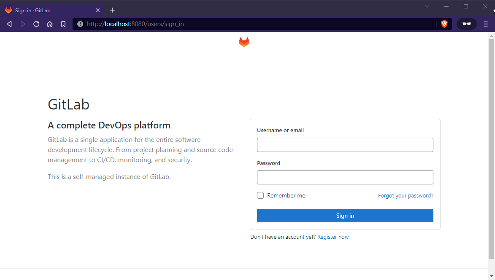
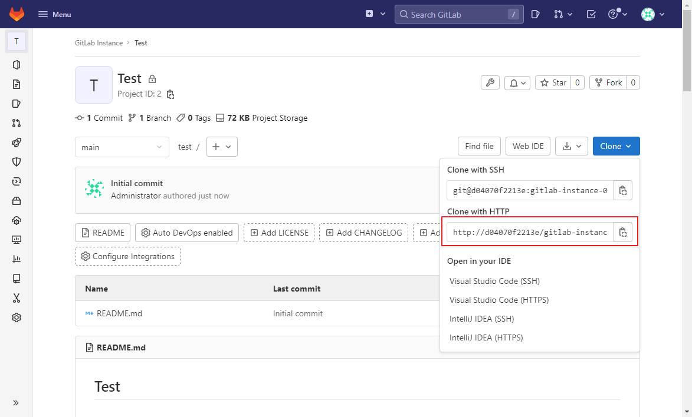
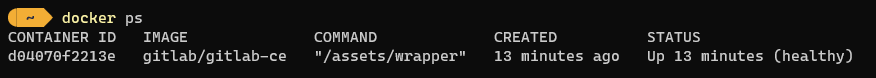
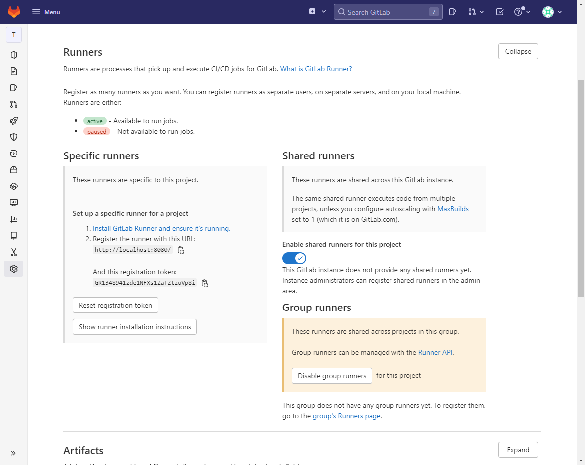
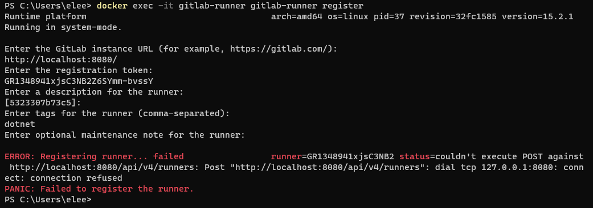
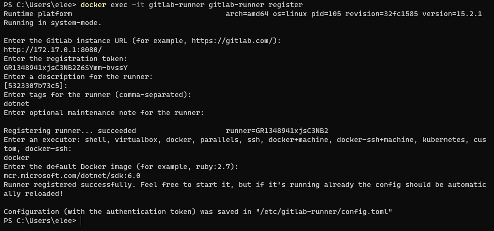
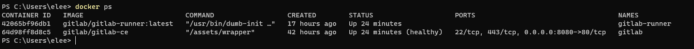

最近因為業務需求，必需在私有環境架設版控平台，並需要 CI/CD 的功能。

在朋友的推薦下，開始初次使用 GitLab。因為對 GitLab 的架設與設定還不熟悉，所以先在本機進行 POC 測試。

為了減少架設的複雜性，所以選擇使用 GitLab 的 Docker Image 來建立服務。

此次使用的軟體版本如下

- OS: Windows 11
- Gitlab Server: GitLab CE Community  15.0.4-ce.0
- Gitlab Runner ver.1.5.1

<!--more-->

### 建立 Gitlab Server

一開始直接參考網路文章內的指令，建立的指令如下

``` powershell
# 不建議直接使用，後續進行 Git Clone 會出現網址的問題
docker run -d --name gitlab -p 8080:80 --restart always gitlab/gitlab-ce
```

  

確實很快的建立好 GitLab 服務，此時會遇到第一個問題，就是不知道登入的密碼是什麼？

因為使用 Docker 建立出來的 GitLab，`root` 預設密碼並不是 ~~`5iveL! fe`~~。需要使用下述指令取得 Continer 內，預設的 `root`的密碼。

``` powershell
# 取得 Container 內的 root 預設密碼
docker exec -it gitlab grep 'Password:' /etc/gitlab/initial_root_password
```

  

順利登入後，新建立一個名為 Test 的 Repository 後，點選 `Clone` 按鈕後，會發現 `Clone with HTTP` 路徑為 `http://d04070f2213e/[Repository-Name]/test.git`。



其實，下載的網址內出現的 `d04070f2213e` 字串，其實是 CONTAINER ID。

  

但實務上，這樣的網址是無直接使用，變成每次需要手動調整更正為主機 Domain Name 或 IP。為避免這個問題，還是乖乖的參考官方文件 [GitLab Docker images](https://docs.gitlab.com/ee/install/docker.html#install-gitlab-using-docker-engine) 的說明。

``` powershell
docker run --detach \
  --hostname localhost \
  --publish 443:443 --publish 80:80 --publish 22:22 \
  --name gitlab \
  --restart always \
  --volume $GITLAB_HOME/config:/etc/gitlab \
  --volume $GITLAB_HOME/logs:/var/log/gitlab \
  --volume $GITLAB_HOME/data:/var/opt/gitlab \
  --shm-size 256m \
  gitlab/gitlab-ee:latest
```

在 Gitlab 的 Container 建立時，預設使用 22、80、443 三個 Port。

- Port 443 是 HTTPS (TLS) 使用
- Port 80 是 HTTP 使用
- Port 22 是 SSH 使用

為了確保後續容易搬移與備份資料，所以額外建立 docker volume。同時，因為本機 80 Port 已經被其他網站使用，所以改用 8080 Port。

調整後的指令如下.

``` powershell
# Create volume
docker volume create gitlab_data
docker volume create gitlab_opt
docker volume create gitlab_log

# 建立使用 8080 Port 與自建 Volume 的 Container
docker run --detach
  --hostname localhost \
  --publish 8080:80 \
  --name gitlab \
  --restart always \
  --volume gitlab_data:/etc/gitlab \
  --volume gitlab_opt:/var/log/gitlab \
  --volume gitlab_log:/var/opt/gitlab \
  --shm-size 256m gitlab/gitlab-ee:latest
```

重新建立好之後，再觀察 `Clone with HTTP`，就會變成預期的 Hostname。


但是直接使用 `Clone with HTTP` 的路徑，還是無法成功使用。

在使用上，還是需要手動加入 Port 才能正常 Clone Repository 的內容。這邊就到此為止，暫不處理此問題。

針對使用不同的 Port，官方建議的設定作法可見 [非預設-80-port-的建議作法](#非預設-80-port-的建議作法)。

### 註冊 Gitlab-Runner

首先使用 GitLab-Runner 的 Docker Image，將 Runner 的服務架設起來。

``` powershell
# Create Volume
docker volume create gitlab-runner-config

# 啟用 GitLab-Runner
docker run -d --name gitlab-runner \
  --restart always \
  -v /var/run/docker.sock:/var/run/docker.sock \
  -v gitlab-runner-config:/etc/gitlab-runner \
  gitlab/gitlab-runner:latest
```

接著，向 Gitlab Server 註冊 Giblab-Runner，而註冊所需的 `Url` 與 `Token`，可以從 Repository 的 `Setting > CI/CD` 內的 `Runners` 取得。

  

``` powershell
# 進行 Runner 註冊
docker exec -it gitlab-runner gitlab-runner register
```



會發生 `connect refuse` 的問題。


若對 docker network 概念不熟悉的話，可能會在這邊卡住。簡單說明一下，在 Docker Network 分為 4 種類型。...

``` docker
# 
docker inspect gitlab-runner

docker exec -it gitlab-runner /bin/bash
```



### 試 run

發現無法成功從 gitlab 拉 code 下來。
所以我們參考官網, 需要額外在 Gitlab-runner 的 etc\gitlab-runner\config.toml 中，加入參數 `clone-url`

### 注意事項

1. localhost

### 結果



## 非預設 80 Port 的建議作法

[官方文件](https://docs.gitlab.com/ee/install/docker.html#expose-gitlab-on-different-ports)

``` docker {linenos=inline, hl_lines=["2-3"]}
docker run --detach \
  --hostname gitlab.example.com \
  --publish 8929:8929 --publish 2289:22 \
  --name gitlab \
  --restart always \
  --volume $GITLAB_HOME/config:/etc/gitlab \
  --volume $GITLAB_HOME/logs:/var/log/gitlab \
  --volume $GITLAB_HOME/data:/var/opt/gitlab \
  --shm-size 256m \
  gitlab/gitlab-ee:latest
```

個人覺得有兩個重點參數 `--hostanme` 與 `--publish`

sudo docker exec -it gitlab /bin/bash

```ruby
# For HTTP
external_url "http://gitlab.example.com:8929"
```

gitlab_shell_ssh_port

``` ruby
gitlab_rails['gitlab_shell_ssh_port'] = 2289
```

gitlab-ctl reconfigure

接著使用下述指令，進入 GitLab 的 Container 內，進行 `etc\gitlab\gitlab.rb` 的調整。

``` bash
# 執行 Gitlab's Container 內的 bash，並與其互動
docker exec -it gitlab /bin/bash
```

順帶一提，GitLab 的 Docker Image 建立的 Container，未安裝 vim，若要使用 vim 進行 `gitlab.rb` 的內容修改，需額外進行安裝 vim。

``` rb
# For HTTP/HTTPS
external_url "http://gitlab.example.com:8080"

```

完成修改後，記得要套用修改後的設定。

``` bash
gitlab-ctl reconfigure
```

結果如下

## 使用 Docker-compose 直接在本機建立 Gitlab Server 與 Runner

``` dockerfile
# docker file

```

## 延伸閱讀

- SALMON'S BLOG, [註冊 GitLab Runner](https://blog.salmon.tw/2018/05/08/%E8%A8%BB%E5%86%8A%20GitLab%20Runner/)
- Rick's Blog, [利用 Docker 建置 GitLab + GitLab Runner](https://www.rickjiang.dev/blog/gitlab-and-gitlab-runner-with-docker)

## 參考資料

- Stackverflow, [This job is stuck, because the project doesn't have any runners online assigned to it. Go to Runners page](https://stackoverflow.com/questions/53370840/sthis-job-is-stuck-because-the-project-doesnt-have-any-runners-online-assigned)
