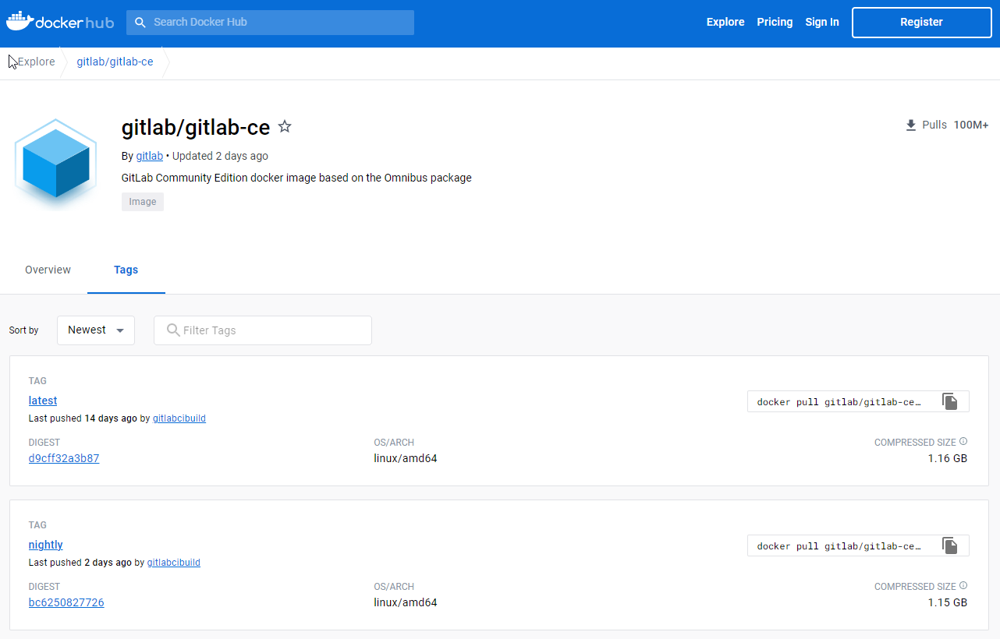
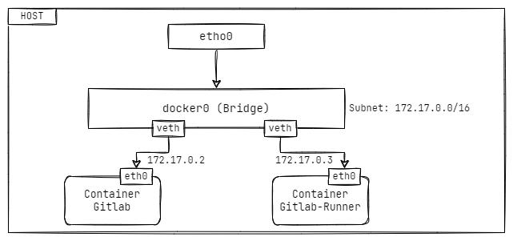
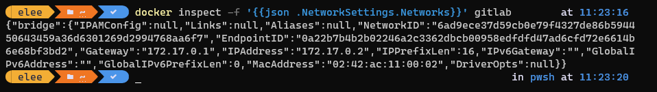
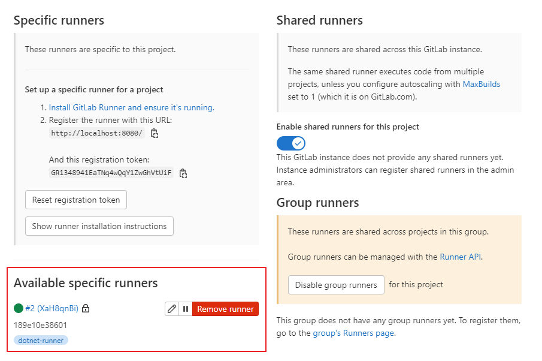
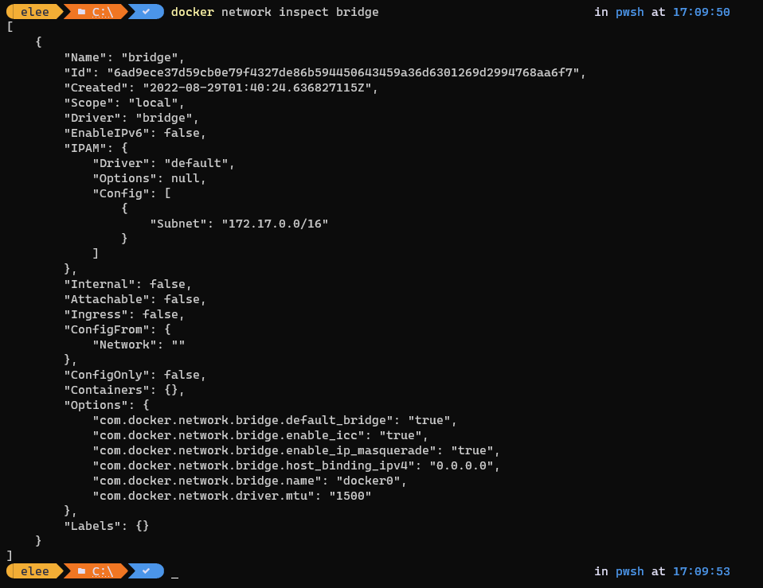
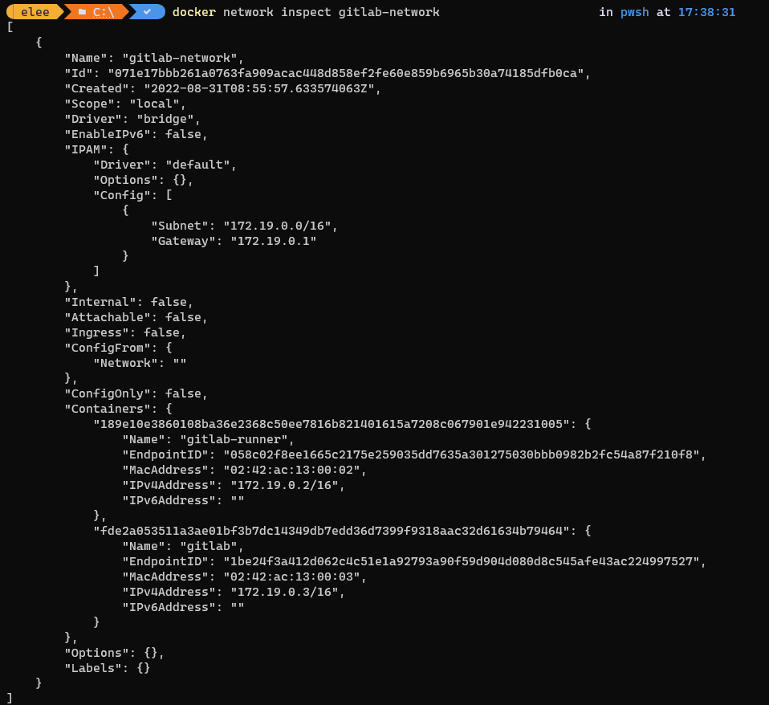
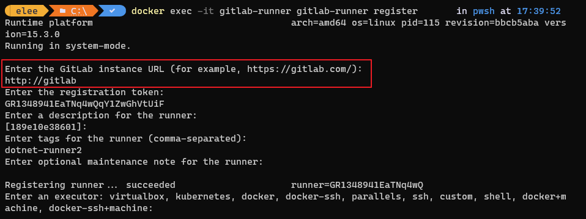
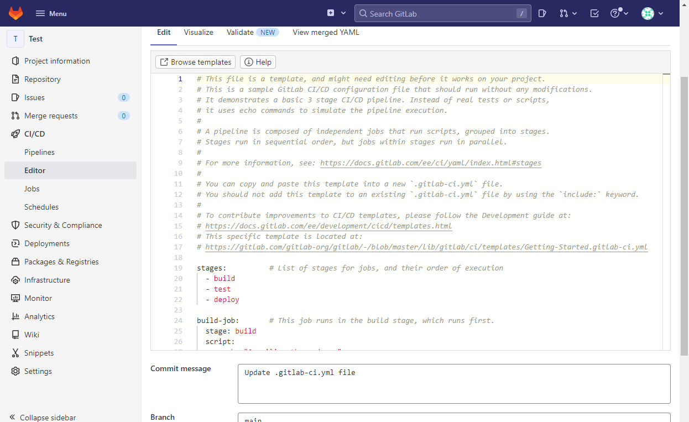
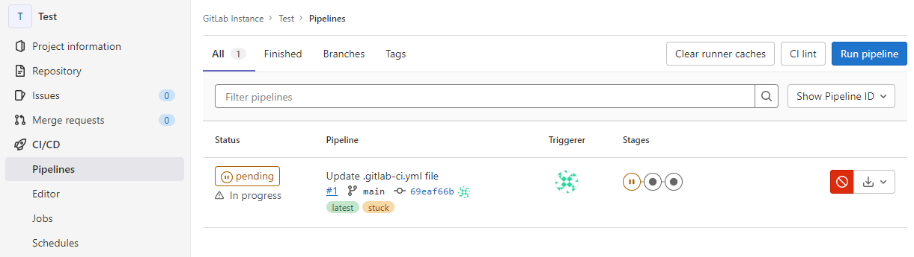
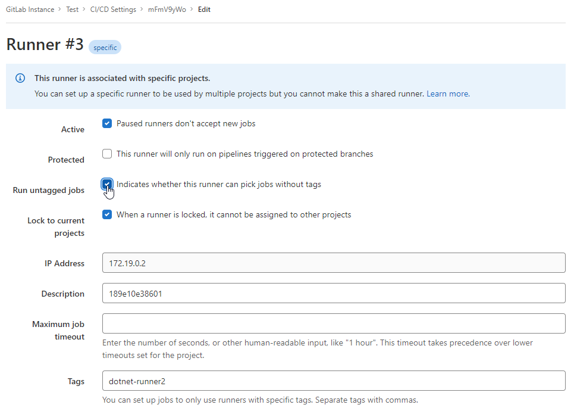

最近因為業務需求，必需在私有環境架設版控平台，並需要 CI/CD 的功能。

在朋友的推薦下，開始初次使用 GitLab。因為對 GitLab 的架設與設定還不熟悉，所以先在本機進行 POC 測試。

為了減少架設的複雜性，所以選擇使用 GitLab 的 Docker Image 來建立服務。此次使用的軟體版本如下

- OS: Windows 11
- GitLab Server: GitLab CE Community  15.0.4-ce.0
- GitLab Runner ver.1.5.1

📣 TL;DR

在同一台機器內，使用 Dokcer 同時架設 GitLab 與 GitLab-Runner 有一些地方要注意。

- 若 GitLab Runner 使用 Docker Executor，需要指定使用的網路。
- 若 GitLab 使用 `localhost`，註冊 GitLab-Runner 時，需特別指定 `clone_url`。
- 若 GitLab 若不是使用 80 Port，務必依官方建議作法，可以減少很多麻煩。
- Docker network 的部份要特別小心。

<!--more-->

## 建立 GitLab Server

首先，我們可以直接到 [Docker Hub](https://hub.docker.com/r/gitlab/gitlab-ce) 中，在 Gitlab-ce 的 Tags 頁面查看要下載的 Docker Image 版本。



在這邊，直接使用 `gitlab/gitlab-ce` 最新的版本。

```powershell
docker pull gitlab/gitlab-ce:latest
```

完成下載後，若直接採用網路文章的方法，快速的完成 GitLab 的建置動作。

``` powershell
# 不建議直接使用，後續進行 Git Clone 會出現網址的問題
docker run -d --name gitlab -p 8080:80 --restart always gitlab/gitlab-ce
```

  

此時會遇到第一個問題，就是不知道登入的密碼是什麼？

因為使用 Docker 建立出來的 GitLab，`root` 預設密碼並不是 ~~`5iveL! fe`~~。需要使用下述指令取得 Continer 內，預設的 `root`的密碼。

``` powershell
# 取得 Container 內的 root 預設密碼
docker exec -it gitlab grep 'Password:' /etc/gitlab/initial_root_password
```

  

順利登入後，新建立一個名為 Test 的 Repository 後，點選 `Clone` 按鈕後，會發現 `Clone with HTTP` 路徑為 `http://d04070f2213e/[Repository-Name]/test.git`。


其實，下載的網址內出現的 `d04070f2213e` 字串，其實是 CONTAINER ID。

  

但實務上，這樣的網址是無直接使用，變成每次需要手動調整更正為主機 Domain Name 或 IP。

為避免這個問題，還是乖乖的參考官方文件 [GitLab Docker images](https://docs.gitlab.com/ee/install/docker.html#install-gitlab-using-docker-engine) 的說明。

``` powershell
docker run --detach \
  --hostname localhost \
  --publish 443:443 --publish 80:80 --publish 22:22 \
  --name gitlab \
  --restart always \
  --volume $GITLAB_HOME/config:/etc/gitlab \
  --volume $GITLAB_HOME/logs:/var/log/gitlab \
  --volume $GITLAB_HOME/data:/var/opt/gitlab \
  --shm-size 256m \
  gitlab/gitlab-ee:latest
```

在 GitLab 的 Container 建立時，預設使用 22、80、443 三個 Port。

- Port 443 是 HTTPS (TLS) 使用
- Port 80 是 HTTP 使用
- Port 22 是 SSH 使用

為了確保後續容易搬移與備份資料，所以額外建立 docker volume。同時，因為本機 80 Port 已經被其他網站使用，所以改用 8080 Port。

調整後的指令如下.

``` powershell
# Create volume
docker volume create gitlab_data
docker volume create gitlab_opt
docker volume create gitlab_log

# 建立使用 8080 Port 與自建 Volume 的 Container
docker run --detach \
  --hostname localhost \
  --publish 8080:80 \
  --name gitlab \
  --restart always \
  --volume gitlab_data:/etc/gitlab \
  --volume gitlab_log:/var/log/gitlab \
  --volume gitlab_opt:/var/opt/gitlab \
  --shm-size 256m gitlab/gitlab-ee:latest
```

重新建立好之後，再觀察 `Clone with HTTP`，就會變成預期的 Hostname。


但是直接使用 `Clone with HTTP` 的路徑，還是無法成功使用。

在使用上，還是需要手動加入 Port 才能正常 Clone Repository 的內容。這邊就到此為止，暫不處理此問題。

針對使用不同的 Port，官方建議的設定作法可見 [非預設-80-port-的建議作法](#非預設-80-port-的建議作法)。

## 註冊 GitLab-Runner

首先使用 GitLab-Runner 的 Docker Image，將 Runner 的服務架設起來。

``` powershell
# Create Volume
docker volume create gitlab-runner-config

# 啟用 GitLab-Runner
docker run -d \
  --name gitlab-runner \
  --restart always \
  -v /var/run/docker.sock:/var/run/docker.sock \
  -v gitlab-runner-config:/etc/gitlab-runner \
  gitlab/gitlab-runner:latest
```

接著，向 GitLab Server 註冊 Giblab-Runner，讓 GitLab 知道有那些 Runner 可以使用。

``` powershell
# 進行 Runner 註冊
docker exec -it gitlab-runner gitlab-runner register
```

在註冊過程中，會有訊息提供，要求依序輸入 `GitLab Url`、`Token`、`Runner 的描述`、`Runner's tags`、`Runner's maintain note`、`Executor` 等資訊。

在 GitLab 的 Runner 可註冊為共用的 `Shared Runner` 或傞供專案本身使用的 `Runner`。

在註冊專案本身使用的 Runner 時，所需的 `Url` 與 `Token`，可以從專案的 `Settings > CI/CD` 的 `Runners` 取得。

  

⚠️ 在註冊過程中，會發生會發生 `connect refuse` 的問題。


從上面可以看到 `連線到 127.0.0.1:8080 被拒` 的異常訊息，若對 docker network 概念不熟悉的話，可能會在這邊卡住，無法理解，為何無法連線？

簡單說明一下，在 Docker 內的 Network 分為 `bridge`、`overlay`、`ipvlan`、`macvlan`、`none` 等類型。預設是使用 `brige` 的類型。

用圖來理解目前的 Container 的網路架構。

  

在了解網路架構後，有兩種調整的做法。分別為硬幹型與標準型。

🔲 硬幹型作法:

``` powershell
# 顯示 GitLab 的網路設定
docker inspect -f '{{json .NetworkSettings.Networks}}' gitlab
```

  

發現 GitLab container 在 Bridge 內配的 IP 為 `172.17.0.2`，Gateway 為 `172.17.0.1`，在註冊 Runner 時，`GitLab Url` 位置的設定方式有兩種

- 使用 IP: 因為 GitLab 預設使用 80 Port，直接輸入 `http://172.17.0.2`，就可以成功從 GitLab-Runner 連入 GitLab。
- 使用 Gateway: 輸入 `http://172.17.0.1:8080/`。簡單來說，Bridge 會依據 Container 建立時的設定，傳導至 GitLab Continer。這邊原理比較複雜，再另外說明。


成功註冊後，再重新整理 `Setting > CI/CD` 的頁面，會發現原先 Runner 的項目下，出現方才新的 Runner。

  

☑ 標準的作法(建議):

若使用預設的 Bridge 網路，Container 若要與另一個 Container 建立連線，只能使用 IP 的方式。

[官方文件](https://docs.docker.com/network/bridge/#use-the-default-bridge-network)中也提到，使用自定義的 Bridge 網路 (User-defined bridge networks) 優於 default bridge，同時有以下幾點好處。

- User-defined bridges provide automatic DNS resolution between containers.
- User-defined bridges provide better isolation.
- Containers can be attached and detached from user-defined networks on the fly.
- Each user-defined network creates a configurable bridge.
- Linked containers on the default bridge network share environment variables.

所以，我們來建立 GitLab 專用的 Bridge 網路吧。

``` powershell
docker network create --driver bridge gitlab-network
```

若是 Container 還沒建立之前，可在建立 Container 時，加入參數 `--network gitlab-network`。

由於先前已建立 `GitLab` 與 `GitLab-Runner` 兩個 Container，所以接下來要變更這兩個 Container 使用的網路設定。

``` powershell
# 停止 Contianer
docker stop gitlab, gitlab-runner

# 加入 gitlab-network 網路
docker network disconnect gitlab-network gitlab
docker network disconnect gitlab-network gitlab-runner

# 移除 bridbe 網路
docker network disconnect bridge gitlab
docker network disconnect bridge gitlab-runner
```

此次再檢視預設 Bridge 網路的內容，可以發現 GitLab 與 GitLab-Runner 兩個 Container 已不在其中。



而在 `gitlab-network` 的 bridge 網路中，可以找到兩個 Container。

  

再次進行 Runner 的註冊時，`GitLab Url` 就可以使用 DNS 的方式指到 GitLab Container。



⚠️ 補充：在 GitLab-Runner 的 Container 內，`/etc/hosts` 內已定義 `localhost`，所以在註冊時使用 localhost 必定會失敗。

## 非預設 80 Port 的建議作法

上面花了很多功夫在處理 Docker PortBinding 不同，所造成的延伸問題。其實可以參考[官方文件](https://docs.gitlab.com/ee/install/docker.html#expose-gitlab-on-different-ports)，減少 `Clone` 時，路徑造成的問題。

``` docker {linenos=inline, hl_lines=["2-3"]}
docker run --detach \
  --hostname gitlab.example.com \
  --publish 8929:8929 --publish 2289:22 \
  --name gitlab \
  --restart always \
  --volume $GITLAB_HOME/config:/etc/gitlab \
  --volume $GITLAB_HOME/logs:/var/log/gitlab \
  --volume $GITLAB_HOME/data:/var/opt/gitlab \
  --shm-size 256m \
  gitlab/gitlab-ee:latest
```

有兩個重點參數 `--hostanme` 與 `--publish`，在 publish 的 PortBinding 時，盡可能使用相同的 Port，這樣可以減少很多麻煩。

在啟動 Container 後，接著進入 Container 內，進行 `etc\gitlab\gitlab.rb` 的調整。

``` bash
# 執行 GitLab's Container 內的 bash，並與其互動
docker exec -it gitlab /bin/bash
```

順帶一提，GitLab 的 Docker Image 建立的 Container，未安裝 vim，若要使用 vim 進行 `gitlab.rb` 的內容修改，需額外進行安裝 vim。

``` rb
# For HTTP/HTTPS
external_url "http://gitlab.example.com:8929"

# 設定 SSH 所使用的 Port
gitlab_rails['gitlab_shell_ssh_port'] = 2289
```

完成修改後，記得要套用修改後的設定。

``` bash
# 重新套用 gitlab.rb 的設定
gitlab-ctl reconfigure
```

## 使用 Docker-compose 直接在本機建立 GitLab Server 與 Runner

``` yml
# docker-compose.yml
version: '3.7'
services:
  web:
    image: 'gitlab/gitlab-ce:latest'
    restart: always
    hostname: 'localhost'
    container_name: gitlab-ce
    environment:
      GITLAB_OMNIBUS_CONFIG: |
        external_url 'http://localhost'
    ports:
      - '8080:80'
      - '8443:443'
    volumes:
      - '$GITLAB_HOME/config:/etc/gitlab'
      - '$GITLAB_HOME/logs:/var/log/gitlab'
      - '$GITLAB_HOME/data:/var/opt/gitlab'
    networks:
      - gitlab
  gitlab-runner:
    image: gitlab/gitlab-runner:alpine
    container_name: gitlab-runner    
    restart: always
    depends_on:
      - web
    volumes:
      - /var/run/docker.sock:/var/run/docker.sock
      - '$GITLAB_HOME/gitlab-runner:/etc/gitlab-runner'
    networks:
      - gitlab

networks:
  gitlab:
    name: gitlab-network
```

``` powershell
# 使用 docker-compose.yml 啟動 Container
docker-compse -d up
```

## 進行 GitLab CI 測試

接著，來撰寫 GitLab CI 的執行腳本。到 `CI/CD > Editor` 內進行 `.gitlab-ci.yml` 的編輯，我們直接使用預設產生的內容進行測試。

  

⚠️ 此時會發現 CI 卡住。一直在 `Pending`，這是因為 `.gitlab-ci.yml` 內未指定 Runner Tag，GitLab CI 找不到可以用的 Runner。




所以需要到 `Settings > CI/CD` 的 Runner，將負責 CI 的 Runner 進行的設定變更，勾選 `Run Untagged Job` 即可。

  


接著 Redo 之前的 CI Job，還是發生錯誤。

  

⚠️ Runner 回應 git 的路徑不正確，無法連線。因此，需要額外在 GitLab-runner 的 `etc\gitlab-runner\config.toml` 中，加入參數 `clone-url`。

  

調整完成後，記得要重置 GitLab-Runner。

``` bash
# 重置 gitlab-runner，套用變更的設定
gitlab-runner restart
```

接著 Redo 之前的 CI Job，持續發生錯誤。


此時的錯誤是無法 Runner 無法解析 DNS。若是 GitLab-runner 的 Executor 指定 Docker，必須告知 Docker Executor 使用的網路。

在 `etc\gitlab-runner\config.toml` 的 `runners.docker` 加入 `network_mode` 後，記得要重置 GitLab-Runner。


再 Redo 之前的 CI Job，終於成功了。


若不想要進到 config.toml 進行參數的調整，也可以在註冊 Runner 加入參數 `--clone-url` 與 `--docker-network-mode` 的參數。

``` powershell
# 註冊 GitLab-Runner 時，傳入參數
docker exec -it gitlab-runner gitlab-runner register \
  --clone-url [gitlab-host] \
  --executor docker \
  --docker-network-mode [network-name]
```

## 補充資料

### 延伸閱讀

- 艦長，你有事嗎？, [GitLab CI 之 Runner 的 Executor 該如何選擇？](https://chengweichen.com/2021/03/gitlab-ci-executor.html)
- datawookie, [Install GitLab Runner with Docker](https://datawookie.dev/blog/2021/03/install-gitlab-runner-with-docker/)
- SALMON'S BLOG, [註冊 GitLab Runner](https://blog.salmon.tw/2018/05/08/%E8%A8%BB%E5%86%8A%20GitLab%20Runner/)
- Rick's Blog, [利用 Docker 建置 GitLab + GitLab Runner](https://www.rickjiang.dev/blog/gitlab-and-gitlab-runner-with-docker)
- Patrycjusz Czerniga, [How to install GitLab using Docker Compose?](https://www.czerniga.it/2021/11/14/how-to-install-gitlab-using-docker-compose/)
- MIRANTIS, [Exploring Scalable, Portable Docker Swarm Container Networks](https://docs.mirantis.com/containers/v3.0/dockeree-ref-arch/networking/scalable-container-networks.html)

### 參考資料

- Stackoverflow, [This job is stuck, because the project doesn't have any runners online assigned to it. Go to Runners page](https://stackoverflow.com/questions/53370840/sthis-job-is-stuck-because-the-project-doesnt-have-any-runners-online-assigned)
- Stackoverflow, [GitLab runner docker Could not resolve host](https://stackoverflow.com/questions/50325932/gitlab-runner-docker-could-not-resolve-host)
