大致動作流程可分為

- 選擇 Depoly 用的 Runner
- 設定 SSH 連線
- Remote Host 的操制與控制

<!--more-->

### 建立 SSH 使用的 Key

``` powershell
ssh-keygen -t ed25519 -C "GitlabDeplayer" -f gitlab_depolyer
```

- `-t` 表示要建立的金鑰類型，在這邊使用 ed25519 的金鑰類型。
- `-c` 表附加至公開金鑰檔案結尾以便輕鬆識別的註解。
- `-f` 表示輸出的檔案名稱

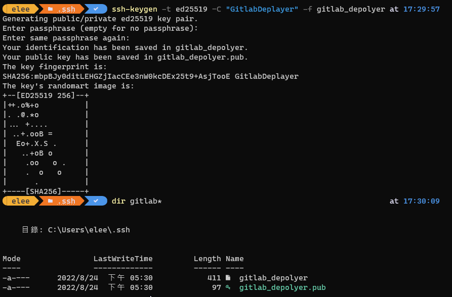

當查看 gitlab_depolyer.Pub 的內容，在檔案的最後結尾處，可以看到我們加入的註解

``` plan
ssh-ed25519 AAAAC3NzaC1lZDI1NTE5AAAAIAcnRrBxD29Gpk+XlV2xVxJauS2BeAeQCpg1ywDDcGvz Deplayer
```

## Target Server

首先，先確認目標的主機，是否可以建立 Powershell 連線。

``` powershell
# 對本機進行連線
Enter-PSSession -ComputerName localhost
```

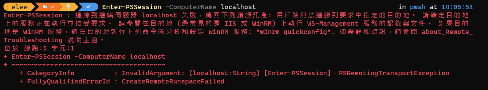  

當出現上述錯誤訊息，表示伺服器未開啟 `WinRM` 服務或 `PSRemoting` 的功能，而 Powershell 要進行遠端連線操作，需開啟此設定。

``` powershell
# 確認 WinRM 的運行狀能
Get-Service WinRM
```

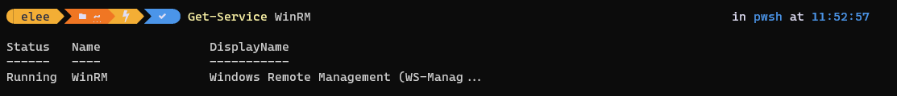

請確保 `WinRM` 的狀態為 `Running`。若狀態為 `Stoped` 時，可使用 `Start-Service WinRM` 啟用 `WinRM` 的服務。（需以 Administrator 權限執行 Powershell）

``` powershell
# 啟動服務 WinRM。
# 需以 Administrator 權限執行。
Start-Service WinRM
```

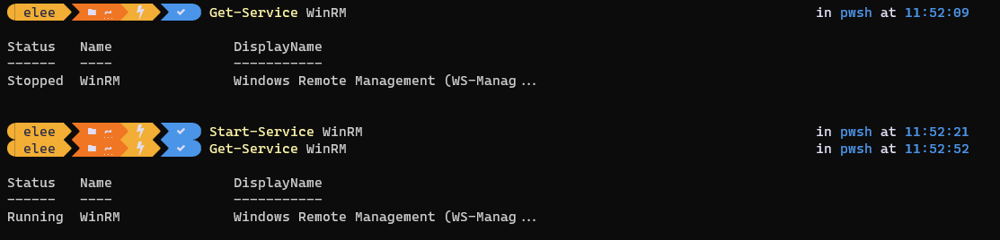  

```powershell
Enter-PSSession -ComputerName localhost
```

接著，啟用 Poweshell 遠端連線的功能。

``` powershell
# 啟用 Powershell Remoting，若 WinRM 未啟用，該指令也會啟用 WinRM 服務。
# 需以 Administrator 權限執行。
Enable-PSRemoting –force
```

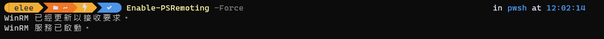  

接著，我們再使用 `Enter-PSSession` 進行連線，就可以順利連上

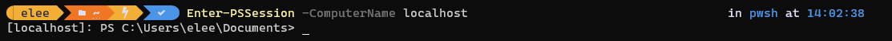  

``` powershell
# 列舉目前 WinRM 監聽的列表
winrm enumerate winrm/config/listener
```

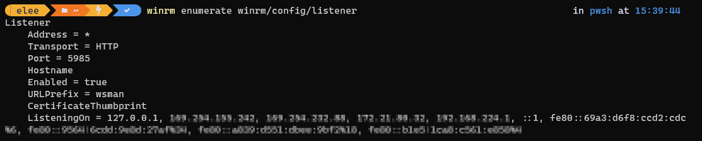  

PowerShell 遠端 (和 WinRM) 會接聽以下連接埠︰

HTTP：5985
HTTPS： 5986

### 設定信任主機 TrustedHosts

``` powershell
# 取得目前 Trausted Host 的清單
Get-Item WSMan:\localhost\Client\TrustedHosts 
```

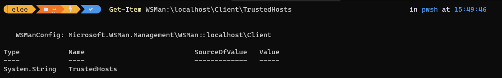  

## Client

為了配合佈屬環境為 Windows 的 IIS 站台，所以選擇使用 Powershell 的指定
在 Gitlab Runner 選擇使用 Powershell 的 docker image `mcr.microsoft.com/powershell`

``` powershell
docker run -it mcr.microsoft.com/powershell /bin/bash
```

接著 Client 所在的機器，進行測試

``` powershell
# 啟動遠端電腦的互動式工作階段
Enter-PSSession [Server location]
```


此時，需要去安裝 Powershell 套件，因為進入 powershell conatiner 時，預設為 `powershell` 模式，直接使用下述指令

``` powershell
Install-Module -Name PSWSMan
Install-WSMan
```

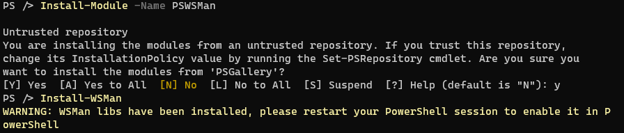

若是進入 `bash` 模式，則使用下述指令

``` Bash
pwsh -Command 'Install-Module -Name PSWSMan'
sudo pwsh -Command 'Install-WSMan'
```

### 連線測試

我們在 Client 先確認是否可以連上 Target server

``` powershell
Test-Connection [target-server-ip]
```

接著，我們再使用 `Enter-PSSession` 進行連線，就可以順利連上

若是 Target Server 未進行 xxxx 的設定，會發生以下的情況

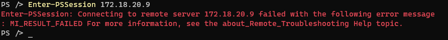

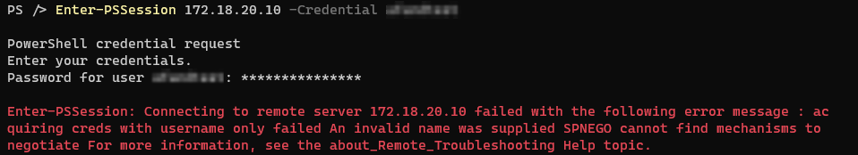  

### 中斷連線

## 參考資料

- FAQforge, [How to Create a PowerShell Session on a Remote Computer](https://www.faqforge.com/windows/create-powershell-session-remote-computer/)
- Microsoft, [Enable and Use Remote Commands in Windows PowerShell](https://docs.microsoft.com/en-us/previous-versions/technet-magazine/ff700227(v=msdn.10)?redirectedfrom=MSDN)
- Microsoft, [使用 WinRM 的 PowerShell 遠端安全性考量](https://docs.microsoft.com/zh-tw/powershell/scripting/learn/remoting/winrmsecurity?view=powershell-7.2)
- Microsoft, [Enter-PSSession](https://docs.microsoft.com/zh-tw/powershell/module/microsoft.powershell.core/enter-pssession?view=powershell-7.2)
- TheITBros.com, [How to Run PowerShell Script on Remote Computer?](https://theitbros.com/run-powershell-script-on-remote-computer/)
- KimConnect.com, [Linux: Enable PowerShell Remoting WinRM Client on Ubuntu 20.04](https://kimconnect.com/linux-enable-powershell-remoting-winrm-client-on-ubuntu-20-04/)
- [Running PowerShell from Linux to Query SMB Shares in NetApp ONTAP](https://whyistheinternetbroken.wordpress.com/2021/05/06/running-powershell-from-linux-to-query-smb-shares-in-netapp-ontap/)
- TechThoughts, [PowerShell Remoting](https://www.techthoughts.info/powershell-remoting/)

有時候不是做不到, 而是你的思考模式卡住了。也許轉個角度，轉個方向，就找到解答了。
