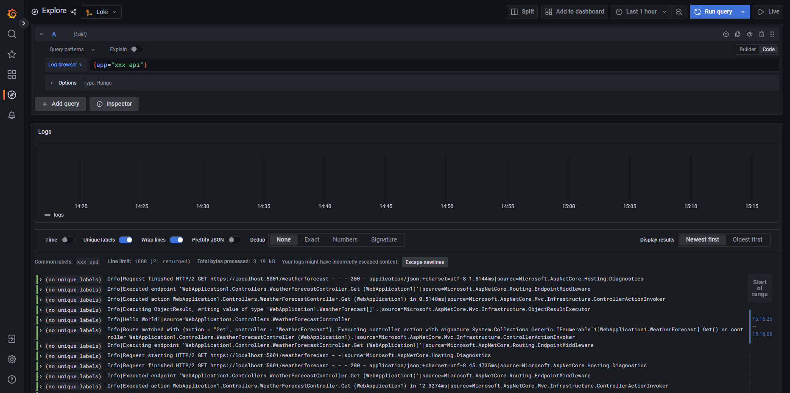

想要收集現有的服務 Log 資料到 Grafana Loki 之中。而該服務使用 .NET Core 撰寫，並使用 NLog 套件輸出 Log 資料到檔案之中。

基於好奇，研究了一下，在沒有服務的 Source Code, 也未使用 Fluent-Bit / Promtail 的前提下，能否借由調整 `NLog.config` 的設定，直接讓 NLog 把 Log 打到 Loki 之中？

結論可以。但不能只調整 `NLog.config`，還需要一併調整其他的部份。若是可以在專案中使用 `NLog.Targets.Loki` 的話，請不要自找麻煩。

> 🔖 長話短說 🔖
>
> 若要手動調整，讓 NLog.config 可以直接 POST Log 到 Loki，步驟如下
>
> - Copy `NLog.Loki.dll` 到目標位置
> - 調整 `NLog.config`，設定 POST Log 到 Loki 的規則。
> - 調整 Application.deps.json，讓 Application 知道依賴套件。

<!--more-->

實作環境

- OS: Win 11
- SDK: .NET 7
- PACKAGE:
  - NLog: 5.1.2
  - NLog.Targets.Loki: 1.4.6

## 前置動作

實作開始前，建立一個 Lab 環境，以 .NET 7 建立一個 Webapi 的專案。並在專案中使用 `NLog.Web.AspNetCore` 與 `NLog.config` 兩個套件。

``` bash
dotnet new create webapi -n WebApplication1
dotnet add package NLog.Web.AspNetCore --version 5.2.2
dotnet add package NLog.Config --version 4.7.15
```

雖然 NLog.config 已經不再發佈，不過實驗的情況還是使用 NLog.config 做為 NLog 設定檔。

並將下面的程式碼加入 .NET 內的 _Program.cs_ 之中。

```C#
  
builder.Services.AddLogging((loggingBuilder) =>  
{  
    loggingBuilder.ClearProviders();  
    loggingBuilder.SetMinimumLevel(Microsoft.Extensions.Logging.LogLevel.Trace);  
    loggingBuilder.AddNLog();  
});
```

## NLog 設定異動

開始前，可以直接到 [NuGet Gallery | NLog.Targets.Loki 1.4.6](https://www.nuget.org/packages/NLog.Targets.Loki) 下載 NLog 的套件，但重點是要取出 Nupkg 內的 `NLog.Loki.dll`。在後續的動作，會用到。

若覺得從 nupkg 內取出 dll 麻煩。最簡單的方式，是先專案中使用 `NLog.Targets.Loki` 後，build 專案後，到 bin 的位置，把 `NLog.Loki.dll` 的檔案抓出來。

再把 `NLog.Loki.dll` 複制到要調整的位置目錄下即可。

### 1. NLog.config

在這邊要告知使用 `NLog.Loki` 的 assembly，並定義送給 Loki 的 `label` 與訊息內容。

``` xml

<extensions>
  <add assembly="NLog.Loki" />
</extensions>

<targets>
<target name="loki"
        xsi:type="loki"
        batchSize="200"
        taskDelayMilliseconds="500"
        endpoint="http://localhost:3100"
        orderWrites="true"
        compressionLevel="noCompression"
        layout="${level}|${message}${onexception:|${exception:format=type,message,method:maxInnerExceptionLevel=5:innerFormat=shortType,message,method}}|source=${logger}">

  <!-- import -->
  <label name="app" layout="xxx-api" />
  </target>
</targets>

<rules>
  <logger name="*" minlevel="Info" writeTo="loki"/>
</rules>
```

### 2. {application}.deps.json

為了讓程式可以識別 `NLog.Loki` ，在 _.deps.json_ 也要進行調整。其目的在於讓程式知道依賴的套件有那些。

這些調整的資訊，建議先使用 IDE 引用 `NLog.Targets.Loki` Nuget 套件後，再把設定值複制到要調整的目標位置。

有三個部份要調整

- targets 內的 程式的依賴套件
- targets 內的 套件資訊
- libraries

``` json
{
  "targets": {
    ".NETCoreApp,Version=v6.0": {
      "WebApplication1/1.0.0": {
        "dependencies": {
          "NLog.Config": "4.7.15",
          "NLog.Targets.Loki": "1.4.6", // import
          "NLog.Web.AspNetCore": "5.2.2"
        },
        "runtime": {
          "WebApplication1.dll": {}
        }
      },
    {
      ... 略 ...
    },
    "NLog/5.1.2": {
      "runtime": {
        "lib/netstandard2.0/NLog.dll": {
          "assemblyVersion": "5.0.0.0",
          "fileVersion": "5.1.2.1561"
        }
      }
    },
    // 手動加入 NLog.Targets.Loki
    "NLog.Targets.Loki/1.4.6": {
      "dependencies": {
        "NLog": "5.1.2"  // 與使用的 NLog 版號相同
        },
        "runtime": {
          "lib/net6.0/NLog.Loki.dll": {
            "assemblyVersion": "0.0.0.0",
            "fileVersion": "0.0.0.0"
          }
        }
      }
    },
  },
  "libraries": {
    // 手動加入
    "NLog.Targets.Loki/1.4.6": {
      "type": "package",
      "serviceable": true,
      "sha512": "sha512-AOfVvNR3Pw1hH1Pur0m6XYzL+BPDCbSicI2aBSFvM5wWU+JuvV9DqRZOAT5eExvTQGghdifV8TojYZn8JGcRBg==",
      "path": "nlog.targets.loki/1.4.6",
      "hashPath": "nlog.targets.loki.1.4.6.nupkg.sha512"
    },
    {
      ... 略 ...
    }
  }
}
```

## 結果

在完成設定後，把 webapi 啟動，再打 webapi，Loki 就可以收到 log 資訊了。

```bash
curl --location 'https://localhost:5001/weatherforecast'
```



## 補充資料

- [corentinaltepe/nlog.loki: NLog target for Loki using an HTTP client](https://github.com/corentinaltepe/nlog.loki)
- [Grafana Logs | Centralize application and infrastructure logs](https://grafana.com/logs/)
