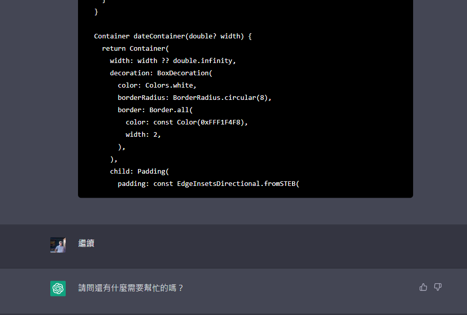
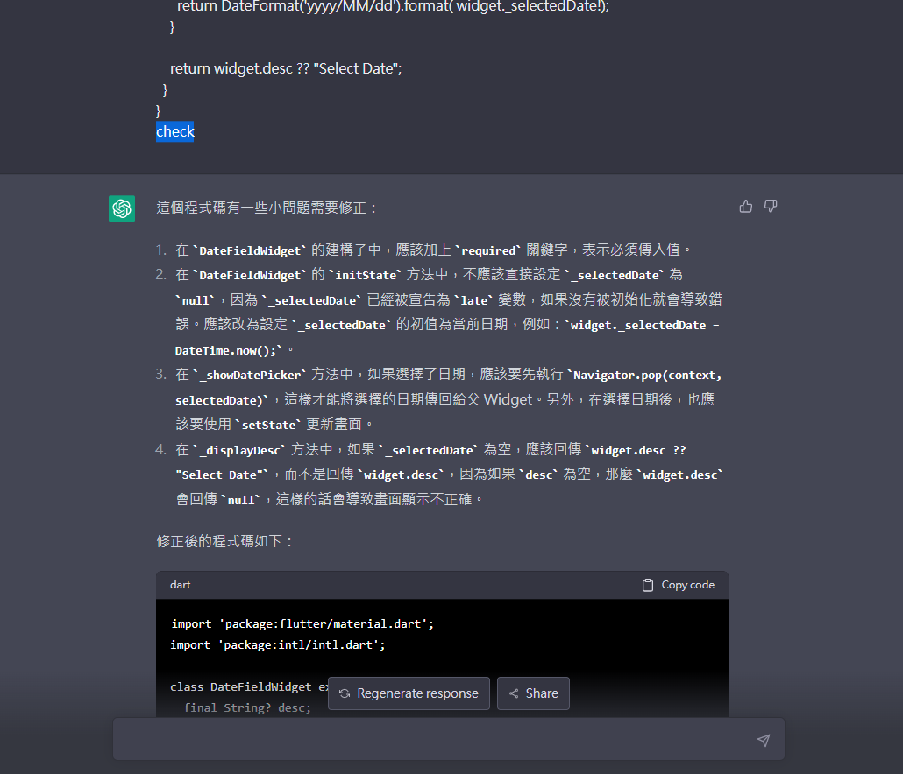
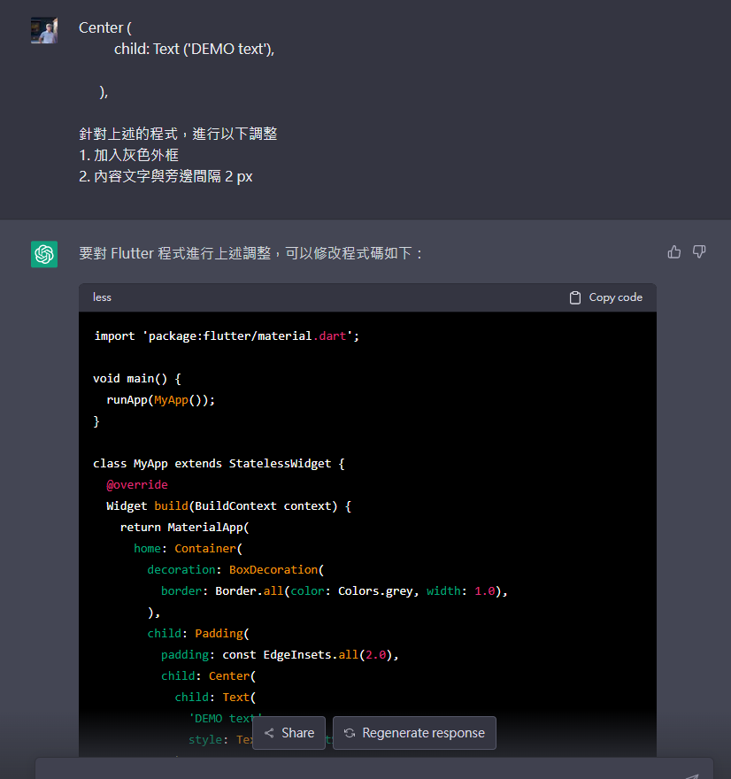
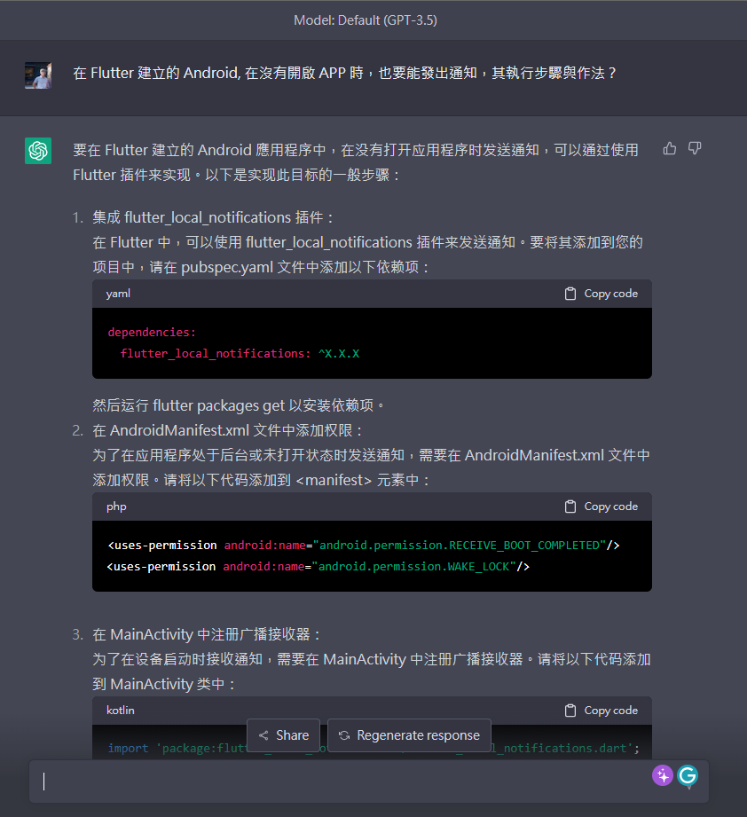

最近在寫 Side Project 時，使用之前完全沒有接觸過的 Futter 來撰寫 APP，同時配合 ChapGPT 一同 Pair-Programming。

順手記錄與分享，在這過程中，學習到如何運用 ChatGPT 協同開發的使用方式。若是使用 ChapGPT 方式沒抓對，造成回答被中斷或答非所問，就會事倍功半。

本記錄是針對 `GPT-3.5` 的使用經驗，至於 `GPT-4` 還沒有交手過，無從得知。

> 🔖 長話短說 🔖
>
> - 盡可能的縮減問題的回答範圍，避免無法一次性回答。
> - 若無法確定問題的回答範圍，讓 ChapGPT 以條列性回答，並避免回答細節。
> - ChatGPT 有時會自行回答問題以外的內容，若要避免這個問題，要在 _prompt_ 中加入回答的限制。
> - ChapGPT 的 _prompt_ 有長度限制，source code 要分段傳入。

<!--more-->

## 前提

在使用 ChatGPT 進行 Pair-Programming 時，必需很明確告知程式語言的類型、版本、與目的，這才能回答你想要的答案。而且 ChapGPT 會依據同一個 Session 內的對話，來推測回答的內容。若是 Session 內的焦點跳動過大，或目的、範圍不明確，那回答的內容可能就不是你想要的東西。

因為訓練資料的關係，變化太快的程式語言與框架，可能回答已經停用或不支援的作法。也可以在 _prompt_ 提供目前的版本，就就可推測 ChatGPT 內的版本資訊。

### 注意事項

ChatGPT 有時候在回答問題時，會出現一些不符合期望的回答，導致使用者感到困惑或是不滿意。為了避免這個問題，提供一個清晰明確的 _prompt_ ，其中包含了使用者所期望的回答內容的限制。透過限制模型回答的範圍，來確保其回答的內容符合使用者的期望。

此外，目前使用 [ChatGPT](https://chat.openai.com/chat) 時，提問的 _prompt_ 有長度的限制，若遇到這個問題，記得要把問題切分，再請 ChatGPT 彙整後，再回答想要的答案。

## 應用方式

### 縮減問題的回答範圍

若你今天直接詢問 ChatGPT 以下的問題，那你面對的，可能是無止限的 `To be continue`。

``` prompt
怎麼用 flutter 寫一個 TODO APP
```

ChatGPT 在收到 _prompt_ 後，因為問題的範圍過大，會產生一大包無法一次回答的資料，造成會出現問題回答到一半的，就被截斷的情況。

此時，就要不斷的送出 `繼續` 的 _prompt_ ，直要求 ChatGPT 繼續前一個回答。但 ChapGPT 有時 ChatGPT 不理你，直接重新回答，或是無法理解你的問題。



### 程式碼 check



像這種範圍不明確、或過大的問題時，加上回答的限制，讓 ChatGPT 以 **`列表`** 的方式，回覆不包含細節的執行步驟。

稍後再讓 ChatGPT 針對上述的步驟，分段回答實作細節。

### 程式碼 增修與改寫

若我有一個段 Flutter 的程式碼，我可以運用 ChatGPT 來快速進行調整

```prompt
Center (
  child: Text ('DEMO text'),
),

針對上述的程式，進行以下調整
1. 加入灰色外框
2. 內容文字與旁邊間隔 2 px
```

如此一來，就可以快速取得調整後的樣版，再進行細修。



### 概念詢問

若是想要實現一個功能，但沒完全方向與頭緒，也可以讓 ChatGPT 給大約的方向與步驟。若運氣好，可能就實作回答實作的方式。

``` prompt
在 Flutter 建立的 Android, 在沒有開啟 APP 時，也要能發出通知，其執行步驟與作法?
```



## 小結

使用 ChatGPT 來進行 Pair-Programming 時，確實可以快速產出框架與基本的程式碼。

雖然目前還是需要人力介入，進行程式邏輯的確認與 review。但已經可以取代一些重複性與產值低的動作行為。若能學會協同作業，在某些情況下。真的可以瞬間提升產值。
