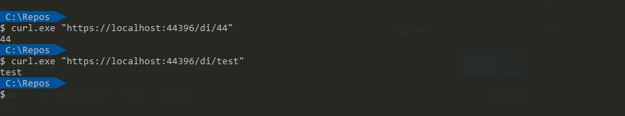

> 🔖 長話短說 🔖
>
> 使用 .NET 內建的 [Microsoft.Extensions.DependencyInjection](https://github.com/aspnet/DependencyInjection) 時，若想要額外設定加初始動作，可使用 `IServiceProvider` 或 `IServiceProviderFactory`
>
> 若想在 Middleware pipeline 之外的地方取得 `HttpContext`，可使用 `HttpContextAccessor`。
>
> 可使用 `IServiceProvider.GetService<IHttpContextAccessor>()` 取得 HttpContextAccessor。
>
> 在 DI 設定物件的生命週期時，運用 Lambda 方法，配合 `IServiceProvider` 參數，來調整建立物件的細部設定。

<!--more-->

操作環境：

- Windows 11
- .NET Core 7

## 目的

當開發多租戶的 API 時，已知 API 的 Route 中必定含有 `租戶 Id`。因此希望在建立服務的時候，可以根據 `租戶 Id` 直接建立對應的服務。

若是 `Service` 物件建立之前，未將 `租戶 Id` 設為 constructor 必需參數，那後續使用 Service 內的方式時，勢必每次都要手動傳入 `租戶 Id` 。

從 DI 的機制切入，使其可以根據請求的參數，建立物件，以達到簡化程式碼，並避免手動傳遞參數時，傳錯參數的錯誤。

## Lab

在實驗之前，有幾個地方必須先調整，

- ControllerBase 的 `[Rotue]` ，指定一個變數 `{id}`。
- 要使用 DI 注入的服務，在 constructor 指定傳入一個參數。

```C#
[ApiController]  
[Route("[controller]/{id}")]  
public class diController : ControllerBase  
{  
    private readonly ITenantService _service;  
  
    public diController(ITenantService service)  
    {  
        this._service = service;  
    }  
  
    [HttpGet(Name = "{id}")]  
    public ActionResult Get()  
    {  
        return this.Ok(this._service.GetId());  
    }  
}  
  
public interface ITenantService  
{  
    string GetId();  
}  
  
class TenantService : ITenantService  
{  
    private readonly string _id;  
  
    public TenantService(string id)  
    {  
        this._id = id;  
    }  
  
    public string GetId()  
    {  
        return this._id;  
    }  
}
```

## 作法

### 取得 HttpContext 的資訊

因為需要使用 Request 的 Route 資訊，可以運用 HttpContextAccessor 來取得 HttpContext 資訊。

在使用 HttpContextAccessor 之前。記得先加入 DI 的 ServiceCollection 之中。可以直接使用 `AddHttpContextAccessor` 的擴展方法，輕鬆達成。

接著，就可以使用 `ServiceProvider.GetService<IHttpContextAccessor>` 的功能，取得 HttpContextAccessor。

```C#
// 在 DI 之中，增加 HttpContextAccessor
builder.Services.AddHttpContextAccessor();
```

### 針對 DI 建立物件的細部設定

#### 使用 Lambda 指定 IServiceProvider

在指定設定 Service LifeCircle 時，運用 `IServiceProvider` 來調整建立物件的細部設定。

在 `AddScoped<ITenantService>` 時，配合 IServiceProvider 與 HttpContextAccessor，就可以達到，在每一個請求的過程中，都是使用請求 `Route` 之中的 `id` 參數所建立的 TenantService。

```C#
builder.Services.AddHttpContextAccessor();
builder.Services.AddScoped<ITenantService>(provider =>
{
	// 使用 HttpContextAccessor 取得 Route 資料
    var accessor = provider.GetService<IHttpContextAccessor>();
    var id = (string)httpContextAccessor.HttpContext.GetRouteData().Values["id"];

	// 建立物件
    return new TenantService(id);
});
```



#### 使用 IServiceProviderFactory

首先，實作繼承 `IServiceProviderFactory<IServiceCollection>` 的類別，`IServiceProviderFactory` 。

接著，把之前取 HttpContextAccessor 與 ISeviceProvider 的程式碼，在 `CreateBuilder` 之中，再重新實作一次。

```C#
public class TenatntServiceProviderFactory : IServiceProviderFactory<IServiceCollection>  
{  
    public IServiceCollection CreateBuilder(IServiceCollection services)  
    {  
        // 註冊 IHttpContextAccessor 
        services.AddHttpContextAccessor();  
  
        // 註冊 TenantService
        services.AddScoped<ITenantService>(provider =>  
        {  
			// 使用 HttpContextAccessor 取得 Route 資料
		    var accessor = provider.GetService<IHttpContextAccessor>();
		    var id = (string)httpContextAccessor.HttpContext.GetRouteData().Values["id"];

            return new TenantService(tenantId);  
        });  
  
        return services;  
    }  
  
    public IServiceProvider CreateServiceProvider(IServiceCollection services)  
    {  
        return services.BuildServiceProvider();  
    }  
}
```

接著跟 Host 告知要使用自定的 `TenantServiceProviderFactory`。

```C#
var builder = WebApplication.CreateBuilder(args);  
  
builder.Host.UseServiceProviderFactory(new TenantServiceProviderFactory());
```

這就樣完成 ServiceProiderFactory 的實作了。

## 延伸閱讀

- [在 6.0 中移轉至新的最小裝載模型的程式碼範例 | Microsoft Learn](https://learn.microsoft.com/zh-tw/aspnet/core/migration/50-to-60-samples?view=aspnetcore-7.0)
- [New dependency injection features in .NET 6](https://andrewlock.net/exploring-dotnet-6-part-10-new-dependency-injection-features-in-dotnet-6/)
