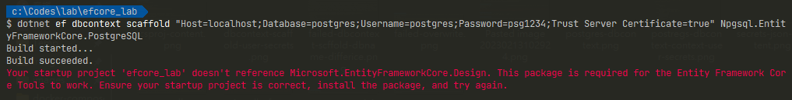
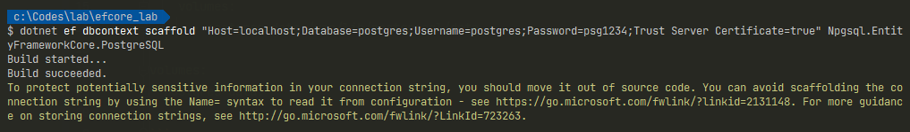
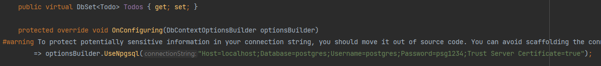
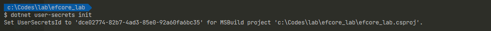
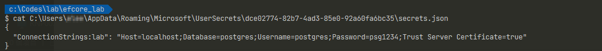

若是有使用過 Entity Framework, EF 的經驗，必然對 `DBContext` 類別有所了解。在 EF 時可以使用 Visual Studo 的 UI 工具，以 Database-First 的方式建立 DBContext。

本篇文章則是記錄 Database-First 的開發方式下，EF Core 如何使用 CLI 來產生 DBContext。

> 🔖 長話短說 🔖
>
> - EF Core 要操作 PostgreSQL 的話，可使用 `Npgsql.EntityFrameworkCore.PostgreSQL`
> - 可使用 `dotnet tool update --global dotnet-ef` 進行 `dotnet-ef` 版本更新
> - 可使用 `dotnet ef dbcontext scffold` 的指令，協助從資料庫已存在的 Schema 產生對應的 dbcontext。
> - 若專案內未參考 `Microsoft.EntityFrameworkCore.Design` 的話，`dotnet ef dbcontext scffold` 無法順利動作。
> - 機敏性資料，可使用 `user-secrets` 工具。

<!--more-->

操作環境：

- Windows 11
- .NET Core 7
- Postgresql 15.1

## 前置作業

### 建立 PostgreSQL

選擇使用 Docker compose 的方式，來建立 PostgreSQL。

使用下面的 yml 設定，預設儲存為 `docker-compose.yml` 檔。當然也可以存為其他更具識別性的名稱。

```yml
version: '3.6'

services:

  postgres:
    image: postgres:15.1
    restart: always
    environment:
      - POSTGRES_USER=postgres
      - POSTGRES_PASSWORD=psg1234
    ports:
      - "5432:5432"
    volumes:
      - postgres-data:/var/lib/postgresql/data

volumes:
  postgres-data:
```

若是存為 `docker-compose.yml` 時，直接執行下述語法即可。

```shell
docker-compose up -d
```

若是存為其他檔名時，需要使用 `-f` 指定 yml 的檔案。

```shell
docker-compose -f <docker-compose.yml> up -d
```

接著建立一個簡單的表格。

```sql
create table todo
(
    id    integer generated always as identity,
    title varchar(30)                         not null,
    date  timestamp default current_timestamp not null
)
```

### 建立 .NET Core Lab 專案

```shell
# 建立新的 console 專案
dotnet new webapi -n efcore_lab

cd efcore_lab

# 安裝 Nuget 套件
dotnet add package Npgsql.EntityFrameworkCore.PostgreSQL --version 7.0.1
dotnet add package Microsoft.EntityFrameworkCore.Design
```

`Npgsql.EntityFrameworkCore.PostgreSQL` 是 postgreSQL 的 DB Provider。

若是沒有安裝 `Microsoft.EntityFrameworkCore.Design`，後續執行 `dotnet ef dbcontext scffold ...` 的指令時，會出現錯誤提示。



## Entity Framework Core Tools

### EF Tool 的安裝與更新

使用 EF Core Tools 之前，需先進行安裝。

```shell
# 將 dotnet ef 安裝為全域工具
dotnet tool install --global dotnet-ef
```

若曾經安裝過 dotnet-ef 的工具，但後續專案使用最新版本的 EF Core，在執行 `dotnet ef` 相關指令時，會出現以下的提示訊息。

`The Entity Framework tools version '6.0.8' is older than that of the runtime '7.0.1'. Update the tools for the latest features and bug fixes. See https://aka.ms/AAc1fbw for more information.`

當發生上述的訊息時，可以使用以下的指令來更新本機內的 EF Core 的 Tools 工具版本。

```shell
 dotnet tool update --global dotnet-ef
```

### 產生 DBContext

接著，就要運用 `dotnet ef dbcontext scaffold` 的指令，來協作我們產生對應資料庫的 DBContext 了。

```shell
dotnet ef dbcontext scaffold <connection_string> Npgsql.EntityFrameworkCore.PostgreSQL

# 例子
dotnet ef dbcontext scaffold "Host=localhost;Database=postgres;Username=postgres;Password=psg1234;Trust Server Certificate=true" Npgsql.EntityFrameworkCore.PostgreSQL
```



若是想要指定產生出來的 `<DBContext.cs>` 放到指定位置，記得額加使用 `-o <Path>` 的指令。否則產生出來的位置與 .csproj 的位置相同。

```shell
# 指定 DBContext 輸出位置為 Models 資料夾
dotnet ef dbcontext scaffold <connection_string> Npgsql.EntityFrameworkCore.PostgreSQL -o Models
```

### 異常排除

#### 狀況一、資料庫不存在 

若是連線字串內的 `Database` 名稱與實際資料庫名稱大小寫不同，會發生找不到資料庫的錯誤。要特別注意。

在這邊，刻意將連線字串內的 Database 名稱，由 `postgres` 改為 `Postgres`，會看到下述的錯誤訊息。


#### 狀況二、已存在檔案

若先前已經有產生過 `<DBContext>` 相關檔案，直接執行指令會出現 `The following file(s) already exist in directory 'c:\Codes\lab\efcore_lab\': PostgresContext.cs,Todo.cs. Use the Force flag to overwrite these files.` 錯誤訊息。


所以必須在指令加上 `-f`，告知 `ef dbcontext scaffold` 要覆寫先前已存在的檔案。

```shell
dotnet ef dbcontext scaffold <connection_string> Npgsql.EntityFrameworkCore.PostgreSQL -o Models -f
```

但要注意的是，上述的指令所產生出來 DBContext.cs 內，會含有連線字串，為了避免資訊外洩，務必記得移除，改用 configuration 注入的方式。



## user-secrets

也可以使用 user-secrets 的方式，來管理機敏資料，避免連線字串直接記錄在程式碼之中。

```shell
# 待調整為 Postgresql 的方式
dotnet user-secrets init
dotnet user-secrets set ConnectionStrings:lab <connection_string>
dotnet ef dbcontext scaffold Name=ConnectionStrings:lab Npgsql.EntityFrameworkCore.PostgreSQL
```

當 `user-serets init` 初始化之後，會產生一組 `UserSecretsId`，並存在 .csproj 之中。




使用 `user-secrets set` 後，系統會把機敏資料存放到 `C:\Users\<user>\AppData\Roaming\Microsoft\UserSecrets\<UserSecretsId>\secrets.json` 之中。




最後使用 `dotnet ef dbcontext scaffold` 使用 `user-secrets` 內的連線字串來產生 DBContext。可以發現連線字串不會被記錄在 DBContext 之中。


## 延伸閱讀

- [Npgsql Entity Framework Core Provider | Npgsql Documentation](https://www.npgsql.org/efcore/)
- [Entity Framework Core 工具參考 - EF Core | Microsoft Learn](https://learn.microsoft.com/zh-tw/ef/core/cli/)
- [在開發中安全儲存應用程式密碼，ASP.NET Core | Microsoft Learn](https://learn.microsoft.com/zh-tw/aspnet/core/security/app-secrets?view=aspnetcore-7.0&tabs=windows#enable-secret-storage)
