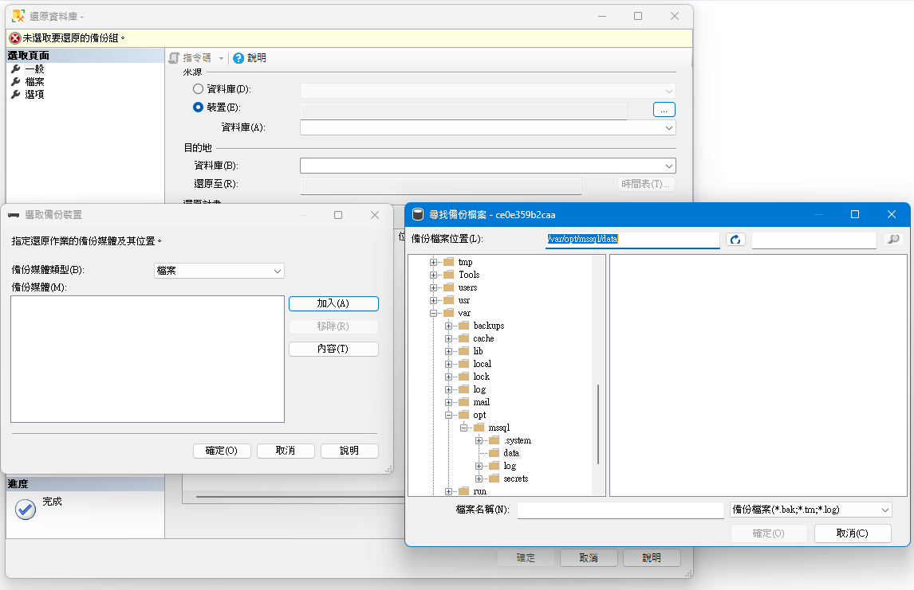
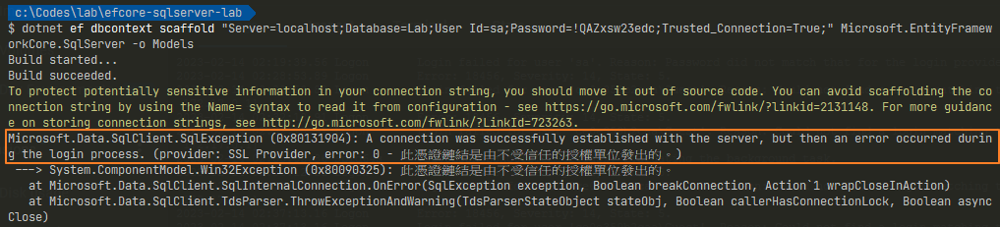

在 [使用 dotnet-ef 建立 PostgreSQL 的 DBContext]() 之後，也嘗試從 SQL Server on Docker 建立 DBContext，就順手把過程中遇到的小問題記錄下來。

> 🔖 長話短說 🔖
>
> - 使用 Docker 建立的 SQL Server，若需要進行 bak 的備份與還原時，在執行 Container 時，別忘了 mount 資料夾。
> - 使用 `dotnet ef dbcontext scaffold` 時，發生 `此憑證鏈結是由不受信任的授權單位發出的` 的差異，請在連線字串內加入 `TrustServerCertificate=true`。
> - 使用 `dotnet ef dbcontext scaffold` 時，發生 `Login failed for user` 的名稱與連線字串內的 `User Id` 不同時，請確認連線字串內的 `Trusted_Connection` 。

<!--more-->

操作環境：

- Windows 11
- .NET Core 7
- EF Core 7
- SQL Server 2022

## 使用 Docker 建立 SQL Server

從微軟 [SQL Server 下載頁](https://www.microsoft.com/en-us/sql-server/sql-server-downloads)內，提供多種 SQL Server 的版本，為了方便，選擇使用 Docker container。

網站上提供了 `Windows container on Docker` 與 `Linux container on Docker` 兩種選項，但最後都會指向同一個 DockerHub [Microsoft SQL Server - Ubuntu based images](https://hub.docker.com/_/microsoft-mssql-server)。

我們可以使用下述的指令來啟動 SQL Server 的 Container。

在範例中，將 `MSSQL_SA_PASSWORD` 設為 `AZ@xsw2ec`，但實際運用上，別忘了修改。

```shell
docker run -e "ACCEPT_EULA=Y" \
		   -e "MSSQL_SA_PASSWORD=AZ@xsw2ec" \
		   -p 1433:1433 \
		   --name sql1 \
		   -d \
		   mcr.microsoft.com/mssql/server:2022-latest
```

關於 SQL Server 環境參數說明

- `ACCEPT_EULA`: 確認是否同意 [End-User Licensing Agreement](https://go.microsoft.com/fwlink/?linkid=857698)
- `MSSQL_SA_PASSWORD`: sa 帳戶的密碼，需超過 8 個字元，同時，至少包含大寫、小寫、數字與非字母的符號，其中三種。

### 資料的持久性

我們都知道 Container 刪除的同時，Container 內所有的資料都會跟著刪除。而資料庫的資料又是最重要的部份。

為確保資料的持久性，可以從 `Bind Mount` 或 `Volume` 兩種作法擇一採用。

#### Bind Mount: 掛載實體的檔案系統

Bind Mount 的參數可使用 `-v` 或 `--mount` ，若使用 `--mount` 需明確指定 type 為 `bind`、`volume` 或 `tmpfs` 其中一種。

```shell
docker run -e "ACCEPT_EULA=Y" \
		   -e "MSSQL_SA_PASSWORD=AZ@xsw2ec" \
		   -p 1433:1433 \
		   -v <host directory>/data:/var/opt/mssql/data \
		   -v <host directory>/log:/var/opt/mssql/log \
		   -v <host directory>/secrets:/var/opt/mssql/secrets \
		   -d \
		   mcr.microsoft.com/mssql/server:2019-latest
```

`<host directory>` 為 Host 的資料夾路徑。

若以 windows 為例，指定 `host directory` 為  `C:\docker_mount`，指令調整如下。

```shell
docker run -e "ACCEPT_EULA=Y" \
		   -e "MSSQL_SA_PASSWORD=AZ@xsw2ec" \
		   -p 1433:1433 \
		   -v C:\docker_mount/data:/var/opt/mssql/data \
		   -v C:\docker_mount/log:/var/opt/mssql/log \
		   -v C:\docker_mount/secrets:/var/opt/mssql/secrets \
		   -d \
		   mcr.microsoft.com/mssql/server:2019-latest
```

##### Volume: 使用 Docker 完全管理資料

Volume 的參數為 `-v`。若在 `docker run` 之中使用未定義或不存在的 volume，docker 會自動產生新的 volume，以提供 container 使用。

```shell
docker run -e "ACCEPT_EULA=Y" \
		   -e "MSSQL_SA_PASSWORD=AZ@xsw2ec" \
		   -p 1433:1433 
		   -v sqlvolume:/var/opt/mssql \
		   -d \
		   mcr.microsoft.com/mssql/server:2019-latest
```

### 資料的備份與還原

若是想要使用 SSMS 將 `.bak` 進行還原，或是進行備份時，若是建立 contaier 時沒有 `mount` 實體位置時，就會發生找不到要還原的 `.bak` 檔案。


所以，若是有備份或還原 `.bak` 的需求，別忘了mount 的動作。

```shell
docker run -e "ACCEPT_EULA=Y" \
		   -e "MSSQL_SA_PASSWORD=AZ@xsw2ec" \
		   -p 1433:1433 \
		   --name sql1 \
		   -d \
		   -v C:\docker_mount:/sql_data \
		   mcr.microsoft.com/mssql/server:2022-latest
```

## 使用 dotnet-ef 建立 DBContext

### 套件與指令

在使用 dotnet-ef 之前，別忘了先為專案增加以下兩個套件。

```shell
dotnet add package Microsoft.EntityFrameworkCore.Design
dotnet add package Microsoft.EntityFrameworkCore.SqlServer
```

接著，設定好 SQL Server 的連線字串後，就可以使用 `dotnet-ef` 來建立 DBContext。

```shell
dotnet ef dbcontext scaffold "Server=localhost;Database=Lab;User Id=sa;Password=AZ@xsw2ec;TrustServerCertificate=true;" Microsoft.EntityFrameworkCore.SqlServer -o Models
```

連線字串參數說明

- `Server`: 資料庫所在的主機位置
- `Database`: 資料庫名稱
- `TrustServerCertificate`: 強制用戶端信任憑證而不進行驗證。

若是只想要 `更新/建立` 特定的表格的 DBContext，可在指令後方加上 `-t` 或 `--table` 的方式。

```shell
dotnet ef dbcontext scaffold "Server=localhost;Database=Lab;User Id=sa;Password=AZ@xsw2ec;TrustServerCertificate=true;" Microsoft.EntityFrameworkCore.SqlServer -o Models -t table1 -t table2
```

### 錯誤排除

#### ⚠ 此憑證鏈結是由不受信任的授權單位發出

```text
Server=localhost;Database=Lab;User Id=sa;Password=!QAZxsw23edc;Trusted_Connection=True;
```

當使用直接使用上述的連線字串時，會發生 SqlException: `A connection was successfully established with the server, but then an error occurred during the login process. (provider: SSL Provider, error: 0 - 此憑證鏈結是由不受信任的授權單位發出的。)`。



當使用的 `Microsoft ODBC Driver for SQL Server` 升級到 18 之後，Driver **預設開啟資料加密**。

當資料加密開啟時，Driver 會進行伺服器憑證的驗證，但 SQL Server 預設使用的 TLS 憑證為自簽憑證 (Self-Signed Certificate)，而用戶端不會有這個憑證。因此出現驗證不通過的異常。

需要在連線字串加入 `TrustServerCertificate=true;`。

#### ⚠ Login failed for user 'xxxxxxx\Guest'

```txt
Server=localhost;Database=Lab;User Id=sa;Password=!QAZxsw23edc;Trusted_Connection=True;TrustServerCertificate=true;
```

當使用含有 `Trusted_Connection=True` 的連線字串時，會發生 SqlException: `Login failed for user 'ce0e359b2caa\Guest'`。

這時，可能會很奇怪，明明連線字串內的 `User Id=sa` ，但為什麼登入的使用者與傳入的帳號不同？

當 `Trusted_Connection=Ture` 時，SQL Server 為確保是可信任的連線，會使用 `Windows 驗證` 的方式登入，若找不到對應的帳號，預設使用 `Guest` 帳號。


## 延伸閱讀

▶ 站內文章

- [Docker 操作簡介]()
- [使用 dotnet-ef 建立 PostgreSQL 的 DBContext]()

▶ 外部文章

- [憑證鏈結是由不受信任的授權單位所發行 - SQL Server | Microsoft Learn](https://learn.microsoft.com/zh-tw/troubleshoot/sql/database-engine/connect/certificate-chain-not-trusted?source=recommendations&tabs=ole-db-driver-19)
- [設定和自訂 SQL Server Docker 容器 - SQL Server | Microsoft Learn](https://learn.microsoft.com/zh-tw/sql/linux/sql-server-linux-docker-container-configure?view=sql-server-ver16&pivots=cs1-bash)
- [使用 Docker 執行 SQL Server on Linux 容器之常用工具與命令 | The Will Will Web (miniasp.com)](https://blog.miniasp.com/post/2020/08/04/Docker-SQL-Server-on-Linux)
- [連接字串語法 - ADO.NET | Microsoft Learn](https://learn.microsoft.com/zh-tw/dotnet/framework/data/adonet/connection-string-syntax)
- [Dockerize your SQL Server and use it in ASP.NET Core with Entity Framework Core (twilio.com)](https://www.twilio.com/blog/containerize-your-sql-server-with-docker-and-aspnet-core-with-ef-core)
- [SQL 連線加密觀察及加密憑證檢查 - 黑暗執行緒 (darkthread.net)](https://blog.darkthread.net/blog/view-sql-encrypt-certificate/)
- [Using Entity Framework for .NET 6 with SQL Server in a Docker Container | no dogma blog (bryanhogan.net)](https://nodogmablog.bryanhogan.net/2021/08/using-entity-framework-for-net-6-with-sql-server-in-a-docker-container/)
- [使用 Microsoft.Data.SqlClient 連線資料庫發生憑證錯誤 (poychang.net)](https://blog.poychang.net/the-certificate-chain-was-issued-by-an-authority-that-is-not-trusted/)
