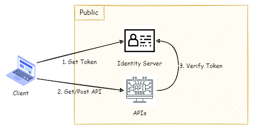
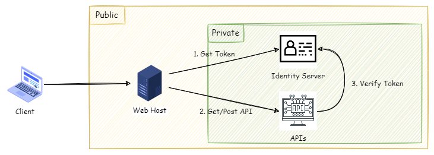
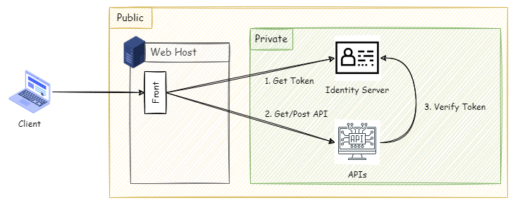
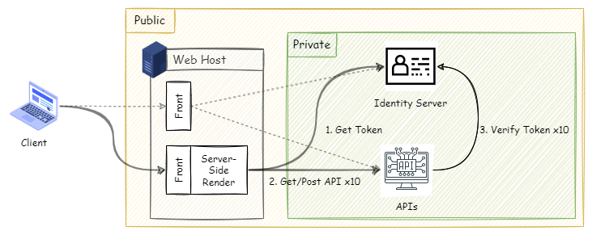

---
title: 開發雜談 - 對於系統架構的多維度思考能力
tags:
  - 自我修練
  - 思維模式
categories:
  - 開發雜談
keywords:
  - 系統架構
  - 思維模式
description: 當思考的維度不同時，會評估與參考資訊的側重點均有不同，影響最後作出的決策。
date: 2022-06-19T01:10:57+08:00
lastmod: 2023-11-11T23:26:33+08:00
slug: multi-dimensional-thinking-for-system-architecture
---

在研究某個軟體的系統架構，發現一個值得探討的問題。

當設計系統架構時，使用何種的視界去分析與設計，會得到不一樣的設計結果，但結果是否為當下最佳的解決方案？

<!--more-->

## 局部視角

假設後端服務的開發團隊，收到開發 APIs 的任務，而且此 APIs 需公開於開放網路。

開發團隊以專業角度出發，基於資安考量的前提下，規劃每一支 API 的請求，都會進行 API 存取合法性的驗證。所以建立 Identity Server，負責 Token 的發送與驗送。

- 在每次呼叫 API 之前，都必須先取得一組 Token 資訊，這組 Token 資訊會包含著請求的有效時間限制以及使用者的資訊。
- 在呼叫 API 時，將取回的 Token 作為必要參數，一同送至 API。
- API 收到請求後，先進行 Token 的驗證。驗證失敗，直接中斷動作，反之，成功回傳 API 的資訊。

這種做法是很合理，因為 APIs 的本身暴露在公開的網路環境中，基於零信任的原則，所以必須對每組 API 的請求，都進行相關身份的驗證。

若思考的維度只關注在 APIs 的本身，很容易會陷入一種情境。當系統發現異常或整合問題時，APIs 端的開發人員會堅持 APIs 的設計沒有問題，一定是其他部份有問題，或是使用端有問題。

當前端與後端分別不同部門，在穀倉效率的影響下，這種事其實蠻容易發生的。因為大家都會站在自己的專業角度去進行設計，個別負責部份都很完美，但組合起來的時候就會發現一些很奇妙的問題。

## 全局視角

**當思考的維度，從單純的 APIs 開發角度抽離，改為關注 APIs 所服務的對象、系統架構的全貌，客戶所關心的重點。**

與相關人員確認後，會發現 APIs 主要提供站台使用，可以初步勾勒出的系統的全貌。

與站台的開發人員，確認會從 JavaScript 直接呼叫 APIs，進行業務層級的操作。

再進一步確認使用情境，發現首頁與特定頁面，需要使用 server side rendering(SSR) 產出頁面。以首頁為例，產出頁面過程中，需要呼叫 10 支 API 組成所需資料。

試著從分析 Client 站連入首頁時，系統一連串的動作行為，會發現在載入 server side rendering 的頁面時，所需要觸發的 API 背後的動作。

1. 首先跟 Identity Server 取得一組 Token。
2. 利用 Token，進行 API 的呼叫。
3. APIs 收到請求後，會將 Token 傳到 Identity Server 進行驗證。
4. 驗證成功後，進行 API 本身的職責，並回傳結果。

發現步驟 2~4 重覆 10 次，每個 API request 都會呼叫一次 Identity Server，進行 Token 的驗證。

總觀來看，其中 9 次的 Token 驗證其實是一個重複性的動作。當然不能說這一個設計有問題，可是從全面性的角度去審視系統架構整體，發現這樣的設計，會對 Identity Server 造成額外的負載，就需要評估這些負載的損耗是必要的嗎？或是可以節省下來？

這其實暴露出系統的規劃與設計，是基於何種維度/視角。

當從局部的角度，去看待一件事情的時候，只有那一個範圍。當評估的維度，往上再拉一層，從全局的角度去看待這件事情的時候，其實會發現當初的最佳解，或許對整個系統而言可能是一個脆弱環節或是瓶頸。

## 小結

回歸到問題的本質，就是設計之初，是否有看見全貌，明白了解這個系統主要要解決的痛點是什麼？客戶要的是什麼？

**其實在大多數的情況下，客戶根本不在意是用什麼樣的技術和方法，能不能解決問題、是否能滿足業務上的需求，這才是他們關注的重點。**

局部最佳解，有時並非系統的最優解。

從局部最佳解來看的話，有時需要額外投入更多的資源進行開發。一旦回到全局的角度來看，有些設計其實是多餘的，或是對系統造成額外負擔。

一但發生未滿足客戶的要求，後續可能需要二次調整，這是一種過度設計造成的成本浪費。

倒不如在專案之初，所有成員提出方法後，進行系統全面性的審視，有時候就可以發現某些功能和設計其實是可以被忽略，或是發現有部分情境未被考慮，在未來可能是系統脆弱的環節。

## 延伸閱讀

- Andrew Wu， [[架構師的修練] #2， SLO - 如何確保服務水準？](https://columns.chicken-house.net/2021/06/04/slo/)
- Ruddy， [工程師的機會成本](https://ruddyblog.wordpress.com/2020/09/14/%e5%b7%a5%e7%a8%8b%e5%b8%ab%e7%9a%84%e6%a9%9f%e6%9c%83%e6%88%90%e6%9c%ac/)