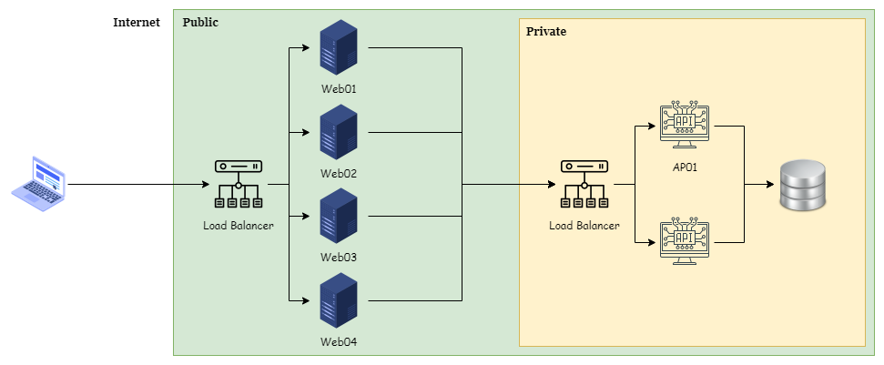
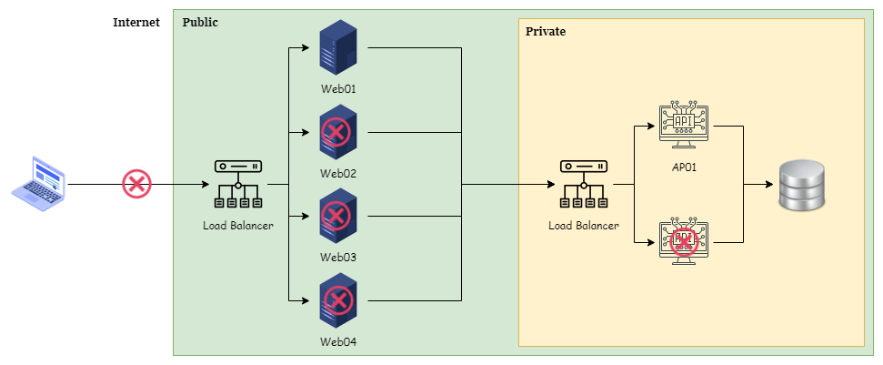
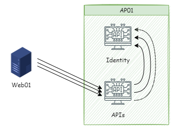
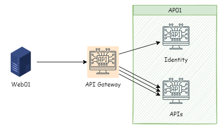

某天 Infra 人員發現還沒對外正式開放的環境，API Server 內的硬碟空間，在短短半個月內，被 IIS Log 吃掉近 20GB 的空間，協同開發人員一同釐清這現象的原因。

<!--more-->

## 釐清過程

上方為簡易的系統架構，依架構來看，API Server 內的 IIS Log 增長，必定是從 Web 主機群過來的請求。

在 API Server-1 隨機查看某天的 IIS Log，發現三個特徵。

- Web01~04 都有呼叫 API，而且在同一秒內，會有相同的請求來源，大量呼叫 API。
- 同一請求來源，請求的 API 與首頁相關。
- 同一請求來源，在一至兩秒內，有多筆相同的 API 請求。

此時初步懷疑是否與之前的壓力測試有關嗎？壓測相關人員回應，壓測的部份，只有壓測半天，後續就沒有再進行任何的壓測動作。

後續減少變數，團隊決定將禁止外部連入，並關閉冗餘的主機，只留下 Web01 與 AP01。

再次觀察 AP01 內的 IIS Log，發現沒有任何外部連線的情況下，Log 還是持續增加，但 Log 的增長速度明顯降低。

觀察 Log 後，發現新的特徵四: **`Web 主機請求的頻率是相同的，固定頻率為 10 秒。`**與特微

此時，Infra 人員想起為了確認 Web 主機是否存活，他將 Load Balancer 的 Health Check 頻率設為每 10 秒會打一次首頁。正好與 IIS Log 出現的特徵相符。

後續處理的作法，團隊會提供 Health Check 用的靜態頁面，以供 Load Balancer 使用。

解決固定頻率呼叫 API 的問題後，接著釐清為何載入首頁時，會有多筆相同的 API 請求？

接著跟前後端開發人員確認載入首頁的流程與 API 動作。才發現...

- 前端載入首頁時，需要先到 AP Server 內的 Identity 服務取得 JWT Token 後，再用這組 Token 同時呼叫 10 支 AP Server 內的 API 服務，以取得完整資訊。
- 後端 API 服務在收到請求後，都會先到 Identity 服務確認 Token 的有效性。

此設計模式，造成單一使用者在載入首頁後，需要針對各別的 API 反覆的進行 Token 驗證，所以才會存在多筆相同的 API 請求。

值得額外討論，AP Server 本身處於私有網域，並不對外服務，是否有再優化的方式。

例如將 API 內的 Token 驗証與本身的職責分開，並彙整需要一起呼叫 API，利用 API Gateway 或 BFF 的概念，將多個 API 整合，只需驗証一次 Token 就可以取得完整資訊。

或者是直接在 API 服務進行整合，減少前端呼叫 API 的數量。

## 問題與解法

> 問題一: Load Balancer 的 Health Check 指向會呼叫 API 的頁面，導致 API 所在主機有預期外的連線請求。

Load Balaner 的 Health Check 指向站台的靜態頁面，即可滿足檢查站台是否存活的目的。並減少對 API 的無意義呼叫。

> 問題二: 同一頁面需使用 Token 呼叫多支 API，但每支 API 均進行 Token 的驗證，造成的大量 Log。

無最佳的解法，需評估看待 API 服務的層面。若僅供內部系統使用，或許有再次優化空間。若提供外部與第三方系統使用，此種作法應為合理的作法。

服務面向不同，其作法也所不同，需依實際環境決策。

## 小結

在問題釐清的過程中，個人的原則與作法

- 由大而小、由粗而細，鎖定問題的範圍。
- 列出可能的情境，並逐一切斷可能的影響。
- 從數據反推原因

若有更好的作法，也歡迎分享。
