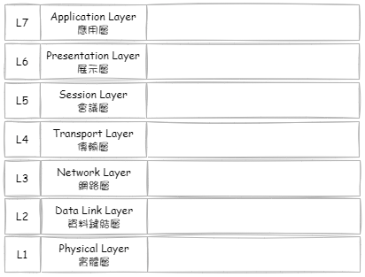

<!--more-->
## OSI

### L7: Application Layer

### L6: Presentation Layer

### L5: Session Layer

### L4: Transport Layer

### L3: Network Layer

### L2: Data Link Layer

### L1: Physical Layer

## 延伸閱讀

▶ 站內文章

- [淺談 HTTPS 與 SSL/TLS 的關係]()
