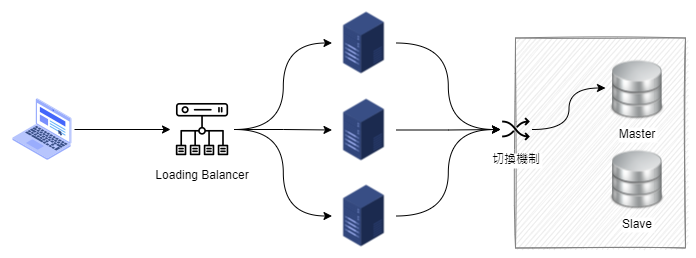
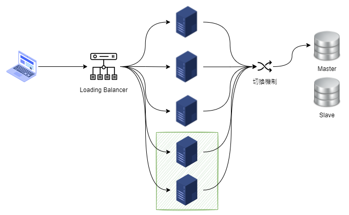

冗餘(Redundancy)是指為提昇系統的穩定性與可靠性，刻意配置重複的零件或機能。此動作主要是為避免單一環節失效，對系統的衝擊。

<!--more-->

在系統架構中，冗餘的機制常用來避免[單點故障]()時，系統失效的情況。資訊系統中，常見的 Load Balancer 與備援機制，都是運用冗餘概念的作法。

有時，為提升系統性能也會使用冗餘的方式。例如，電商為面對搶購活動，突如其來的巨量請求，在資訊系統的 Load Balancer 後方增加機器，以提高系統的負載量。

此外，在軟體開發使用 Behaviour-Driven Development, BDD 也是冗餘的應用之一，針對同一目的，使用不同作法的不同機能冗餘。

藉由 Specification By Example, SBE 的方式開發，讓軟體開發人員可以從 SBE、整合測試等，進行多方面的驗證軟體行為是否符合規格需求。

冗餘機制在確保穩定度與可靠性的同時，相對也會有些缺點與麻煩。

- 額外配置冗餘裝置的成本。
- 增加管理與監控的複雜性。

雖然大多時候，冗餘帶來的好處大於缺點，但在設計與使用時，需要權衡其優缺點，找出最適合當下環境的作法。