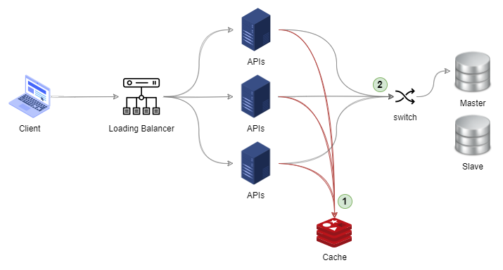

單點故障(Single point of failure, SPOF)，指的是系統上的某一個物理節點故障，而導致整個系統無法運作的現象。

當進行系統風險評估時，必需將單點故障造成的影響，列入評估的範圍。依單點故障發生，會造成服務中止或系統全面性故障，[冗餘機制]()的設定就必定列入考量。

<!--more-->

## 案例

在軟體系統開發上，常用在檢視與評估系統或網路架構的脆弱環節。

假設有一個 API 服務，服務本身需要面對高頻率的資料存取，其中有七成以上的請求，都是取得最近的公告資訊。

基於以上的情境，規劃的系統架構如下，若是請求 API 的種類與公告資訊相關。API 的處理流程是先嘗試到 Cache 取得資料，若 Cache 內沒有資料，再去訪問資料庫，並將取回的資訊放一份在 Cache 內。

服務的系統架構初步看起來好像沒有問題，仔細觀察，發現所有的 API 主機同時使用同一台 Cache，這個節點的發生故障或異常，可能造成服務中止。

當 Cache 主機發生異常或是發生快取雪崩、擊穿、穿透等問題時，造成大量的請求，直接衝擊到資料庫，造成資料庫被打掛，所以 Cache 就是可能造成服務系統無法運作的故障點。

在清楚有那些節點故障時，會對系統造成異常後，才能在事前安排對應的處理方式，達到防範於未然。

## 延伸閱讀

- [工程師的單點故障 (Single Engineer of Failure) 與備援](https://data.leafwind.tw/single-engineer-of-failure-947e2ede1039)
- [案例分析：單點故障，全部故障。(Single Point of Failure, SPOF)](https://showipprotocols-tw.blogspot.com/2013/11/single-point-of-failure-spof.html)
- [single point of failure (SPOF)](https://www.techtarget.com/searchdatacenter/definition/Single-point-of-failure-SPOF)