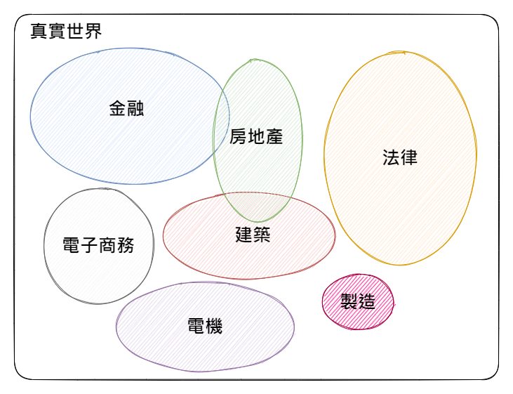
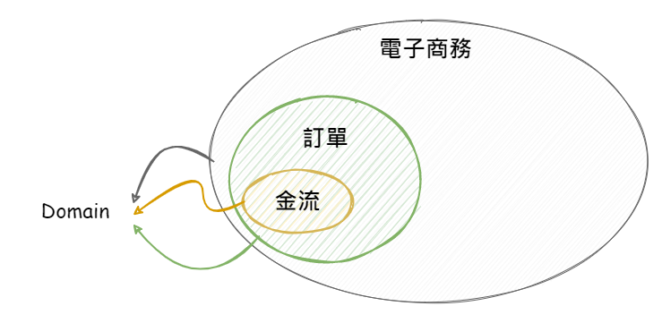
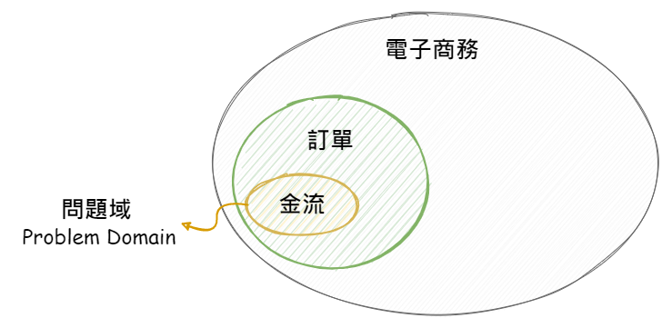
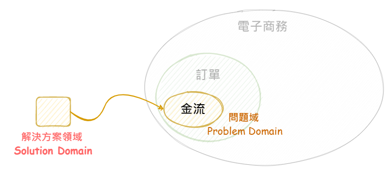
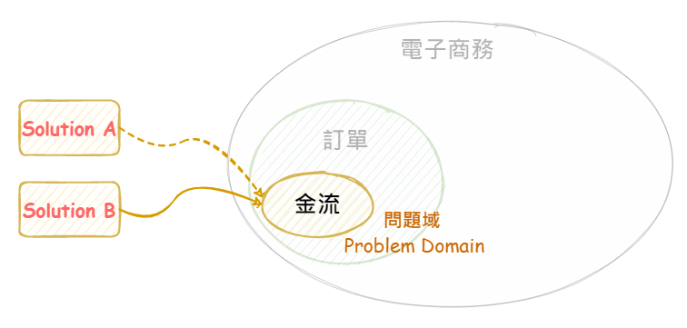
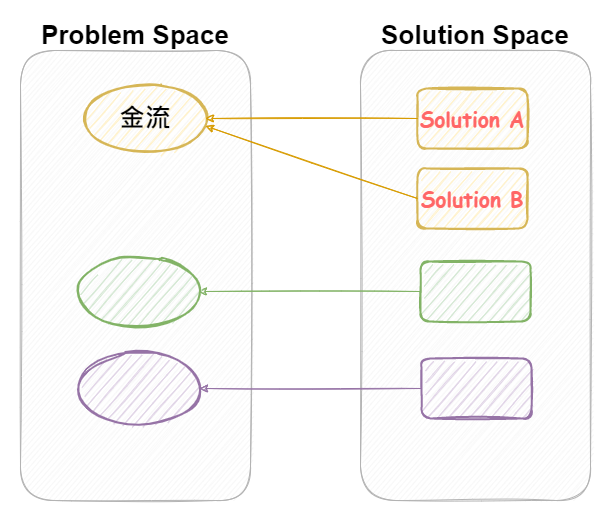

當開始接解 Domain-Driven Desgin, DDD 時，一定會接觸到 `Problem Domain`、`Solution Domain` 、`Context`、`Problem Space` 與 `Solution Space` 這些名詞。

而 `Problem Domain` 與 `Soltion Domain` 的概念，用在釐清問題的切入面，現有資訊的評估，都可以帶來許多的幫助。

> 🔖 簡述 🔖
>
> - **Domain**: 特定知識或專業為基礎的範圍。
> - **Context**: 指特定事物的背景與先決條件。
> - **Problem Domain**: 以特定知識或專案為前提條件，需要處理或解決的問題。一個問題可能會有多組的解決方案。
> - **Poboblem Space**: 所有待處決或問題的集合。
> - **Solution Domain**: 以問題所屬的領域為主，針對性的解決方案。一個解決方案，也可能應用到多個問題域。
> - **Solutton Space**: 所有解決方案的集合。

<!--more-->

## Domain

一開始，先來聊聊 `領域(Domain)` 的概念。

以真實世界為例，存在的許多專業的知識，比如說金融、房地產、法律、電機、製造或電子商務。這些知識，在我們日常生活中，也許多少都會有機會去接觸，但大部份旳人都沒有深入去理解。

將這些專業知識，以其專業的領域進行區分，並加以視覺化，如下圖。

但是，就算兩個人都身處金融領域，也不表示兩個人就可以順利的互相交流。沒有人可以全盤知道領域之中所有的知識。

// 圖, 兩個人, 在溝通, 一個是放款領域, 一個是股票

就更不用說，在不同的領域之中，相同的名詞背後代表的意思完全是不同的。

以金融業而言，光是 `帳戶` 這個名詞，又可以分成銀行帳戶、股票帳戶、基金帳戶、放款帳戶、借貸帳戶等等，每個帳戶著重的重點也不盡相同。

假若，今天一個電子商務的工程師，站台支援的金流，需要增加信用卡支付功能。

與銀行信用卡的工程師溝通時，使用電商的術語跟金融業在討論事情，那很有可能會發生雞同鴨講的情況。

例如說`賬戶`這個名詞，在電商領域，可能指的是消費者或會員的會員帳號。而信用卡的領域，指的可能是信用卡的卡號。

若是無法對齊彼此所處的的領域，有很大的機會發生雞同鴨講的情況，讓溝通事倍功半。

### 上下文/語境/脈絡 *Context*

所以我們要有效的溝通，必須要存在相同的領域中，我們的溝通才會更有的共識。

那其實背後一直的說我們在溝通的時候我們的知識背景要相同我們的溝通是在處於一個相同的環境下溝通

所以有一個詞非常的重要這個詞，就是所謂的 Context。`Context` 是一個非常非常重要的詞彙。這一個詞目前有很多的中文翻譯，最常見的應該是`上下文`，這也有人用`語境`，但個人比較偏好用所謂的`脈絡`。

我們今天在討論一件事情或與人溝通的時候，我們的回答和反應往往會取決於前面的一些背景。如果無法知道明確的前置條件或是背景知識的時候，就很容易發生雞同鴨講的情況也就是所謂的頻道不在同一條線上。

我們在生活的溝通上，多少遇到一些說話很跳 tone 的人。之所以會讓我們覺得這些人說話很無理頭或摸不著頭緒，大部份因為我們無法理解他們回應背後的背景、先置條件或立足點。

### 問題領域 *Problem Domain*

什麼是問題領域呢？一般指的就是我們想要解決的問題，它所存在的專業領域或者是主題、問題的範圍、問題的背景與相關的限制與規範。

只有在知道明確問題的背景情況下，才能有效的理解問題與進行分析，有效的設計與找出對應的解決方案。

當問題領域越是明確，就更容易鎖定真正要處理的問題點在哪裡。越是理解問題所需要的領域知識，就能更有效的去設計與建構出符合用戶和室利害關係人需求的問題，或是排除系統現有的問題

以電子商務為例，在電子商務這個領域裡面，又可以切分出多個子領域，例如與訂單相關領域、金流相關領域、物流相關領域等等。而領域跟領域之間，其實是有大的機會發生交集或重疊。

若今天想解決金流領域，與第三方信用卡支付的問題，那麼問題的範圍就很明確的縮小到金流與第三方信用卡支付的串接。

### 解決方案 *Solution Domain*

解決方案是指對一個問題或需求的解决方法。它是由一系列步驟或策略組成的，用於達到預定的目標。

解決方案可能包括使用特定的技術、工具或方法，或者是一組配置或架構。在軟體開發中，解決方案是指應用程式或系統如何解決特定問題領域中的需求。解決方案需要考慮到用戶需求、技術限制、成本限制和時間限制等因素。

當我們已經鎖定好當我們已經鎖定好了問題領域後，接著我們就要去找出這個問題的解決方案了

那這個解決方案了通常有可能包含了使用的技術工具和方法，或者是架構調整等等等

在同時我們必須考慮如何提出一個可以符合用戶需求、技術限制、成本限制、時間限制等等的先天先決條件，對應的解決方案。

### 兩者之間的關係

不過當我們再找解決方案的時候，通常不會只有一組唯一解。大多時間，我們可能會找出或是提出 2 到 3 組的解決方案，並從中評估解決方案的優缺點，最終選擇一個最符合當下情境的最終決策。

有時，我們會發現某些解決方案，也可以應用到其他不同的問題上。

// 增加圖示與例子

## Space

前面再討論問題領域以及解決方案的時候其實我們在討論的都只是一個個案，

在軟體開發的過程中，通常會有很多個問題等著解決，若將這些問間集中在一個地方，我們可以稱這個問題的集合為`問題空間 (Problem Space)`。

同理，將所有可能的解決方案加以集中，所有可能的解決方案的集合則稱為 `解決方案空間 (Solution Space)`。解決方案空間的大小，取決於問題的複雜性。

總而言之，問題空間是所有可能的問題的集合，而解決方案空間是所有可能的解決方案的集合。

值得特別一提，隨時間過去與業務的成長，問題不會永遠都不變，隨之，解決方案也會隨著問題與的不同而跟著變化。

面臨的問題，可能是原本問題的顏色問題的延伸，所以可能會需要調整原有的解決方案，或是配合其他現有的解決方案，共同處理掉這個問題。

## 延伸閱讀

▶ 外部文章

- [區分 DDD 中的 Domain, Subdomain, Bounded Context, Problem/Solution Space - 騰訊雲開發者社區](https://cloud.tencent.com/developer/article/1844134)
