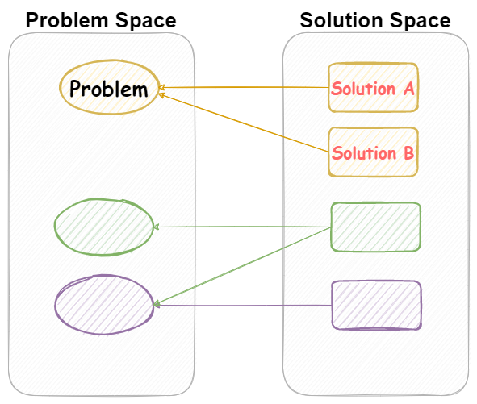

當開始接解 Domain-Driven Desgin, DDD 時，一定會接觸到 `Problem Domain`、`Solution Domain` 、`Context`、`Problem Space` 與 `Solution Space` 這些名詞。

而 `Problem Domain` 與 `Soltion Domain` 的概念，用在釐清問題的切入面，現有資訊的評估，都可以帶來許多的幫助。

<!--more-->

## Domain

一開始，先來聊聊 `領域(Domain)` 的概念。

以真實世界為例，存在的許多專業的知識，比如說金融、房地產、法律、電機、製造或電子商務。這些知識，在我們日常生活中，也許多少都會有機會去接觸，但大部份旳人都沒有深入去理解。

將這些專業知識，以其專業的領域進行區分，並加以視覺化，如下圖。

但是，就算兩個人都身處金融領域，也不表示兩個人就可以順利的互相交流。沒有人可以全盤知道領域之中所有的知識。

// 圖, 兩個人, 在溝通, 一個是放款領域, 一個是股票

就更不用說，在不同的領域之中，相同的名詞背後代表的意思完全是不同的。

以金融業而言，光是 `帳戶` 這個名詞，又可以分成銀行帳戶、股票帳戶、基金帳戶、放款帳戶、借貸帳戶等等，每個帳戶著重的重點也不盡相同。

假若，今天一個電子商務的工程師，站台支援的金流，需要增加信用卡支付功能。

與銀行信用卡的工程師溝通時，使用電商的術語跟金融業在討論事情，那很有可能會發生雞同鴨講的情況。

例如說`賬戶`這個名詞，在電商領域，可能指的是消費者或會員的會員帳號。而信用卡的領域，指的可能是信用卡的卡號。

若是無法對齊彼此所處的的領域，有很大的機會發生雞同鴨講的情況，讓溝通事倍功半。

### 上下文/語境/脈絡 *Context*

Context 是一個非常非常重要的詞彙。

### 問題領域 *Problem Domain*

問題域指的是問題或系統所要解決或運作的領域或主題。它定義了問題的範圍和問題存在的背景。

問題域指的是問題或系統所設計或運作的領域或主題。它定義了問題的範圍和上下文。

在軟體開發中，問題域是軟體系統正在建立的專業領域或應用領域，如財務、醫療保健或電子商務。

了解問題域對於有效地設計和構建能夠解決用戶和利益相關者特定需求和要求的系統至關重要。

了解問題域對於有效地設計和構建符合用戶和利益相關者特定需求和要求的系統至關重要。

### 解決方案 *Solution Domain*

解決方案是指對一個問題或需求的解决方法。它是由一系列步驟或策略組成的，用於達到預定的目標。解決方案可能包括使用特定的技術、工具或方法，或者是一組配置或架構。在軟體開發中，解決方案是指應用程式或系統如何解決特定問題領域中的需求。解決方案需要考慮到用戶需求、技術限制、成本限制和時間限制等因素。

## Space

問題空間是指所有可能的問題的集合。它是由問題的所有狀態、輸入和輸出組成的。問題空間是所有可能的問題的集合，它可以是有限的或無限的。

解決方案空間是指所有可能的解決方案的集合。它是由解決方案的所有狀態、輸入和輸出組成的。解決方案空間也可以是有限的或無限的，具體取決於問題的複雜性。

總而言之，問題空間是所有可能的問題的集合，而解決方案空間是所有可能的解決方案的集合。

### 問題空間

### 解決方案空間

### 兩者之間的關係

## 延伸閱讀

▶ 外部文章

- [區分 DDD 中的 Domain, Subdomain, Bounded Context, Problem/Solution Space - 騰訊雲開發者社區](https://cloud.tencent.com/developer/article/1844134)
