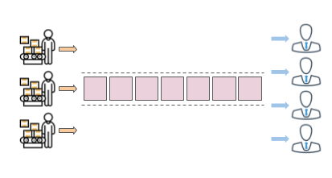

---
title: 淺談 Pattern | 生產者與消費者模型
description: 佇列常見用於生產者與消費者模型之中，作為兩者之間的緩沖區。將雙方的直接關係進行解耦，並減少雙方效率不均的問題。
date: 2023-02-02T07:58:59.547Z
categories:
  - Pattern
tags:
  - 系統架構
keywords:
  - producer-consumers
  - pattern
slug: producer-consumers
---

佇列常見用於生產者與消費者模型之中，作為兩者之間的緩沖區。將雙方的直接關係進行解耦，並減少雙方效率不均的問題。

而在併發的架構下，必須使用鎖定機制與同步機制，確保佇列中的之資源被正確的存取，避免重覆使用或錯誤覆寫的情況。

<!--more-->

## 生產者與消費者模型

依慣例，在說明**生產者與消費者模型(producer-consumers pattern)** 之前，先用一個現實的情境來舉例。

```Plan
A 公司推出新的 3C 產品，預計會有兩、三波的搶購熱潮。

所以它找了三間代工廠，幫它預先生產了五萬組商品，放在 A 公司的集貨倉庫之中。後續持續生產三萬組。
如它預期，一上巿果然引起搶購熱潮，庫存在幾天內，就將商品售完。消費者因為沒有現貨，只能等待到貨。

A 公司評估銷售後，這情況，決定新增一間代工廠，追加兩萬組商品。
那知好景不長，B 公司推出殺手級的商品，大部份旳消費者轉向購買 B 公司的商品。
A 公司只能將緊急中止新代工廠的訂單，待原本代工廠完成原本的訂單後，停止生產。而己經生產的商品，持續放在倉庫中，等待消費者來購買。
```

在上面的故事中，我們看到三個角色。這三個角色動作的時間點與作用均不相同。

- 代工廠：在銷售前的預生產；銷售中的持續生產；最後完成訂單後，停止生產。
- 集貨倉庫：商品的存放區。
- 消費者：銷售後的購買行為。



其中，代工廠作為**生產者**，負責產生資源(商品)。集貨倉庫可視為 Queue，負責資源的暫存緩衝與資源調派。消費者，就負責把資源取走、使用。

在實例中，可以觀察到以下的特性。

- 解耦

  代工廠與消費者中間，透過集貨倉庫，將兩端隔離。不會發生消費者直接衝到代工廠內，大喊我要商品，快給我。或是代工廠衝到消費者面對，大喊給我買。

  透過集貨倉庫，代工廠不會知道有那些消費者會來購買商品。相同的，消費者也不知道商品是那些代工廠所生產的。

  A 公司決定更換代工廠，對消費者完全沒影響。消費者的身分，由個人購買更換為公司行號大量購買，對代工廠也沒有影響。**因為兩者而言，它們所聚焦的重點在於商品本身，而非其他對象**。

- 並發

  以代工廠的角度，代工廠將生產出來的商品放到集貨倉庫，完全不需考慮商品的銷售情況。A 公司可以依商品的銷售情況，增減代工廠的數量。

  以消費者的角度：如果商品本身很受歡迎，有購買意願的消費者數量就會增加。反之，如果沒有購買意願，消費者的數量就會減少。而不需理會代工廠產生的商品數量。

- 速率不均

  在上面的例子中，因為商品生產的速度比較慢，所在代工廠在銷售之前，就預先生產五萬商品。但是因為消費者購買速率遠大於生產速度，造成售完的情況。

  雖然，A 公司預估預產商品錯誤有誤，讓商品出現售完的情況。偶後，因為滯銷的情況，讓後面生商出來的商品只能存放於倉庫，等待慢慢銷售。

  但換個角度，正是因為有集貨倉庫，讓商品可以預生產與滯銷的週轉空間。

將上面提到的三個特性，試著以軟體系統的角度解讀。

- 解耦

  若將生產者與消費者分別視為兩個不同的 A、B 模組。

  當發生 A 模組直接調用 B 模組的方法，兩者之間就建立起耦合關係。若將來 B 模組的方法變更，就可能影響到 A。

  利用 Queue 將兩者隔離，讓兩者依賴於 Queue，A、B 模組之間沒有直接依賴，解決其耦合關係。

- 並發

  系統可以依據最重要資源數量，動態決定是增加產生資源的生產者數量，還是減少處理資源的消費者數量。

- 速率不均

  有時資料的產生，可能是一瞬間突然湧進，利用 Queue 的緩衝特性，讓來不及處理的資料可以先暫存下來，等後面產生資料的速度慢下來後，可以處理完成。

彙整 Queue 的使用情境，可以得到以下幾點資訊。

- 速率不對等：產生資料的速度與處理資料的速度不同。
- 避免高耦合：不希望產生資料的模組與處理資料的模組直接相互存取，避免高耦合。
- 並發性處理：同時可以多線程的產生資料，或是處理資料。
- 資源的調配：當 Queue 塞滿資源時，要讓生產端得知；不存在任何資料時，則需處理端知道。

因為這種需要處理的問題，一再反覆出現。當其具有規則性旳部份，統整為一個模型，就是**生產者與消費者模型(producer-consumers pattern)**

面對並發、速率不均的因素，如何有效管理資源放入或取出的正確性，就變得十分的重要。為此，對 Queue 有以下的要求。

- 當 Queue 己填滿資源，就要阻擋生產者持續產生資源，避免持續填入資源。
- 當 Queue 內部清空時，也要阻擋消費者繼續取得資源。

當符合兩點特性的 Queue，稱為阻塞佇列 (BlockQueue) 。

為確保 Queue 內的共用資源的正確性，就必需對存取 Queue 的對象有所管制，避免同時多個對象對同一資源操作。因此需要是互斥鎖、非排他鎖等鎖定機制。

不管是互斥鎖、Semaphore、Mutex、WaitHandle 的那一種作法，其主要的目的，都是為了確保**多執行緒爭相存取共用資源時，共用資源內容的正確性。**

在 `.NET Core` 之中，己經針對生產者消費者模型，設計 [IProducerConsumerCollection](https://docs.microsoft.com/zh-tw/dotnet/api/system.collections.concurrent.iproducerconsumercollection-1) 介面。而 `BlockCollection`、`ConcurrentQueue` 均基於 `IProducerConsumerCollection` 的實作，提供安全執行緒集合適用的封鎖和界限容量，

## 併發程式的三大特性: 原子性、有序性、可見性

在設計並發性的系統中，許多前輩與神人，整理出三個原則。分為**原子性**、**有序性**、**可見性**。

### 原子性 *Atomic*

在以前，原子被認為為是最小的粒子，無法在再分割。雖然現在已經推翻這個概念，但還是習慣使用這個名詞。

以筆者的解讀，原子性指的就是**一個流程或操作之中，無法被外部因素影響，而造成中斷。** 對具有原子性的操作而言，只有兩種可能。

- 操作內所有的動作、變更都順利完成。
- 操作失敗，內部的動作、變更全部不存在。

像 `Lock` 機制，Lock 內的區塊，就視為一個不可分割的執行個體。在執行期間，不會被任何外部因素打斷或影響。

```c#
lock(obj)
{
    // 此區塊可視為一個不可分割的整體
}
```

原子性的區塊大，可以確保更多的操作，但相對的，可能減低系統的效能。區塊小，可能無法確保操作。還是要依據需求，進行評估原子性區塊的範圍。

### 有序性 *Ordering*

使用 Queue 就是因為有著 FIFO 這種有順序的操作方式。相同的，多個執行緒對共用資源操作，可以依據對共用資源存取的請求順序，依序操作。

筆者的理解，有序性，就是會依先後進入的順序，進行操作或存取。`Lock` 、`Mutex` 就是屬於這種的。

這時，再把前面的圖回顧一下。


Producer 1、Producer 2、Customer 1 三者前後請求對 Queue 的操作，而 Queue 處理與回應的順序，也是與請求順序相同。這就是有序性。

### 可見性 *Visibility*

今天，我去超商買走最後一瓶飲料，其他顧客要買時，就會發現飲料沒了。相同的情境，套到系統內，當共用資源被某一個執行緒修改，其他存取共用資源的執行緒也會發現資料的變更，這就是可見性。

在運用原子性的操作後，所有取存共用資源的執行緒，所得到的，都是變更後的最新的資訊，

如果系統為效能的考量，採用了快取的機制。而快取資料，一般是固定間隔才會更新資料，所以存取快取而來的資料，不一定是最新的。

這種情況，就是為了效能而犧牲了部份的可見性。

## 延伸閱讀

▶ 生產者消費者模式

- [生產者/消費者模式(阻塞隊列) 一個經典的並發模型](https://blog.csdn.net/canot/article/details/51541920)
- [生產者 vs 消費者 - BlockQueue 實作](https://columns.chicken-house.net/2008/10/18/生產者-vs-消費者-blockqueue-實作/)
- [Asynchronous Producer Consumer Pattern in .NET (C#)](https://www.dotnetcurry.com/dotnetcore/1509/async-dotnetcore-pattern)
- [BlockingQueue（阻塞隊列）詳解](https://www.cnblogs.com/tjudzj/p/4454490.html)

▶ 併發程式的三大特性

- [解決原子性問題？腦海中有這個模型就可以了](https://juejin.im/post/5d8814975188253f6c75e179)
- [分散式系統 - 在分散的世界中保持一致](https://ithelp.ithome.com.tw/users/20121042/ironman/2792)
