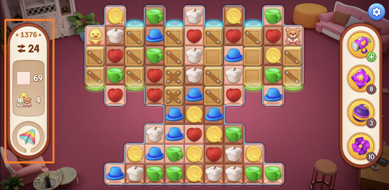
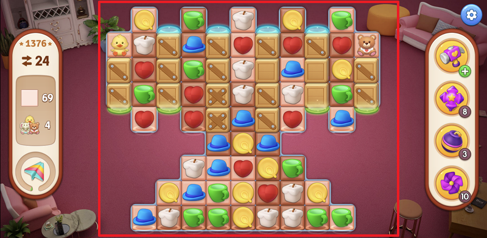
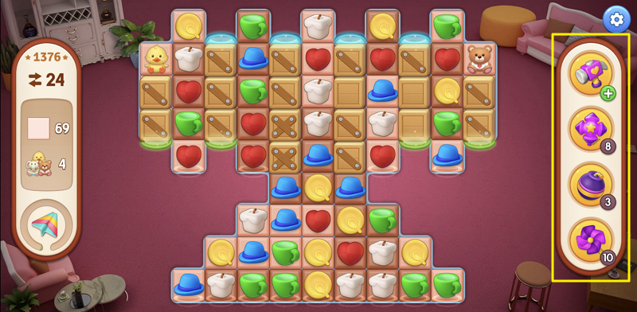
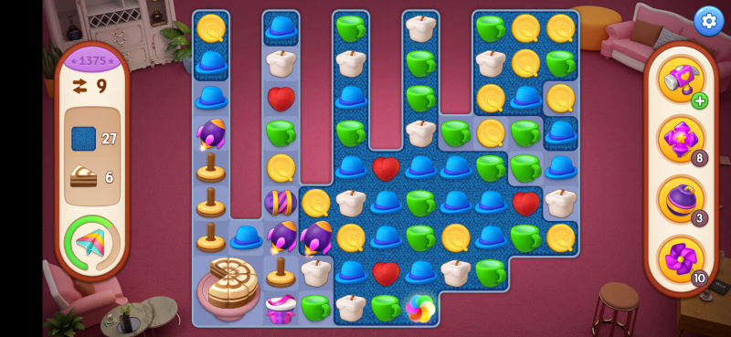
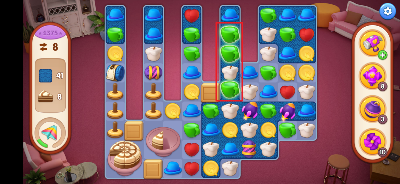

在休閒時間遊玩的消除遊戲，無意中發現消除遊戲中，每一關的過關方式，都可以與專案管理有關。

每一關都像一個全新的專案，在專案進行的過程中，一定會對確認目標，確定要交付的內容，可以使用的資源，是否有那些難點是會影響專案進行下去的要素。

<!--more-->

## 消除遊戲簡介

可能有些人不知道消除遊戲是什麼？簡單介紹一下，

消除遊戲的玩法。消除遊戲主要是以關卡的模式進行。每一關。都會有一個地圖。這些地圖裡面會有著不同的圖案、阻礙以及過關要求的項目。在有限的時間或動作步數內，消除指定種類與數量的項目。

這些特殊的道具, 借由組合相同圖案為長條、十字、方塊等形狀，可以得到特殊的道具，有些可以一口氣消一行或一排，也可以炸消一個區塊，更可以借著道具間的組合，達到更強的威力。

玩家在遊戲過程中，借由組合相同圖案，進行消除組合區塊旁的阻礙，或是利用組合產生特殊道具，更快速的消除阻礙。在限定時間或動作步數內，的最終達到關卡要求的過關條件。

下文所提到消除遊戲，將以[夢想家居](https://play.google.com/store/apps/details?id=com.spacegame.homedesign&hl=zh_TW&gl=US)遊戲為例。

## 確認目標，以終為始

在每一關的開始，都一定有過關的目標，這就像是專案，每一個專案，必定有一個需交付的產品。

上圖左側，是消除遊戲各關卡所要達成的過關條件，**知道了解目標為何？我們才能在。消除遊戲的過程中採用更有效率的方式來達成目的**。以這關來看，我們必須消除所有的顏色區塊，以及四隻玩偶。

在許多提升效率的方法中不斷地提到。我們一定要明確的瞭解及認知，所要達成的目的或是解決的問題。才可以避免無意義的做工或資源的浪費。

有句話叫做，以終為始。確定好你的目標，才能更有效的規劃與執行過程，減少走錯方向或多餘的資源耗損。

## 看見全貌

在專案的開始，我們要看見全貌。也就是說，我們要對整個大局有所估計。其作用是為了發現目前的一個環境背景下。我們可以使用的資源是什麼？要解決什麼樣的問題？要處理的。時候可能會遇到哪些？困難卡點的地方。

已知確認過關條件為消除所有的顏色區塊及四隻玩偶，接著觀察中間的活動區塊。

藉由觀察評估的過程中，試圖找出某些可利用的資源，利用這一些資源更快速的達成的目標。或者是預期某些地方，會是阻礙達成目標的問題。

觀察後，雖然沒有發現可現成使用的道具，但也找出部份可組合道具的圖案排列。

另一方面，發現要成功消除 4 個玩偶前，必須先消除玩偶下方的箱子。此外，許多的箱子會影響我們組合圖案，及消除色塊的不確定因素。

這些箱子，就是**達成目標可能遇到的難點**或是**阻礙達成目標的問題**。那麼，這些箱子要如何排除，就是我們關注的地方，所以在進行中，要持續不斷的注意與排除它們。

回到專案管理的角度，雖然無法在專案執行的初期，使用上帝視角，看清專案全貌。但可以藉由全面的資訊(時程、可使用資源、相關利害關係人 etc.)收集，拼湊出一個不是那麼完美的全貌。雖然。可能還會有一些不確定的因素或是變數？

但換個角度而言，變相地找出專案進行中，可能會造成阻礙的影響。自然的列出後續專案執行過程中，需要持續注意的部份。

接著在推進專案的過程中，就要不停地去思考著要如何去**處理/排除/避開**這些阻礙，直到完全排除影響專案進行的難點。

## 借力使力，可運用的資源與工具

上圖右側的區塊，是遊戲關卡中間可使用的特殊道具。使用這些道具時，無需花費額外的移動步驟，有効的幫助玩者消除方塊。所以當關卡遇到困難的時候，可以使用這些額外的道具來幫我們解決難關。

特殊道具或是右側的道具欄，對應到專案管理，就像專案執行過程中，可以使用的資源或工具，我們可以決定使用或是保留這些資源。但是無疑，這這些都是我們的額外助力。

值得一提的是工具的使用，在消除遊戲中常見的道具有四種

- 飛彈：能消除行或列的飛彈
- 炸彈：3x3 區域性的刪除
- 飛機：依照不同阻礙優先序，進行消除
- 彩球：一口氣消除相同圖案

我們針對需要消除特定目標。有目的性的組合或這些特殊的道具。

假設今天需要一口氣消除四五個相鄰的色塊，那就必須使用炸彈才能達到我要的目的。這時，選擇使用飛彈或飛機。達到的效率就不佳，造成需要花費額外的步驟，才能達到相同的目的。

再假設，目前關卡需要一口氣對所有活動區塊進行炸彈消除，那就會將炸彈與彩球組合起來，將某種圖案全數轉為炸彈，一口氣全面進行炸彈轟炸，快速消除大量阻礙或過關條件。以最小的投入成本，得到極大化成果的作法。

轉到專案的角度來看。當使用的工具或方法，無法針對想要解決的問題對癥下藥。那可能需要花費更多的時間與精力才能達到相同的目的，事倍功半。

再進一步，將兩種或以上的工具或方法，有效的組合使用，就可以讓我們的專案推進得更加的順利。達到`1+1>2` 的成效，事半功倍。

## 持續確認，時時停下再看全貌

隨著遊戲的進行，遭遇到的問題或阻礙會不斷的變化。所以需要時時的注意可用的步數與過關的阻礙。若是對達成目標無用的動作，就要避免浪費步數。

上圖中，距離過關條件，還差 8 塊蛋糕與 41 個區塊染色，若是去組合圖中的綠色區域就沒意義。因為它無法對達成目的有任何幫助。而且步數只剩 8 步，可能需要使用右側的道具欄來協助消除方塊。

回到專案的角度，必須時時地去確保專案的執行過程中，有沒有偏離了主要的目的？是不是做了一些，看起來很爽，但是對達成目的沒有幫助的動作。若發現有這個情況。就馬上的去做修正就可以了。

此外。也隨著時間的流逝，可能發現專案無法在預定的時程或資源內，去達成想要的解決的問題或目的。這時候就要評估，這個專案接下來要怎麼做？

- 確認目前進度能否如期完成？是否需要投入額外資源？
- 再次確認目前的目標達成情形？能否調整目標範圍？或是分期交付？
- 確認是否要改變做法？是否目前做法有問題？
- 確認是否要尋求資訊協助

## 適時的放棄

在遊戲中，若是關卡的移動步數用完。還無法達到過關條件時。遊戲會問是否斷續，花費紙鈔追加資源，以順利過關。或是放棄本關卡。

玩家可能會因為身上擁有足夠的紙鈔，或是特定活動獎勵，決定投入資金，繼續進行關卡的挑戰。或是評估目前的消除進度，就接再投入新的資源，也無法過關，而選擇放棄。

轉到專案的角度。若在原本規劃的時程與資源內。若無法達成目的。就會評估的這個專案，是否值得要再額外的追加時程和資源？或者是，可以尋求其他的資源的協助，就可以突破目前的困境，達到我們想要的目的？

假若評估需要追加投入的資源成本過高。是否需要放棄？放棄損失的成本。以及追加所額外花費的成本，到底哪一個會比較劃算？

假若專案失敗損失的成本過高，或者是基於戰略的目的，不論花費多少成本，一定要取得專案的成功。我們就可能評估需要額外追加資源。

不管是哪種做法，這種追加資源的情況都會有一定的額度。

一旦**預期獲得的利益 <=所花費的成本資源**，那麼這個專案，有很大的機率會被放棄，最終宣告失敗。

## 簡單總結

從方塊的消除遊戲，來看專案管理，其實可以發現一些共同點。

以終為始。只有在確認專案的目標的情形下，才能確保執行過程中不會有太大的偏差。

初期我們就必須對全盤有一個全貌性的了解，為的就是要可以在初期，還沒有遇到問題之前，就評估可能會遇到的問題卡點，處理的方式，還有要持續注意的地方。

在專案的執行過程中。我們必須時時的注意目前專案的進展，是否有偏離了？專案本身的目的還有是否要尋找？專案是否無法順利如期完成？若是提早知道無法順利完成的話，我們必須在當下就要先做一些處理機制，越早處理的處理成本會越低。

簡單來說，就是我們希望藉由目標的聚焦以及全盤性的了解。同時減少無意義的作工，及專案進行的效率最佳化。
