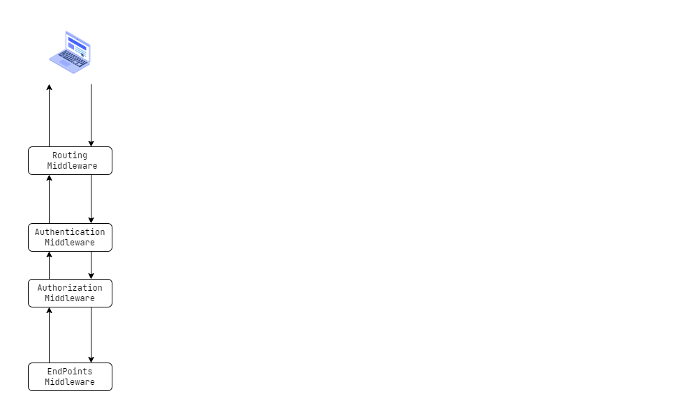
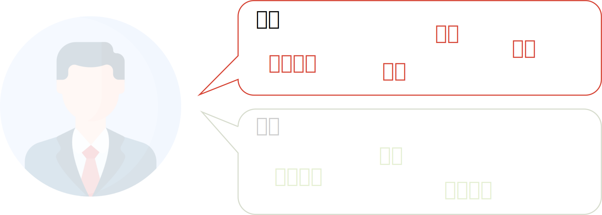
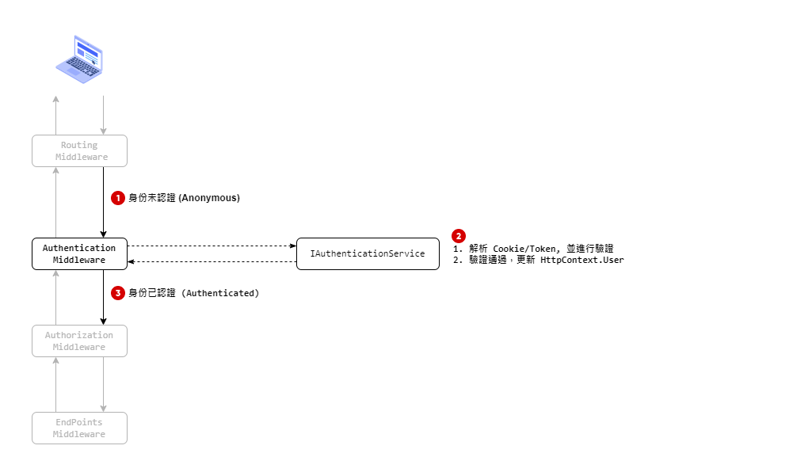
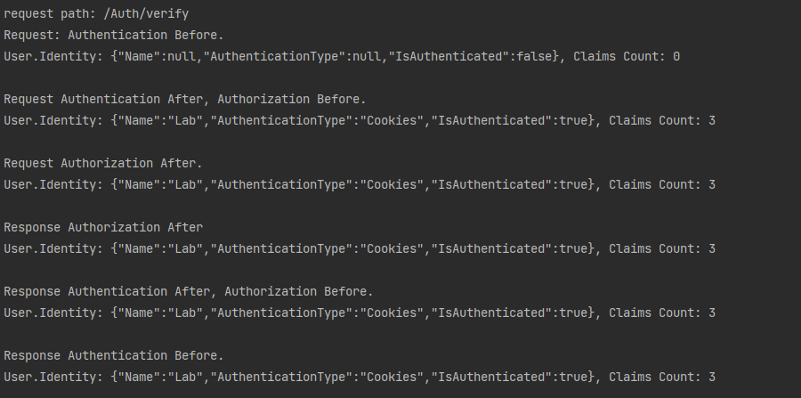
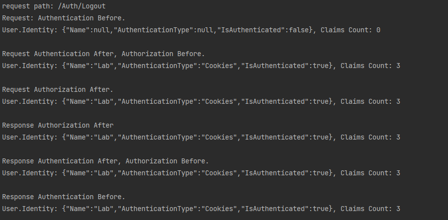
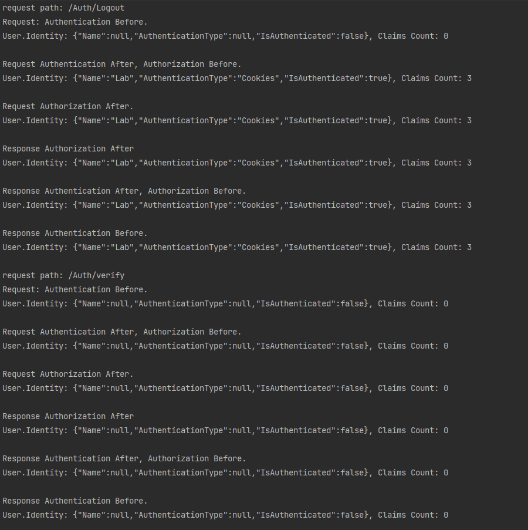
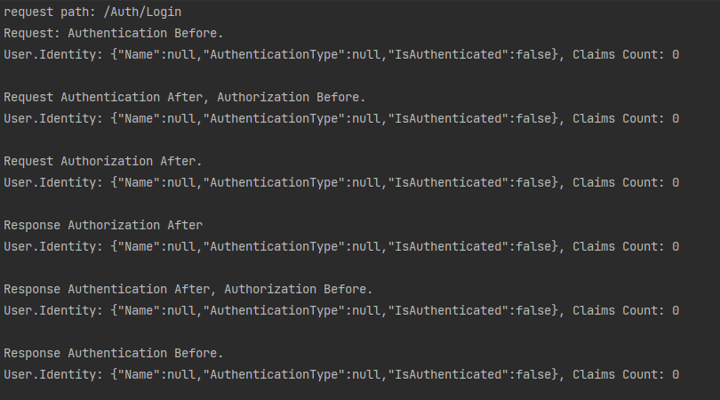

`身份驗證(Authentication)` 也被稱為 `認證` 或 `鑑權`，是通過特定的方式來確認使用者身份的過程。身份驗證的目的是確保當前所聲稱的使用者身份確實是所聲稱的使用者。

`授權(Authorization)` 則是根據使用者的身份，判斷使用者可以訪問哪些資源。以確保只有經過身份驗證的使用者才能訪問特定資源。因此，身份驗證和授權通常是一起使用的。

在現代資訊技術領域中，身份驗證和授權通常是非常重要的安全措施，因為它們可以幫助確保系統和資料的安全。

在下面的內容，將進一步的理解與研究 ASP.NET Core 中，Authentication 與 Authorization 的原理與概念。

> 🔖 長話短說 🔖
>
> - `認證(Authentication)` 用於確認身份。 *who you are*
> - `授權(Authorization)` 決定能作什麼事。*what you're allowed do*
> - ASP.NET Core 使用大量的 Middleware，在實作 `認證` 與 `授權` 時，需注意 Middleware 的順序。`Routing` ↦ `Authentication` ↦ `Authorization` ↦ `EndPoint`
> - `HttpContext.User` 是貫通 ASP.NET Core 認證與授權的重要角色。

<!--more-->

## Middleware pipeline

在聊 ASP.NET Core 之前，需要對 Middleware Pipeline 有基本的概念。這可以讓我們了解 Authentication 與 Authorization 應擺放的位置與動作的時機。


在 ASP.NET Core 專案建立時，預設使用 `UseAuthorization` 。所以 `UseAuthorization` 直接在宣告在 `UseAuthentication` 前面即可。

微軟官方網站特別提醒，若有使用 `UseRouting` 與 `UseEndpoints` 的話，`UseAuthentication` 與 `UseAuthentication` 應位於 `UseRouting` 與 `UseEndpoints` 中間。

```c#
app.UseRouting();

app.UseAuthentication();
app.UseAuthorization();

app.EndPoints();
```

順帶一提，`UseAuthentication()` 會在 Middleware 插入 [AuthenticationMiddleware](https://github.com/dotnet/aspnetcore/blob/main/src/Security/Authentication/Core/src/AuthenticationMiddleware.cs) 。而 `UseAuthorization()` 則是插入 [AuthorizationMiddleware](https://github.com/dotnet/aspnetcore/blob/main/src/Security/Authorization/Policy/src/AuthorizationMiddleware.cs)。

接著把焦點放在 `Routing`、`Authentication`、`Authorization`、`EndPoints` 四個 Middleware  。

`RoutingMiddleware` 

`AuthenticationMiddleware` 與 `AuthorizationMiddleware` 負責身份驗證與授權，詳細行為後續會進一步探討，這邊先略過不提。

`EndPointsMiddleware`



## Claims-based Authenticaton

`HttpContext` 則是整個 Middleware Pipeline 的靈魂人物，在 `認證` 與 `授權` 的過程中，會使用到 `HttpContext.User`，而 HttpContext.User 的資料型態為 `ClaimsPrincipal`。

ClaimsPrincipal 又是由 `ClaimsIdentity` 與 `Claims` 組成，記錄已驗證的主體(使用者或應用程式)身份。


### Claim 宣稱

宣稱關於主體的特徵資訊，以 `Type:Value` 的方式表示主體的某些特性。例如 UserName, Email 等等資訊。


```C#
// 可使用 .NET 預先定義的 ClaimTypes 或 自行定義 Type
var claim1 = new Claim(ClaimTypes.Name, "Lab");
var claim2 = new Claim("UID", "FTSX1854ASF");
```

### ClaimsIdentity 宣稱身份

ClaimsIdentity 是 Claim 的集合體，代表了主體的其中一種身份資訊。

舉例來說，一個人在不同的場域，就會有著不同的身份特徵。

- 在公司職場，它的身份特徵可能是 `員工編號`、`部門`、`職等`、`職稱` 等等。
- 在家庭，它的身份特徵就是 `角色`、`聯絡電話` 等等。



```C#
// 建立多組 Claims 資料
var claims = new List<Claim>  
{  
    new Claim(ClaimTypes.Name, "Lab"),
    new Claim("UID", "FTSX1854ASF"),
    new Claim(ClaimTypes.Role, "Guest"),
};  

// 建立 ClaimsIdentity 並指定使用的 Authentication Scheme
var claimsIdentity = new ClaimsIdentity(claims, CookieAuthenticationDefaults.AuthenticationScheme);  
```

### ClaimsPrincipal 宣稱主體

ClaimsPrincipal 表示了主體的身份資訊，包含了一到多個的 ClaimsIdentity。


```C#
// 建立多組 Claims 資料
var claims = new List<Claim>  
{  
    new Claim(ClaimTypes.Name, "Lab"),  
    new Claim("UID", "FTSX1854ASF"),  
    new Claim(ClaimTypes.Role, "Guest"),  
};  

// 建立 ClaimsIdentity 並指定使用的 Authentication Scheme
var claimsIdentity = new ClaimsIdentity(claims, CookieAuthenticationDefaults.AuthenticationScheme);  

// 建立 ClaimsPrincipal
var principal = new ClaimsPrincipal(claimsIdentity);  
```

## 身份認證 Authentication

在 AuthenicationMiddleware 中會藉由 `IAuthenticationHandler` 調用 `` 與 `IAuthenticationService`。




Learn how ASP.NET Core handles the Authentication using **Authentication Handlers**, **Authentication Scheme** & **Authentication Middleware**,

### Authentication 的概念

Authentication 的方式很多, 有

- Cookie-based authentication
- Token-based authentication
- 

### Authentication Handlers

### Authentication Schema

### IAuthenticationService

在 `IAuthenticationService` 定義 5 種行為：

- Authenticate (get any authentication data for a request)
- Challenge (used for unauthenticated requests)
- Forbid (used when an authenticated request should be denied)
- SignIn (associate a ClaimsPrincipal)
- SignOut (remove any associated data)

// 關係圖解










```C#
// 重要
await this.HttpContext.SignInAsync(principal);
```

```C#
// 登出
await this.HttpContext.SignOutAsync(CookieAuthenticationDefaults.AuthenticationScheme);
```

#### 實作概念

進一步查看 GitHub 上的 [AuthenticationHttpContextExtensions.cs](https://github.com/dotnet/aspnetcore/blob/main/src/Http/Authentication.Abstractions/src/AuthenticationHttpContextExtensions.cs) 內，關於 `HttpContext.SignInAsync` 與 `HttpContext.SignOutAsync` 的實作部份，會發現它的使用 `AuthenticationSchema` 的資訊，取出對應的 Authentication Service，再由這些服務進行處理。

## 授權 Authorization

接著就是到要授權管理的地方加上 `[Authorize]` 屬性

```c#
[ApiController]  
[Route("[controller]")]  
[Authorize]  
public class TodoController : ControllerBase  
{  
}
```

### Authorization 概念


### Policy-based Authorzation

Policy
Requirement
Handler

## 延伸閱讀

▶ Middleware 觀念

- [ASP.NET Core Middleware | Microsoft Learn](https://learn.microsoft.com/en-us/aspnet/core/fundamentals/middleware/?view=aspnetcore-7.0)

▶ Authentication 觀念

- [Overview of ASP.NET Core Authentication | Microsoft Learn](https://learn.microsoft.com/en-us/aspnet/core/security/authentication/?view=aspnetcore-7.0)
- [Microsoft.AspNetCore.Authentication 命名空間 | Microsoft Learn](https://learn.microsoft.com/zh-tw/dotnet/api/microsoft.aspnetcore.authentication?view=aspnetcore-7.0)
- [[.NET Core] ASP .NET Core 3.1 驗證與授權 (一)- 驗證與授權](https://blogger.tigernaxo.com/post/dotnetcore31/auth/auth_guild_1/)
- [Introduction to Authentication in ASP.NET Core - TekTutorialsHub](https://www.tektutorialshub.com/asp-net-core/authentication-in-asp-net-core/)
- [ASP.NET Authentication: A Practical Guide | Frontegg](https://frontegg.com/blog/asp-net-authentication)

▶ Authorization 觀念

- [Claims-based authorization in ASP.NET Core | Microsoft Learn](https://learn.microsoft.com/en-us/aspnet/core/security/authorization/claims?view=aspnetcore-7.0)
- [Policy-based authorization in ASP.NET Core | Microsoft Learn](https://learn.microsoft.com/en-us/aspnet/core/security/authorization/policies?view=aspnetcore-7.0)
- [Policy-based Authorization in ASP.NET Core - A Deep Dive - Simple Talk (red-gate.com)](https://www.red-gate.com/simple-talk/development/dotnet-development/policy-based-authorization-in-asp-net-core-a-deep-dive/)
