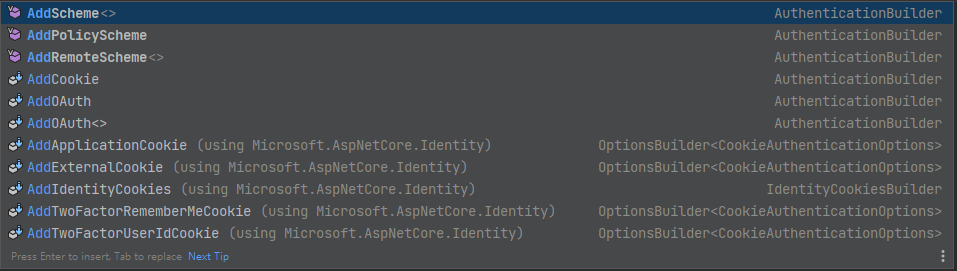
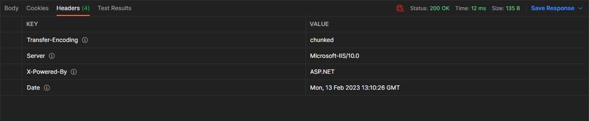
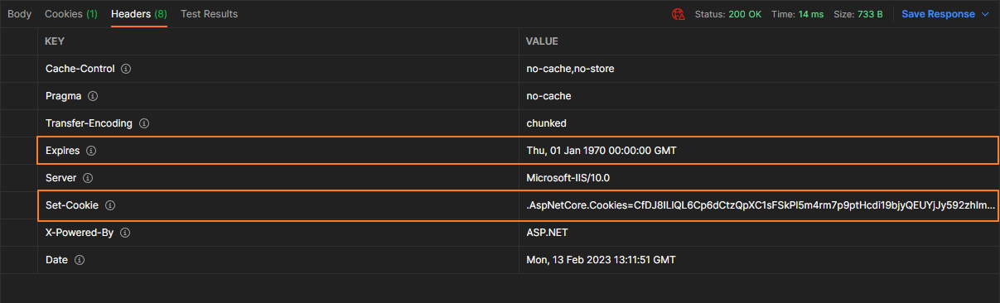

> 🔖 長話短說 🔖
>
> 進行身份驗證時，需要使用 `UseAuthentication()` 插入 Authentication Middleware。

<!--more-->

## 設定 Authentication

### Authenticaton 規則

運用基本（Basic）驗證的場合

預設支援多種 Authentication 方式



#### 使用 Cookies Authentication

首先是宣告使用 Cookie 的驗證方式

```C#
builder.Services.AddAuthentication()
    .AddCookie(CookieAuthenticationDefaults.AuthenticationScheme,
        options => builder.Configuration.Bind("CookieSettings", options));
```

接著是建立驗證的 Cookie，常用於 Login 的時機點。我們可以在 Claims 額外加入我們想要填入的資訊。

```C#
/// <summary>  
/// 使用者登入  
/// </summary>  
[HttpPost("Login")]  
public async Task<ActionResult> Login()  
{  
    var claims = new List<Claim>  
    {  
        new Claim(ClaimTypes.Name, "Lab"),  
        new Claim("UID", "FTSX1854ASF"),  
        new Claim(ClaimTypes.Role, "Guest"),  
    };  
  
    var claimsIdentity = new ClaimsIdentity(claims, CookieAuthenticationDefaults.AuthenticationScheme);  
  
    var principal = new ClaimsPrincipal(claimsIdentity);  

    // 重要
    await this.HttpContext.SignInAsync(principal);
    
    return this.Ok();  
}
```

觀察 Login 前後的 Response Header，可以發現使用 cookies authentication 後的 Response Header 多了 `Expires`、`Set-Cookie` 兩個重要的欄位資訊。





接著就是到要授權管理的地方加上 `[Authorize]` 屬性

```c#
[ApiController]  
[Route("[controller]")]  
[Authorize]  
public class TodoController : ControllerBase  
{  
}
```

登出/取消認證

```C#
/// <summary>
/// 使用者登出
/// </summary>
[Authorize]
[HttpPost("Logout")]
public async Task<ActionResult> Logout()
{
    // cookies 
    await this.HttpContext.SignOutAsync(CookieAuthenticationDefaults.AuthenticationScheme);
    return this.Ok();
}
```

##### Security: Cookie Policy

```c#
app.UseCookiePolicy();
```

###### HttpOnly

使用 cookies 存在 HttpOnly 的 OWASP 的問題，所以可以在 `Option` 加入 `HttpOnly = true` 的設定

```C#
builder.Services.AddAuthentication()
    .AddCookie(CookieAuthenticationDefaults.AuthenticationScheme,
        options => {
            builder.Configuration.Bind("CookieSettings", options);
            options.Cookie.HttpOnly = true;
        });
```

###### SameSite

## 使用 claims principal 的資訊

- this.HttpContext.User;
- this.HttpContext.User.Identity.IsAuthenticated

## 延伸閱讀

▶ 站內文章

- [ASP.NET Core | 淺講 Authentication 與 Authorization 機制]()

▶ Base Authentication

- [ASP.NET Core 6 實作自訂 Authentication 身份驗證，以 Basic Authentication 例 | 余小章 @ 大內殿堂 - 點部落 (dotblogs.com.tw)](https://dotblogs.com.tw/yc421206/2022/06/18/asp_net_core_6_use_basic_authentication)
- [ASP.NET Core 3.1 - Basic Authentication Tutorial with Example API | Jason Watmore's Blog](https://jasonwatmore.com/post/2019/10/21/aspnet-core-3-basic-authentication-tutorial-with-example-api)

▶ Cookies

- [在 ASP.NET Core 中使用 SameSite cookie | Microsoft Learn](https://learn.microsoft.com/zh-tw/aspnet/core/security/samesite?view=aspnetcore-7.0)
- [[ASP.NET Core] 自定義自己的 Authentication 身份驗證器 | Ian Chen - 點部落 (dotblogs.com.tw)](https://dotblogs.com.tw/Null/2020/07/03/172547)
