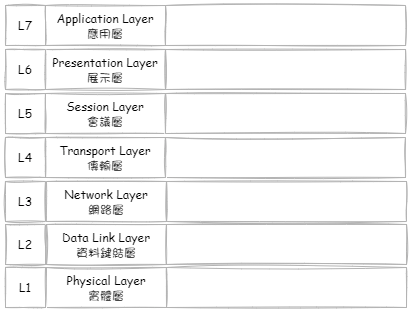
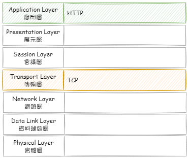
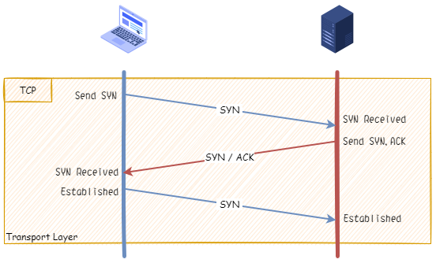
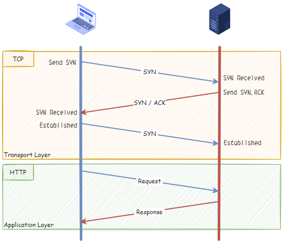
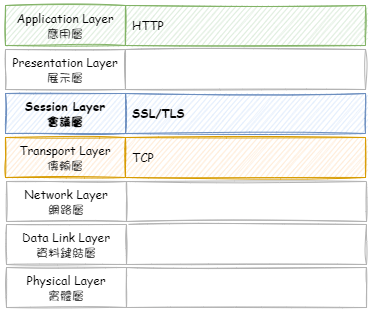
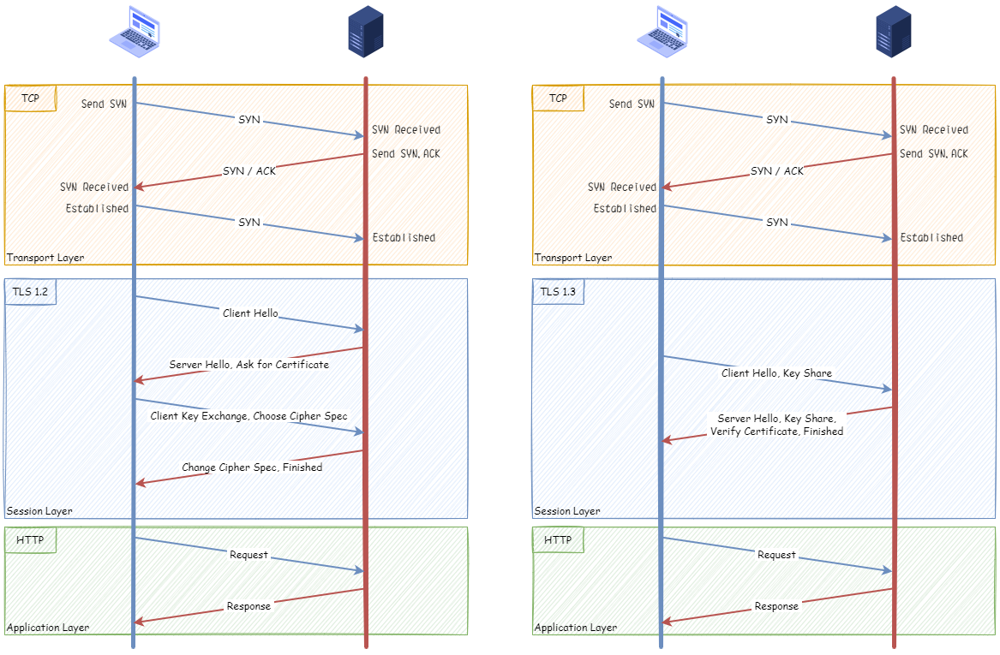

在開始之前，先提一下 OSI，它是由國際標準化組織(ISO)針對開放式網路架構所制定的電腦互連標準，全名是開放式通訊系統互連參考模型（Open System Interconnection Reference Model, OSI），簡稱 OSI 模型。依網路通訊的運作，依不同的傳輸模式、定義的規範與標準，從實體到抽象，將劃分為七層。

<!--more-->

## HTTP 的傳輸方式

HTTP(HyperText Transfer Protocol) 為應用層的通訊協定，底層使用 TCP(Transmission Control Protocol) 通訊協定作為數據傳輸的方式。因此，在 HTTP 交換資料之前，在兩台機器開啟連線時，需要先進行 TCP 的三次交握(Three-way handshake)，完成後，才是正式進行資料的傳輸。

> 題外補充: 三次交握的主要目的是**避免歷史錯誤連接的建立並讓通信的雙方確定初始序列號**

HTTP 本身單純 Request/Resonse 一來一往的進行通訊。

(注意: 此圖僅用於表示兩台機器在各層內的互動方式，並非實際通訊流程)

但是有個問題，就是 HTTP 的內容採用明文的方式傳輸，有可能被有心人士從中進行資料的偽造、竄改或擷取，造成資安的疑慮。

## HTTPS 的傳輸方式

網景公司(Netscape)早在 1994 年就想到 HTTP 明文傳輸可能造成的資安問題，他們提出 SSL(Secure Sockets Layer) 的作法。隨後 [IETF](https://www.ietf.org/) 將 SSL 標準化，更新為 TLS(Transport Layer Security)。時至今日，由於安全性問題，大多的瀏覽器已不支援SSL，改為支援 TLS，但習慣上，還是稱為 SSL。目前 TLS 最新版本為 1.3 版。

SSL/TLS 的活動位置，位於 OSI 的 Seseion Layer，針對傳輸資料內容，進行加密與身份驗證，達到保護個人或機敏性資料的目的。

TLS 1.2 與 TLS 1.3 的交握機制有所不同，TLS 1.3 針對安全與交握機制進行改善，減少交握溝通的次數，達到縮減交接的往返時間(Round Trip Time, RTT)與提升安全性。

> RTT 指的是，網路封包從發送命令到接收結果，所需要的往返時間。需注意的是客戶端與主機的地理位置距離，會影響資料傳輸所需的時間。

以初次連線為例，來看一下 TLS 1.2 與 TLS 1.3 兩者的差異。

(注意: 此圖僅用於表示兩台機器在各層內的互動方式，並非實際通訊流程)

想進一步了解 TLS 1.2/1.3 的規範，可詳閱 [RFC5246](https://datatracker.ietf.org/doc/rfc5246/)、[RFC8446](https://datatracker.ietf.org/doc/rfc8446/)。

### SSL/TLS 簡介

SSL/TLS 的動作大致的分為幾個階段

1. 協商使用的 SSL/TLS 版本、使用的密碼套件(金鑰交換演算法、加密演算法、訊息驗證演算法)
2. 非對稱金鑰的身分認證
3. 對稱金鑰的資料加密

運用身份認證與加密演算法混淆傳輸的資料，以**確保網路連線安全**及**防止在兩個站台間相互傳送的敏感資料被惡意人士擷取、偽造與竄改**。

### SSL 憑證

SSL 憑證透過授權機構簽發正式憑證，SSL 憑證包含下列資訊**擁有者資訊、序號及有效起訖日、憑證簽發相關單位**等，而對憑證的信任取決於對憑證核發單位的信心，因為核發單位為憑證的真偽做擔保。憑證授權中心使用多種驗證方法來驗證各單位組織提供的資訊。

憑證可以依「保護範圍」以及「驗證等級」進行劃分，保護範圍越大，驗證等級越高的憑證，價格也就越高。

憑證的保護範圍，是支援的網域多寡劃分

- 單網域 Single-Domain SSL
- 通用型 Wildcard SSL
- 多網域 Multi-Domain SSL

而憑證驗證等級，又分為

- 域名驗證 (Domain Validation, DV)
- 組織驗證 (Organization Validation, OV)
- 延伸驗證 (Extension Validation, EV)

### SSL 數位簽章

數位簽章(digital signature) 就的資料的雜湊值 (hash) 經由簽章者的私鑰簽名後的結果。

在 SSL 中，採用 [X.509](https://zh.wikipedia.org/zh-mo/X.509) 的格式規範，並使用非對稱加密演算法，來進行身分認證。

簡單說，在建立連線後，伺服器會將 SSL 憑證內的**數位憑證(digital certificate)**與**加密金鑰**發送給客戶端，由客戶端會以非對稱加密方式，進行憑證驗證。

驗證通過，就完成身份的認證，可以接續後面的動作。在連線關閉前，所有傳輸的資料都會在加密的狀態下進行傳輸。

若想要進一步了解數位簽章與認證的機制，這又是個專門的主題，這邊就不多加描，有興趣可參考相關資料。

### SSL 加密

採用對稱金鑰，對資料進行加解密。這組金鑰在 SSL/TLS 建立的過程中，就已經決定好雙方共同使用於加解密的金鑰。

可能會好奇為何不使用非對稱加密演算法，更進一步確保資料的安全？最大因素在於非對稱加密的速度慢。

## 相關資料

- [5 分鐘圖解 HTTPS 加密原理，SSL/TLS 盡在掌握！](https://kknews.cc/tech/9g24nrj.html)
- [網站 SSL 加密原理簡介](https://www.netadmin.com.tw/netadmin/zh-tw/technology/6F6D669EB83E4DC9BEA42F1C94636D46)
- [WIKI TLS/SSL](https://zh.wikipedia.org/wiki/TLS%EF%BC%8FSSL)
- [OSI 七層架構](https://vocus.cc/article/618c7853fd8978000108c4d5)
- [TCP 三向交握 (Three-way Handshake)](https://notfalse.net/7/three-way-handshake)
- [TLS 1.2 and TLS 1.3 Handshake Walkthrough](https://cabulous.medium.com/4cfd0a798164)
- [What is HTTP and HTTPS?](https://cabulous.medium.com/what-is-http-and-https-c3da5fd5adb4)
- [為什麼 HTTPS 需要 7 次握手以及 9 倍時延](https://draveness.me/whys-the-design-https-latency/)
- [TLS 1.3 Handshake: Taking a Closer Look](https://www.thesslstore.com/blog/tls-1-3-handshake-tls-1-2/)
- [TLS/SSL 的加密套件 (Schannel SSP)](https://docs.microsoft.com/zh-tw/windows/win32/secauthn/cipher-suites-in-schannel)
- [[SSL] 數位簽名與驗證的過程](https://weirenxue.github.io/2021/06/15/ssl_digital_signed_verify/)
- [那些關於 SSL/TLS 的二三事 (五) — 數位簽章](https://medium.com/@clu1022/326fa5347893)