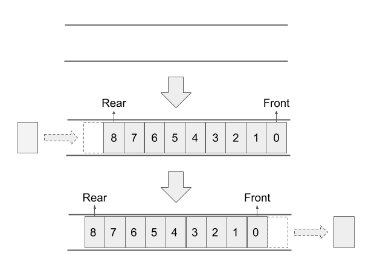
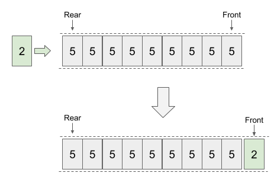
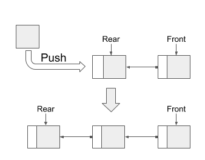
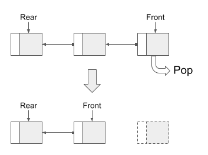
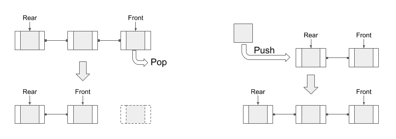

個人認為佇列(Queue)的本質，就是做為資料載體的暫存與緩衝區，同時，它具備 **先進先出(First In First Out, FIFO)** 的特性。

在演算法中，有些演算法使用 Queue 做為操作記錄資料的載體，例如針對二元樹的尋訪(Traversal)，廣度優先搜尋(Breadth First Search)，都是活用 Queue FIFO 的特性。

有時，資料本身的數量有限，但同時有多個對象需要取得資料。使用 Queue 來控制資料的處理速度，或是調配資源的的方式，作為資料配置最佳化的方式之一。

經常運用於跨執行緒、跨行程、跨系統之中的通訊使用。在這種場域下，產生資料與處理資料的兩方，處理的速度不一相同。借由 Queue 的暫存緩衝與 FIFO 特性，便於採用非同步的處理方式。

<!--more-->

## 基本概念

首先，我們先來聊聊 Queue 的基本概念。

還記得先前提到，Queue 具有**暫存緩衝**與它**先進先出**的兩種特性嗎？舉個與 Queue 概念相近的現實案例。

``` Plan
今天是張學友的簽名握手會，時間是中午一點到下午三點，共兩小時。早上八點開放排隊，只有在隊列中的人才有資格參與活動。(先忽略中途放棄、與插隊的情況。)

下午一點一到，張學友開始簽名會。排在最前面的歌迷，理所當然的第一個與張學友簽名握手，離開後，換下一位歌迷。
還沒輪到的歌迷，只能在隊列中，持續等待到輪到自己的時候。

到了三點，雖然還有許多歌迷在排隊，但張學友礙於行程的規劃，只能準時結束簽名會。沒能要到簽名的歌迷，只能乖乖的離去。
```

在上面的例子，就可以看 Queue 的幾個特性。

- **先進先出**：最前面的歌迷，最早與張學友簽名握手，其他次之。
- **暫存緩衝**：不管歌迷有多少人，多早到，都要進隊列，等待主角的到來。
- **資源調配**：時間資源有限，不是進入隊列的歌迷，都有機會拿到簽名。

從上面的例子，可以將 Queue 想像為一個線性的空隊列，當資源進入 Queue (歌迷開始排隊)，就會產生**頭(Front)**、**尾(Rear)** 的概念。

當資源不停的進入，Rear 就會不停的往後移動。只要沒有資源離開 Queue ，Front 都是固定不動的。反之，只要有資源開始離開，Front 就會往下一個資源移動。

通常，會把資源放入 Queue 的動作，稱為 ***Push*** 或 ***Enqueue***。反之，從資源離開 Queue 的動作，稱為 ***Pop*** 或 ***Dequeue***。



## Queue

在實際情況下，不太可能配置無限資源給 Queue 使用，大多情況下，都是事前先宣告 Queue 一次最多可接收資源的數量限制。缺點是，放入的資源超過 Queue 可接收的限制，而且沒有對應的處理方式，必定會發生異常。

就像客運明明只能上 15 個人，客運公司不小心超賣 2 張，第 16、17 人上不了客運，一定會造成預期外的事件。但超出 Queue 長度的情境與處理不是討論的重點，就先忽略。

第一種處理方式，就像是有 15 個人排隊買雞排，當第一個人買到雞排後，他會離開，後面的人自動向前一位。

對應到 Queue，當 Queue 之中，最前面的資源離開 Queue 後，後面的資源會自己向前遞補，讓資源主動移到 Front 。

```C# {linenos=inline}
public class Queue 
{
    private const int MaxSize = 20;
    private int[] _buffer = new int[MaxSize];
    private int _index = 0;
    
    public void Enqueue (int item)
    {
        _buffer[_index] = item;
        _index++;
    }

    public bool IsEmpty { get { return _index == 0; } }

    public int Dequeue ()
    {
        int item = _buffer[0];
        for (int i = 0; i <= _index; i++) {
            _buffer[i] = _buffer[i + 1];
        }
        //  避免最後一位沒有初始化
        if (_index == MaxSize - 1)
            _buffer[_index] = 0;
        _index--;
        return item;
    }
}
```

## Circle Queue

後來發現，每次移動資源的成本過於昂貴，若資源量少，可能還看不出差異。但資源數量成千上萬時，所耗費成本，就相當可觀。

要解決上面的問題，那是不是有方法，在不移動資料本身位置的時候，一樣可以識別出 Front 與 Rear 的位置？

既然資源本身不能移動，那麼，利用兩組指標，分別指向 Front 與 Read 位置不就可了。當資源 Push 或 Pop 時，指標進行對應的移動即可。這麼一來，就可以大幅減少移動資源造成的耗損成本。

但實作上發現，單純只是更新指標指向資源的話，可能會不小心讓資料跑出 Queue 的可控範圍，所以必須在資源放入 Queue 時，進行控制。

最後，會發現迭代完成的 Queue ，就是 circle 的架構，又被叫作 Circle Queue

```C# {linenos=inline}
public class CircleQueue
{
    private const int MaxSize = 20;
    private int[] _buffer = new int[MaxSize];
    private int _front = 0;
    private int _rear = 0;

    public void Enqueue(int item)
    {
        _buffer[_rear] = item;
        _rear++;
    }

    public bool IsEmpty
    {
        get { return _front == _rear; }
    }

    public int Dequeue()
    {
        int item = _buffer[_front];
        //  初始化
        _buffer[_front] = 0;
        _front++;
        return item;
    }
}
```

## Priority Queue

有時，在某些情況下，必需打破 FIFO 的原則，需要讓後面進來的**特定的資源**提早被離開 Queue。

我們再來看個例子。

``` Plan
有 10 個病人到診所，己經掛完號，領了號碼牌，排隊等著叫號看診。
突然，有一名爸爸，背著高燒不退的孩子，衝到診所掛號看病。
```

這時，有三種處理情境。

- 所有病人的病況都一樣嚴重，所以維持原本的看診順序。(**所有資源的權重相同，一視同仁。**)
- 孩子的病況比其他病人都還要嚴重，診所判斷需要提前看診。(**最新資源的權重大於其他，優先處理。**)
- 孩子的病況很嚴重，但是診所處理不來，只能轉診。(**將資源轉到其他的 Queue 之中，並行處理。**)

第一種情況，就是一般的 Queue 的特性，前面己經討論過了，就不再多說明。

第三種情況，是多個 Queue 與 Router 的組合技，這部份後面會提到，就先略過不提。

先討論第二種情況，當資源加入 Queue 後，離開 Queue 順序會因為權重而有所變更。用白話來說，這就是**插隊機制**。



這種打破 FIFO 特性，卻又保留部份 FIFO 的 Queu，稱為 Priority Queue 。而權重的比對，可以組合 `Compare`  與不同的 `排序演算法`的實作，來決定各資源離開的順序。

雖然實作方式有很多種。但在下面的簡易實作，使用一個 `Priority` 做為參數，以便排序使用。

```C# {linenos=inline}
public class PriorityQueue
{
    private class QueueBlock
    {
        public int Priority { set; get; }
        public int Entity { set; get; }
    }

    private const int MaxSize = 20;
    private readonly QueueBlock[] _buffer = new QueueBlock[MaxSize];
    private int _index = 0;

    public void Enqueue(int priority, int item)
    {
        var block = new QueueBlock() { Priority = priority, Entity = item };

        for (int i = _index; i >= 0; i--)
        {
            if (i - 1 < 0 || _buffer[i - 1].Priority <= priority)
            {
                _buffer[i] = block;
                break;
            }
            else
            {
                _buffer[i] = _buffer[i - 1];
            }
        }

        _index++;
    }

    public bool IsEmpty {...}
    public int Dequeue(){...}
}
```

> .NET 6 之後，提供 `PriorityQueue<TElement,TPriority> Class` 可達到相同的用途。

## Linked List

先前提到的的作法，都是預先配置記憶體空間後，才開始將資源放入。雖然簡單快速，但在決定預先配置空間尺寸，就變成一個需要進行評估的點。

- 預配空間過大，無法有效利用空間，造成多餘的浪費與成本耗損。
- 預配空間不足，置出來的記憶體空閒不足實際使用，導致重覆配置空間與搬移資料。

那是不是有方法可以動態的生成空間，而非仰賴事先配置的記憶體空間？

有的。那就是資料結構中所提到的**鍵結串列(Linked List)**。鍵結串列又分單向與雙向兩種，而這兩種都可以被運用在 Queue 的概念之中。

- 只有單純 FIFO 的 Queue，就適合使用單向的鍵結串列。
- 像是 Priority Queue，因為內部資源需要進行排序，雙向的鍵結串列就較為合適。

我們將每一個資源，視為一個節點。

當放入新的資源時，會將該資源放入節點中，同時將原本 Rear 的節點與新節點鍵結，並移到 Rear 到最後的節點。



反之，當資源離開時，Front 會向後移動一個節點，其他節點與 Rear 維持不動。



不管是單向鍵結或雙向鍵結，概念都是相同的。



下面的實作，採用單向鍵結的方式，來實作 Queue。

因為 .NET Core 之中，己經存有 `LinkedList<T>` ，所以將範例內的類別名稱取為 `LinkedListQueue<T>`

```C# {linenos=inline}
 public class LinkedListQueue<T>
 {
     private class LinkedNode<T>
     {
         public T Data { set; get; }
         public LinkedNode<T> Next { set; get; }
     }

     private int _count = 0;
     private LinkedNode<T> _node = null;

     public void Enqueue(T data)
     {
         var node = new LinkedNode<T> {Data = data, Next = null};

         if (_node == null)
         {
             _node = node;
         }
         else
         {
             var ptr = _node;
             while (ptr.Next != null)
             {
                 ptr = ptr.Next;
             }

             ptr.Next = node;
         }

         _count++;
     }

     public bool IsEmpty => _count == 0;

     public T Dequeue()
     {
         if (_node == null)
             return default(T);

         var ptr = _node;

         _node = _node.Next;
         _count--;

         return ptr.Data;
     }
 }
```

## 延伸閱讀

- [Queue 相關數據結構的原理與實現 (LinkedList, ArrayDeque, PriorityQueue)](https://www.jianshu.com/p/45de5690b424)
- [Queue: 以Array 實作 Queue](http://alrightchiu.github.io/SecondRound/queue-yi-arrayshi-zuo-queue.html)
- [Linked List: 新增資料、刪除資料、反轉](http://alrightchiu.github.io/SecondRound/linked-list-xin-zeng-zi-liao-shan-chu-zi-liao-fan-zhuan.html)
- [MSDN](https://docs.microsoft.com/en-us/dotnet/api/system.collections.generic.priorityqueue-2?view=net-6.0)
