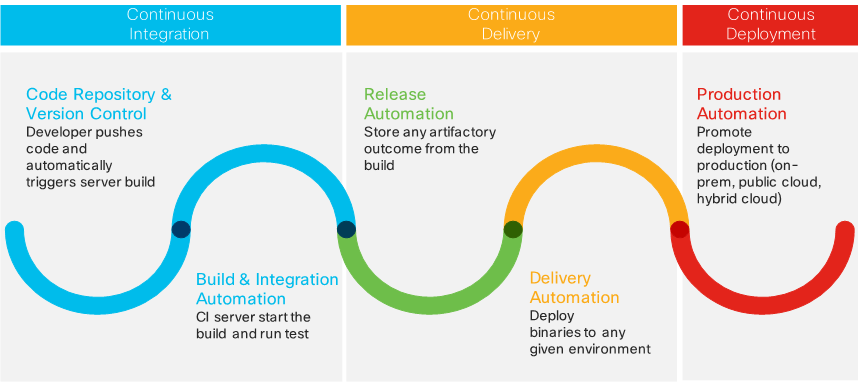

---
title: 踏入 CI/CD 的世界 - 觀念篇
date: 2022-06-22T16:00:19.590Z
description: 簡述 CI/CD 的觀念
categories:
  - DevOps
keywords:
  - CI
  - CD
lastmod: 2022-06-28T09:03:47.840Z
slug: cicd_concept
---

> [2019 iT 邦幫忙鐵人賽](https://ithelp.ithome.com.tw/users/20107551/ironman/1906)文章補完計劃，[從零開始建立自動化發佈的流水線]()合篇

當程式碼已經進入版控系統後，就會想要有個服務可以自動去建置、驗證 source code 的完整性與安全性，最好還可以自行部屬。而 CI/CD 就是為了滿足這個希望，而誕生出來的機制。

<!--more-->

```chat
至從吉米跟 Eric 請益完 git flow 後，時間又過去一個多月。
這天，Eric 與吉米一同參加同一場技術分享會。兩人在會中休息時，Eric 問起了吉米的近況。

Eric:
  版控使用上，還習慣嗎？有沒有遇到什麼問題？

吉米:
  還行。不過，確實有遇到一些小問題。像我把變更後的資料，push 到 remote repository。到了另一台電腦 pull 下來後，發現程式無法 build。
  原因是在 push 時，遺漏檔案或兩台電腦的環境不同，程式專案的組態設定無法直接使用。

Eric:
  這些問題是不難解決，但確實很煩人。看起來，我們可以接著往 CI/CD 的方向進行。那這些問題，就不會再發生了。

吉米:
  還記得之前在介紹 BitBucket、Azure DevOps 時，也有提到 CI/CD。只知道是一種自動化的環境，但不是很清楚了解它的作用。

Eric:
  哈哈，我簡單說明一下。
```

## 常見情境

### Clone 的專案無法執行

  A 將手上可以正式執行與建置的專案，提交到版本控制系統。但因為 A 的粗心，少提交相關的檔案，或組態設定內的設定指向不在版管範圍內的檔案。

  當 B 接手維護時，因為檔案缺少或組態設定錯誤，造成 B 要花費額外的時間進行修正。

### 提交程式碼時，發現大量的衝突，需花大量額外時間來解決衝突

  A、B、C 三位開發者協力開發一個系統，若三人都在負責功能開發完成後，才提交修改內容。

  第一個提交的人很幸運，可能沒有任何的衝突。

  第二個提交的人，因為手上的版本與線上的版本，己經有相當大的差異，他可能要額外花時間解決與前一位提交者的衝突。

  第三個提交旳人，就更辛苦。因為最新版本的程式，在經過兩位提交的變更後，版本間的差異更大。變動的範圍越大，可能衝突項目就更多。甚至可能會重覆出現第二位提交者所遇到的衝突。

## CI/CD 的差異


(圖片來源: [Cisco Blogs](https://blogs.cisco.com/cloud/have-you-ever-considered-ci-cd-as-a-service))

常從其他人口中，將 CI/CD 混在一起說，但其實 CI/CD 分別指 **持續整合(Continuous Integration, CI)**、**持續部署inuous Delivery, CD)**、**持續交付(Continuous Deployment, CD)**，後者負責範圍包括前者的內容。

在筆者看來，CI/CD 比較像是三個不同階段的任務，只有完成了前一個階段，才能進入下一個階段。

### 第一階段、持續整合(Continuous Integration, CI)

曾經團隊協同開發過的人，應該都有遇到在提交時，為了解決程式碼衝突，結果花上更多的時間在處理衝突的程式碼。

尤其提交間隔越久的開發者，處理程式碼的衝突，就越困難。而且還可能造成團隊的成員重複解決相同程式區塊的衝突。**整合的時間越晚，整合的難度與失敗的機率就越高**。

持續整合的目的，利用頻繁地提交新功能的變更，觸發自動化建置和測試，確保最新版本的軟體是可運行的。

* **版本控制**: 持續整合最重要的一步，可以說，沒有版控，就沒有 CI/CD。
* **建置**: 確保提交的程式碼是否可以執行的。
* **自動化測試** 確保功能正常與軟體品質。
* **程式碼分析**: 檢查 code style 或程式的穩健度。

### 第二階段、持續部署(Continuous Deployment, CD)

完成整合的階段後，接下來就是部署的階段。

不管是為了測試、驗收或上線，都一定需要進行軟體的部置。但是往往部署環境的差異，造成驗收或上線時的兵荒馬亂。

持續部署的目的，就是要快速而自動的部署，任何版本的軟體到不同的環境。為此，**須採用同一個包裝好的套件 (package)**，以達到 **簡化組態管理(configuration management)** 與 **減少部署所需的時間**。

另外，因為採用同一 package 進行部署的因素，**必需將其組態 / 設定外部化 (configuraiton externalization)**。簡單點講，就是**不要將設定寫死 (hard-coded) 在程式碼**。

* 發佈
* 手動測試

### 第三階段、持續交付(Continuous Delivery, CD)

持續交付的目標，就是 **儘快將最新版本的軟體，交付到最終使用者(end-user)手中**。

為達到持續交付，必需先行建立 **持續整合** 跟 **持續部署** 的機制。

## 持續整合的精神

持續整合是 CI/CD 最重要的一點，如果提交的程式有問題，造成整合失敗。對於發生失敗的這種情況，團隊內的成員，需要在一開始就要溝通清楚，取得共識。

對於上面提到，提交造成整合失敗的情況，常見的做法有……

* 每次提交之前，先在本機執行建置與單元測試，作為整合前的額外驗證措施。
* 造成提交失敗的人，要負責修訂錯誤。
* 建置有錯的情況下，禁止其他新功能的提交。
* 測試失敗的情況下，需立即找出問題，確保測試通過，以維持程式品質。

**持續整合需要團隊內，所有成員的一同努力與堅持，才能達到良好的效果。**

```chat
Eric: 剛剛只是介紹完持續整合、持續部置到持續交付的觀念。但 CI/CD 環境的架設，一口氣到位的難度頗高。一步一步的架設，會比較安穩。
吉米: 確實，因為現在版控的條件己經滿足了，那下一步就是架設 自動建置的環境。
Eric: 沒錯。不過，晚點我有一些事情要先離開處理。我們再約個時間，針對自動建置的架設，進一步的討論。
吉米: 好，時間再跟你約。
```

## 延伸閱讀

1. David Ko的學習之旅, [執行持續整合所需要的紀律](http://kojenchieh.pixnet.net/blog/post/379112090-%E5%9F%B7%E8%A1%8C%E6%8C%81%E7%BA%8C%E6%95%B4%E5%90%88%E6%89%80%E9%9C%80%E8%A6%81%E7%9A%84%E7%B4%80%E5%BE%8B)
2. Rick Hwang, [導入 CI/CD 的第一步](https://rickhw.github.io/2018/03/20/DevOps/First-Step-To-CICD/)
3. Stefano Gioia, [Have You Ever Considered CI/CD as a Service?](https://blogs.cisco.com/cloud/have-you-ever-considered-ci-cd-as-a-service)
4. 陳正瑋, [CI、CD、Automation你還沒準備好！？（Agile Tour Kaohsiung 2017）](https://www.slideshare.net/warfan/cicdautomationagile-tour-kaohsiung-2017)
5. 山姆鍋, [山姆鍋對持續整合、持續部署、持續交付的定義](https://samkuo.me/post/2013/10/continuous-integration-deployment-delivery/)
6. Chris Riley, [want to do Continuous Deployment](https://devops.com/i-want-to-do-continuous-deployment/)
7. Nginx, [Introducing CI/CD with NGINX and NGINX Plus](https://www.nginx.com/blog/introducing-cicd-with-nginx-and-nginx-plus/)
8. 91APP 品牌新零售學院, [持續性整合與發佈 (Continuous Integration / Continuous Delivery) 之相關應用](https://blog.91app.com/continuous-integration-delivery/)
9. sj, [內修敏捷開發心法 + 外練持續整合招式](https://blog.toright.com/posts/4139/%E5%85%A7%E4%BF%AE%E6%95%8F%E6%8D%B7%E9%96%8B%E7%99%BC%E5%BF%83%E6%B3%95-%E5%A4%96%E7%B7%B4%E6%8C%81%E7%BA%8C%E6%95%B4%E5%90%88%E6%8B%9B%E5%BC%8F.html)
10. 安德魯, [架構師觀點: 你需要什麼樣的 CI / CD ?](https://columns.chicken-house.net/2017/08/05/what-cicd-do-you-need/)
