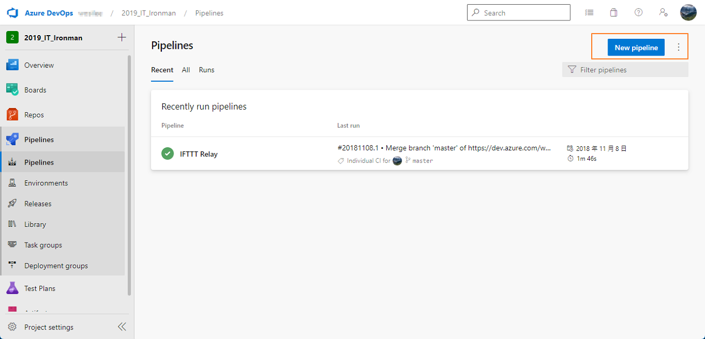
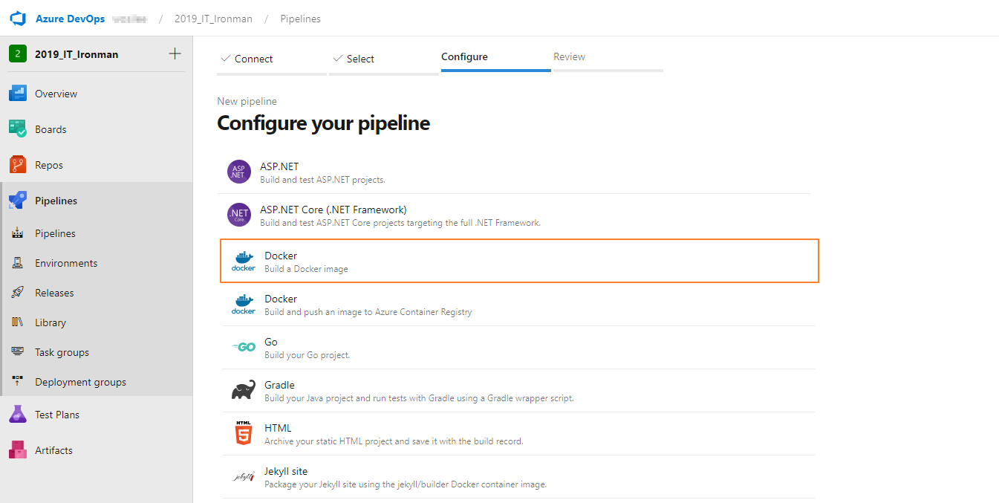
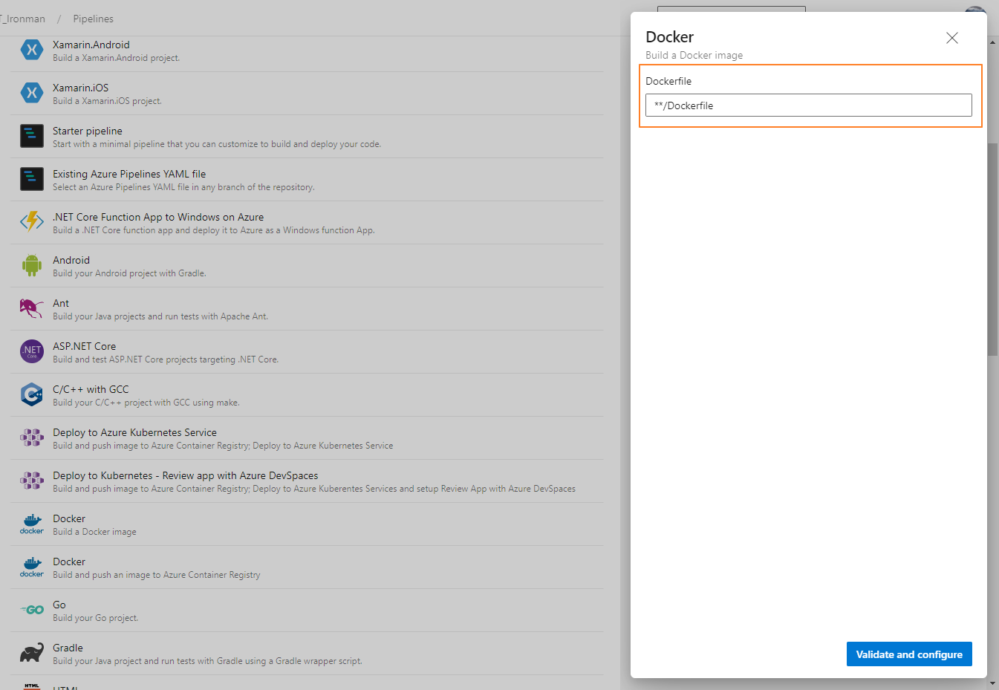
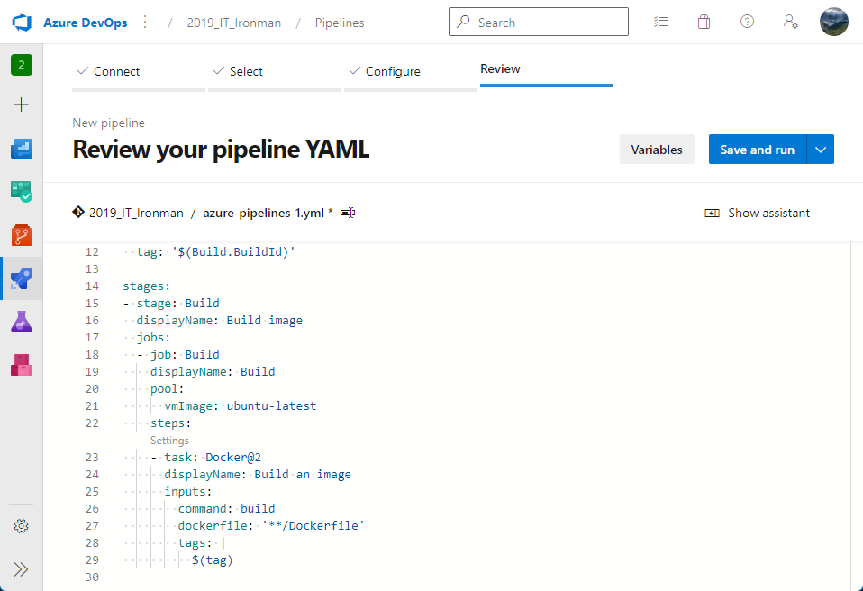

---
title: 使用 Azure Pipelines / Jenkins 建置 Docker image
description: 在 Azure PipeLines, Jenkins 中，除了可以直接指定使用現有的 Docker image 做為執行 CI 所需的運行環境。也可以讓
  Azure Pipelines, Jenkins，運用 dockerfile 或 cmd 的方式，直接把程式封裝為 Docker Image
tags:
  - Docker
categories:
  - DevOps
  - Container
keywords:
  - dockerfile
  - Azure Pipelines
  - jenkins
date: 2023-01-11T15:01:17+08:00
slug: build-docker-image
lastmod: 2023-06-28T10:10:47+08:00
---

> [2019 iT 邦幫忙鐵人賽](https://ithelp.ithome.com.tw/users/20107551/ironman/1906)文章補完計劃，[從零開始建立自動化發佈的流水線]()tainer 篇

在上一篇  [使用 Container 建立 CI 所需要的建置環境]() 中，初步了解如何在 Travis CI、Azure DevOps、Jenkins 中，使用 Docker 來建立 CI 運行 Build、Test 所需的環境。

接著，試著運用 Azure DevOps、Jenkins 來建立 Docker image 的 Artifact。

<!--more-->

## Azure DevOps

⚠️ 提醒：Azure Pipelines 的設定方式，與[原本文章](https://ithelp.ithome.com.tw/articles/10209866)禸容提到的設定方式，已有所差異。⚠️

▶ 在 `azure-pipelines.yml` 內，`steps` 的 task 採用 `Docker@2`

```yaml
trigger:
 - main

 pool:
   vmImage: 'ubuntu-latest' 

 variables:
   imageName: 'pipelines-javascript-docker'

 steps:
 - task: Docker@2
   displayName: Build an image
   inputs:
     repository: $(imageName)
     command: build
     Dockerfile: app/Dockerfile
```

▶ 使用 Auzre Pipeline 工具建立

直接到 Azure Pipeline 中，選擇 `New Pipeline`，並選擇 `Docker`與設定後，Azure pipeline 就會自動產生 `azure-pipelines.yml` 。後續再依需求自行調整即可。









## Jenkins

在 Jenkins Pipeline 中，Jenkins 會依據 `jenkinsfile` 內容的指示執行各種動作。運用 Groovy 的格式來撰寫 `jenkinsfile` 讓使用者可以客制化建置的流程與環境。

▶ 作法一、直接使用 `dockerfile`

Jenkins Pipeline 支援運用 `dockerfile`。當在 `jenkinsfile` 中，宣告使用 `agent { dockerfile true }` ，Pipeline 就會使用 Repository 根目錄下的 `dockerfile` ，進行 Docker image 的建立與執行。

```groovy
agent {
    dockerfile true
}
```

▶ 作法二、在 `agent` 內直接下 docker 指令

```groovy
agent {
    docker {
        image 'myregistry.com/node'
        label 'my-defined-label'
        registryUrl 'https://myregistry.com/'
        registryCredentialsId 'myPredefinedCredentialsInJenkins'
    }
}
```

▶ 作法三、在 `agent` 內寫 `dockerfile` 的內容

```groovy
agent {
    // Equivalent to "docker build -f Dockerfile.build --build-arg version=1.0.2 ./build/
    dockerfile {
        filename 'Dockerfile.build'
        dir 'build'
        label 'my-defined-label'
        additionalBuildArgs  '--build-arg version=1.0.2'
        args '-v /tmp:/tmp'
    }
}
```

關於 Pipeline 中，`agent` 部份的其他語法，如果有興趣，可以參考[官方文件](https://jenkins.io/doc/book/pipeline/syntax#agent)。

---

雖然 Jenkins 的官方文件中，沒有特別說明到 `docker-compose` 的部份。但筆者很幸運找到 Symfony 在 Jenkins 運用 docker-compose 的文章 ( [A continuous integration pipeline with Jenkins in Docker](https://www.nielsvandermolen.com/continuous-integration-jenkins-docker/) )。

下面，筆者擷取部份 `jenkinsfile` 的內文。

```groovy
pipeline {
    agent { label 'docker' }
    triggers {
        bitbucketPush()
    }
    environment {
        // Specify your environment variables.
        APP_VERSION = '1'
    }
    stages {
        stage('Build') {
            steps {
                // Print all the environment variables.
                sh 'printenv'
                sh 'echo $GIT_BRANCH'
                sh 'echo $GIT_COMMIT'
                echo 'Install non-dev composer packages and test a symfony cache clear'

                // 使用 docker-compsoe
                sh 'docker-compose -f build.yml up --exit-code-from fpm_build --remove-orphans fpm_build'

                echo 'Building the docker images with the current git commit'
                sh 'docker build -f Dockerfile-php-production -t registry.example.com/symfony_project_fpm:$GIT_COMMIT .'
                sh 'docker build -f Dockerfile-nginx -t registry.example.com/symfony_project_nginx:$GIT_COMMIT .'
                sh 'docker build -f Dockerfile-db -t registry.example.com/symfony_project_db:$GIT_COMMIT .'
            }
        }
    }
}
```

從範例中，可以看到 `docker-compose` 的使用點，位於 `steps` 內，以**命令**的方式執行。不像 `dockerfile` ，Jenkins 有直接的支援。

最後，該篇文章也分享它們執行 `jenkinsfile` 的畫面。從圖中可以發現 Symfony 活用 Jenkins Pipeline 功能，將建置、測試、發佈等動作串連起來。


(圖片來源:  [A continuous integration pipeline with Jenkins in Docker](https://www.nielsvandermolen.com/continuous-integration-jenkins-docker/))

```chat
吉米:
  不同工具的設定方式，都不太相同。

Eric:
  是啊。不過，再怎麼變化，都是離不開 cmd、dockerfile、yml 設定檔這三個部份。

吉米:
  嗯嗯，還要多嘗試，才能調整為自己想要的流程。

Eric:
  一起加油吧。
```

## 延伸閱讀

▶ Azure Devops

- [Docker 應用程式之外部迴圈 DevOps 工作流程中的步驟 | Microsoft Learn](https://docs.microsoft.com/zh-tw/dotnet/standard/containerized-lifecycle-architecture/docker-devops-workflow/docker-application-outer-loop-devops-workflow)
- [Build container images to deploy apps - Azure Pipelines | Microsoft Learn](https://docs.microsoft.com/en-us/azure/devops/pipelines/languages/docker?view=vsts&tabs=yaml)
- [Docker@2 - Docker v2 task | Microsoft Learn](https://docs.microsoft.com/en-us/azure/devops/pipelines/tasks/build/docker?view=vsts)

▶ Jenkins

- Jenkins Document, [Using Docker with Pipeline](https://jenkins.io/doc/book/pipeline/docker/)
- Miiro Juuso, [Building your first Docker image with Jenkins 2: Guide for developers](https://getintodevops.com/blog/building-your-first-docker-image-with-jenkins-2-guide-for-developers)
- nielsvandermolen, [A continuous integration pipeline with Jenkins in Docker](https://www.nielsvandermolen.com/continuous-integration-jenkins-docker/)
- Gustavo Apolinario, [Jenkins Building Docker Image and Sending to Registry](https://medium.com/@gustavo.guss/jenkins-building-docker-image-and-sending-to-registry-64b84ea45ee9)
- [持续集成之 Jenkins 通过 Deploy 插件热部署 java 程序(九)](http://blog.51cto.com/wzlinux/2166241)
- [A continuous integration pipeline with Jenkins in Docker](https://www.nielsvandermolen.com/continuous-integration-jenkins-docker/)
