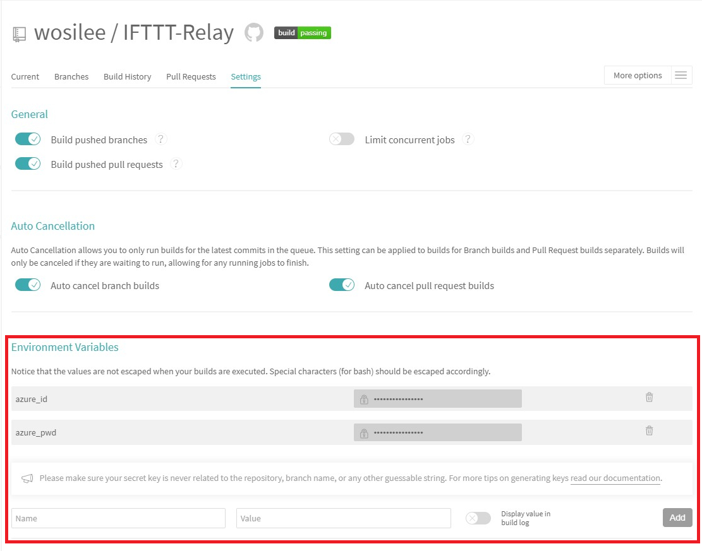
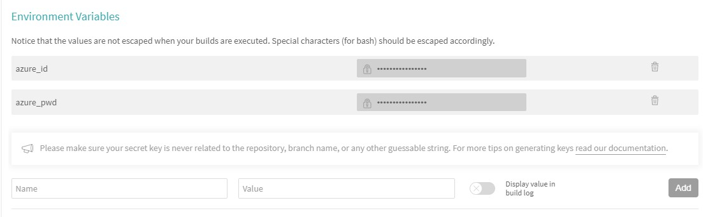
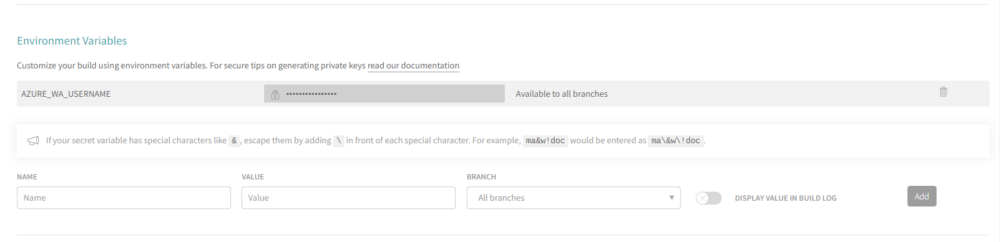
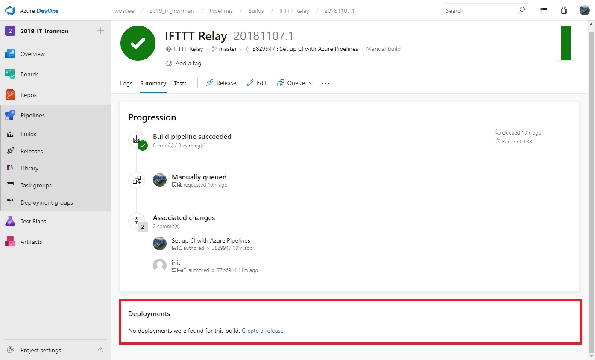
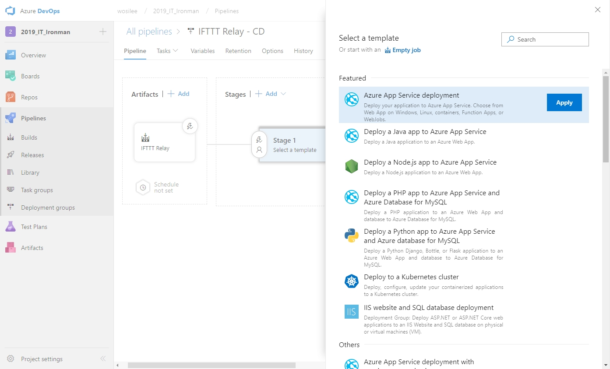
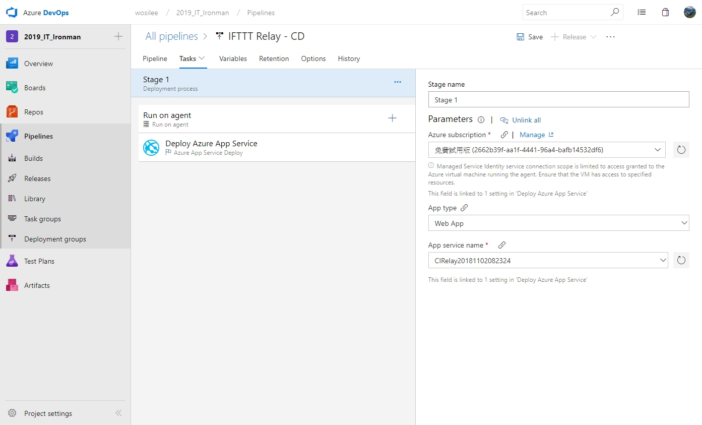
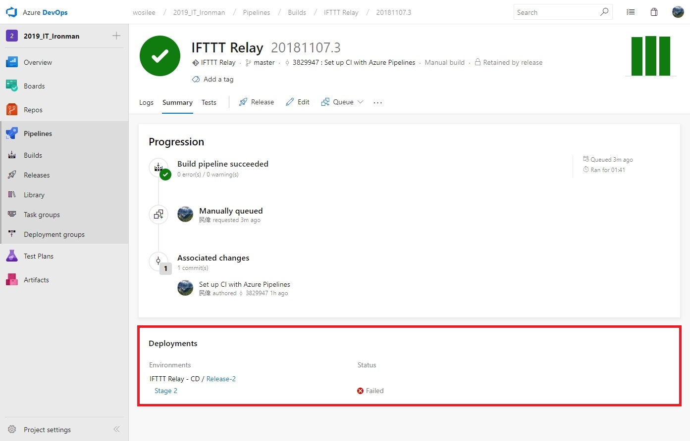
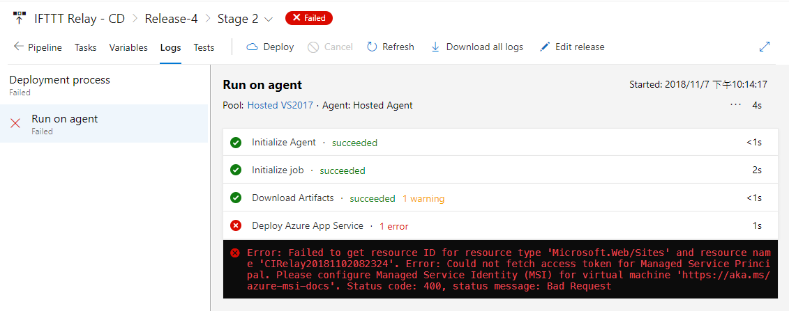

> [2019 iT 邦幫忙鐵人賽](https://ithelp.ithome.com.tw/users/20107551/ironman/1906)文章補完計劃，[從零開始建立自動化發佈的流水線]() 持續發佈篇

<!--more-->

## 將 WebAPI 發佈到 Azure App Service

```chat
吉米: 前面，我們將程式檔案發佈到 DropBox 之中，那結果要發佈 Web 之類的，又要怎麼做？

Eric: 自動發佈 Web ，是很常用遇到的情境。那下面就來聊聊如何發佈 Web 吧。吉米，你還記得我們曾經寫了一支基於 .Net Core 的 WebAPI 嗎？

吉米: 記得啊，還記得那支改了很多次。

Eric: 對啊，所以接下來就那支 Web API 做為範例。
```

### 使用 Travis CI 發佈

> 📝 資訊補充 📝
>
> 文章內使用的 Travis CI 設定方式是基於 Deployment(v1) 版本，2023/01 的當下，[Deployment(v2)](https://docs.travis-ci.com/user/deployment-v2) 仍在 Beta 階段。

發佈的網站位置是在 Azure Web App 之中，直接採用 Traivs CI 現成的 Deploy 方式。

```yaml
# .travis.yml

deploy:
  provider: azure_web_apps
  username: azure_deployment_user       # If AZURE_WA_USERNAME isn't set
  password: azure_deployment_password   # If AZURE_WA_PASSWORD isn't set
  site: azure_deployment_sitename       # If AZURE_WA_SITE isn't set
  slot: azure_deployment_slotname       # (optional) If AZURE_WA_SLOT isn't set
```

但是直接將 Azure 的帳密打在 `.travis.yml` 是很危險的一件事，通常會將這些機敏性資料設定在`環境變數`之中。在 Travis CI 中提供了兩種作法。

- 使用 CLI 操作的 [`Encryption keys`](https://docs.travis-ci.com/user/encryption-keys/)
- 直接使用 Web 設定的 [`Environment Variables`](https://docs.travis-ci.com/user/environment-variables/)

`Encryption keys` 的方式，沒有實際操作過。有興趣的朋友，可以參考 Stack overflow 上, [Travis CI - Using repository environment variables in .travis.yml](https://stackoverflow.com/questions/33735992/travis-ci-using-repository-environment-variables-in-travis-yml) 這篇的討論。

`Environment Variables` 的設定簡單，下面的操作採用 Environment Variables 的方式。

首先到 Travis CI 專案的 `Setting` 頁面，可以找到 `Environment Variables` 的設定區域，在設定時，可以選用兩種設定方式。



#### 自定義的 Environment Variables

在 Travis CI 的 Environment Variables 中，分別建立 `azure_id` 與 `azure_pwd` 兩組變數。



配合環境變數的設定，調整 `.travis.yml` 的內容，將 `azure_id` 與 `azure_pwd` 加入。

```yaml
deploy:
  provider: azure_web_apps
  username: $azure_id    # If AZURE_WA_USERNAME isn't set
  password: $azure_pwd   # If AZURE_WA_PASSWORD isn't set
  site: azure_deployment_sitename       # If AZURE_WA_SITE isn't set
```

#### Travis CI 定義的 Environment Variables

在 Travis CI 的 Environment Variables 中，直接使用 `AZURE_WA_USERNAME`、`AZURE_WA_PASSWORD`、`AZURE_WA_SITE` 的變數名稱。



當 `.travis.yml` 的 deploy 指定的 provider 為 azure_web_apps 時，預設會去抓取 `AZURE_WA_USERNAME`、`AZURE_WA_PASSWORD`、`AZURE_WA_SITE` 的環境變數。

在 `.travis.yml` 之中，直接省略 username、password、site 的設定。

```yaml
# .travis.yml
deploy:
  provider: azure_web_apps
```

### 使用 Azure DevOps 內建的 Azure Pipelines 發佈

如果點開 Build 的 log 出來看，會發現下方的 `Deployments` 沒有有任何設定。



在 `Azure Pipelines` 的 `Deployments` 必需從 是由 Releases 中進行設定的。
在建立 Release 的第一步，就是選擇 deploy 的目標。因為要 deploy web 到 Azure App Service 之中，所以指定 `Azure App Service deployment` 。



建立完成 stage 後，記得到 `Tasks` 中進一步設定。



完成所有設定後，再到 Build 之中，按下 `Queue` 進行建置。完成後，再觀查一下 log 就可以看最下方的 `Deployments` 己經存在剛剛設定的 Release 了。



可惜的是，筆者實作到這邊，未能在順利的處理無法順序發佈的問題。若解決，會再補上。



```chat
Eric: 因為是將 Web 發佈到 Azure 上，而主流的 CI Server 大多己經有現成的支援，這讓 Web 的發佈簡易很多。

吉米: 那如果要將 Web 發佈到私有的伺服器上呢？

Eric: 這時候，可能就要利用 Shell，以 command line 的方式，進行封裝與發佈的動作，就像之前發佈安裝的方式。

吉米: 嗯嗯，了解。

Eric: 以後有遇到這情況，就有設定的機會。

吉米: 哈哈哈，有備無患啊。
```

## 參考資料

1. Travis Document, [Script deployment](https://docs.travis-ci.com/user/deployment/script/#stq=&stp=0)
2. Travis Document, [Azure Web App Deployment](https://docs.travis-ci.com/user/deployment/azure-web-apps/)
3. FELIX RIESEBERG , [Using Travis to Deploy Apps to Azure](https://felixrieseberg.com/using-travis-to-deploy-apps-to-azure/)
4. [ASP.NET Web Deployment using Visual Studio: Command Line Deployment](https://docs.microsoft.com/en-us/aspnet/web-forms/overview/deployment/visual-studio-web-deployment/command-line-deployments)
5. Microsoft Document, [Azure Web App deployment](https://docs.microsoft.com/en-us/azure/devops/pipelines/targets/webapp?toc=%2Fazure%2Fdevops%2Fdeploy-azure%2Ftoc.json&%3Bbc=%2Fazure%2Fdevops%2Fdeploy-azure%2Fbreadcrumb%2Ftoc.json&view=vsts&tabs=yaml)
6. Microsfot Document, [Use the visual designer](https://docs.microsoft.com/zh-tw/azure/devops/pipelines/get-started-designer?view=vsts&tabs=new-nav#deploy-a-release)
7. [Using Managed Service Identity (MSI) with an Azure App Service or an Azure Function](https://blogs.msdn.microsoft.com/benjaminperkins/2018/06/13/using-managed-service-identity-msi-with-and-azure-app-service-or-an-azure-function/)
