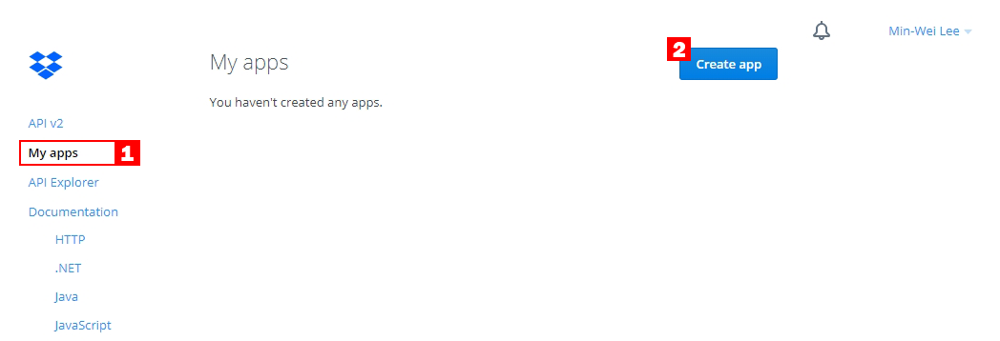
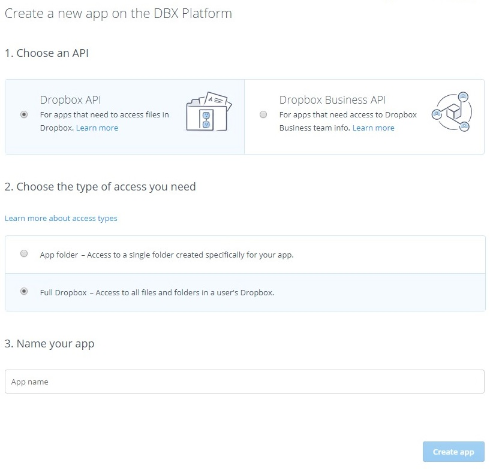

> [2019 iT 邦幫忙鐵人賽](https://ithelp.ithome.com.tw/users/20107551/ironman/1906)文章補完計劃，[從零開始建立自動化發佈的流水線]() 持續發佈篇

<!--more-->

```chat
吉米: 既然，可以運用 CI Server 自動建置、自動測試、發訊息，那再接下來，應該就是自動發佈了吧。

Eric: 沒錯，不過發佈類型不同，設定也有所差異。

吉米: 可以先介紹一下安裝檔的發佈嗎？

Eric: 好啊。
```

## 將軟體發佈到 Dropbox

由於先前使用的 CI Server 全部是現有的雲端服務，或是自行架構在 Azure 的虛擬機器。

所以期望 CI Server 也可以將檔案，自動發佈到網路空間，以下，筆者試著將軟體發佈到 DropBox 之中。

### Dropbox 設定

檔案上傳到 Dropbox 時，筆者運用 andreafabrizi 在 GitHub ，所分享的 [Dropbox-Uploader](https://github.com/andreafabrizi/Dropbox-Uploader) ，以簡化介接 Dropbox API 的工作量。

首先，先到 [Dorpbox Developers](https://www.dropbox.com/developers/apps) ，會看到以下的畫面，



按下 `Create app` 後，創立一個提供 CI Server 使用的 API。



完成建立後，直接到 `OAuth 2` 的區域取得 Token 值，這會用在 `Dropbox_Uploader.sh` 之中。


要注意的是，`dropbox_uploader.sh` 中，是將 先前取得的 Dropbox OAuth2 的 Token 另存檔案。但這情況不適合用在 CI Server ，所以對 `dropbox_uploader.sh` 進行部份修改。

```shell
# step 1
# 到 #Default values 增加 Token
OAUTH_ACCESS_TOKEN=73x2khI0WgMAAAAAAACQT9o8kMlODtz48GhinV9sq2lRCZq8RzIpLMBkVb2575wy

# Step 2
# 將 SETUP 區域的部份 mark 掉
```

並將修改後的 `dropbox_upload.sh` 放到 Repository 的目錄下。

### Travis CI

Travis CI 提供許多現成的發佈方式，例如 GitHub Release, AWS S3, Azure Web App, NPM, …… ，但由於我們要將程式發佈到 DropBox 之中，所以使用 `Custom Deploy`。

```yaml
deploy:
  provider: script
  script: bash scripts/deploy.sh
  on:
    branch: master
```

在 yaml 指令中，看到 `bash scipts/deploy.sh` 這個指令。它的意思是，要去執行 scripts 這個資料夾中，deploy.sh 這個 shell 檔案。

依 Travis CI 建議的做法，是比軟好的方式，但筆者則是採用另一程做法。直接在 `.travis.yml` 的 `script` 區段，執行上傳的動作。

```shell
language: csharp
solution: IronmanDemo.sln

mono: none
dotnet: 2.1.300

script:
    - dotnet restore
    - dotnet build --configuration Release
    - dotnet test Calculate.Tests/Calculate.Tests.csproj
    # 上傳到 dropbox 的檔案清單
    - bash dropbox_uploader.sh upload IronmanDemo/bin/Release 2019Ironman/Travis
```


## Azure DevOps deploy

在 Azure Pipeline 的部份，筆者參考官方文件的說明。

```yaml
- task: ShellScript@2
  inputs:
    scriptPath:
    #args: '' # Optional
    #disableAutoCwd: false # Optional
    #cwd: '' # Optional
    #failOnStandardError: false
```

先將 `dropbox-uploader.sh` 放到 repository 之中。

再到 `azure-pipeline.yml` 中，加入 `dropbox-uploader.sh` 的調用。

```yaml
- task: ShellScript@2
  inputs:
    scriptPath: .\dropbox_uploader.sh 
    args: upload IronmanDemo/bin 2019Ironman/AzureDevOps
```


說個題外話，筆者在實作時，沒有注意到參數要用 `args` 這個 key 值載入。試了很多次，才發發現這個錯誤，哈哈哈。

```chat
吉米: 透過 shell script 的操作，CI Server 的運用，就更加靈活。

Eric: 是啊，也要謝謝 andreafabrizi 分享上傳 dropbox 的 shell，大量簡化了與 Dropbox API 串接的工程。

吉米: 真的。剛剛看了一下 dropbox 的說明文件，如果都自己來，那工可就多了。
```

## 將 WebAPI 發佈到 Azure App Service

```chat
吉米: 前面，我們將程式檔案發佈到 DropBox 之中，那結果要發佈 Web 之類的，又要怎麼做？

Eric: 自動發佈 Web ，是很常用遇到的情境。那下面就來聊聊如何發佈 Web 吧。吉米，你還記得我們曾經寫了一支基於 .Net Core 的 WebAPI 嗎？

吉米: 記得啊，還記得那支改了很多次。

Eric: 對啊，所以接下來就那支 Web API 做為範例。
```

## 01. Travis CI

發佈的網站位置是在 Azure Web App 之中，直接採用 Traivs CI 現成的 Deploy 方式。

```yaml
# .travis.yml

deploy:
  provider: azure_web_apps
  username: azure_deployment_user       # If AZURE_WA_USERNAME isn't set
  password: azure_deployment_password   # If AZURE_WA_PASSWORD isn't set
  site: azure_deployment_sitename       # If AZURE_WA_SITE isn't set
  slot: azure_deployment_slotname       # (optional) If AZURE_WA_SLOT isn't set
```

但是，**直接將 Azure 的帳密打在 .yml 是很危險的一件事**，Travis CI 建議使用 `Environment Variables` 的方式。

就筆者看到的實作方式，一種是使用 Travis 的 `Encryption keys`、另一種則是使用 Environment Variables。第一種方式，筆者沒有實驗過，有興趣的朋友可以參考延伸閱讀 5。筆者採用 Environment Variables 的方式。


這時，.travis.yml 的內容如下。

```yaml
deploy:
  provider: azure_web_apps
  username: $azure_id    # If AZURE_WA_USERNAME isn't set
  password: $azure_pwd   # If AZURE_WA_PASSWORD isn't set
  site: azure_deployment_sitename       # If AZURE_WA_SITE isn't set
```

或是在 `Environment Variables` 中，直接宣告 `AZURE_WA_USERNAME`、`AZURE_WA_PASSWORD`、`AZURE_WA_SITE`，這樣的話 .travis.yml 的內容就省略 username、password、site 。

這時，.travis.yml 中，deploy 部份的內容如下。

```yaml
# .travis.yml
deploy:
  provider: azure_web_apps
```

## 02. Azure DevOps

如果點開 Build 的 log 出來看，會發現下方的 `Deployments` 沒有有任何設定。

在 Azure Pipelines 的 Deployments 是由 Releases 中進行設定的。


在建立 Release 的第一步，就是選擇 deploy 的目標。因為要 deploy web 到 Azure App Service 之中，所以指定 `Azure App Service deployment` 。


建立完成 stage 後，記得到 `Tasks` 中進一步設定。


完成所有設定後，再到 Build 之中，按下 `Queue` 進行建置。完成後，再觀查一下 log 就可以看最下方的 `Deployments` 己經存在剛剛設定的 Release 了。


可惜的是，筆者實作到這邊，未能在順利的處理無法順序發佈的問題。若解決，會再補上。


```chat
Eric: 因為是將 Web 發佈到 Azure 上，而主流的 CI Server 大多己經有現成的支援，這讓 Web 的發佈簡易很多。

吉米: 那如果要將 Web 發佈到私有的伺服器上呢？

Eric: 這時候，可能就要利用 Shell，以 command line 的方式，進行封裝與發佈的動作，就像之前發佈安裝的方式。

吉米: 嗯嗯，了解。

Eric: 以後有遇到這情況，就有設定的機會。

吉米: 哈哈哈，有備無患啊。
```

## 參考資料

▶ Dropbox

1. Xmodulo, [How to access Dropbox from the command line in Linux](http://xmodulo.com/access-dropbox-command-line-linux.html)
2. [Dropbox Uploader](https://www.andreafabrizi.it/2016/01/01/Dropbox-Uploader/)
3. MR. 沙先生, [Dropbox API 用 bash 也可以上傳下載 Dropbox](https://shazi.info/dropbox-api-%E7%94%A8-bash-%E4%B9%9F%E5%8F%AF%E4%BB%A5%E4%B8%8A%E5%82%B3%E4%B8%8B%E8%BC%89-dropbox/)
4. Microsoft Document, [Shell Script task](https://docs.microsoft.com/en-us/azure/devops/pipelines/tasks/utility/shell-script?view=vsts)

▶ Jenkins

1. Travis Document, [Script deployment](https://docs.travis-ci.com/user/deployment/script/#stq=&stp=0)
2. Travis Document, [Azure Web App Deployment](https://docs.travis-ci.com/user/deployment/azure-web-apps/)
3. Travis Document, [Environment Variables](https://docs.travis-ci.com/user/environment-variables/#default-environment-variables)
4. FELIX RIESEBERG , [Using Travis to Deploy Apps to Azure](https://felixrieseberg.com/using-travis-to-deploy-apps-to-azure/)
5. Stack overflow, [Travis CI - Using repository environment variables in .travis.yml](https://stackoverflow.com/questions/33735992/travis-ci-using-repository-environment-variables-in-travis-yml)
6. [ASP.NET Web Deployment using Visual Studio: Command Line Deployment](https://docs.microsoft.com/en-us/aspnet/web-forms/overview/deployment/visual-studio-web-deployment/command-line-deployments)
7. Microsoft Document, [Azure Web App deployment](https://docs.microsoft.com/en-us/azure/devops/pipelines/targets/webapp?toc=%2Fazure%2Fdevops%2Fdeploy-azure%2Ftoc.json&%3Bbc=%2Fazure%2Fdevops%2Fdeploy-azure%2Fbreadcrumb%2Ftoc.json&view=vsts&tabs=yaml)
8. Microsfot Document, [Use the visual designer](https://docs.microsoft.com/zh-tw/azure/devops/pipelines/get-started-designer?view=vsts&tabs=new-nav#deploy-a-release)
9. [Deployment of  website using Visual studio, FTP Tool, Dropbox etc. in Microsoft Azure.](https://rojalinsahoo.wordpress.com/2015/05/05/5/)
10. [Using Managed Service Identity (MSI) with an Azure App Service or an Azure Function](https://blogs.msdn.microsoft.com/benjaminperkins/2018/06/13/using-managed-service-identity-msi-with-and-azure-app-service-or-an-azure-function/)
11. Microsoft Document, [Set up continuous integration and deployment to Azure App Service with Jenkins](https://docs.microsoft.com/en-us/azure/jenkins/java-deploy-webapp-tutorial)
12. Micorsoft Document, [使用 Jenkins 外掛程式來部署到 Azure App Service](https://docs.microsoft.com/zh-tw/azure/jenkins/deploy-jenkins-app-service-plugin)
