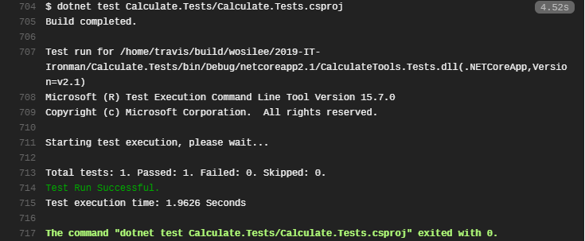
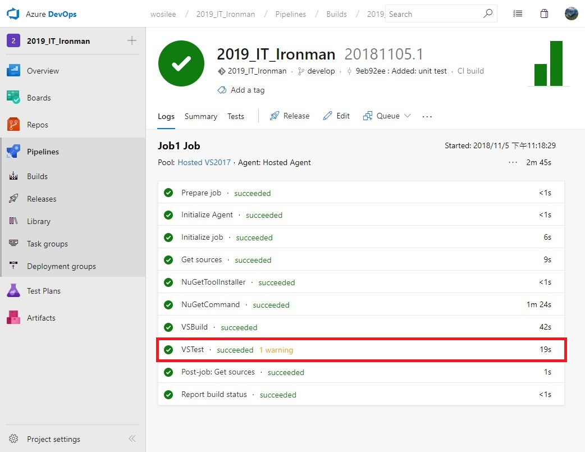
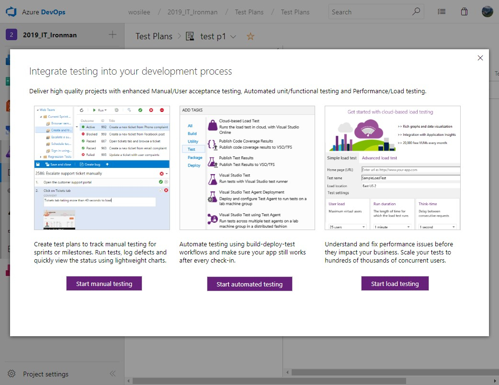

> [2019 iT 邦幫忙鐵人賽](https://ithelp.ithome.com.tw/users/20107551/ironman/1906)文章補完計劃，[從零開始建立自動化發佈的流水線]() 持續整合篇

想達成持續整合(Continuous Integration, CI)的目標，只有單純進行版本控制與建置，就太可惜了。CI 可視為是自動化管控軟體品質的第一道防線，在這個階段，可以整合自動化測試、程式碼掃描分析、資安掃描等動作。

接著，在本篇文章內章，會淺講單元測試的概念，並試著把單元測試與 CI 整合起來。

<!--more-->

```plan
Eric: 完成持續整合與訊息通知後，又向持續發佈的目標前進了一大步。
吉米: 是啊，完成 CI server 的架設與訊息通告的設定後，就可以立刻確定提交到版控的程式是否能正常建置。
Eric: 很好，但還不夠。我們下一步就是確保建置出來的軟體，可以正確運行功能。
吉米: 我們在提供之前的測試，不就是為了確保軟體正確運行功能嗎？
Eric: 這在軟體規模小的時候還可以，但是如果你手上的軟體己經持續發展六七年以上，還有辦法修改後的程式，每個功能都正常嗎？
吉米: 確實，通常都是只測試這次修改的功能是否正常，其他功能不太會特別去測試。
Eric: 對吧！所以這個時間，就要依賴自動測試機制，來檢查原有的功能是否正確運行。
吉米: 你說的有道理，但我對自動化測試這部份沒有經驗。
Eric: 沒關係，先跟你說自動化的觀念後，以後，你有機會會用到的。
```

## 自動化測試的第一步 - 單元測試

提到自動化測試，那就一定避不開單元測試。單元測試最主要的目的，就是**驗證被測試的物件，商業邏輯的是否正確**、**輸出入的結果是否符合預期**。

我們利用單元測試來快速測試、驗證，所開發的功能，是否能達到預期的結果。對於通過測試的功能，至少可以保證它的商業邏輯，在特定的測試的條件是正確無誤的。

### 單元測試的五大特性

而一個好的單元測試，它一定具有 **`快速`**、**`獨立`**、**`可重現性`**、**`可自我驗證`**、**`即時性`** 這五個特性。通常將這五個特性簡稱為 `FIRST`。

- **F**ast 快速

  單元測試可以在短時間取得測試結果。

- **I**ndependent/**I**solated 獨立

  單元測試時，不需依賴其他的物件或功能，才能進行測試。

- **R**epeatable 可重現的

  不管在何時何地，測試的結果應該都是相同的。

- **S**elf-Validating 可自我驗證

  不管單元測驗通過與否，應該可以從測試工具產生的測試報告，明白的得知測試結果與失敗原因。

- **T**imely 即時

  可以當下就知道測試結果。

### 單元測試的基本功

對於沒有撰寫過單元測試的開發者，往往不知道要從那邊開始下手。或者是手上的程式歷經 N 個人的手，內容過於複雜，無法下撰寫單元測試。

事實上，單元測試的運用與觀念，非常重視 `物件導向的特性` 與  `SOLID 原則`。所以，假若不常用或不熟悉物件導向的開發者，初期不容易切入單元測試的世界。

簡單提一下 **物件導向的特性** 與  **SOLID 原則** ，若要進一步了解，網路上也有許多參考資料，就不詳細說明。

#### 物件導向特性

- **封裝**: 將相關的功能、參數、全部包成同一個物件。
- **繼承**: 繼承父物件的子物件，具有父物件的特定功能的同時，可以增加父類別所沒有的功能。
- **多型**: 使用相同的抽象介面，操作同介面不同實作的物件。
- **抽象**: 物件間共有的特性或功能，但不一定具有實作功能。

#### SOLID 原則

- 單一職責原則(Single responsibility principle, SRP)

  每個物件，不管是類別、函數，負責的功能，都應該只做一件事。也因為一次只做一件事，所以它的目的是非常明確的。

  相當來說，目的越明確，範圍越小的功能，其單元測試就越容易撰寫。

- 開放封閉原則(Open-Close principle, OCP)

  當功能變改時，該藉由**增加新的程式碼**來擴充系統的功能。避免**修改原本的程式碼**來擴充系統的功能。

  修改原本正常運行的程式碼，你很難確保這次的變更，是否如預期般，不會影響到其他相關的功能。

  就個人經驗而言，有所影響是正常的，沒影響到是運氣好，但通常會對維護上，帶來額外的負擔。

- 里氏替換原則(Liskov substitution principle, LSP)

  簡單來說，只要是繼承父類別的物件。在程式中，只要出現父類別物件的部份，都可以用子類別替換。

- 接口隔離原則(Interface segregation principle, ISP)

  針對不同需求的用戶，開放其對應需求的介面，提供使用。可避免不相關的需求介面異動，造成被強迫一同面對異動的情況。

  簡單來說，對不同的用戶，開放不同的功能。再用通俗一點的說法，就是見人說人話、見鬼說鬼話。

- 依賴反轉原則(Dependency inversion principle, DIP)

  類別中，不應該直接使用另一個具有實作類別，而是使用抽象的介面，去承接繼承該介面的實作類別。**它的目標就是解除物件與物件間，兩者的直接相依關係。**

### 單元測試的用途

當軟體規模大到一個程度後，後面的需求變動，往往有很大的機率出現**改 A 壞 B**的情況。在單元測試保護的情況下，程式改壞了，測試就會直接亮紅燈，以確保程式功能的正確性。

或是軟體需要重構的情況下，確保軟體不會因為程式碼的整理，而造成功能的損壞。

再者時，軟體己具有一定規模時，快速驗證新增功能是否正常，而不需要每次都從重跑流程，造成時間與效率的浪費。

所以 **單元測試，真正發揮它的 POWER 的時間點，在於軟體後續長期維護、需求變動、重構**時，才能真正的明白為什麼需要單元測試。

順帶一提，在單元測試時，不需要過份追求**程式覆蓋率** 或 **測試案例**。過度追求程式覆蓋率或測試案例，可能會造成無意義的測試案例、或是測試案例維護成本過高的情況。在無法確定那些功能需要測試的情前提下，可先從**使用頻率最高**、**曾經出錯的功能**下手。

## 設定 CI 運行規則

```plan
Eric: 當我們寫完了自動測試，當然也會希望 CI server 在建置時，順便幫我們確認提交變更後的程式，是否可以通過測試。
吉米: 嗯嗯，所以我們接著要去 Azure DevOps、Travis CI 這幾個 CI Server 中，設定執行自動測試的動作吧。
Eric: 沒錯。那我們就接著進行 CI Server 的設定吧。
```

在開始之前，先建立一個名稱為 Calculate.Tests 的.net core unit test 專案，特別注意，使用的測試工具是 **MSTest**。

```c#
[TestMethod]
public void Plus_1_plus_1_equ_2()
{
    CalculateTools.Calculate calc = new CalculateTools.Calculate();
    int expected= 2;

    int actual = calc.Plus(1, 1);

    Assert.AreEqual(expected, actual);
}
```

### Travis CI

▶ 若測試框架為 MSTest，由於 MSTest 為 dotnet 的內含工具，只需在 `.travis.yml` 增加一行指令，就可以進行測試了。

```yaml
script:
   - dotnet test Calculate.Tests/Calculate.Tests.csproj
```

從 Travis CI 的 log 中，就可以看到 Travis CI 真的有執行測試動作。



▶ 假若使用 NUnit 或 xUnit 等測試框架，就需要額外設定，讓 Travis CI 知道有使用外部套件。

下面是 Travis CI 官方說明文件的 yml 範例。

```yaml
language: csharp
solution: solution-name.sln
install:
  - nuget restore solution-name.sln
  - nuget install xunit.runners -Version 1.9.2 -OutputDirectory testrunner
script:
  - xbuild /p:Configuration=Release solution-name.sln
  - mono ./testrunner/xunit.runners.1.9.2/tools/xunit.console.clr4.exe ./MyProject.Tests/bin/Release/MyProject.Tests.dll
```

### Azure DevOps

對於自家的 .NET 專案，Azure DevOps 的支援性就更高了。

**無需額外設定**，Azure Pipleline 在建置時，發現有測試專案，就會自動進行測試。



除了單元測試以外，還想加入其他的測試計劃，可以選擇 `Test Plans`。這部份就不多加著墨，有興趣可以自行摸索。



```plan
吉米: 當 CI 整合測試後，感覺又多了一層保障。
Eric: 是啊，只要通過 CI ，可以確實每一個提交者的程式，都是通過測試的。
吉米: 也就是，只有要人沒通過測試，就把變更後的程式提交上來，立馬就會被抓包了。
Eric: 哈哈哈，要這樣說也可以。
```

## 延伸閱讀

▶ 單元測試

- 91, [30天快速上手 TDD](https://ithelp.ithome.com.tw/articles/10109845)
- [10. 從被動變主動—依賴反轉](https://ithelp.ithome.com.tw/articles/10191603)

▶ Travis CI

- [Travis CI Document](https://docs.travis-ci.com/user/languages/csharp/#.NET-Core)
- [Setup Travis CI to compile a .NET CORE project, run the tests and package it for NuGet](https://nicolas.guelpa.me/blog/2018/01/15/travis-ci-net-core.html)
