> [2019 iT 邦幫忙鐵人賽](https://ithelp.ithome.com.tw/users/20107551/ironman/1906)文章補完計劃，[從零開始建立自動化發佈的流水線]() 持續整合篇

當程式碼已經進入版控系統後，就會想要有個服務可以自動去建置、驗證 source code 的完整性與安全性，最好還可以自行部屬。而 CI/CD 就是為了滿足這個希望，而誕生出來的機制。

<!--more-->

```chat
Eric: 前面介紹完 Travis CI，雖然容易上手，可惜只支援 GitHub。接下來，我們來聊聊最多人使用的 Jenkins。

吉米: Jenkins 有聽其他人提起過，不過一直沒有放在心上。但我記得 Jenkins 的設定有點復雜。而且，我是不是要再另外準備一台電腦，提供 Jenkins 使用？

Eric: 放心，這點我有想到。所以在說 Jenkins 之前，先跟你介紹一下 Azure 雲端服務平台。
```

## 雲端運算簡介

近年來，常常聽到雲端運算這名詞，但到底怎麼才可以稱之為雲端運算呢？

依據美國國家技術標準局( National Institute of Standards and Technology, NIST) 所定義的 雲端運算，它具有 `五大特性`、`四種部署模式`、以及 `三種服務`。

### 五大特性

- 自助式隨需服務(On-demand self-service)

  客戶可以依其需求索取計算資源(例如伺服器或儲存空間)，且整個過程是單方面自動化的，無須與資源提供者互動。

- 廣泛網路接取(Broad network access)

  服務是經由網路提供，且有標準機制能讓不同的客戶端平台(如智慧型手機及筆電等)都可以使用。

- 共享資源池(Resource pooling)

  服務者所提供的計算資源，例如儲存空間、網路頻寬、計算能力、虛擬機器數量等，可類比為一個大水池，能隨時依需要(重新)分配給不同平台的多個使用者。使用者不需了解資源的實體位置，只要有抽象概念即可(如資源是在哪個國家或哪個資料中心)

- 快速的彈性(Rapid elasticity)

  計算資源不僅可以快速且有彈性地被提供或釋放，且對客戶而言，資源是取之不盡且可以恣意購買的。

- 可量測的服務(Measured service)

  計算資源可依其所提供的服務特性被自動控管及最佳化。提供者與使用者雙方都可透明地監控資源使用情形。

### 四種部署模式

- 公用雲
- 私有雲
- 社群雲
- 混合雲

### 三種服務

- 基礎架構即服務 (IaaS)
- 平台即服務 (PaaS)
- 軟體即服務 (SaaS

## Azure 簡介

Azure 是 Microsoft 近年來，大力推行的公有雲端服務平台。它提供了多種服務，讓用使用者自行選擇、組合與運用。

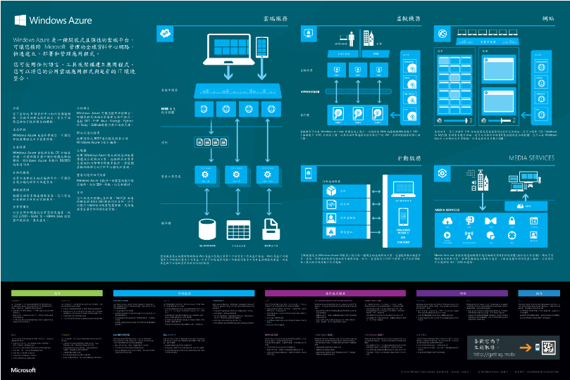

( 圖片來源: [Azure 官網](https://azure.microsoft.com/zh-tw/resources/infographics/azure/))

Azure 發展致今，服務內容己經横跨 **運算**、**資料服務**、**應用程式服務**、**儲存**、**網路** 等類型。

為了在將 JenKins 掛在 Azure 上，因此，採用 Azure 的 Linux **虛擬機器** 。

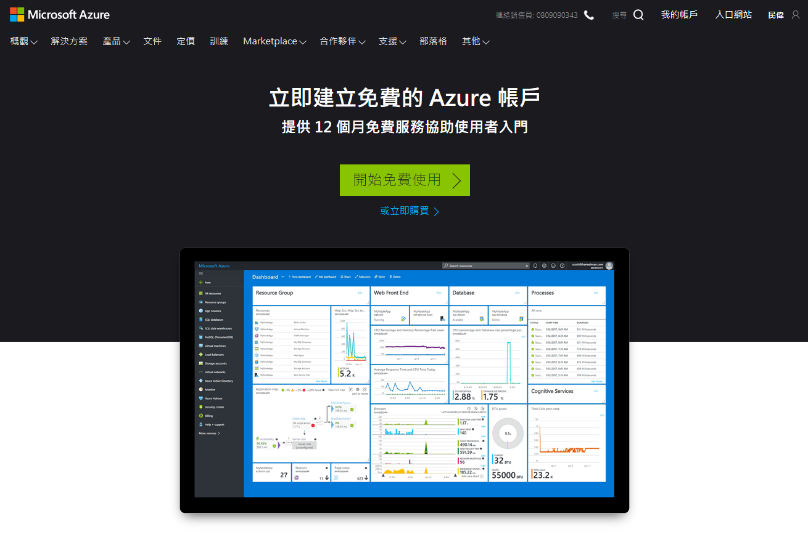

目前 Azure 為了讓更多人使用與體驗，提供 免費帳戶 讓大家有機會嘗試 Azure 豐富的服務內容。

為了確保帳戶的有效性，在申請免費帳戶時，必需經過信用卡驗證的關卡。

## Jenkins on Azure

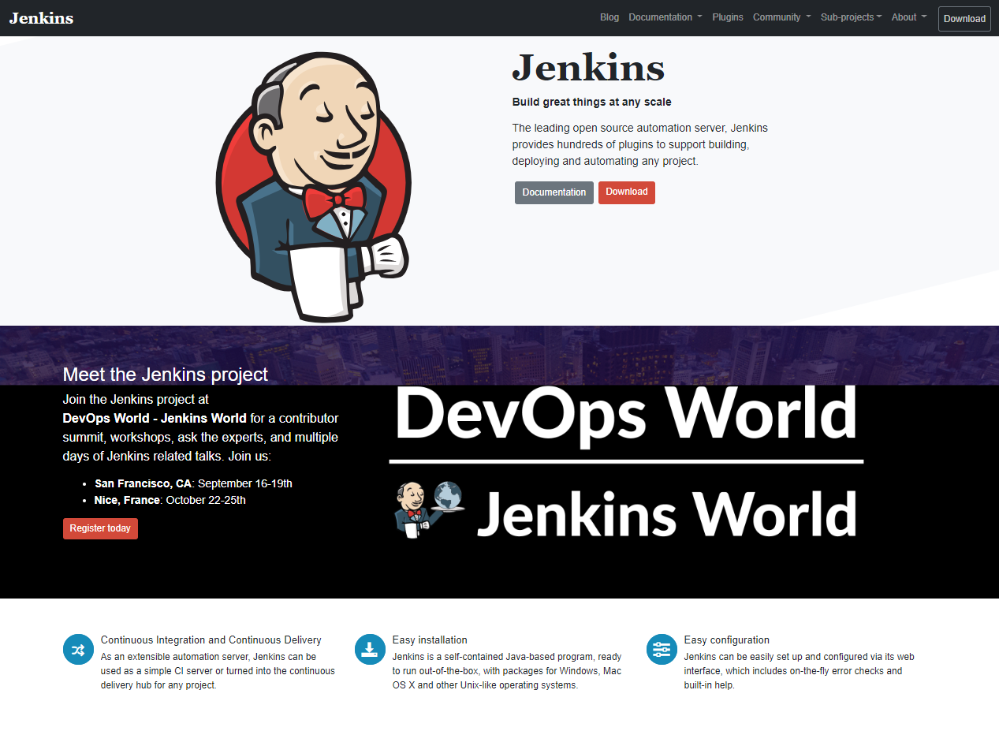

Jenkins 是目前擁有眾多使用者的 CI/CD 軟體。同時，它也是一個 Java 的開源專案，因此，擁有許多套件可搭配使用，以支援不同的需求。

### Jenkins install in Azure

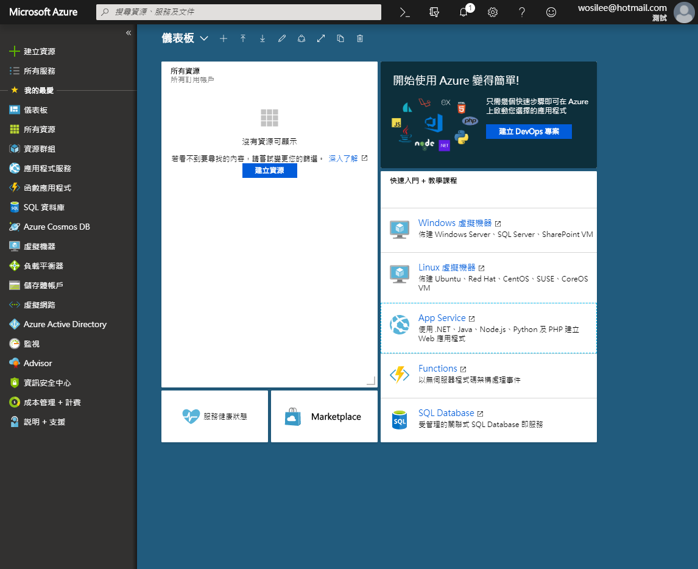

在進入 Azure 的畫面後，直接到 Marketplace 中，找到 Jenkins 進行安裝。

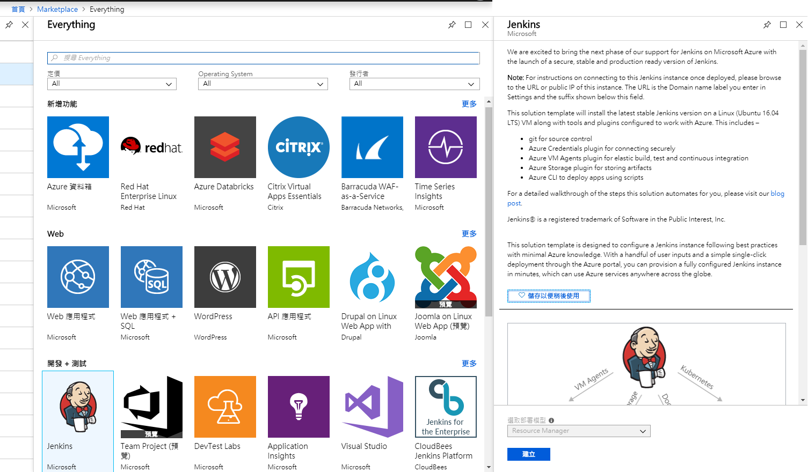

接下來就是進行一連續的設定動作。

筆者特別把建立過程中，遇到的問題，跟大家分享一下。

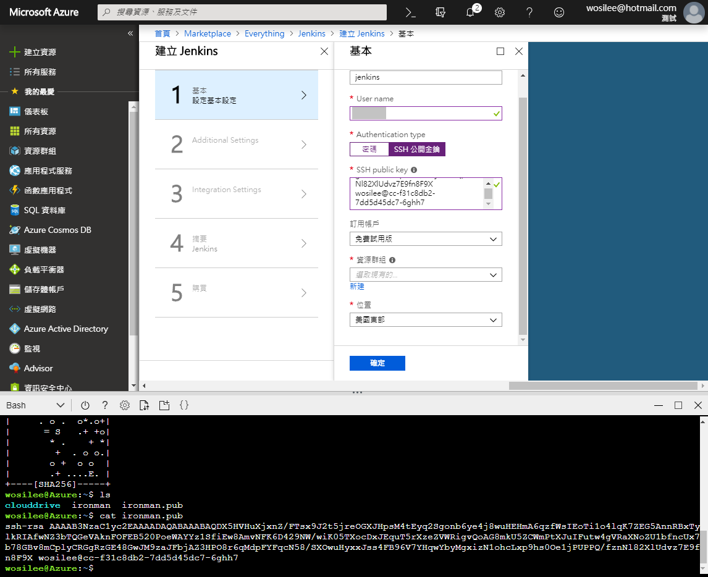

在 Linux 虛擬機器設定的步驟中，採用 `SSH 公開金鑰` 保護的機制。

筆者建立金鑰的方式，是使用 Azure 的 `Cloud Shell` 產生 SSH 金鑰。

```shell
# 建立 SSL 金鑰
ssh-keygen

# 再從產生出來的金鑰中，取出公鑰。
cat xxxxxxx.pub
```

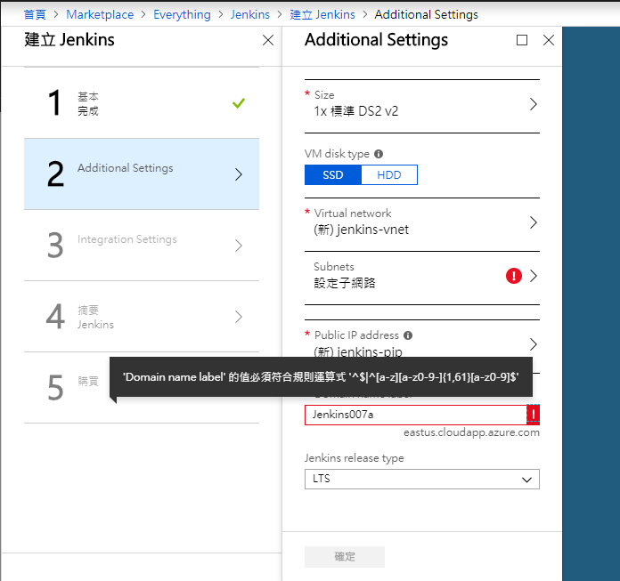

接著，在進行網路相關設定時，Domain Name 有進行規則運算式的驗證，要注意一下。

全部都設定完成後，就是等 Azure 完成部署。

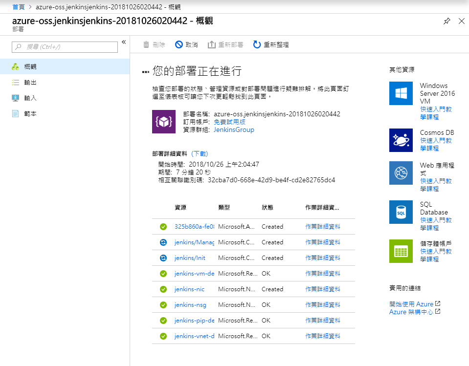


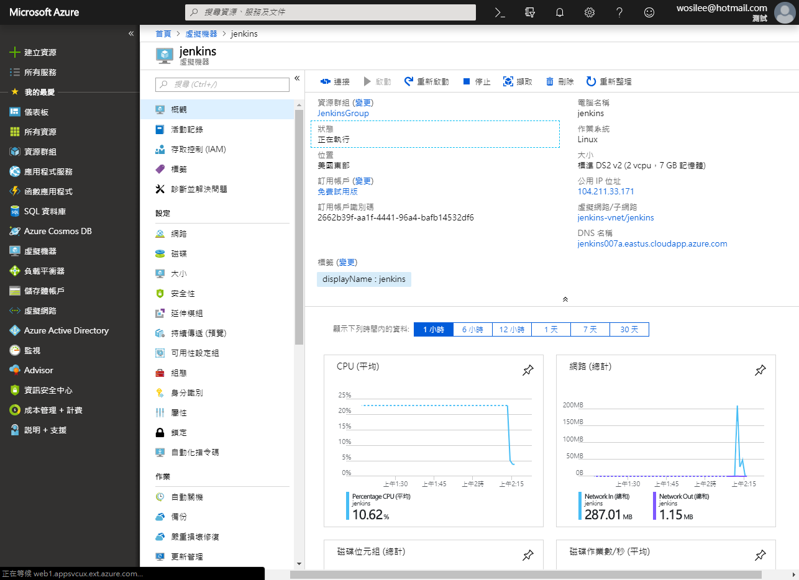

### Jenkins 設定

我們可以從虛擬機器中的 DNS 名稱，看到 Jenkins 所在的網站。

連到該網址後，因為伺服器是採用 SSH 金鑰的認證，所以無法直接使用網站。

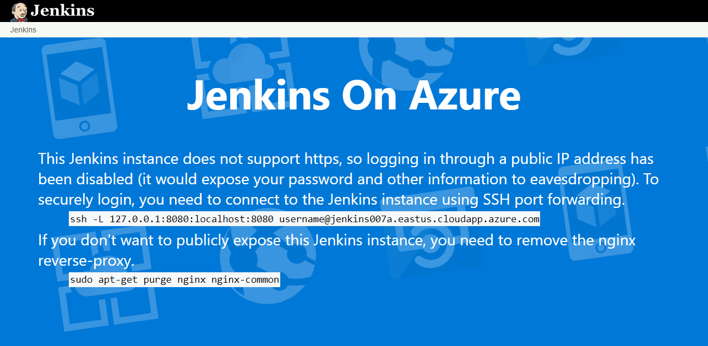

依指示，在本機端輸入 SSH 指令

```shell
ssh -L 127.0.0.1:8080:localhost:8080 username@domainname.eastus.cloudapp.azure.com
```

username: 設定時，所輸入的名稱。

domainname: 虛擬機器網路設定時，所輸入的 domain name。

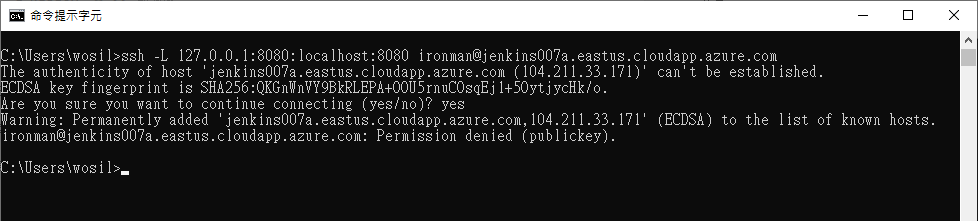

結果，訊息回傳 `Permission denied (publickey)` 的錯誤。

因為 Cloud Shell 產生出來的金鑰，儲存在 Azure 空間中，但本機端沒有金鑰資訊。資訊不對等，自然就會發生錯誤。

只要將 Azure 中的金鑰，下載放到本機端的 .ssh 資料夾中，就可以順利動作。

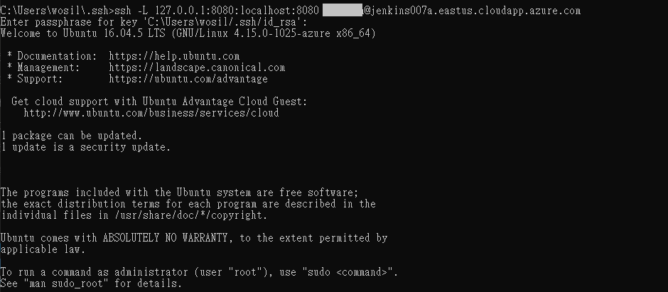

接下來，就可以從 <http://localhost:8080> 進入 Jenkins。不過第一次登入，一定要進行 Unlock 的動作。

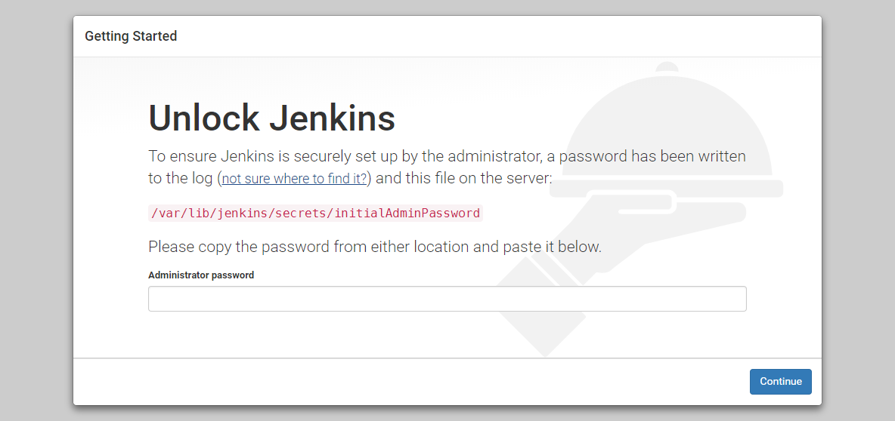

指 Jenkins 指示，輸入指令，就可以取回密碼，完成 Jenkins 的初始設定。

```shell
sudo cat /var/lib/jenkins/secrets/initialAdminPassword
```

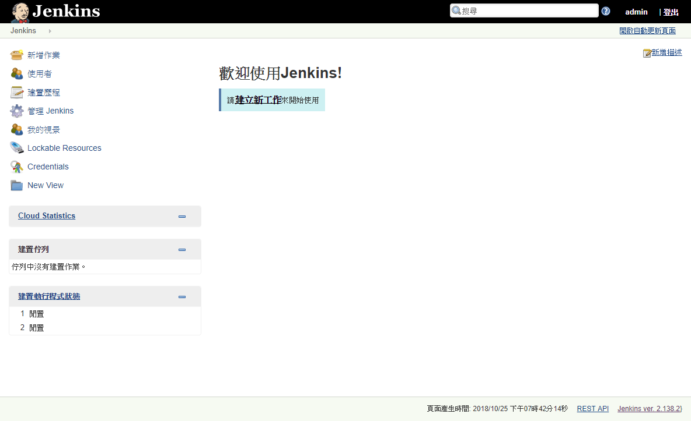

看到這個畫面，就大功告成，完成安裝。

```chat
Eric:
  是不是比想像中的容易。

吉米:
  對啊，沒有想到 Microsoft 還有專門介紹如何在 Azure 上 架設 Jenkins。

Eric:
  我們己經順利的在 Azure 上架設 Jenkins，並成功啟用。接下來，試著用 Jenkins 將 GitHub、BitBucket 的 Repository 接起來。
  Azure Repos 的部份，就交給 Azure DevOps 內的 Azure Pipeline 負責。

吉米:
  了解，但使用 Jenkins 在串接的 GitHub、BitBucket 這兩個不同平台時，設定上的差異會很大嗎？

Eric:
  這部份倒是不用太擔心。
  基本上，越多人便用的平台，Jenkins 通常會出現針對那平台或功能的插件。
```

### Step.1 建立 CI 專案

由於 GitHub、BitBucket、Azure DevOps 均是使用 Git 的做為版控的方式。

以 串接 BitBucket 為例，說明 Git Repository 要如何進行設定。


首先，按下建立新的 CI 專案後，會出現專案的設定畫面。選擇 `Free-Style 軟體專案`。

直接移到原始碼管理，將 Repository 的位置填入，然後在 **Credentials 中，選擇或新增 所使用 Repository 的帳密**。以便 Jenkins 可以成功進入 private repository ，並取回資料。

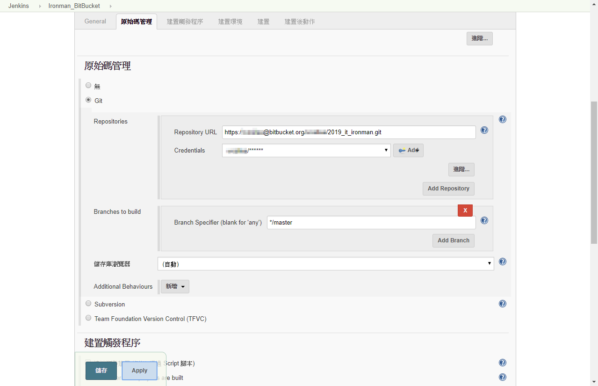

Repository 的設定只要出錯，建置的結果必定失敗。若去看建置失敗的原因，就會看到 git fetch 失敗。

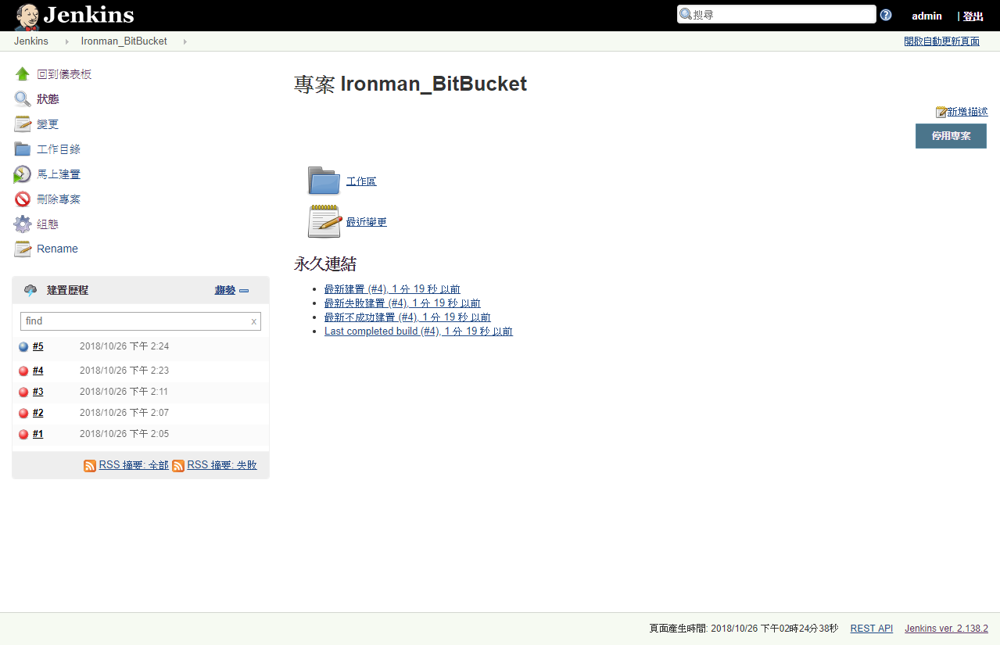

設定到這邊，Jenkins 只能主動去跟 Repository 取回資料。但是無法得知 Repository 是不有任何變更。

所以，一定要到 Repository 的平台上，設定 `webhook`，以便發生版本變更的同時，立即通知 Jenkins 進行 CI。

```chat
Eric:
  前面只是單純針對 Git 版控的 Repository 進行通用設定，但是 GitHub、BitBucket 這些被常用的平台，有好心人士公開專用的插件。
```

### 02. Repository 變更時，主動通知 Jenkins

所以要到 Repository 的平台上，設定 `webhook`，讓 Repository 知道，當發生版本變更時，通知 Jenkins 進行 CI。

- ### Software Configuration Management, SCM

- ### GIt plug

### 被動

### 1. GitHub plug-in

在最新版本的 Jenkins，己經預設安裝 `Github Plugin` 這個插件。所以在專案的 `組態` 中，看到 `GitHub projects`、`GitHub hook trigger for GITScm polling` 這兩個項目。

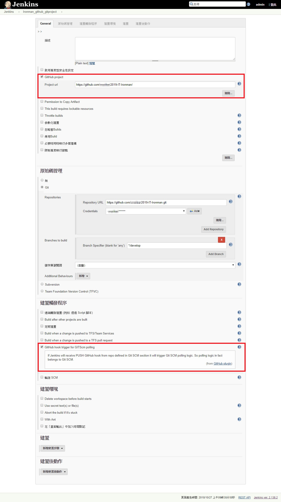

勾選 GitHub Projects 後，專案選單中，會出現 `GitHub` 。點選後，會直接轉跳到 GitHub 網址。

勾選 GitHub hook trigger for GIT trigger for GITScm polling，則是出現 `GitHub Hook Log`。

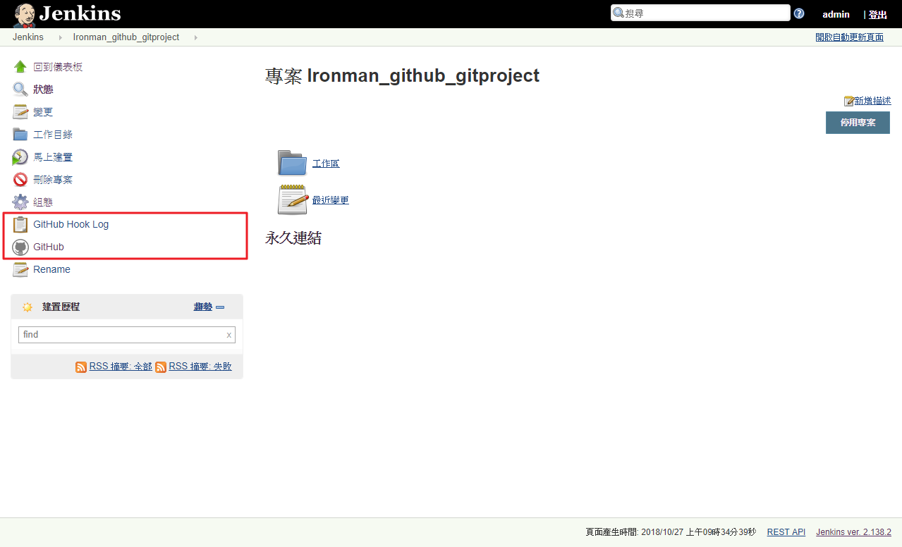

但是這樣還是收不到，記得到 GitHub 設定 Webhook。

```
{jenkins網址}\github-webhook
```

### 02. BitBucket plug-in

### 03. 使用 Jenkins 監控 Azure DevOps

## Azure Pipelines of Azure DevOps

```chat
Eric:
  前面花了很長的時間，說明 Jenkins 設定與支援 GitHub、BitBucket、Azure DevOps 等 Git Repository。接下來，來聊聊 Azure DevOps 當中的 PipeLines。

吉米:
  Pipelines？

Eric:
  Microsoft 將，原本 VSTS 當中，所有與 CI/CD 相關功能，統整於 Azure Pipelines。

吉米:
  了解。

Eric:
  我們先來聊聊 Azure Pipelines 對自家產品 Azure Repositories 的支援與設定。
```

### 1. Azure PipeLines 的建立

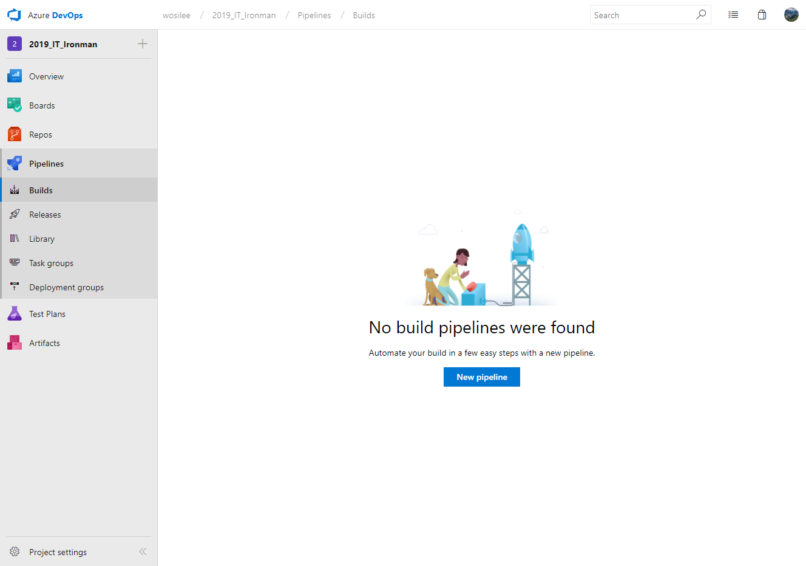

選取 Pipelines 的 Builds 後，會看到工作清單。但因為目前沒有任何資料，所以直接進入`建立 pipeline` 的容量。

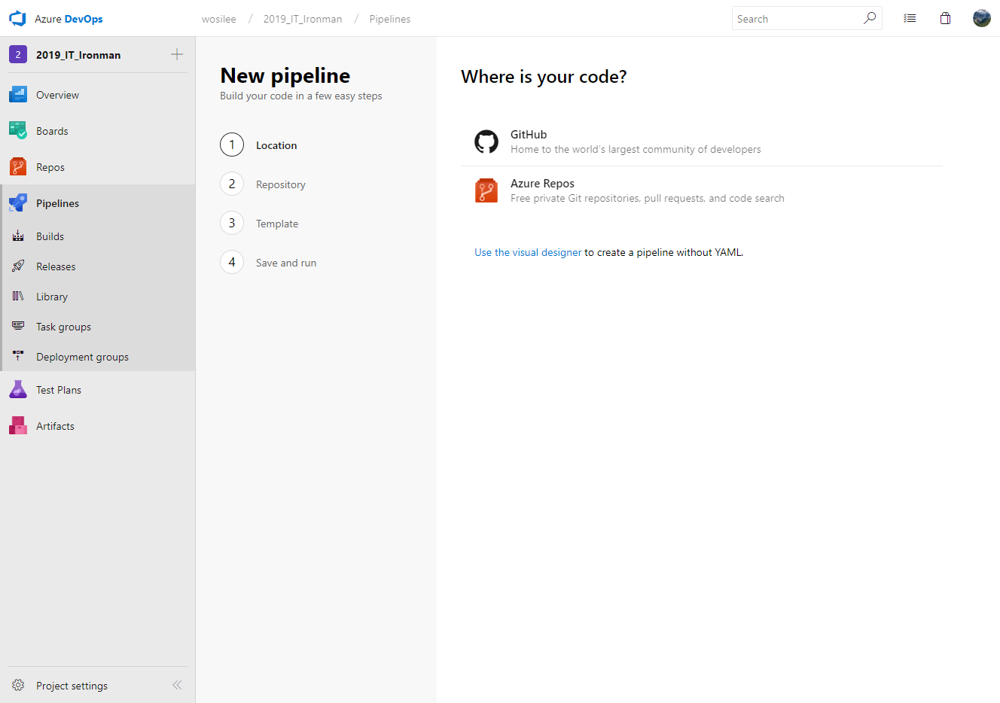

選擇 Azure Repository 後，如果該 Repository 內有資料，會列出 Repository 清單。

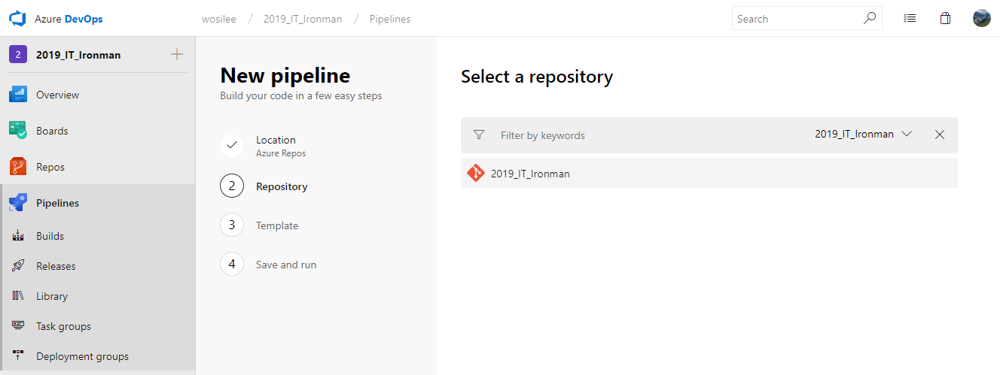

如果選取的 Repository 內己經有資料，Azure Pipeline 會自動分析，並建立 yml 檔。

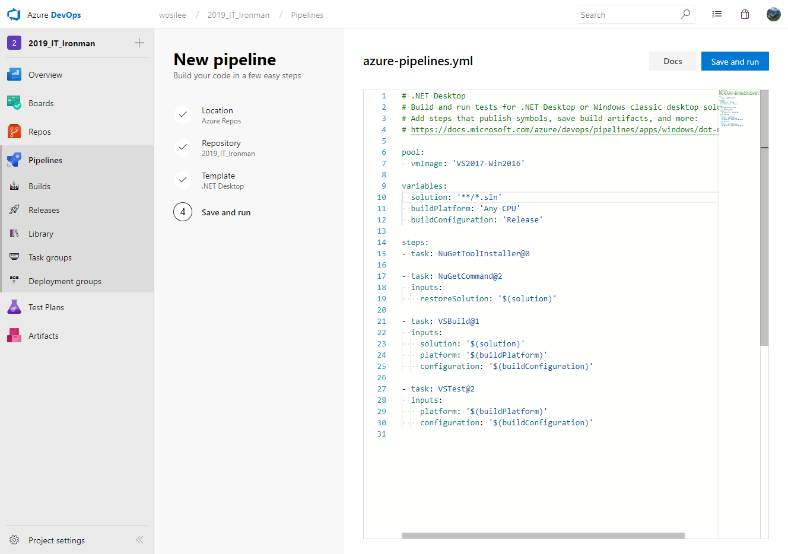

### 2. azure-pipelines.yml

我們來看一下，Azure pipelines 自動建立出來的 yml 內容。

```yaml
pool:
  vmImage: 'VS2017-Win2016'

variables:
  solution: '**/*.sln'
  buildPlatform: 'Any CPU'
  buildConfiguration: 'Release'

steps:
- task: NuGetToolInstaller@0

- task: NuGetCommand@2
  inputs:
    restoreSolution: '$(solution)'

- task: VSBuild@1
  inputs:
    solution: '$(solution)'
    platform: '$(buildPlatform)'
    configuration: '$(buildConfiguration)'

- task: VSTest@2
  inputs:
    platform: '$(buildPlatform)'
    configuration: '$(buildConfiguration)'
```

`azure-pipelines.yml` 的內容，其實還滿容易理解的。

- `pool` 所使用的測試環境
- `varibale` 宣告 `task` 內的所使用的變數
- `steps` 真正進行動作用的地方，在 azure pipeline 內，將各個動作都視為 `task` 。

Azure pipeline 動作時， 會依序執行 task，只要其中一個 task 失敗，就會直接中斷動作。並回報結果為失敗。

### 3. Azure pipeline 執行畫面

當 Repository 的程式碼有異動時，Azure Pipeline 就會依剛剛 `azure-pipelines.yml` 的指示，進行動作。

下面的圖為 Azure Pipelines 執行中的畫面。

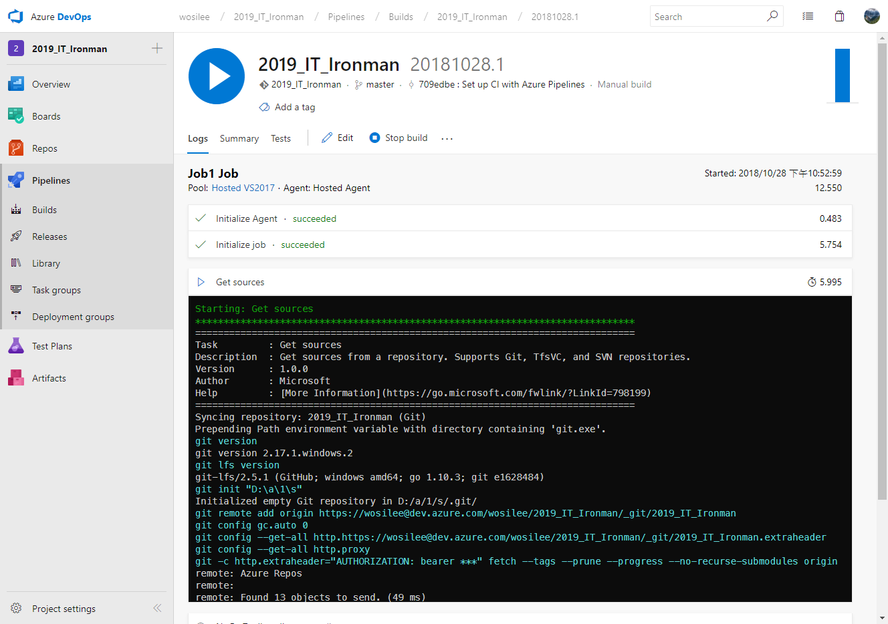

```chat

Eric: 接下來，我們來聊聊 YAML 這個標註語言。
```

### 延伸閱讀

▶ Cloud

- [雲端運算定義與範疇](https://www.cloudopenlab.org.tw/ccipo_industryDefinition.do)

▶ Azure

- Mircosoft Azure, [Azure 上的 Jenkins](https://docs.microsoft.com/zh-tw/azure/jenkins/)
- hungys, [認識 Microsoft Azure](https://ithelp.ithome.com.tw/articles/10157344)
- [Azure DevOps Features Timeline](https://docs.microsoft.com/en-us/azure/devops/release-notes/index)
- [YAML schema reference](https://docs.microsoft.com/en-us/azure/devops/pipelines/yaml-schema?view=vsts&tabs=schema)

▶ Jenkins

- [GitHub Integration: Webhooks](https://support.cloudbees.com/hc/en-us/articles/224543927-GitHub-Integration-Webhooks)
- [Git Plugin](https://wiki.jenkins.io/display/JENKINS/Git+Plugin)
- [Configure Jenkins to Run Build Automatically on Code Push (youtube)](https://www.youtube.com/watch?v=ke3f3rcRSc8)
- [Configuring Jenkins to Run a Build Automatically on Code Push (document)](https://blogs.sap.com/2015/12/15/configuring-jenkins-to-run-a-build-automatically-on-code-push/)
- [【Jenkins】外掛套件：MSBuild](https://dotblogs.com.tw/echo/2018/03/30/jenkins_plugin_msbuild)
- alexellis, [3 Steps to MSBuild with Docker](https://blog.alexellis.io/3-steps-to-msbuild-with-docker/)
- [GitHub Integration: Webhooks](https://support.cloudbees.com/hc/en-us/articles/224543927-GitHub-Integration-Webhooks)
- [Bitbucket Plugin](https://wiki.jenkins.io/display/JENKINS/Bitbucket+Plugin)
- [GitHub Plugin](https://wiki.jenkins.io/display/JENKINS/GitHub+Plugin)
