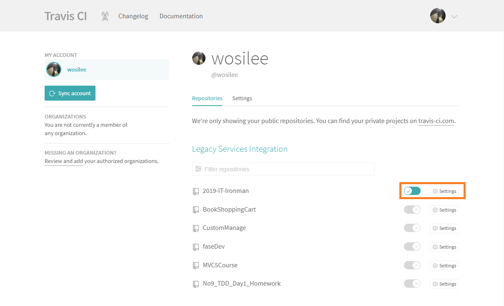
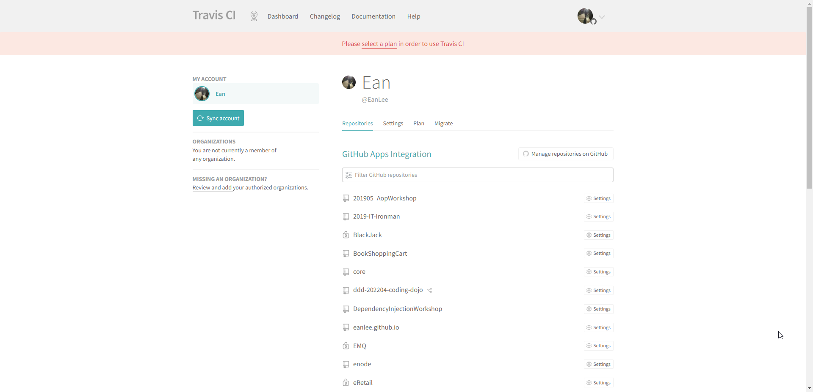
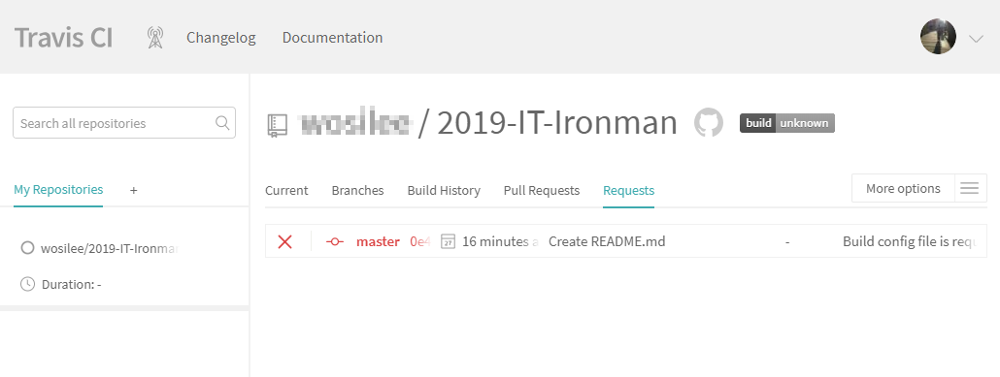
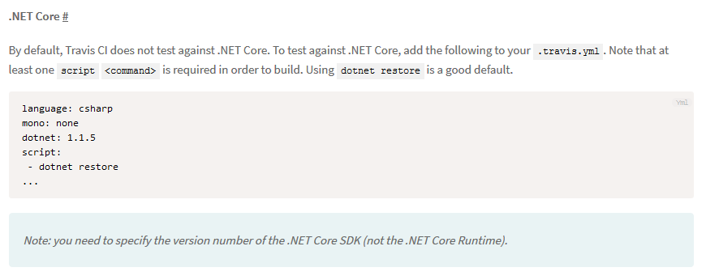

> [2019 iT 邦幫忙鐵人賽](https://ithelp.ithome.com.tw/users/20107551/ironman/1906)文章補完計劃，[從零開始建立自動化發佈的流水線]() 持續整合篇

當程式碼已經進入版控系統後，就會想要有個服務可以自動去建置、驗證 source code 的完整性與安全性，最好還可以自行部屬。而 CI/CD 就是為了滿足這個希望，而誕生出來的機制。

<!--more-->

## Travis CI

```chat
吉米與 Eric 約在一個週末的下午，邀請 Eric 到他的工作室。
兩人會面後，聊了一會，就直接切入持續整合這個主題。

Eric: 吉米，你現在使用那一個程式碼托管平台？GitHub？BitBucket？還是 Azure DevOps？

吉米: 工作上主要是用 BitBucket ，Azure DevOps 也還持續在摸索中。GitHub 因為要付費才能用 private repository，倒是什麼什麼在用。

Eric: 沒關係，這次就分享幾個 CI/CD 環境給你知道。既然提到 GitHub ，我們就先聊聊 Travis CI。

吉米: 嗯嗯。
```

### Travis CI 與 GitHub 的設定

有在參與 Open Source 專案的人，一定對 Travis CI ，這個提供 CI 的服務平台不陌生。

Travis CI 對 GitHub 有著高度的整合，讓使用者可以快速與 GitHub 帳戶內的 Repository 串接完成，享受 CI/CD 的服務。

比較可惜的是，依 Travis CI 提供的文件說明，目前只支援 GitHub。


在首頁，~~就可以觀察到 Travis CI 與 GitHub 的關係有多密切~~，只要使用者有 GitHub/Bitbucket/GitLab/Assembla 帳號，就可以直接登入使用。

> 📝 資訊補充 📝
>
> 在 2023 年的首頁，可以發現 Travis CI 支援託管平台，已經不限於 GitHub。
>
> 在[官方文件](https://docs.travis-ci.com/user/tutorial/)中，指出支援 GitHub、Bitbucket、GitLab 與 Assembla 這幾個託管平台。但是必須使用 GitHub、Bitbucket、GitLab 或 Assembla 的帳號進行註冊，才能使用對應的託管平台內的 Repository 資訊。


在第一次登入時，Travis CI 會跟使用者確認 GitHub 的存取項目與行為。

同意授權後， Travis CI 會花費一些時間，與 GitHub 內的內容同步。最終會把 GitHub 內所有的 Repository 列出來。


~~順帶一提，[travis-ci.org](https://travis-ci.org) 這個網址的 Travis CI 僅提供給 public repository 使用。若是想要存取 private repository ，則是要從 [travis-ci.com](https://travis-ci.com/) 這個網址進入。~~

> 📝 資訊補充 📝
>
> 現在不管是從 <https://travis-ci.org> 或 <https://travis-ci.com/> 進入，均會轉導到 <https://www.travis-ci.com/>
>
> 另外，2023 年的當下，已經不提供免費的服務，新註冊用戶可以享用 30 天的試用。


登入 Travis CI 後，在 Travis CI 的 Dashboard 內可以看到託管平台上所有的 Reposiotries。




若要對特定 repository 進行 CI，只要將 repository 後方的整合功能開啟，Travis CI 就會自動到 GitHub repository 的 webhook 的設定。完全不需要自行手動設定 webhook。  


### 開始使用 Travis CI

在 Travis CI 與 GitHub 完成串接後，Travis CI 並不會進行任何的建置或測試。 Travis CI 所有的動作，都是由 GitHub 發生版本變更時，經過 webhook 跟 Travis CI 通知。有版本異動，麻煩執行一下 CI。



在串接起 Travis CI 之前，筆者就先提交了一份 **.net core 主控台程式**。

為了測試 CI 是否正常工作，在 直接在 GitHub 中，增加了 README.md 的檔案，結果如上圖。

失敗的原因在於 repository 中，缺少 **.travis.yml** 這個檔案，導致 Travis CI 無法進行任何動作。

對 Travis CI 而言，.travis.yml 中，註明專案的使用的語言、使用的框架、執行的動作等資訊。

因為一開始的 .travis.yml 的設定有誤，造成 Travis CI 建置失敗。



後來參照 Travis CI Document 中，關於 .net Core 的設定寫法，這才順利通過建置。同時，在 Build History 中，可以很清楚的看到建置的結果與耗時。


接著，開一支 develop 的分支，然後在 develop 中，進行變動的提交。


在 Travis CI 中的 Branches 中，也可以看到各分支的最近五次的整合情況。

```chat
吉米: Travis CI 的設定真的很簡單，又快速上手。前後不到幾分鐘，就完成設定了。

Eric: 不過，因為你沒有在用 GitHub，使用到 Travis CI 的機會也不高。如果真的有用 Travis CI 的時間， .travis.yml 的設定就要花時間去了解。

吉米: 了解。

Eric: 接下來，我們來聊聊 GitHub 自家的 CI/CD 工具，GitHub Action。
```

## GitHub Actions

GitHub 在 2019/11/13 正式推出 GitHub Actions

## 延伸閱讀

- [使用 Travis CI 自動部署 GitHub Pages](https://ssk7833.github.io/blog/2016/01/21/using-TravisCI-to-deploy-on-GitHub-pages/)
- [Travis CI Tutorial](https://docs.travis-ci.com/user/tutorial/)
- [[DevOps] GitHub Actions 筆記 | PJCHENder 未整理筆記](https://pjchender.dev/devops/devops-github-action)
