> [2019 iT 邦幫忙鐵人賽](https://ithelp.ithome.com.tw/users/20107551/ironman/1906)文章補完計劃，[從零開始建立自動化發佈的流水線]() 持續整合篇

在上一篇 [踏入 CI/CD 的世界 - 觀念篇]() 介紹 CI/CD 的觀念後，接著來介紹如何使用 Travis CI 與 GitHub Actions 進行持續整合(Continuous integration, CI)。

<!--more-->

## Travis CI

```chat
吉米與 Eric 約在一個週末的下午，邀請 Eric 到他的工作室。
兩人會面後，聊了一會，就直接切入持續整合這個主題。

Eric: 吉米，你現在使用那一個程式碼托管平台？GitHub？BitBucket？還是 Azure DevOps？

吉米: 工作上主要是用 BitBucket ，Azure DevOps 也還持續在摸索中。GitHub 因為要付費才能用 private repository，倒是什麼什麼在用。

Eric: 沒關係，這次就分享幾個 CI/CD 環境給你知道。既然提到 GitHub ，我們就先聊聊 Travis CI。

吉米: 嗯嗯。
```

### Travis CI 與 GitHub 的設定

有在參與 Open Source 專案的人，一定對 Travis CI ，這個提供 CI 的服務平台不陌生。

Travis CI 對 GitHub 有著高度的整合，讓使用者可以快速與 GitHub 帳戶內的 Repository 串接完成，享受 CI/CD 的服務。

~~比較可惜的是，依 Travis CI 提供的文件說明，目前只支援 GitHub。~~

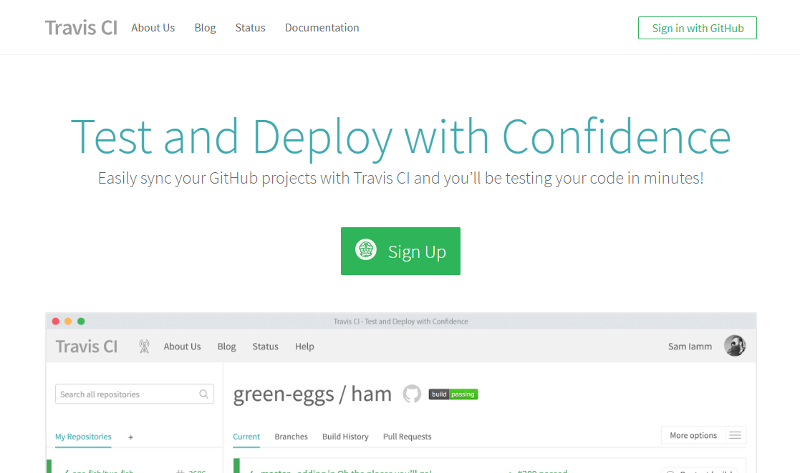

在首頁，~~就可以觀察到 Travis CI 與 GitHub 的關係有多密切~~，只要使用者有 GitHub/Bitbucket/GitLab/Assembla 帳號，就可以直接登入使用。

> 📝 資訊補充 📝
>
> 在 2023 年的首頁，可以發現 Travis CI 支援託管平台，已經不限於 GitHub。
>
> 在[官方文件](https://docs.travis-ci.com/user/tutorial/)中，指出支援 GitHub、Bitbucket、GitLab 與 Assembla 這幾個託管平台。但是必須使用 GitHub、Bitbucket、GitLab 或 Assembla 的帳號進行註冊，才能使用對應的託管平台內的 Repository 資訊。

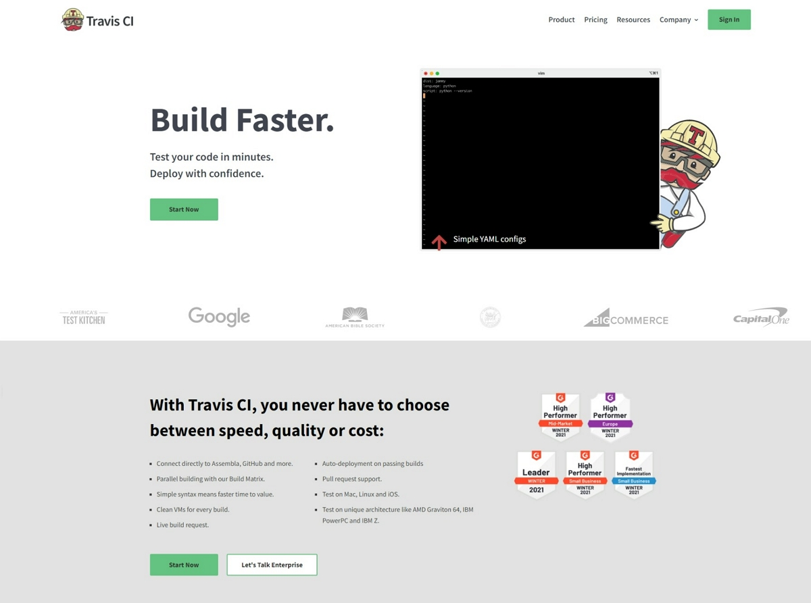

初次登入時，Travis CI 會跟使用者確認 GitHub 的存取項目與行為。

同意授權後， Travis CI 會花費一些時間，與 GitHub 內的內容同步。最終會把 GitHub 內所有的 Repository 列出來。

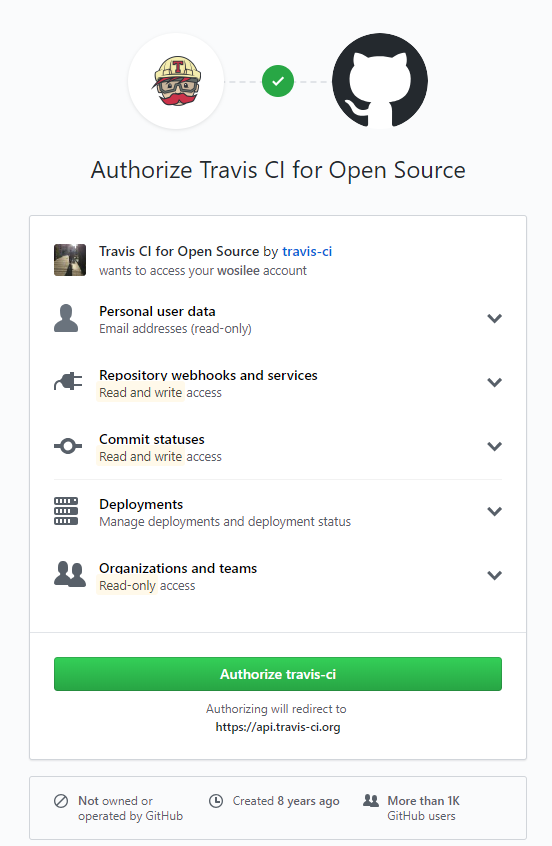

~~順帶一提，[travis-ci.org](https://travis-ci.org) 這個網址的 Travis CI 僅提供給 public repository 使用。若是想要存取 private repository ，則是要從 [travis-ci.com](https://travis-ci.com/) 這個網址進入。~~

> 📝 資訊補充 📝
>
> 現在不管是從 <https://travis-ci.org> 或 <https://travis-ci.com/> 進入，均會轉導到 <https://www.travis-ci.com/>
>
> 另外，2023 年的當下，已經不提供免費的服務，新註冊用戶可以享用 30 天的試用。

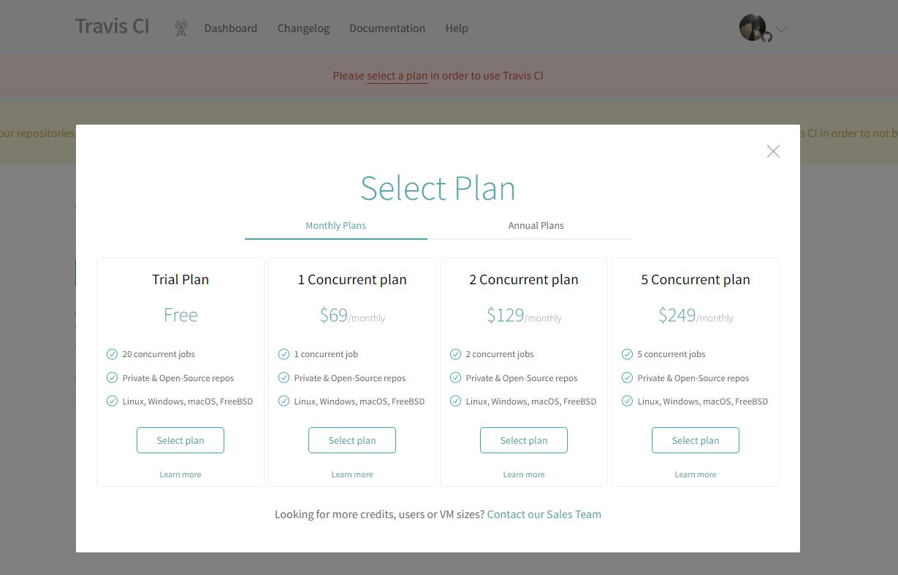

登入 Travis CI 後，在 Travis CI 的 Dashboard 內可以看到託管平台上所有的 Reposiotries。

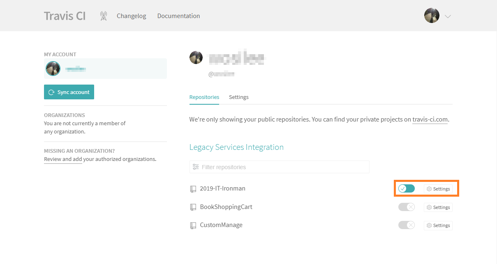

若要對特定 repository 進行 CI，只要將 repository 後方的整合功能開啟，Travis CI 就會自動到 GitHub repository 的 webhook 的設定。完全不需要自行手動設定 webhook。  

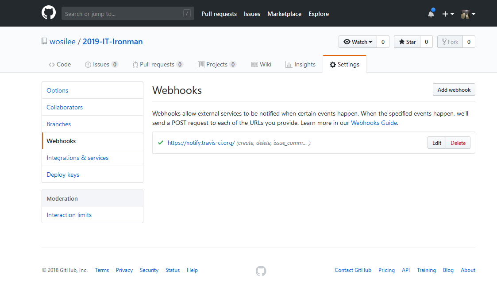

### 開始使用 Travis CI

在 Travis CI 與 GitHub 完成串接後，Travis CI 並不會進行任何的建置或測試。 Travis CI 所有的動作，都是由 GitHub 發生版本變更時，經過 webhook 跟 Travis CI 通知。有版本異動，麻煩執行一下 CI。

實際測試串接 Travis CI 的結果，在串接前，已先提交了一份 .net core 程式。並在完成 Travis CI 串接後，直接在 GitHub 中，增加了 `README.md` 的檔案。Travis CI 執行結果如下。


失敗的原因在於 GitHub repository 中，缺少 `.travis.yml` 這個檔案，導致 Travis CI 無法進行任何動作。對 Travis CI 而言，`.travis.yml` 中，註明專案的使用的語言、使用的框架、執行的動作等資訊。若是不清楚 `travis.yml` 要如何設定，也可以參照 Travis CI Document 的的寫法。


```yaml
language: csharp
solution: IronmanDemo.sln
mono: none

dotnet: 2.1.300

script:
- dotnet restore IronmanDemo
- dotnet build IronmanDemo

webhooks:
on_success: always # default: always
urls:
  - https://maker.ifttt.com/trigger/CI_Build_result/with/key/den2SL6fXRgg4MJUsAj27w

on_failure: always # default: always
on_start: change # default: never
on_cancel: always # default: always
on_error: always # default: always
```

同時，在 Build History 中，可以很清楚的看到建置的結果與耗時。

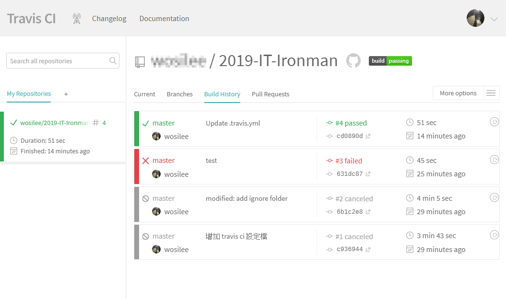

而在 Travis CI 中的 Branches 中，也可以看到各分支的最近五次的整合情況。

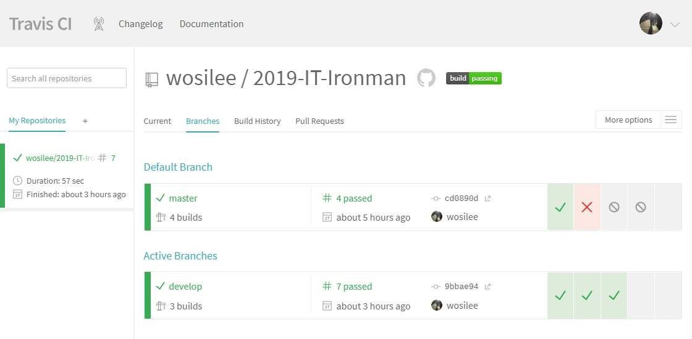

```chat
吉米: Travis CI 的設定真的很簡單，又快速上手。前後不到幾分鐘，就完成設定了。

Eric: 不過，因為你沒有在用 GitHub，使用到 Travis CI 的機會也不高。如果真的有用 Travis CI 的時間， .travis.yml 的設定就要花時間去了解。

吉米: 了解。

Eric: 接下來，我們來聊聊 GitHub 自家的 CI/CD 工具，GitHub Action。
```

## GitHub Actions

GitHub 在 2019/11/13 正式推出 GitHub Actions，讓開發者可以不用離開 GitHub 平台，就可以直接享受 CI/CD 的便利性。

在 Repository 的頁面，就可以看到 `Actions` 的頁籤，可以從此進入到 GitHub Actions 設定的頁面。

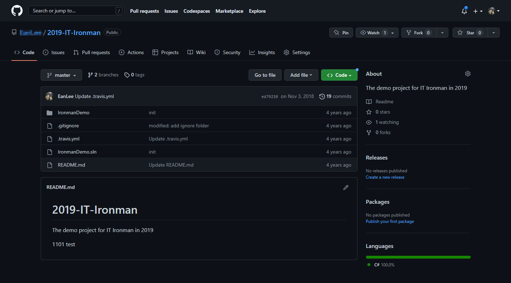
因為目前 Repository 還沒有進行任何 GitHub Actions 的設定，所以這一頁是空白的。

可以按下 `set up a workflow yourself`，從無到有，一切自己設定。可以參考 [GitHub Actions Docs](https://docs.github.com/en/actions/learn-github-actions) 文件。

不過，這樣工程有些浩大，建議使用 GitHub 會自動偵測 Repository 內容後給予的推薦設定樣版，或是撰擇現有的設定樣版。只要按下 `Configure`，就可以使用對應的預設樣版設定。

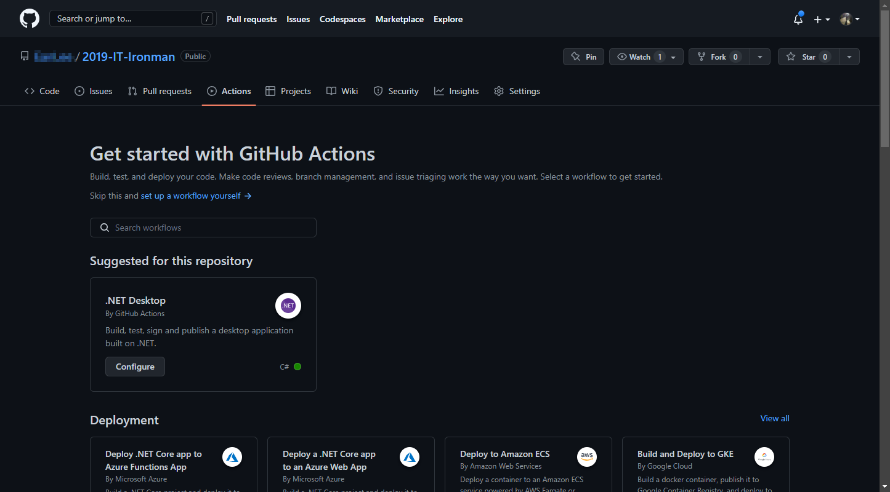

當按下 `configure` 後，GitHub 會自行在 `.github/workflows/` 的位置，建立 YAML 檔案。

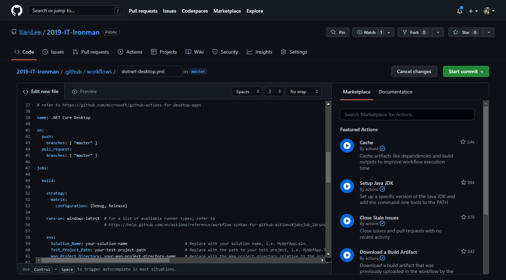

若是預設內容無法滿足需求，也可以檢視右端的 `Marketplace` 與 `Document` 來調整 YAML 的設定。

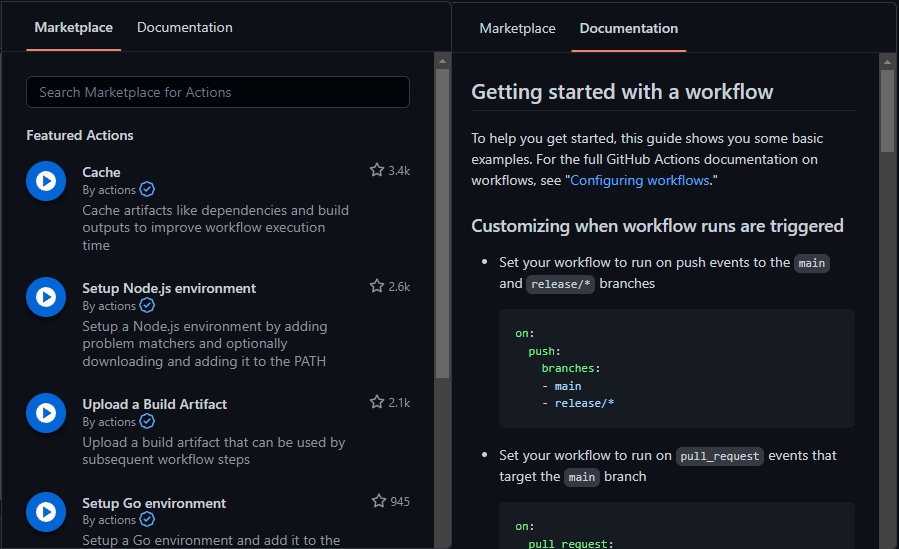

當完成設定後，再進入 GitHub Actions 後，就可以查看建置的動作了。

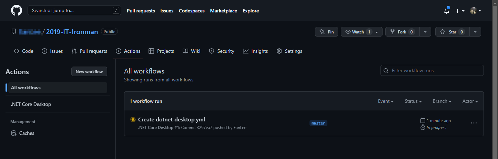

```chat
吉米: 可以直接在 GitHub 直接進行 CI/CD 設定，真的方便了不少。

Eric: 除了 Travis CI 與 GitHub Actions 之外，還有很多好用的 CI/CD 工具。
```

## 延伸閱讀

- [使用 Travis CI 自動部署 GitHub Pages](https://ssk7833.github.io/blog/2016/01/21/using-TravisCI-to-deploy-on-GitHub-pages/)
- [Travis CI Tutorial](https://docs.travis-ci.com/user/tutorial/)
- [[DevOps] GitHub Actions 筆記 | PJCHENder 未整理筆記](https://pjchender.dev/devops/devops-github-action)
