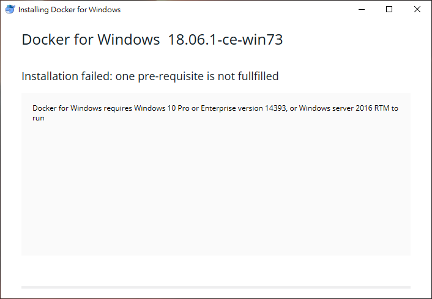
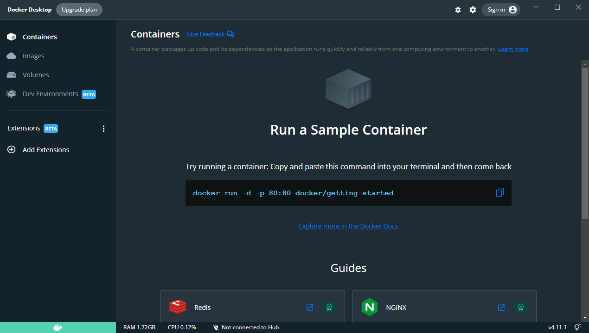

> [2019 iT 邦幫忙鐵人賽](https://ithelp.ithome.com.tw/users/20107551/ironman/1906)文章補完計劃，[從零開始建立自動化發佈的流水線]() Container 篇

當系統需要重新建置後，會發現建置的過程與步驟煩雜，甚至每次安裝都會發生不同的問題，不管使用虛擬機或是實體機。

此時，可以視實際情況，考慮使用 Container 的技術，減少環境建置的複雜性與成本。

<!--more-->
## Containers vs Virtual Machine

```chat
從建立起 CI/CD 環境後，幫吉米的工作分擔了許多麻煩事。讓吉米有更多的時間去爭取新的專案的情況下。
吉米成立了自己的小公司，並邀請 Eric 作為技術上的顧問。
就這樣過了一兩年，這天，吉米與 Eric 吃飯時，討論起到到客戶那邊更新服務時，種種的情況與問題。

吉米:
  現在的案子，每次更版，至少都要更新兩三支以上的程式，每次都要重新設定真的有點花費太多的時間在這上面。

Eric:
  嗯嗯，最近的案子，程式都是安裝在客戶建立的虛擬機 (Virtual Machine, VM) 中，每次都要重複進行相同的設定。在這情況下，我覺得可以嘗試將容器(Container)技術導入產品之中。

吉米:
  容器技術？是指近年來很紅的 Docker 或 K8S 嗎？這適合我們使用嗎？

Eric:
  嗯，我分析給你聽。
```


(圖片來源: [What’s the Diff: VMs vs Containers](https://www.backblaze.com/blog/vm-vs-containers/))

在討論容器化技術之前，要先了解到底 **容器(Container)** 與 **虛擬機器(Virtual Machine, VM)** 兩者之間的差異到底在那。

雖然 Container 與 Virtual Machine 都是基於作業系統 (Operating System, OS) 的高階虛擬化的技術，但是兩者的架構與完全不一樣。而原本的作業系統，又稱為主要作業系統 (Host OS)。

- Vitual Machine

  Virtual Machine 是從 **作業系統** 下手，它的目標就是 **建立一個可以執行完整作業系統的獨立環境**。
  
  說到這，就不得不提到 **Hypervisor**，它又稱為虛擬機器監視器 (Virtual Machine Monitor, VMM)，是 Guest OS 與實體機器(physical hardware)的中間層。
  
  一方面，以軟體的方式，模擬硬體環境替代實體機器，提供適當的 CPU、記憶體、硬碟容量……等虛擬硬體資源給 OS 使用。
  
  另一方面，負責協調不同虛擬硬體之間對實體機器的操作，以達到多個 OS 與應用程式共用同一套實體機器的資源。例如 VMware vSphere 或 Microsoft Hyper-V 就是 Hypervisor。

  可以想成，Hypervisor 就是硬體提供商，它單純只提供硬體。因此，需要安裝作業系統，才能執行應用程式。而安裝在 Hypervisor 上的 OS，又稱為 Guest OS。

- Container

  Container 則是直接針對 **應用程式層** 下手，一方面將 **應用程式本身與相關的函式庫、環境配置檔，打包成映像檔 (Image)**，以達到應用程式的獨立與模組化。

  另一方面，藉由 OS 層的抽象化，經由 **Containers Daemon** 的支援，讓每一個 Container 都是獨立環境的前提下，共用 Host OS。這種架構，讓 Container 可運行在實體機、虛擬器，或是雲端基礎設施 (cloud infrastructure)。

  因為 Container 共用 Host OS，所以不像 VM，需要等待 Guest OS 的啟動時間。自然 Container 的啟動時間遠快於 VM。

🔔 題外話 🔔

Container 技術最早是被發佈與運用在 Linux 之中，經過 Docker 的推廣，才讓 Container 真正的大紅，因此早期僅支援 Linux 環境。

若要在 Windows 之中使用，只能透過 Virtaul Machine 安裝 Linux Kernel 才能使用，造成 container 在 Windows 的環境下，效能表現不佳，讓許多基於 Windows 的軟體開發商避而不用。

雖然 Microsoft 先是推出 Windows Subsystem for Linux (WSL)，提供 Linux 的程式於 Windows 上使用，但依然有所局限。

在 2017 年 Linux Container on Windows (LCOW) 與 Windows Container on Linux (WCOL) 的推出，更是消弭了 Windows 與 Linux 之間的那道牆。

在 2020 年 9 月 Microsoft 調整 WSL 的架構，推出 WSL2，讓完整的 Linux 核心跑在 Hyper-V 的虛擬機器，提供更貼近原生 Linux 的使用體驗。

```chat
吉米:
  聽起來，Container 的導入，確實有一定的幫助。但要怎麼做呢？

Eric:
  建議可以從 Docker 先入手。

吉米:
  為什麼會建議使用 Docker 呢？

Eric:
  一來它的資源多，二來，我們的系統還沒大到需要 K8s。使用 Docker 之前，先來聊聊 Docker 的背景與變化。

```

## Docker 簡介

Docker 是 dotCloud 公司於 2013 年推出的開源專案。同年，dotCloud 公司也更名為 Docker 公司。Docker 在滙集眾多開發者的貢獻，與 Linux CoreOS 的大力支持下，很快的將 Docker 技術推展開來。

但是 2017 年 4 月，Docker 公司將原本開源的 Docker 專案名稱更改為 Moby。並將過去集合眾多開發者心血的 Docker，明確的區分為 **企業版 ( Docker Enterprice Edition, Docker EE)** 與 **社群版 (Dockert  Community Edition, Docker CE)** 。

另一方面，Docker 為了支援不同平台，所以針對各同平台，開發各自的 Container Deamon (在 Docker 中，被稱為 Docker Engine)。但這種作法，會導制支援平臺越多，維護的版本就越多的情況。

所以 Docker 併購了 Unikernel Systems 這個團隊，掌握了自行設計 Hypervisor 和 Unikernel 作業系統的技術。最終，產出 LinuxKit 這個 Linix 子系統。

在 LinuxKit 的支援下，達成 Docker Engine 的統一化。這讓 Docker 走出 Linux 環境的限制，讓 Docker 可以在更多平台上活躍。


(圖片來源: [Operating System Containers vs. Application Containers](https://blog.risingstack.com/operating-system-containers-vs-application-containers/))

➽ Docker Image

Docker Image 是 Docker 利用 dockerfile 內的指令堆疊組合而成。每一條指令代表一個 **唯讀層 (Read-only layer)**，且每層的內容必為前面的增量。如上圖的 emacs、Apache。

換句話說，當基於特定的 Base Image，搭配不同環境或應用程式的需求，將其堆疊組合，最後會產生符合需求的 **唯讀 (Read-only)** Docker Image。

實務上，可以依需求，決定是將每一個應用程式都打包為單獨的 Image，或是將多個應用程式打包成一個 Image。

➽ Docker Container

當運行 Docker Image 時，Docker 會依據 Image 內的資訊，配置可供寫入與使用的資源空間，產生名為 Container 的單獨個體。因此，Image 可以重覆創建 Container。

➽ Docker Hub

但每個環境，都要重頭建立需要的 Docker Image，豈不是重複做工嗎？

Docker 提供一個名為 Docker Hub 的 Remote Repositories，讓所有 Docker 的使用者可能下載現成的 Image。也可以將自己建立的 image 上傳給其他人使用。

使用者只要註冊 docker 的免費帳戶後，就能從 Docker Hub 下載 Image。同時，免費帳戶也可以將自己建立的 image 上傳到 Public Repositories。若被其他使用者下載，需升級為付費帳戶，才能使用 Private Repositories。

➽ Docker Compose

當 Container 越來越多時，利用 Docker compose，就可以方便的管理許多 Container。利用 `docker-compose.yml` 這個檔案，就可以依不同的需求，個別定義與管理所有 Container 的設定。

```plan
Eric:
  現在對 Docker 相關的名詞有比較清楚的認識後，接下來，就是實際操作了。

吉米:
  哈哈！那就來吧。

Eric:
  介紹完 Docker 的背景與相關名詞後，直接進入主題吧。

吉米:
  是啊，先教我一下 Docker 的基本操作方式。

Eric:
  沒問題，我們先來安裝 Docker 吧。
```

## 安裝 Docker for Windows

由於 Docker 政策的因素，是無法直接在 Docker 官網下載 Docker CE。必需經過 Docker store，才能下載 Docker CE 。

Docker Store 必需登入帳戶，才能進行下載動作。如果沒有帳戶，記得申請帳戶。


安裝時，不用額外設定，只要順著指示步驟進行安裝，就能完成設定。

要注意的是，如果準備安裝 Docker for Windows 的作業系統，不是 **Windows 10 Pro** 、 **Enterprise** 、**Windows Server 2016**，會出現以下的畫面，然後就停止安裝動作。



但是，要補充一點，在 Docker 完裝完成後，假若機器是第一次安裝 Docker，會出現 `close and log out` 的按鈕：反之，只會出現 `close` 的按鈕。

當啟用 Docker for Windows 時，Docker 會自行確認所需的技術或功能是否有開啟支援。若未開啟相關功能，Docker 會詢問是否要開啟。同意的話，會自動重新開機。反之，則直接告知無法啟動 Docker。


~~在啟動後，Docker 會要求使用者登入。~~

**[2022.08 補充] 目前 Docker for Windows version 20.10 之後，不會直接出現使用登入的畫面，改為 Docker Desktop Dashboard 的畫面。**

實際上，登入與否的差異，只差在能否存取 Docker Hub 的 Repositories。本機 Docker 還是可以正常操作。



## 延伸閱讀

### Container 與 VM 的差異

1. BACKBLAZE, [What’s the Diff: VMs vs Containers](https://www.backblaze.com/blog/vm-vs-containers/)
2. bmcBlogs, [Containers vs Virtual Machines: What’s The Difference?](https://www.bmc.com/blogs/containers-vs-virtual-machines/)
3. RisingStack, [Operating System Containers vs. Application Containers](https://blog.risingstack.com/operating-system-containers-vs-application-containers/)
4. wiki, [Hypervisor](https://zh.wikipedia.org/wiki/Hypervisor)
5. Microsoft, [比較 WSL 1 和 WSL 2](https://docs.microsoft.com/zh-tw/windows/wsl/compare-versions)

### Docker

1. [10张图带你深入理解Docker容器和镜像](http://dockone.io/article/783)
2. [Docker Documentatin](https://docs.docker.com/)
3. [【從Docker到Moby】Docker如何將容器平臺變成一門好生意？](https://www.ithome.com.tw/news/113899)
4. [【Docker通吃全平臺秘密武器】容器專屬超迷你OS包LinuxKit登場](https://www.ithome.com.tw/news/113898)
