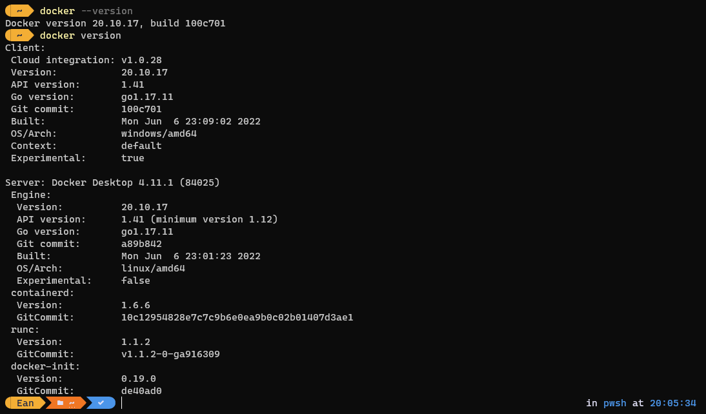
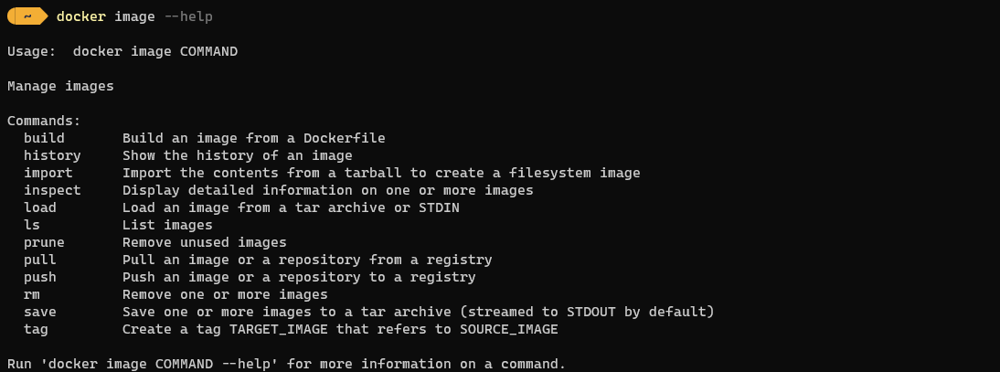
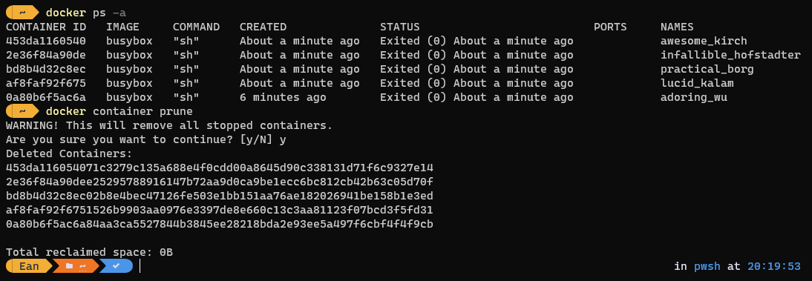

> [2019 iT 邦幫忙鐵人賽](https://ithelp.ithome.com.tw/users/20107551/ironman/1906)文章補完計劃，[從零開始建立自動化發佈的流水線]() Container 篇

在上一篇 [部署新境界 - 使用 Container 簡化流程]() 中，初步了解 Virtual Machine 與 Container 的差異、Docker 的歷史背景與安裝方式。

接下來，讓我們來進一步了解 Docker 相關的指令與操作方式。

<!--more-->

## Docker command

```chat
Eric:
  Docker 成功安裝後，我們試著對 docker 的進行一些基本操作。
```

若需確認機器上運行的 Docker 版本，可以使用以下指令來進行查詢。

``` docker
docker --version

# 取回的資料較為詳細
docker version
```

  

### Image

在建立運行服務的 Container 時，一定要指定使用的 Image。Docker 才有辦法建立基於 Image 的 Container。所以說 Image 是 Docker 的核心，也不為過。

可以使用 `docker image --help` 查詢所有與 Image 相關的操作。

  

雖然操作 Image 的指令很多，但最常用的指令有四種。

``` bash
# 取得本地當下存放的 Image
# 可以檢視到 Image 的名稱、建立時間與大小
docker image ls

# 從 remote repository 下載 image，若沒有指定 Tag，預設會下載 latest
# 預設位置為 Docker Hub，可找到許多現成的 Image。
docker pull NAME:[Tag]

# 執行 Image，建立 Container
docker run NAME:[Tag]

# 移除 image
docker image rm IMAGE
docker rmi IMAGE
```

接著來實際操作指令，進行 Image 的 查詢、下載、移除等動作。


``` docker
# create/build image
docker image build [dockerfile path]
```

當發現沒有適合的 Image 時，也可以自行建立 Image。建立 Image 時，Docker 會依據 YAML 格式所撰寫的 Dockerfile 內參數設定，來建立 Image。在 [dockerfile](#建立-docker-image) 會進一步介紹。

### Container

常用的 Container 指令如下

``` bash
# 查看目前的 container 清單
docker ps
docker container ls

# 啟動已停止的 Container
docker start [CONTAINER ID]
docker container start [CONTAINER ID]

# 停止執行中的 Container
docker start [CONTAINER ID]
docker container start [CONTAINER ID]
```

先前，已經從 Docker Hub 取得 busybox 的 image，接著，我們使用 `docker run busybox` 的方式，告知 Docker Engine ，以 busybox Image 啟動 container。

  

在啟動 container 後，可以使用下述的指令，進行確認 container 目前的狀態。

``` bash
# 查看目前的 container 清單
# 作法一
docker container ls
# 作法二
docker ps
```

但是，執行上述的指令取得的結果，會發現查不到任何資料，找不到與 busybox 相關的 container。

這是因為 busybox 在完成動作後，就會直接結束。而 `docker ps` 只會列出執行中的 container。所以必需在加上 `-a` 的參數，要求列出所有的 Container。


``` bash
# 啟動已停止的 Container
# 作法一
docker start [CONTAINER ID]
# 作法二
docker container start [CONTAINER ID]
```

假若要執行的 container 己經存在，可以運用 `start` 來啟動己經停止的 container。在下圖可以發現的狀態有所變動。

  

若看到己經執行完成的 container 一直存在清單之中，覺得怪不舒服。可以用 `docker conatiner prune` 將一口氣已停止的 container 刪除。

下這個指令，請**務必、務必、務必確認已停止的 Container 沒有需要保留，不然清除後可是救不回來的。**

``` docker
# remove stopped container
docker conatiner prune
```

  

相同的，如果要一口氣移除無用的 container、Volume、Network，則可以使用 `docker system prune`。

``` powershell
# remove unused data
docker system prune
```

## 建立 Docker Image

```chat
Eric:
  現在對 docker 的基本操作，有一定的了解了。但這樣還不能滿足我們的需求。

吉米:
  那接下來的重點，就是把公司現在的服務轉成 Docker Image，這樣才能利用 Docker 所提供的服務。

Eric:
  沒錯，接著來聊聊建立 docker image 的方法，以及 dockerfile 的設定。
```

### Dokcerfile 格式

Docker 在建立 image 時，會依據 `dockerfile` 的內容來進行建製的。而 `dockerfile` 就是 YAML 格式撰寫的指令檔。其中記錄使用者在編譯 docker image 時，所有的 **命令列 (Command-Line)**。

筆者個人認為，dockerfile 最重要的 `FORM`、`COPY`、`RUN`、`CMD` 正好對應 docker image 從建立到執行的四階段。

#### 初始設定

- `FROM` 指定 docker image 建立時，使用的底層 (Base Image)。**

  ```dockerfile
  FROM <image> [AS <name>]
  ```

- ~~`MAINTAINER` 維護者的相關資訊。~~ (官方己經棄用，建議使用 `LABLE`)

- `LABLE`

  The `LABEL` instruction adds metadata to an image. A `LABEL` is a key-value pair.
  
  To include spaces within a `LABEL` value, use quotes and backslashes as you would in command-line parsing.

- `ENV`

  `ENV` 使用 key-value 的結構，來設定 Container 所使用的環境變數。
  
  This value will be in the environment for all subsequent instructions in the build stage and can be [replaced inline](https://docs.docker.com/engine/reference/builder/#environment-replacement) in many as well.

#### 配置

- 程式的配置
  - `COPY` 複制檔案或資料夾到 container 的檔案系統內。

    ```dockerfile
    FROM <image> [AS <name>]
    ```

  - `ADD` 除了 `copy` 的功能外，額外支援 URL 的資料來源。

- 環境的配置

  - `EXPECT`

    指定 container 在執行時，所開放使用 TCP 或 UDP 的 PORT。若沒有特別指定 TCP/UDP 的話，預設使用 TCP。

    但是，`EXPECT` 實際上並非真的公開端口。它更像是 執行 container 時，與 Image 內部的溝通窗口。

    所以，在執行 container 時，要使用公開端口，記得要加上 `-p` 的參數。

    ``` docker
    # 網路 port=80 對應到 container port=80
    docker run -p 80:80/tcp
    ```

  - `VOLUMN`

    The `VOLUME` instruction creates a mount point with the specified name and marks it as holding externally mounted volumes from native host or other containers.

#### 建立 Image Layer

- `RUN` builds your application with `make`.

  RUN 指令，將會基於目前的映像檔上，執行命令，並產生新的映像檔，以提供 Dockerfile 中的下一步使用。  

  ```dockerfile
  # 1. shell 型式
  RUN <command> 
  
  # exec 型式
  RUN ["executable", "param1", "param2"]
  ```

#### 啟動 container

- `CMD` specifies what command to run within the container.

  ``` dockerfile
  # CMD 有三種操作的方式
  
  # exec 型式 (建議優先選取此方式)
  CMD ["executable","param1","param2"] 
  
  # 將預設參數傳給 ENTRYPOINT
  CMD ["param1","param2"]
  
  # shell 形式
  CMD command param1 param2
  ```

- `ENTRYPOINT`

  An `ENTRYPOINT` allows you to configure a container that will run as an executable.

  ```dockerfile
  # ENTRYPOINT 有兩種方式
  
  # exec 型式 (建議優先選取此方式)
  ENTRYPOINT ["executable", "param1", "param2"] (exec form, preferred)

  # shell 形式
  ENTRYPOINT command param1 param2 (shell form)
  ```

When you run an image and generate a container, you add a new *writable layer* (the “container layer”) on top of the underlying layers. All changes made to the running container, such as writing new files, modifying existing files, and deleting files, are written to this thin writable container layer.

### .dockerignore

Before the docker CLI sends the context to the docker daemon, it looks for a file named `.dockerignore` in the root directory of the context. If this file exists, the CLI modifies the context to exclude files and directories that match patterns in it. This helps to avoid unnecessarily sending large or sensitive files and directories to the daemon and potentially adding them to images using `ADD` or `COPY`.

The CLI interprets the `.dockerignore` file as a newline-separated list of patterns similar to the file globs of Unix shells. For the purposes of matching, the root of the context is considered to be both the working and the root directory. For example, the patterns `/foo/bar` and `foo/bar` both exclude a file or directory named `bar` in the `foo` subdirectory of `PATH` or in the root of the git repository located at `URL`. Neither excludes anything else.

If a line in `.dockerignore` file starts with `#` in column 1, then this line is considered as a comment and is ignored before interpreted by the CLI.

### 建立 Image 檔

``` docker
# build image
docker build [OPTIONS] PATH | URL
```

## Docker Compose

```chat
Eric:
  dockerfile 會隨著使用環境的複雜程度，而有所變動。好好的使用，就的達到想要的效果

吉米:
  嗯嗯，使用 docker 來啟動 container 的部份，大致上沒問題了。
  但是如果需要一次啟動多個 container 的話，也有類似批次檔的做法嗎？

Eric:
  有噢，這就是接下來要聊的部份。
  針對需要同時啟動多個 Container 的情境，可以使用 docker compose 可以解決這個需求。
  利用 docker-compose.yml 內的設定，在啟用多個 Container 的同時，也一併完成 Container 之間的關連設定。
  以達到快速佈置的目的。

吉米:
  那還等什麼，我們開始吧。
```

`docker-compose` 是一個用來定義與執行多個 container 的輔助工具。

當使用 `docker-compose up` 這個指令，它會去依循 compose file 內的定義，依序啟動多個 container，以及建立它們之間的關連。compose file 預設名稱為 `docker-compose.yml` 。

使用 docker-compose ，基本上分為三個步驟

- 使用 `dockerfile` 定義應用程式的環境。
- 使用 `docker-compose.yml` 內的定義，構成應用程式的服務 (service)。
- 執行 `docker-compose up`，啟動並運行整個應用程式。

在 docker-compose 中，以 **服務(service)** 稱呼使用 compose file 產生出來的物件。

所以執行 `docker-compose --help` 時，會看到許多指令的說明，都是以 service 稱呼。


### docker-compose.yml 範例

```yaml
# docker-compose.yml
version: '3'
services:
  web:
    build: .
    ports:
    - "5000:5000"
    volumes:
    - .:/code
    - logvolume01:/var/log
    links:
    - redis
  redis:
    image: redis
volumes:
  logvolume01: {}
```

從這個範例中，可以看到 **docker-compose.yml 的內容，是以 [YAML]() 格式撰寫。** 包含 compose file 格式的版本、服務內的 container 設定，以及執行環境的設制。

關於 compose file 內的指令語法，還有許多未能說明的。真的有需求或興趣，可以直接到 Docker 的文件庫內查看。

``` chat
吉米:
  既然 docker compose 讓佈置變的這麼方便，那接來下，將它與 CI Server 結合在一起吧。

Eric:
  這正是我們接下來的要進行的內容。

吉米:
  好。
```

## 延伸閱讀

▶  Docker Command

 1. [全面易懂的Docker指令大全](https://legacy.gitbook.com/book/joshhu/dockercommands/details)
 2. [Docker —— 从入门到实践](https://legacy.gitbook.com/book/yeasy/docker_practice)
 3. [《Docker —— 從入門到實踐­》正體中文版 (gitbook.io)](https://philipzheng.gitbook.io/docker_practice/)

▶  Dockerfile

 1. [正確撰寫Dockerfile　製作最好用容器映像檔](https://www.netadmin.com.tw/article_content.aspx?sn=1710020002&jump=3)
 2. Docker Document, [Dockerfile reference](https://docs.docker.com/engine/reference/builder/)
 3. Docker Document, [Best practices for writing Dockerfiles](https://docs.docker.com/develop/develop-images/dockerfile_best-practices/)
 4. peihsinsu, [Docker學習筆記](https://legacy.gitbook.com/read/book/peihsinsu/docker-note-book)

▶ Docker Compose

 1. akira.ohio, [5. Using Docker Compose](https://www.penflip.com/akira.ohio/appcatalyst-hands-on-lab-en/blob/master/docker-compose.txt)
 2. Docker Document, [Overview of Docker Compose](https://docs.docker.com/compose/overview/)
 3. Docker Document, [Compose file version 3 reference](https://docs.docker.com/compose/compose-file/)
 4. TechBridge 技術共筆部落格, [Docker Compose 建置 Web service 起步走入門教學](https://blog.techbridge.cc/2018/09/07/docker-compose-tutorial-intro/)
