> [2019 iT 邦幫忙鐵人賽](https://ithelp.ithome.com.tw/users/20107551/ironman/1906)文章補完計劃，[從零開始建立自動化發佈的流水線]() 持續發佈篇

<!--more-->

# 16. CI 訊息通知 - Line

**`Eric`**: 既然提到 Line ，那接下來，我們來看一下要如何與 Line 串接。

**`吉米`**: 嗯嗯，是利用 Line Bot 的方式嗎？

**`Eric`**: 很接近。不過，我們這次先用 Line Notify 來進行通知。

## 01. LINE Notify

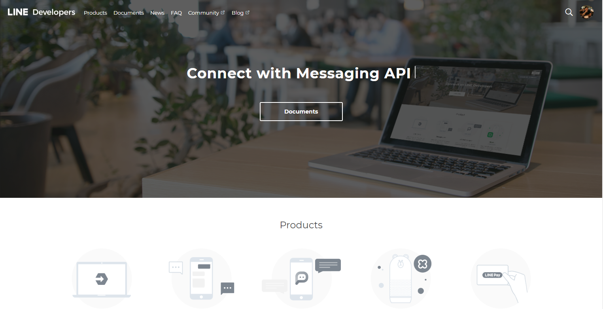

首先，必需先申請 Line Developer 帳戶。完成申請並登入後，因為是第一次登入，會看到要求建立 Provider。

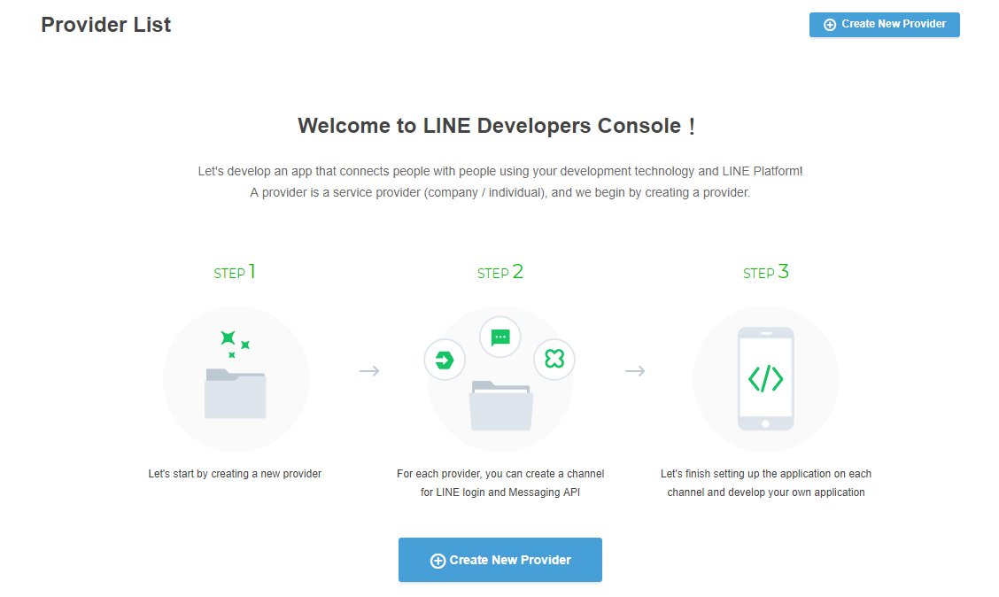

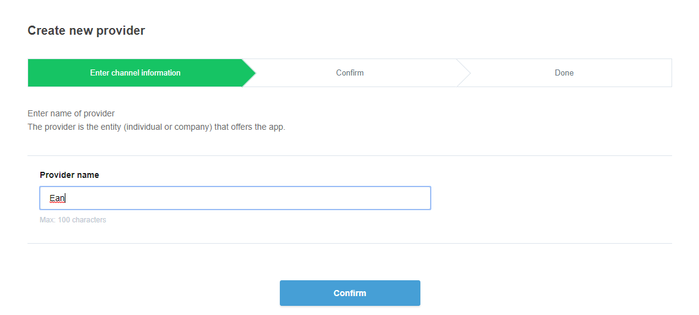

在完成 Provider 的建立後，接下來要建立 Channel。Channel 中，包含與 Line Server 互動的設定資訊。

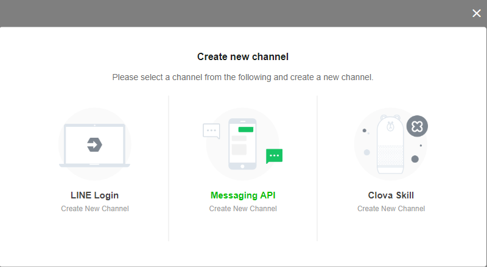

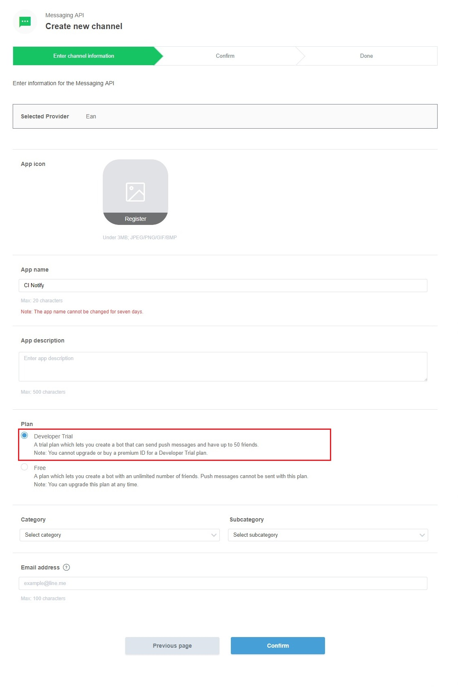

建立 Channel 時，有一件事要注意，Plan 的選項，需選擇 `Developer Trial` 這個項目。其他部份，只要依指示進行，就可順利完成建立動作。

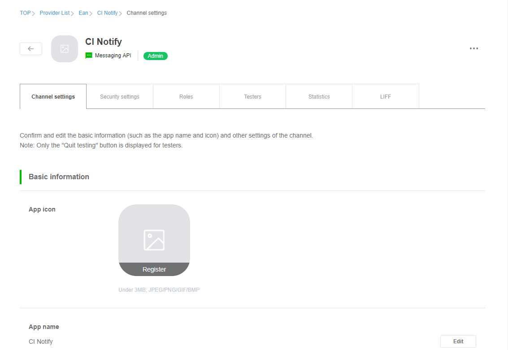

## 02. IFTTT

---

**`Eric`**: 完成的 Line Developer 與 IFTTTT 的串接後，接著，開始來串接 Travis CI、Azure Pipeline、Jenkins 吧。

**`吉米`**: 嗯嗯。

<<待續>>

## 延伸閱讀

1. [LINE Notify API Document](https://notify-bot.line.me/doc/en/)
2. [the DevOps journey - 在VSTS CI(Continuous Integration)中發送Line通知](http://studyhost.blogspot.com/2017/03/the-devops-journey-vsts-cicontinuous.html)
3. [IFTTT 發送 LINE 訊息通知](https://www.oxxostudio.tw/articles/201803/ifttt-line.html)

# 17. CI 訊息通知 - Line(中)

**`Eric`**: 因為我們是經過 IFTTT 去轉發訊息到 Line，所以在串接 CI Server 時，將從 IFTTT 取回的 webhook url 跟 CI server 進行綁定。但是這做，會發生一些情況。

**`吉米`**: 什麼情況？

**`Eric`**: 操作給你看，你就知道會發生什麼事了。

---

## 01.  Travis CI

在 Travis Ci 中，webhooks 的設定方式，跟設定 email 通知相同，直接到專案中的 .travis.yml 中增加指令即可。

```yaml
webhooks:
    urls:
      - https://maker.ifttt.com/trigger/CI_Build_result/with/key/den2SL6fXRgg4MJUsAj27w
    on_success: change # default: always
    on_failure: always # default: always
    on_start: change   # default: never
    on_cancel: always # default: always
    on_error: always # default: always
```

其中，`https://maker.ifttt.com/trigger/CI_Build_result/with/key/den2SL6fXRgg4MJUsAj27w` 這段 url 是筆者在IFTTT 建立 Applet 後，取回來的。

LINE Notify 雖然順利收到資料，但可以發現，重要的資料沒有顯示，均為空白。

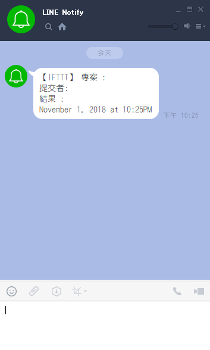

## 02. Azure DevOps

進入 Azure DevOps，進入專案後，先選擇 `Project settings` 後，再選取 `Service hooks`。

接著選擇 `Create subcription`，建立 webhooks 的串接。

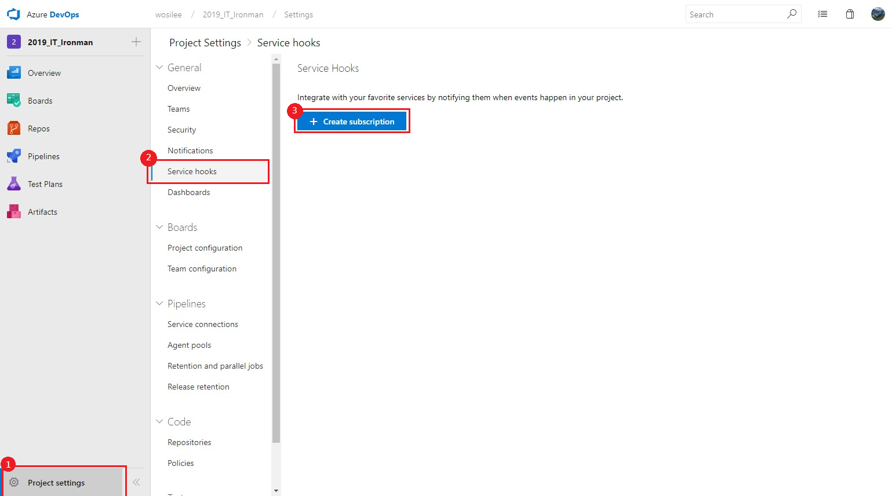

在建立新的 `service hooks` 時，可以看到左側有許多可以串接的服務。可惜 Line 不在其中，所以選擇 `Web Hooks` 這個項目。

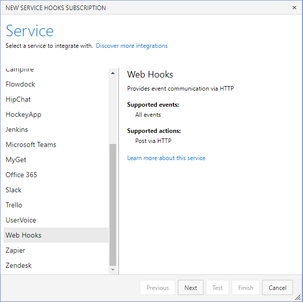

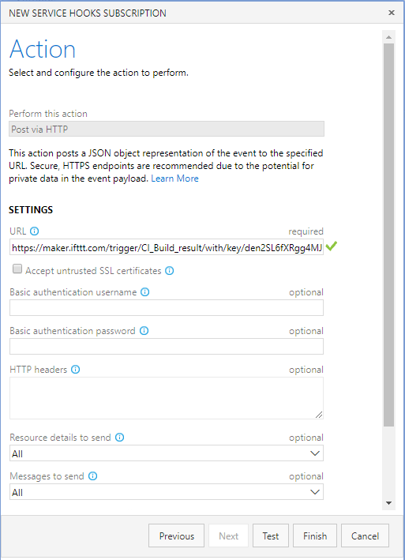

接下來，將從 ITFFF 取回的 webhook url 填入對應的位置。按下 `Test` 後，Line Notify 會立刻收到通知。

LINE Notify 雖然順利收到資料，但可以發現，重要的資料沒有顯示，均為空白。

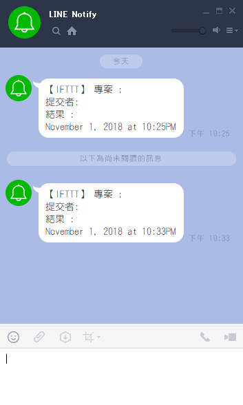

## 03. Jekins

---
**`吉米`**: Line Notify 收到的訊息，全部都沒有內容耶。

**`Eric`**: 對啊，所以的要建立轉發用的 Web API ，做為 CI server 與 IFTTT 的中繼站。也因為 IFTTT 只吃特定的格式，所以在 Web API 之中，也要進行資料的對應。。

**`吉米`**: 嗯嗯。

<<待續>>

## 延伸閱讀

1. Microsoft Doc, [Web Hooks](https://docs.microsoft.com/en-us/azure/devops/service-hooks/services/webhooks?view=vsts)

# 18. CI 訊息通知 - Line(下)

**`Eric`**: 不管是 Azure DevOps、Travis CI 還是 Jenkins ，這些 CI Server 經由 webhooks 回傳的資訊，ITFFF 都無法直接去識別。所以要實作一個 webapi 來做為中繼轉換。

**`吉米`**: 所以要再次利用 Azure ，來建立 web api 嗎？

**`Eric`**: 沒錯，讓我們開始動作吧！

---

## 01. Web Api

建立一個 web API 的專案，筆者在這邊是選擇使用 `Asp.Net Core Web 應用程式` 的 `API`。

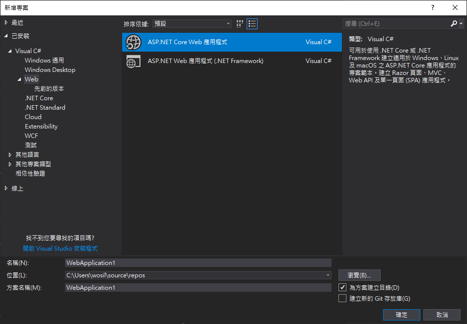

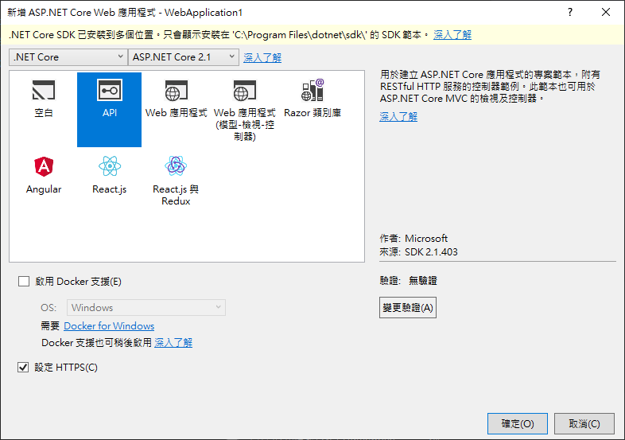

因為 IFTTT 接收的格式，只支援 value1、value2、value3 這個欄位名，所以建立一個 IFTTTModel 的類別。

```c#
public class IFTTTModel
{
    string value1 {set;get;}
    string value2 {set;get;}
    string value3 {set;get;}
}
```

接著，進行轉發的實作。實作中，使用 nuget 套件 `Restsharp` 進行 Post 訊息到 IFTTT。

記得將 RestClinet(`...`) 內的 `...` 指定到 IFTTT 的 webhook url。

```c#
public void Post([FromBody] string value)
{
    RestClient client = new RestClient("https://maker.ifttt.com/trigger/CI_Build_result/with/key/den2SL6fXRgg4MJUsAj27w");
    RestRequest request = new RestRequest(Method.POST);
    request.AddHeader("Content-Type", "application/json");

    ITFFFModel model = new ITFFFModel {value1 = "VS", value2 = "Ean", value3 = value};
   var json = JsonConvert.SerializeObject(model);
   request.AddParameter("Image", json, ParameterType.RequestBody);

   var response = client.Execute(request);
}
```

要注意的是，上面的程式，只是基本框架，還不能滿足我們的需求。使用 `PostMan` 進行測試，會看到下面的訊息。

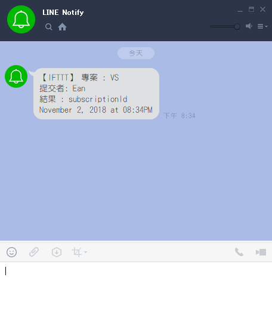

## 02. Azure App service

接著，將剛剛完成的 web api 發佈到 Azure App Service 。在建立發佈的設定時，選擇 Azure App Service。

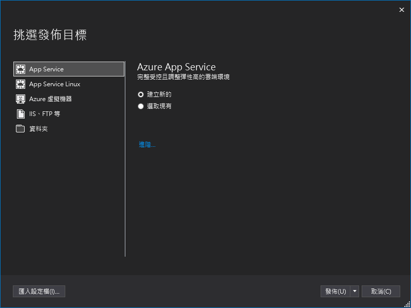

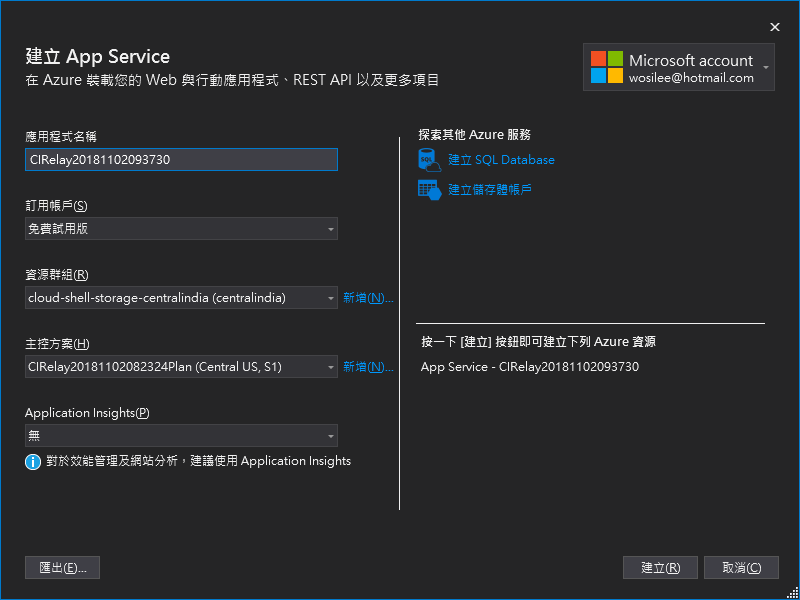

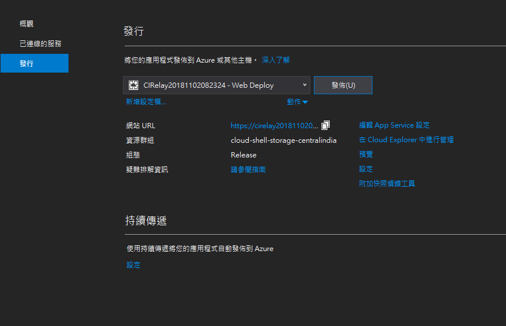

因為是第一次建立，筆者選擇使用預設值。完成建立後，可以看到`網站 URL` 這個資料，這等等會用到。

## 03.  Travis CI

針對 Travis CI 的部份，我們在 Web API 中，加入一個 `travis` 的 Controller。並把上面 程式碼復制到 travisController 之中。

```C#
[Route("api/[controller]")]
public class travisController : Controller
{
    [HttpPost]
    public void Post([FromBody] string value)
    {
        RestClient client = new RestClient("https://maker.ifttt.com/trigger/CI_Build_result/with/key/den2SL6fXRgg4MJUsAj27w");
        RestRequest request = new RestRequest(Method.POST);
        request.AddHeader("Content-Type", "application/json");

        ITFFFModel model = new ITFFFModel {value1 = "VS", value2 = "Ean", value3 = value};
        var json = JsonConvert.SerializeObject(model);
        request.AddParameter("Image", json, ParameterType.RequestBody);
        var response = client.Execute(request);
    }
}    
```

在發佈程式到 Azure 後，接著，我們到 Github repository，將 .travis.yml 中 webhooks 的 url 改為 `{網站URL}/api/travis` 即可。

```yaml
webhooks:
    urls:
      - https://cirelay20181102082324.azurewebsites.net/api/travis
      
    on_success: change # default: always
    on_failure: always # default: always
    on_start: change   # default: never
    on_cancel: always # default: always
    on_error: always # default: always
```

接著，要針對 Travis CI 傳過來資料進行解析，並將資料放入 IFTTTModel 之中，才能正確的傳送資料到 Line 之中。

## 04. Azure DevOps

針對 Travis CI 的部份，我們在 Web API 中，加入一個 `AzurePipeline` 的 Controller。程式的寫法，請參考 Travis 的部份。

接著到 Azure DevOps 的 `project settings` \ `Service hooks` 中，將 `Web Hooks` 中，URL 位置的內容，變成為  `{網站URL}/api/travis` 即可。

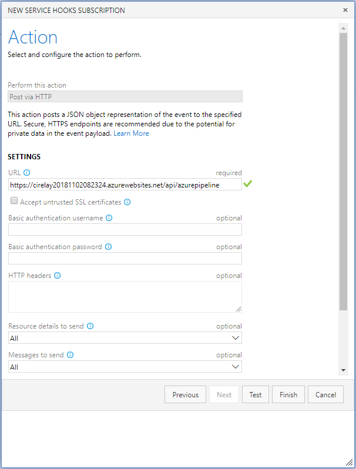

按下 `Test` 後，Line Notify 就會收到訊息了。但這時傳送的訊息也無法滿足我們的需求，所以要在 AzurePipeline 的 Post 內，進行資訊解析。才能正確傳送所需的訊息到 Line 。

## 05. Jekins

> 撰寫中

---
**`吉米`**: Line 的串接動作，跟 E-mail 相比，增加了不少的設定與動作。

**`Eric`**: 對啊，除了 Line 之後，接下來，我們來串接 Microsoft Teams 這個溝通平台吧。

**`吉米`**: 嗯嗯。

<<待續>>

## 延伸閱讀

1. [在 Azure 中建立 ASP.NET Core Web 應用程式](https://docs.microsoft.com/zh-tw/azure/app-service/app-service-web-get-started-dotnet)
