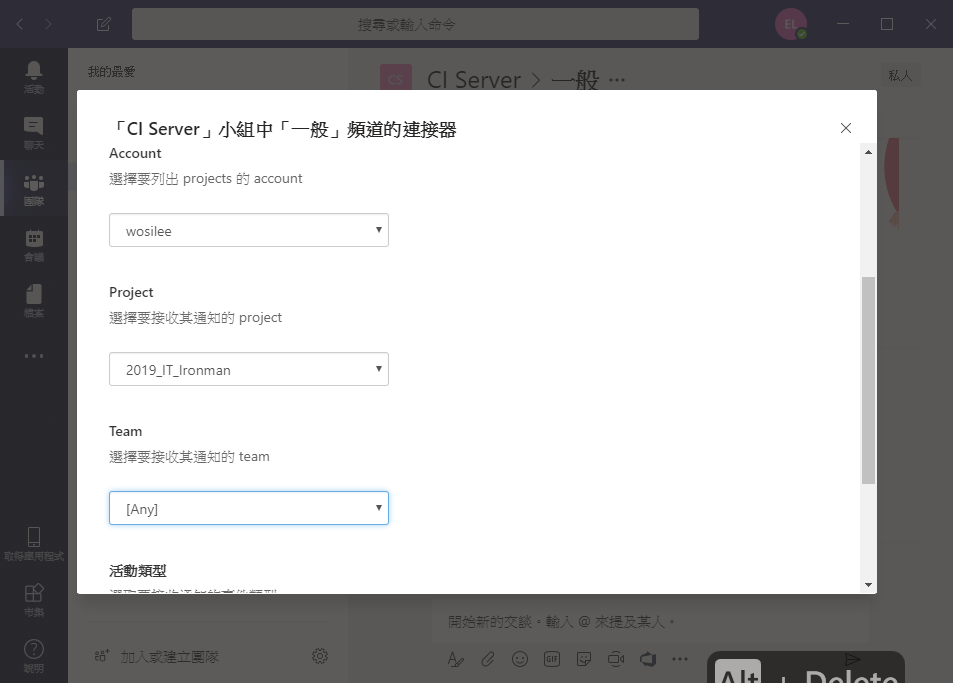

> [2019 iT 邦幫忙鐵人賽](https://ithelp.ithome.com.tw/users/20107551/ironman/1906)文章補完計劃，[從零開始建立自動化發佈的流水線]() 訊息通知篇

<!--more-->

## 使用 E-mail 通知

```chat
Eric:  前面我們己經將 CI server 建立起來了，也成功將 Repository 與 CI Server 流程整合，但還有最重要的一件事沒還沒有做。

吉米: CI Server 回饋的訊息通知嗎？因為好像只有架構 Travis CI 時，會把整合的訊息寄到信箱，而 Jenkins、Azure Pipeline 好像都沒有回饋訊息。

Eric: 沒錯，**持續而即時的訊息回饋，才是 CI 最重要的地方**。要不然，假若持續整合失敗的原因，是因為三天前的提交造成的，那 CI Server 的作用就微弱。

吉米: 確實，如果可以在提交後，快速的得知整合結果，萬一出問題了，也能立即修正。

Eric: 所以接下來，來聊聊 CI Server 的訊息通知。
```

### Travis CI

Travis CI 在設定 E-mail 通知的步驟非常容易，只要到 Repository 中的 `.travis.yml` 內，增加以下的內容。

Travis CI 就會依設定，進行訊息的通知。

```yaml
# .travis.yml

notifications:
  email:
    recipients:
      # 被通知人的 E-mail
      - one@example.com
      - other@example.com
    # 通知的時機點
    on_success: never # default: change
    on_failure: always # default: always
```

### Azure DevOps

Azure DevOps 的通知設定，比 Travis CI 複雜一點，但也是很容易。


首先選擇帳戶選單中的 `Notification Setting`，就可以看到所有通知的設定像是 Build、Code ……。


接著，選擇 `New subscription` ，建立通知的事件。


在 Azure DevOps 的 New subscription 中，己經有一些現成的樣版，提供選擇。


如果樣版不能足夠需求，也可以再進一步，增加修改的設定內容。

```chat
吉米: Email 的通知方式是不錯。不過，以我而言，不會一直注意 Email，有更方便的通知方式嗎？例如 LINE 之類的。

Eric: OK，那接下來，我們就來聊用 LINE 來進行通知。
```

## 使用 Microsoft Teams 即時通知

```chat
吉米: Line 的設定真的有點麻煩。

Eric: 剛好前一陣子，Microsoft 推出的免費版的 Teams ，我們也可以試試看。
```

Microsoft Teams是 Mircosfot 所推出的的團隊合作平台，讓使用者以線上溝通的方式，進行相互之間的溝通與協作。從 2018 年 7 月後，提供免費版本讓大眾使用。

免費版本最多可讓300人以下規模團隊使用，並且不限制交談內容搜尋功能。但要使用會議錄制、網頁版 Office 等進階功能，則需付費。

有人會說，線上溝通用現有的通訊軟軟體即可。以 LINE 為例，需要存取超過 7 日以上的檔案時，因為 LINE 只保留檔案 7 日的限制。只能再麻煩對方重傳一次檔案。

目前跟 Teams 功能相似的有 Slack、HiChart 等軟體或平台。主要差異在於這些平台，跟其他網路服務商的整合量有多少。

在 Teams 的使用上，除了基本的 **一對一** 與 **群組** 聊天外，也包含 **檔案共同存取與修改**。筆者個人覺得最重要的功能，在於 Teams 提供的 Connector 。

Connector 讓現有的網路服務可以方便快速的串接起來，如 Trello、Jenkins、JIRA 等服務。當服務與 Teams 串接起來後，可以不用離開 Teams ，第一時間知道其他服務的最新訊息。


### Travis CI 的


首先，從頻道中的後的 `...` 進入 `連接器`。


可以看到，連接器中，己經提供許多的選項讓我們選取。Microsoft 針對 `Travis CI` ，己經提供現成的項目。


接著只要依指示，就可以取回一組 `Webhook` url ，接著到 GitHub repository 的 .travis.yml 中，加入 teams 給的 webhook ，就完成串接的動作。

### Azure DevOps

關於 Azure DevOps，Microsoft 向來對自家產品的有著高度的整合。

直接到 Teams 的 Connector 中，選擇 `Azure Devops` 。


接下來， 會要求登入 Microsoft Account。這時，直接使用 Azure DevOps 的帳戶登入。


完成登入與授權後，就直接在 Teams 內進行 Azure DevOps 內的 通知設定。



在完成設定後。這時，如果到 Azure DevOps 的 `Project settings`\ `Service hooks` 中，可以看到剛剛經由 Teams 設定的資料。


之後，只要有新的變動提交 Azure Repos 後，Azure DevOps 會將 Azure Pipelines 建置結果，經由 Teams 通知。


```chat
吉米: Teams 與 CI Server 的串接，比 Line 輕鬆很多耶。

Eric: 從 Mircosoft 將自己定位為服務商後，對各家廠商的整合是越來越友善了。

吉米: 嗯嗯，尤其是 Teams 與 Azure DevOps 串接的容易程度，讓我想到之前 GitHub 與 Travis CI 設定的時候。

Eric: 接下來，我們往 CI/CD 的下一步走下去。
```

## 參考資料

▶

1. [Configuring Build Notifications](https://docs.travis-ci.com/user/notifications)
2. [Manage notifications for a team](https://docs.microsoft.com/en-us/azure/devops/notifications/howto-manage-team-notifications?view=vsts&viewFallbackFrom=tfs-2015&tabs=new-nav)

▶ Teams

1. [Microsoft Teams](https://products.office.com/zh-tw/microsoft-teams/free)
2. [[我們是怎麼用 Microsoft Teams 的？以 USPACE 為例](https://demo.tc/post/847)
3. [[Microsoft Teams]使用 Webhook 傳訊息到 Teams 頻道](https://dotblogs.com.tw/lapland/2017/04/13/145208)
