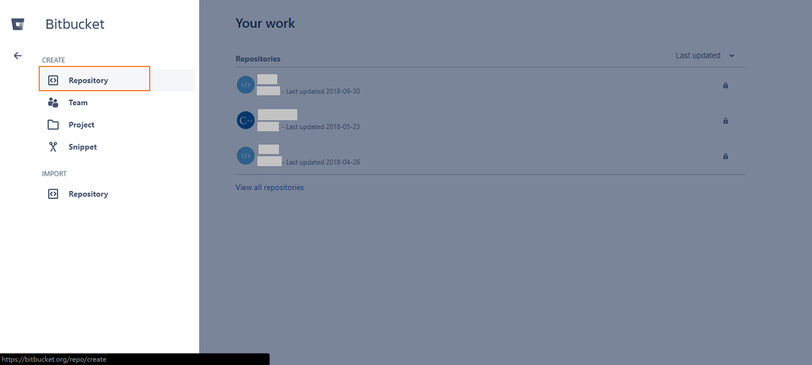
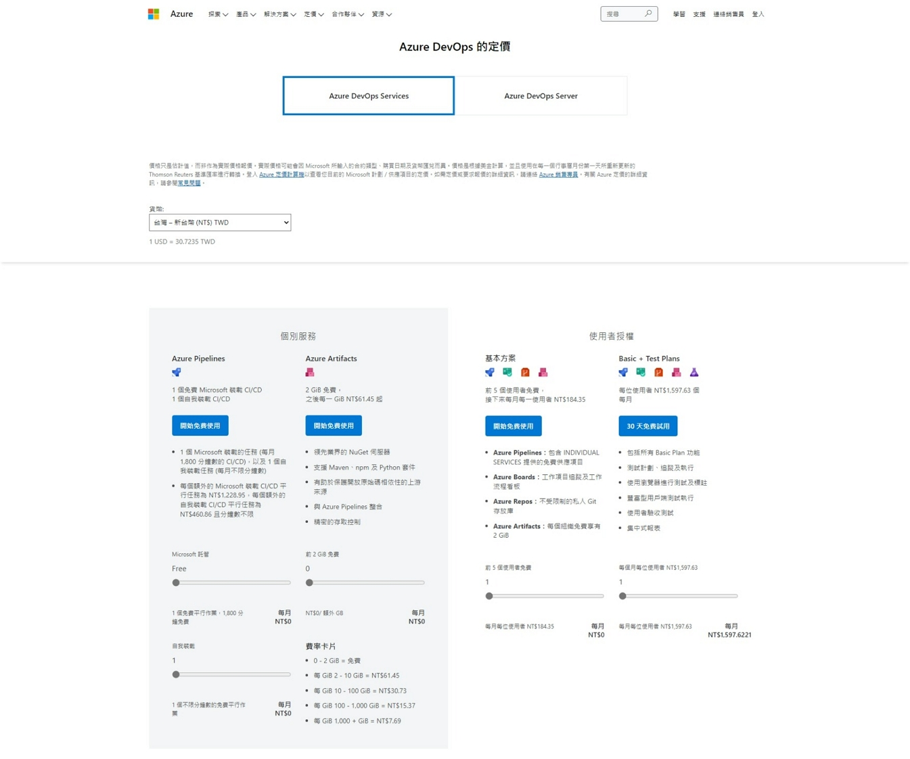
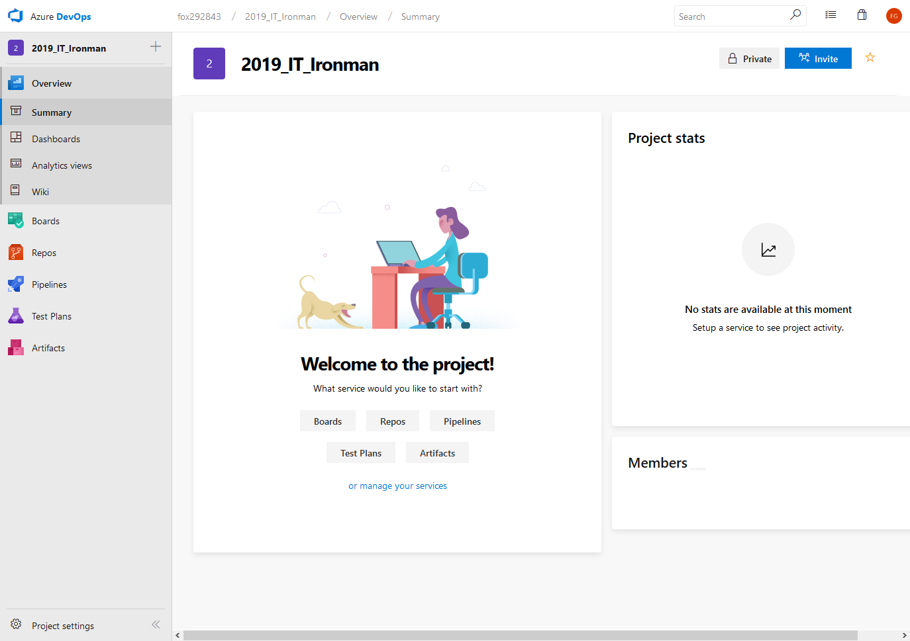

> [2019 iT 邦幫忙鐵人賽](https://ithelp.ithome.com.tw/users/20107551/ironman/1906)文章補完計劃，[從零開始建立自動化發佈的流水線]() 持續整合篇

<!--more-->

## 程式碼托管平台

### GitHub

```chat
Eric:
  通常，我們習慣將提供 Remote Repository 服務的平台，稱為程式碼托管平台。而提到托管平台，就不得不提到 GitHub。
  GitHub 是目前最大的 open source 的集散地。就連 Microsoft 都將部份產品的程式碼儲存在這。提供給社群內的人們有參與專案的機會。

吉米:
  GitHub 有聽過，但沒有真正的去了解它。

Eric:
  一進到 GitHub 的首頁，它就明白的說明，GitHub 是提供給開發人員的用的平台。不管是要用於 Open Source 或是商業用途，都可以好好的運用它。

吉米:
  真是大氣的宣言啊。

Eric:
  我們直接進到 GitHub 的首頁，就會看到它的宣言了。
```

> 📝 資訊補充 📝
>
> 2023 年的 [GitHub](https://github.com/) 首頁的宣言已更換，GitHub 將自己定位為安全的協作平台。


```chat
Eric:
  因為 GitHub 的申請相當容易，這部份就不過於著墨。

吉米:
  好噢。

Eric:
  那就直接切入主題，如何建立所需要的 Remote Repository 。
```

登入帳號後，直接到右上角選取 `New repository` ，就會進入建立 repository 的設定頁面了。


其實，只要設定 `Repository name` 並檢查無相同名稱後，就可以直接按下 `Create repository` 進行建立。完成後，頁面會貼心的提示，本地端的 repository 要如何與 GitHub repository 建立起關連。

預設 Repository 為公開對外，若不想被無關的人檢視內容，記得切換為私有。

也可以選擇額外的設定，讓 GitHub 自行建立 `Readme.md`、`.gitgnore` 與 `license`。

> 📝 資訊補充 📝
>
> 在 2019 年，GitHub 宣佈提供 private repositories 給免費用戶，但 private repositoryes 仍有共用限制，毎個 private repository 最多三位共同開發者使用。

~~但要特別提到一點就是，雖然 GitHub 提供免費的 Repository 空間，但是必需將該專案設為**公開(public)**。~~

~~假若希望將專案設為 **私有(private)** ，避免被不相關的人檢視內容。在網頁中，也清楚的說明，每個月支付 7 美元，提升帳戶的級層，就可以無限制的使用 **private repositories**。~~


### BitBucket

```chat
Eric:
  前面我們提到了 GitHub，接下來再來聊聊另一個程式碼托管平台 BitBucket。
```

> 📝 資訊補充 📝
>
> 雖然 2023 年的 [BitBucket](https://bitbucket.org/) 首頁的宣言已更換，本質上沒有太大的改變，只是更加強調 BitBucket 是 Atlassian's Open DevOps 解決方案的一員。


```chat
Eric:
  先前有提到 GitHub 如果要使用 private repository，就必需付費升級帳戶。
  雖然 BitBucket 與 GitHub 相同，也有免費與付費的兩種方案。不過，免費帳戶開放 private repository 提供使用，但限制 Repository 最多可支援到 5 名用戶。

吉米:
  這可真是佛心！

Eric:
  此外，BitBucket 的公司 Atlassian，有許多好用的產品，例如追蹤應用程式問題的 JIRA、Git Client 的 SourceTree、團隊協作的 Confluence，BitBucket 都可以整合使用。

吉米:
  原來如此，以後有機會，也可以來研究一下 JIRA 與 Conflunence。
```

略過註冊的部份，直接來看看 repository 的設定畫面。



當按下 `Create` ，並選取 `Respository` 後，會看到設定 repository 的設定畫面。


跟 GitHub 相同，只要輸入 **`Repository name`** 就可以創立一個新的 repository。

與 GitHub 不同，BitBucket 預設 repository 的存取層級就是私有的。如果要公開的話，記得將 **`Access level`** 的勾選取消。

此外，BitBucket 同時兩種分散式版本控制系統 Git 與 Mercurial，如果沒有需求，直接使用預設值 Git 即可。


建立 repository 完成後，BitBucket 一樣會貼心的提示您，如何將本地端的 repository 與 BitBucket repository 建立起關連。

左側的功能列上，也可以選擇看 **Commits**、**Branches** 的相關記錄。**Pipelines**、**Deployments** 這兩個功能與 CI/CD 相關。

若需要調整 repository 的設定，都可以從 **Setting** 進行設定的變更。


### Azure Repositories of Azure DevOps

```chat
Eric:
  說完了 GitHub、BitBucket ，最後，來了解一下 Microsoft 所推出的 Azure DevOps。

吉米:
  Azure DevOps？

Eric:
  Azure DevOps 的前身是 Visual Studio Team Services (VSTS)，為了因應 DevOps 的的趨勢，Microsoft 將原本單一的 VSTS 服務，依功能種類，打散成一系列的服務。

吉米:
  那 Azure DevOps 現在有那些功能呢？

Eric:
  像是工作管理的 Azure Boards 、私有 Git 儲存庫 Azure Repos、CI/CD 相關的 Azure Pipelines 等等。

```

> 📝 資訊補充 📝
>
> [Azure DevOps](https://azure.microsoft.com/en-us/services/devops/) 的 2023 年的收費方式與 2019 年撰寫文章時，已經完全不同。




```chat
Eric: Azure DevOps 也提供免費與付費的服務，若是使用免費帳戶配合 private repository 時，跟 BitBucket 相同，有著使用者人數的限制。
吉米: 就 Azure DevOps 服務的項目，小型小組的方案最適合我的需求。
Eric: 我們這次來聊聊 Azure Repos 。
```


Azure DevOps 與 GitHub、BitBucket 建立比較不同的地方，在於後兩者是直接建立 Repository，而;在 Azure DevOps 則是先建立專案項目。

在建立專案時，需要指定該專案是屬於 `公開` 或 `私有` ，這個決定 Azure DevOps 對專案的支援項目。



專案建立後，會在左側功能看到 Azure DevOps 提供的服務，像 **Boards**、**Repos**、**Pipeline**、**Test Plan**。

點開 **Repos** 後，會發現系統己經自行建立一個與專案名稱相同的 Repository。也一樣會貼心的提示您，如何將本地端的 repository 與 BitBucket repository 建立起關連。


如果需要額外進行 Repository 的新增、滙入與合併，可以直接點選頁面上方的 repository 項目，就會出現操作選單。


到這邊，接下來的 Git 設定方式，跟前面提到的方法是一樣的，不管是 **Git 指令** 或是 **Git Client GUI**。

## Git GUI 工具

```chat
吉米: Repository 的建立，真的簡單易懂。不過中間有看到 Pipelines、deployments 這兩個選項，是做什麼用的呢？

Eric: 這兩個選項是與 **持續整合**、**持續發佈** 相關的設定，以後有機會再來聊聊。還記得前面 GitHub 時，我們直接用 Git 指令來進行操作。

吉米: 記得啊，不過總覺得要一直打指令，有點麻煩。

Eric: 確實，有些經常性，又繁瑣的事情，其實可以用 Git client GUI 來協助版管。 但是使用這些 Git Client GUI 之前，一定要 **確實了解 Git 的指令，並清楚指令的意思與使用時機**。剛好提到 Atlassian 的 BitBucket ，那就用 Atlassian 的 SourceTree 這套 Git Client GUI 工具吧。
```

### Fork

### SourceTree

在某一次 SourceTree 的更版後，它在安裝過程中，會要求註冊帳戶。因為沒有自行設定 BitBucket Server ，所以選擇 **Atlassian account** 這個選項。

當註冊 BitBucket 的帳戶後，就等同己經建立 Atlassian 帳戶，所以直接輸入 BitBucket 帳戶即可。


另外，SourceTree 在安裝過程中，會自行詢問是否下載安裝 Git，這讓我們少了手動安裝 Git 的工夫。


本地端 repository


Remote repository 的指定


```chat
Eric: 吉米，除了前面介紹到的 GitHub、BitBucket、Azure DevOps 外，還有許多代管平台可以選擇。但不管是 **使用現有的程式碼托管平台** 或是 **自行架設版本控制系統伺服器**，還是要考量本身的需求，來選擇最佳的方案。
吉米: 自架 server 這個選項，就成本與實務上的考量，暫時是不可能的。我先分別試用這三個平台一陣子後，再決定要用那一個。 
Eric: 嗯嗯，這次跟你分享的這些資訊，你回去後，再好好的研究。如果還有什麼疑惑，也歡迎討論。
吉米: OK，今天真的是太謝謝你了。
```

## 參考資料

1. [Azure DevOps 的定價](https://azure.microsoft.com/zh-tw/pricing/details/devops/azure-devops-services/)
2. [微軟化整為零，發表 Azure DevOps 以取代 Visual Studio Team Services](https://www.ithome.com.tw/news/125788)
3. [開發者新年大福音！GitHub 宣布 private repositories 開放免費版用戶 - INSIDE](https://www.inside.com.tw/article/15236-github-open-free-users-to-get-unlimited-private-repositories)
