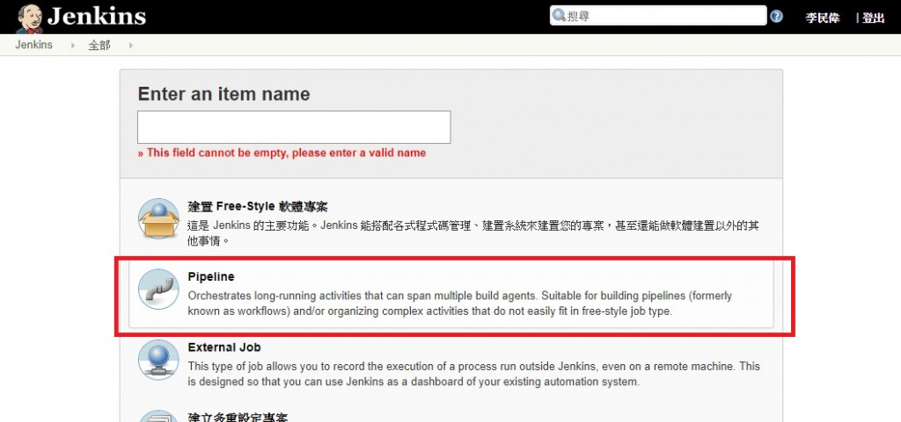

> [2019 iT 邦幫忙鐵人賽](https://ithelp.ithome.com.tw/users/20107551/ironman/1906)文章補完計劃，[從零開始建立自動化發佈的流水線]() Container 篇

在 [Docker 操作簡介]() 中，初步了解 Docker、dockerfile、docker-compose 的操作方法。

接下來，要與 CI Server 搭配使用，讓 CI Server 可以依據設定檔，使用 docker 的方式，建置出執行 CI 所需要的環境。

<!--more-->

## Travis CI

在 Travis CI [官方文件](https://docs.travis-ci.com/user/docker/)中，提到 5 種 docker 的建置方式，但筆者只針對 `dockerfile` 與 `docker-compose` 的部份介紹。若對其他方式有興趣，可以直接上 Travis CI 官網觀看。

不管是那邊方式，都必須先設定啟用 docker 的服務。所以增加以下的片段到 `.travis.yml` 。

```yaml
# .travis.yml

services:
  - docker
```

### dockerfile

```yaml
# .travis.yml

sudo: required

language: ruby

services:
  - docker

before_install:
  - docker build -t carlad/sinatra .
  - docker run -d -p 127.0.0.1:80:4567 carlad/sinatra /bin/sh -c "cd /root/sinatra; bundle exec foreman start;"
  - docker ps -a
  - docker run carlad/sinatra /bin/sh -c "cd /root/sinatra; bundle exec rake test"

script:
  - bundle exec rake test
```

### docker-compose

```yaml
# .trvis.yml

env:
  - DOCKER_COMPOSE_VERSION=1.4.2

before_install:
  - sudo rm /usr/local/bin/docker-compose
  - curl -L https://github.com/docker/compose/releases/download/${DOCKER_COMPOSE_VERSION}/docker-compose-`uname -s`-`uname -m` > docker-compose
  - chmod +x docker-compose
  - sudo mv docker-compose /usr/local/bin
```

## Azure DevOps

若希望  Azure Pipelines 可以程式建置為 docker 可使用的物式件，需對 `azure-pipelines.yml` 進行對應的變動。

### 使用 dockerfile

You can build a Docker image by running the `docker build` command in a script or by using the [**Docker task**](https://docs.microsoft.com/en-us/azure/devops/pipelines/tasks/build/docker?view=vsts).

```yaml
- script: docker build -t $(dockerId)/$(imageName) .  # add options to this command to meet your needs
```

Often you'll want to build and test your app before creating  the Docker image. You can orchestrate this process either in your build  pipeline or in your *Dockerfile*.

### Build and test in your build pipeline

In this approach, you use the build pipeline to orchestrate building  your code, running your tests, and creating an image. This approach is  useful if you want to:

- Leverage tasks (either built-in tasks or those you get from the  Marketplace) to define the pipeline used to build and test your app.
- Run tasks that require authentication via service connections (for example: authenticated NuGet or npm feeds).
- Publish test results.

To create an image, you run a `docker build` command at the end of your build pipeline. Your *Dockerfile* contains the instructions to copy the results of your build into the container.

The instructions in the [above example](https://docs.microsoft.com/en-us/azure/devops/pipelines/languages/docker?view=vsts&tabs=yaml#example) demonstrate this approach. The test results published in the example, can be viewed under [Tests Tab](https://docs.microsoft.com/en-us/azure/devops/pipelines/test/review-continuous-test-results-after-build?view=vsts) in build.

### Build and test in your Dockerfile

In this approach, you use your *Dockerfile* to build your code and run tests. The build pipeline has a single step to run `docker build`. The rest of the steps are orchestrated by the Docker build process. It's common to use a [multi-stage Docker build](https://docs.docker.com/develop/develop-images/multistage-build/) in this approach. The advantage of this approach is that your build process is entirely configured in your *Dockerfile*.  This means your build process is portable from the development machine  to any build system. One disadvantage is that you can't leverage Azure  Pipelines and TFS features such as tasks, jobs, or test reporting.

For an example on using this approach, follow these steps:

1. The sample repos that you used in the [example](https://docs.microsoft.com/en-us/azure/devops/pipelines/languages/docker?view=vsts&tabs=yaml#example) above also include a **Dockerfile.multistage** for this approach:

   - [Dockerfile.multistage in .NET Core sample](https://github.com/MicrosoftDocs/pipelines-dotnet-core/blob/master/docs/Dockerfile.multistage)

     ```yaml
     # First stage of multi-stage build
     FROM microsoft/aspnetcore-build:2.0 AS build-env
     WORKDIR /app
     
     # copy the contents of agent working directory on host to workdir in container
     COPY . ./
     
     # dotnet commands to build, test, and publish
     RUN dotnet restore
     RUN dotnet build -c Release
     RUN dotnet test dotnetcore-tests/dotnetcore-tests.csproj -c Release --logger "trx;LogFileName=testresults.trx"
     RUN dotnet publish -c Release -o out
     
     # Second stage - Build runtime image
     FROM microsoft/aspnetcore:2.0
     WORKDIR /app
     COPY --from=build-env /app/dotnetcore-sample/out .
     ENTRYPOINT ["dotnet", "dotnetcore-sample.dll"]
     ```

   Replace the content in the `Dockerfile` at the root of your repository with the content from `Dockerfile.multistage`.

1. Then, define your build pipeline:

```yaml
pool:
  vmImage: 'ubuntu-16.04'

steps:
  - script: docker build -t $(dockerId)/$(dockerImage) . # include other options to meet your needs
```

### 使用 docker-compose

Docker Compose enables you to bring up multiple containers and run tests. For example, you can use a *docker-compose.yml* file to define  two containers that need to work together to test your application: a  web service that contains your application and a test driver. You can build new container images every time you push a change to your  code. You can wait for the test driver to finish running tests before bringing  down the two containers.

If you use Microsoft-hosted agents, you don't have to run any additional steps to install and use docker-compose.

To extend the [above example](https://docs.microsoft.com/en-us/azure/devops/pipelines/languages/docker?view=vsts&tabs=yaml#example) to use docker-compose:

1. Your sample repo already includes a `docker-compose.yml` file in the `docs` folder.
2. Add a **Bash** step to your build pipeline:

```yaml
- script: |
    docker-compose -f docs/docker-compose.yml --project-directory . -p docs up -d
    docker wait docs_sut_1
    docker-compose -f docs/docker-compose.yml --project-directory . down
```

If you can't upgrade, another way to solve this problem is to explicitly create another test driver as a container within the composition, as we did in the example above. Another solution is to use `docker-compose exec` and target a specific container in the composition from your script.

## Jenkins

如果曾經使用 Jenkins 進行發佈，或許對 pipeline 並不陌生。

在 Pipeline 中，Jenkins 會依據 `jenkinsfile` 內容的指示執行各種動作。運用 Groovy 的格式來撰寫 `jenkinsfile` 讓使用者可以客制化建置的流程與環境。



經由 `jenkinsfile` 與 docker 的配合，我們可以自行訂定各 **階段 (stages)** ，使用不同 Docker Image 建置環境，執行不同的動作。而無需手動配置環境。

下面的範例，將會使用 Nodejs `7-alpine` 版本的 docker image 作為執行環境。並在`測試階段`，執行 node.js 的相關動作。

```groovy
Jenkinsfile (Declarative Pipeline)

pipeline {
    agent {
        docker { image 'node:7-alpine' }
    }
    stages {
        // 
        stage('Test') {
            steps {
                sh 'node --version'
            }
        }
    }
}
```

Pipeline 支援運用 `dockerfile`，進行 docker image 的建立與執行。

當我們將 `jenkinsfile` 中，**使用 `agent { dockerfile true }` ，Pipeline 就會使用 Repository 根目錄下的 `dockerfile` ，進行 docker image 的建立與執行。**

```groovy
pipeline {
    agent { dockerfile true }
    stages {
        stage('Test') {
            steps {
                sh 'node --version'
                sh 'svn --version'
            }
        }
    }
}
```

此外，也可以在 `agent` 內直接下 docker 指令。

```groovy
agent {
    docker {
        image 'myregistry.com/node'
        label 'my-defined-label'
        registryUrl 'https://myregistry.com/'
        registryCredentialsId 'myPredefinedCredentialsInJenkins'
    }
}
```

或是在 `agent` 內寫 `dockerfile` 的內容。

```groovy
agent {
    // Equivalent to "docker build -f Dockerfile.build --build-arg version=1.0.2 ./build/
    dockerfile {
        filename 'Dockerfile.build'
        dir 'build'
        label 'my-defined-label'
        additionalBuildArgs  '--build-arg version=1.0.2'
        args '-v /tmp:/tmp'
    }
}
```

關於 Pipeline 中，`agent` 部份的其他語法，如果有興趣，可以參考[官方文件](https://jenkins.io/doc/book/pipeline/syntax#agent)。

雖然 Jenkins 的官方文件中，沒有特別說明到 `docker-compose` 的部份。但筆者很幸運找到 Symfony 在 Jenkins 運用 docker-compose 的文章 ( [A continuous integration pipeline with Jenkins in Docker](https://www.nielsvandermolen.com/continuous-integration-jenkins-docker/) )。

下面，筆者擷取部份 `jenkinsfile` 的內文。

```groovy
pipeline {
    agent { label 'docker' }
    triggers {
        bitbucketPush()
    }
    environment {
        // Specify your environment variables.
        APP_VERSION = '1'
    }
    stages {
        stage('Build') {
            steps {
                // Print all the environment variables.
                sh 'printenv'
                sh 'echo $GIT_BRANCH'
                sh 'echo $GIT_COMMIT'
                echo 'Install non-dev composer packages and test a symfony cache clear'
                sh 'docker-compose -f build.yml up --exit-code-from fpm_build --remove-orphans fpm_build'
                echo 'Building the docker images with the current git commit'
                sh 'docker build -f Dockerfile-php-production -t registry.example.com/symfony_project_fpm:$GIT_COMMIT .'
                sh 'docker build -f Dockerfile-nginx -t registry.example.com/symfony_project_nginx:$GIT_COMMIT .'
                sh 'docker build -f Dockerfile-db -t registry.example.com/symfony_project_db:$GIT_COMMIT .'
            }
        }
    }
}
```

從範例中，可以看到 `docker-compose` 的使用點，是 **位於 `steps` 內，以 命令列 的方式執行**。不像 `dockerfile` ，Jenkins 有直接的支援。

筆者將其再次精減，可以很清楚的看到 `docker-compose` 的使用方式。

```groovy
pipeline {
    agent { label 'docker' }
    stages {
        steps {
            sh 'docker-compose -f build.yml up --exit-code-from fpm_build --remove-orphans fpm_build'
        }
    }
}
```

最後，該篇文章也分享它們執行 `jenkinsfile` 的畫面。

從圖中，真的可以發現 Symfony 活用 Jenkins Pipeline 功能，建立起 建置、測試、發佈 一連串自動化 CI/CD 流程。


(圖片來源:  [A continuous integration pipeline with Jenkins in Docker](https://www.nielsvandermolen.com/continuous-integration-jenkins-docker/))

```plan
吉米: 哇，每個 CI Server 的設定方式，設定的方式都不太相同。

Eric: 是啊。不過，再怎麼變化，都是離不開 cmd、dockerfile、yml 設定檔這三個部份。

吉米: 嗯嗯，還要多試幾次，才能把 docker 摸的比較了解。

Eric: 一起加油吧。

<< 完 >>
```

## 延伸閱讀

▶ Travis CI

- Travis CI Document, [Using Docker in Builds](https://docs.travis-ci.com/user/docker/)

▶ Azure Devops

- nielsvandermolen, [A continuous integration pipeline with Jenkins in Docker](https://www.nielsvandermolen.com/continuous-integration-jenkins-docker/)
- Miiro Juuso, [Building your first Docker image with Jenkins 2: Guide for developers](https://getintodevops.com/blog/building-your-first-docker-image-with-jenkins-2-guide-for-developers)
- Microsoft Document, [Docker 應用程式的外部迴圈 DevOps 工作流程中的步驟](https://docs.microsoft.com/zh-tw/dotnet/standard/containerized-lifecycle-architecture/docker-devops-workflow/docker-application-outer-loop-devops-workflow)
- Microsoft Document, [Build Docker apps with Azure Pipelines or Team Foundation Server](https://docs.microsoft.com/en-us/azure/devops/pipelines/languages/docker?view=vsts&tabs=yaml)
- Micorsoft Document, [Docker task](https://docs.microsoft.com/en-us/azure/devops/pipelines/tasks/build/docker?view=vsts)

▶ Jenkins

- Jenkins Document, [Using Docker with Pipeline](https://jenkins.io/doc/book/pipeline/docker/)
- Gustavo Apolinario, [Jenkins Building Docker Image and Sending to Registry](https://medium.com/@gustavo.guss/jenkins-building-docker-image-and-sending-to-registry-64b84ea45ee9)
- [持续集成之 Jenkins 通过 Deploy 插件热部署 java 程序(九)](http://blog.51cto.com/wzlinux/2166241)
- [A continuous integration pipeline with Jenkins in Docker](https://www.nielsvandermolen.com/continuous-integration-jenkins-docker/)
