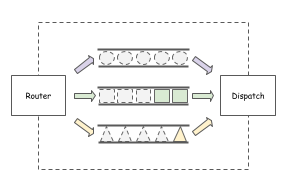
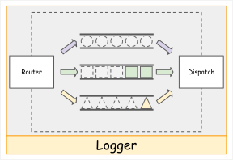
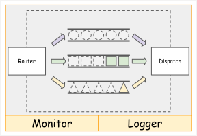
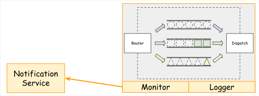
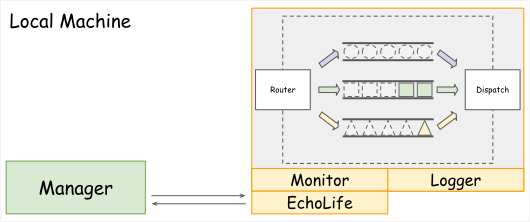
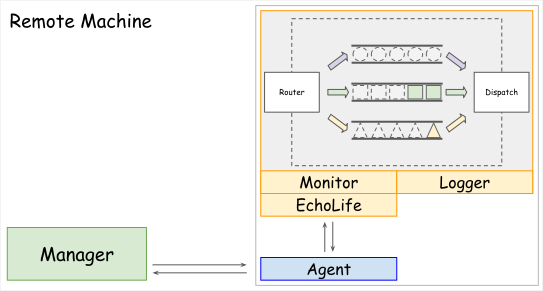
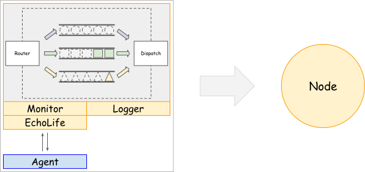
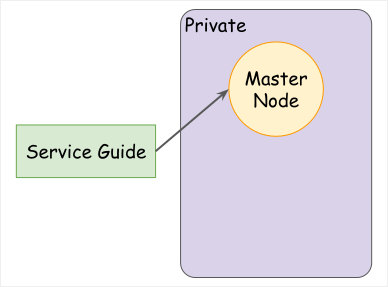
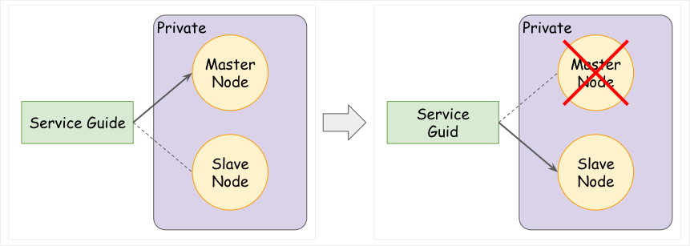

> [第 11 屆(2020) iThome 鐵人賽](https://ithelp.ithome.com.tw/users/20107551/ironman/2172)文章補完計劃，[從零開始土炮 MQ]() 基礎篇

<!--more-->

## 九、需求與框架規劃

在了解完成通訊協定後，接著，開始對 FloraMQ 提出一些要求。

* 可以記錄 log 資訊，以便觀察、分析使用情況與追逐問題。
* 可以定期回報系統的資訊，例如：己處理數量、等待中的數量…
* 當系統掛掉後，可自己重新啟動。
* 當系統掛掉後，可第一时間切換到備用系統，避免對使用系統的使用者，造成困擾。
* 可設定水位，當系統負擔大過特定水位時，主動發出通知。
* 可手動增加或減少系統的數量。

將上面的需求整理，可歸納為 `監控`、`軔性`、`延伸性`三個類型。

1. 監控：

   * 以記錄 log 資訊，以便觀察、分析使用情況與追逐問題。
   * 可以定期回報系統的資訊，例如：己處理數量、等待中的數量…
   * 可設定水位，當系統負擔大過特定水位時，主動發出通知。

2. 軔性：

   * 當系統異常終止後，可自己重新啟動。
   * 當系統掛掉後，可第一时間切換到備用系統，避免對使用系統的使用者，造成困擾。

3. 延伸性：

   * 可手動增加或減少系統的數量。

接著，試著改進系統的架構，逐一達成三個類型的需求。

### 9.1 監控

在前面，己經將 Router、Queue、Dispatch 的組合，視為一個個體。為了方便後面的描述，使用 Node 稱呼。

接著，試著修改架構，以符合需求的項目。

> 需求一：記錄 log 資訊，以便觀察、分析使用情況與追逐問題。

首先想到的作法，就是在 Node 外部，加一個 `Logger` ，負責處理 Log 的相關事務。

* Logger 只單純處理從 Router、Queue、Dispatch 內部傳回的資訊，無對外關係。

> 需求二：可以定期回報系統的資訊，例如：己處理數量、等待中的數量…

加入一個`Monitor` 元件，負責定期撈取 Node 內部的特定資訊。其回報方式，可以使用 Log 的方式，也可以通過不同的協定，將資料傳到外界。

> 需求三、可設定水位，當系統負擔大過特定水位時，主動發出通知。

設定水位，最直接的做法，當然利用 `Configuration` 的方式，進行水位的設定。再增加 `Monitor` 的功能，讓該模組可以發送訊息的外部的通知系統，例如：email、slack 等等。

### 9.2 軔性 Resilience

在前面監控的部份，作為單一系統使用，基本上是可行的。但，若要運用在實際環境，還是有些問題，需要解決。

因異常終止的原因，造成其他相依服務的異常，必然會造成使用者的困擾。所以必需 **確保系統在不管在何種情況下，都能持續提供服務**。這種特性，又稱為**不死性**、**復原力**或**軔性**。

> 需求四、當系統異常終止後，可自己重新啟動。

要達到這個目標，就需要額外建立一個服務，姑且先稱為 `Manager`。在 Node 中，增加一個 `EchoLift` 的元件，負責跟 `Manager` 的溝通。

`Manager` 這個服務本身的責任很單純，就是**週期性的固定詢問 Node 的狀態**。當 Node 無回應時，就必需進行處理，移除無反應的服務與重新啟動服務。

對本機而言，只要有權限，一個服務可以輕易控制其他服務。所以當 Node 發生異生，Manager 就可以直接刪除、建立 Node 的服務。

但對於兩支服務放置於不同主機的情形下，就沒有那麼容易。就需要再一個服務`Agent`來負責 Node 的移除與啟動。同时，它也可能作為 Node-EchoLift 與 Manager 的溝通橋樑。

可是這樣又延伸另一個問題，`Manager` 與 `Agent` 要如何得知道對方的位置？最簡易的方式，就是採用 `Configuration` 的方式，記錄對方的位置。

當儲存在 Manager 的 configuration 之中，表示 Manager 需要主動去訪查 Agent ，Node 數量少還可以，數量一多，維運時的管理就會變成一個負擔。

依筆者的想法，將 Manager 的連線位置記錄於 Agent 的 configuration 是比較好的作法，考量點如下：

* Manager 的角色，偏向管理，所以 Agent 啟動時，應主動跟 Manager 報備。
* Manager 放置主機的位置可能會變更，如果 Agent 指向的是一個 Domain Name，就可以在最小影響下，變更 Manager 的主機位置。

相關的作法有 Service Registory、Service Mash、Service Disvery ，這些後面會簡單提到。有興趣的人，可以看 Rick 大寫的 [聊聊分散式系統](https://rickhw.github.io/2018/06/18/Architecture/Gossip-in-Distributed-Systems/)。

> 需求五、當系統掛掉後，可第一时間切換到備用系統，避免對使用系統的使用者，造成困擾。

原先，直接對 Node 放入或取回資源，但若 Node 異常終止時，所有相依的服務都會發生異常。為了確保 Node 的服務可以持續服務，前面規劃利用 `Manager` 與 `Agent` 的組合，達到自動啟動的機制。

但是這樣還是無法滿足持續服務的目標。因為從**服務異常終止**到**重啟提供服務**這段空窗期，對其他相依服務而言，都會造成服務無法正確運行。

將 Node 視為一個單純的服務節點。

接著，將存取 Node 的操作左移，外部所有的操作請求都送到 `Service Guide` ，由 `Service Guide` 負責所有操作的請求，導向目前可運行的 Node。另一方面，Node 就避開外部直接對它的操作。

接著規劃備援的機制，在斷開 Node 與外界直接的關連後，就保留了更多的操作空間。

我們將原本的 Node 稱為 `Master Node`，並另外建立一個 Node，稱為 `Slave Node`。在 Master Node 發生異常時，直接將所有的請求，**從導向 Master Node 切換導向 Slave Node**。

切換的夠即時，理論上，可以將服務異常終止的影響減到最小。對外部請求存取的服務而言，它們可能完全不知道相依的服務有發生過異常。

#### Service Discovery

回頭看一下解決需求四與五的做法，不管是 `Manager` 或 `Service Guide`那一種，都必需知道 Node 的連線位置。

要重覆做工，個別指定 Node 位置的做法，不是不行。

但有一天，Node 的數量越來越多，服務更新與維運部屬是維持手工指向的方式，不僅效率低。而且支出的成本過高。

剛好，這邊的情況，與微服務部屬遇的問題相同，就是如何**統一管理當前服務的資訊**。而在微服務的架構中，Service Discovery 就是值得進一步了解的解決方式。

Service Discovery 的兩個關鍵功能：

* 使用 Query，以提供最新可用的服務清單，讓訪問者得知當前可以使用的服務。
* 使用 Registry，以維運 Query 回傳的服務清單。

所以我們可以將前面的架構圖整理如下。

延伸閱讀

1. [微服務架構Service Discovery篇]( http://sah.tw/blog/2018/04/21/service-discovery/ )
2. [微服務基礎建設 - Service Discovery]( https://columns.chicken-house.net/2017/12/31/microservice9-servicediscovery/ )

### 9.3 延伸性 Scale

> 需求六、可手動增加或減少系統的數量。

當請求資訊的數量大到當前服務無法支撐的情況，就勢必要增加服務的處理能力。而增加處理能力不外乎是提高硬體的等級的`垂直擴展`；或是加開新的服務的`水平垂展`。

#### 延伸閱讀

1.[Scalability – Scale Out/In vs Scale Up/Down (Horizontal Scaling vs Vertical Scaling)]( https://www.nitrix-reloaded.com/2016/10/01/scalability-scale-outin-vs-scale-updown-horizontal-scaling-vs-vertical-scaling/ )

---

Actor Model

Status Machine

HA, High Availability

## 延伸閱讀
