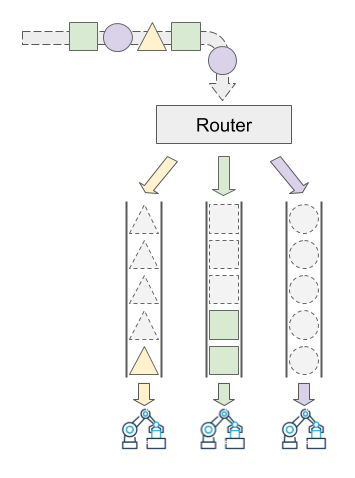
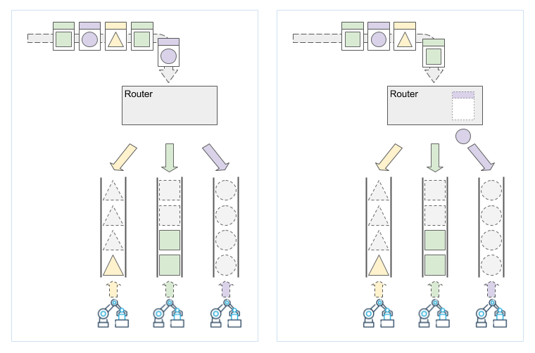

> [第 11 屆(2020) iThome 鐵人賽](https://ithelp.ithome.com.tw/users/20107551/ironman/2172)文章補完計劃，[從零開始土炮 MQ]() 基礎篇

<!--more-->

## Router 路由器

### 概念分析

如果今天有一個需求，希望使用將不同類型的資料，統一的放入 queue ，統一管理。那這樣的情況...

我們來解析一下需求，它想要統一管理所使用的 queue ，所以可以畫出以下的概念圖



用白話來說，所有建立的  queue , 都要加入 queue router 之中，但資料要如何個自放到對應的 queue 之中?

試著用 TDD 的方式進行開發，在加入第一個 Test case 時，建立一個 `ConcurrentQueue<int>` 的 queue 還很順利。

```c#
public class QueueRouter
{
    private ConcurrentQueue<int> _queue;

    public void AddQueue(ConcurrentQueue<int> queue){...}
    public void Enqueue(int i){...}
}
```

但是接下來，建立 `ConcurrentQueue<string>` 時，就會發現，很多問題浮出水面，`AddQueue` 與 `Enqueue` 都會發生類別轉換錯誤的問題。

當然，也可以用硬幹，俗稱暴力破解法來滿足下面的需求。

```c#
public class QueueRouter
{
    private ConcurrentQueue<int> _queue;
    private ConcurrentQueue<string> _queueString;

    public void AddQueue(ConcurrentQueue<int> queue){...}
    public void AddQueue(ConcurrentQueue<string> queue){...}
    
    public void Enqueue(int i){...}
    public void Enqueue(string i){...}
}
```

但是，如果支援的資料類型越來越多，難道要一直在 QueueRouter 之中加入 `ConcurrentQueue<T>` property 與 method 嗎? 這不但不符合 Open-Close 原則外，也間接增加維護開發的困難。

### 資料的封裝

如果將傳入的資料打包，同時有一個標記讓 queue Manager 可以知道新增的資料是屬於那個 queue 的，這種作法的概念圖如下。


```C#
public class QueueItem
{
    public string Label { get; set; }
    public object Payload { get; set; }
}
```

這時，輸入的資料有 `Label` 可以做為判斷資料類型的依據，如示意圖表示。Router 可以依據 Label 內的資訊來進行歸類的動作。



在這個例子中，我們可以先參考下列的程式實作。

```c#
public class QueueRouter
{
    private ConcurrentQueue<int> _queue;
    private ConcurrentQueue<string> _strQueue;

    public void AddQueue(ConcurrentQueue<int> queue)
    {
        _queue = queue;
    }

    public void AddQueue(ConcurrentQueue<string> queue)
    {
        _strQueue = queue;
    }

    public void Enqueue(QueueItem item)
    {
        if (item.Label == typeof(int).ToString())
        {
            _queue.Enqueue((int) item.Payload);
        }

        if (item.Label == typeof(string).ToString())
        {
            _strQueue.Enqueue((string) item.Payload);
        }
    }
}
```

目前寫法，因為是利用 .net 的資料類別，都是繼承 `object` 的特性實作的。所以會有 [Boxing / Unboxing](https://docs.microsoft.com/zh-tw/dotnet/csharp/programming-guide/types/boxing-and-unboxing) 的吃效能的缺點，但這邊我們先不理它。

## Queue 註冊

接下來，我們來處理 `AddQueue` 在支援不同類型 Queue 時，要不停增加函數多型的情況。

在這邊，我們回顧一下需求。整理一下思路，程式改動的目的是 `不用修改程式，就可以指向不同類型的佇列`。

再加上前面 `Enqueue(QueueItem item)` 的實作，是利用 Label 的 欄位進行資料的識別，那我們是不是可以加入 Label 做為  registry key 。

Binding Queue 時，必須註冊 RouterKey，以便 Router 在分派輸入的物件。

### 初版

我們最初的想法，是**直接指定 Router 的泛型類別，而且 Queue 的儲存內容，限定泛型類別或其繼承類別。**

```c#
// 實作概念
public class QueueRouter<T>
{
    public void AddQueue(string label, ConcurrentQueue<T> queue){...}
    public void Enqueue(QueueItem item){...}
}
```

還記得先前的 `QueueItem` 的 `Payload` 類別是 `object` 嗎？

在變更 `Enqueue(QueueItem item)` 的前提下，就會發生隱型限制，也就 `T` 的類型只能為 `object` 。但基於一次只變動特定功能的原則。

這個版本的問題，我們延後處理，先驗證目前想法是否可行。

```c#
// 變更為泛型的 QueueRouter
public class QueueRouter<T>
{
    private Dictionary<string, ConcurrentQueue<T>> _dctQueues
        = new Dictionary<string, ConcurrentQueue<T>>();

    public void AddQueue(string label, ConcurrentQueue<T> queue)
    {
        _dctQueues[label] = queue;
    }

    public void Enqueue(QueueItem item)
    {
        if (!_dctQueues.ContainsKey(item.Label))
            return;
        _dctQueues[item.Label].Enqueue((T)item.Payload);
    }
}
```

```c#
// 測試案例
[TestClass]
public class QueueRouterTest
{
    [TestMethod]
    public void QueueRouter_輸入不同的值_放入對應佇列()
    {
        var router = new QueueRouter<object>();
        var intQueue = new ConcurrentQueue<object>();
        var strQueue = new ConcurrentQueue<object>();

        router.AddQueue(typeof(int).ToString(), intQueue);
        router.AddQueue(typeof(string).ToString(), strQueue);

        int[] expected = {23, 16};
        string[] strExpected = {"Skype", "Google"};
        Enqueue2Router(router, expected);
        Enqueue2Router(router, strExpected);

        var actual = DequeueFromQueue(intQueue);
        var strActual = DequeueFromQueue(strQueue);
        expected.ToExpectedObject().ShouldMatch(actual.ToArray());
        strExpected.ToExpectedObject().ShouldMatch(strActual.ToArray());
    }

    private static void Enqueue2Router<T1, T2>(
        QueueRouter<T1> router, IEnumerable<T2> expected) where T2 : T1
    {
        foreach (var i in expected)
            router.Enqueue(new QueueItem {Label = i.GetType().ToString(), Payload= i});
    }

    private static List<T> DequeueFromQueue<T>(ConcurrentQueue<T> queue)
    {
        var actual = new List<T>();
        while (!queue.IsEmpty)
        {
            queue.TryDequeue(out var item);
            actual.Add(item);
        }

        return actual;
    }
}
```

雖然我們確定這個作法可行，但目前會遇到幾點問題。

- `QueueItem` 造成的泛型類別隱性限制。
- 有 [Boxing / Unboxing](https://docs.microsoft.com/zh-tw/dotnet/csharp/programming-guide/types/boxing-and-unboxing) 的吃效能的問題。

所以，接下來，我們先處理泛型類別隱性限制為 object 的問題。

------

### 迭代：QueueItem 的泛型

先前 QeueueRouter 的泛型類別會被隱性限制為 object 的問題，主要是出在 QueueItem 的 Payload 類別。

所以我們將 `QueueItem` 變更為 `QueueItem<T>` ，同時對 QueueRouter 進行對應的改動

```c#
// QueueItem 的泛型
public class QueueItem<T>
{
    public string Label { get; set; }
    public T Payload { get; set; }
}

// 實作概念
public class QueueRouter<T>
{
    public void AddQueue(string label, ConcurrentQueue<T> queue){...}
    public void Enqueue(QueueItem<T> item){...}
}
```

針對概念的變動，此次迭代的異動範圍有...

- QueueRouter.Enqueue 的傳入參數，由 `QueueItem` → `QueueItem<T>`。
- 測試案例對應的修改。

```C#
// 針對迭代的內容，只要修改這個函數，即可全部通過測試。
private static void Enqueue2Router<T1, T2>(Router<T1> router, IEnumerable<T2> expected) where T2 : T1
{
    foreach (var i in expected)
    {
  router.Enqueue(new QueueItem<T1> {Label = i.GetType().ToString(), Payload = i});
 }
}
```

從上面，我們己經解決了 QeueueRouter 的泛型類別會被隱性限制為 object 的問題 ，但還是幾點可以持續改善的。

- 當 `Payload` 的類型為 Vaule Type 時，用 `object` 做為泛型類別，仍有 Boxing/Unboxing 的效能問題。
- 對 QueueRoter 要 Binding 全新的類別，必須額外再建立對應的 Router。

目前只有部份滿足需求，就是所有的資料，只要放入同一個 Router，就可以放入對應的 queue 之中。

所以接下來，我們先改善一個 Router 無法通用所有 Queue 類型的問題。

### 迭代：通用型的 Router

由於前面的實作方式，都是建立在知道 QueueItem 本身的資料類型或結構。

那有沒有可能，回歸到 QueueItem 本身只單純的儲存資料，避開與任何資料類型的耦合？這樣是否為對存取資料的 consumber 造成困擾？

我們轉個想法，理論上，consumer 會知道 prodcutor 所造成的內容格式，所以在 queue 原封不動的儲存資料內容，唯一需要知道的只有 Lable 就可以了。

而 consumber 只要依據 Label，就可以取得他己知格式內容的資料本身，讓 consumber 自己去處理資料，這樣一來，程式就會與資料格式解耦，也可以避免 Boxing / Unboxing 的問題。

所以將 `Payload` 格式變更為 `byte[]` 的資料。

```c#
// Payload 的資料資料變動
public class QueueItem
{
    public string label {get;set;}
    public byte[] Payload {get;set;}
}

// Router 的結構變更
public class QueueRotuer
{
    public AddQeeue(string lable, ConcurrentQueue<byte[]> queue){...};
    public Enqueue(QueueItem item){...}
}
```

由於邏輯概念有較大幅度的改變，此次迭代的異動範圍有...

- 移除 `QueueItem` 的泛型，並將 `Payload` 變更為 `byte[]` 格式。
- QueueRouter.Enqueue 的傳入參數，由 `QueueItem<T>` → `QueueItem`。
- 測試案例對應的大幅修改。

```c#
// 測試案例
[TestClass]
public class QueueRouterTest
{
    [TestMethod]
    public void QueueRouterQueueManagerTestSingleQueue可輸入的值放入佇列()
    {
        // arrange
        var router = new QueueRouter();
        var intQueue = new ConcurrentQueue<byte[]>();

        var label = typeof(int).ToString();
        router.AddQueue(label, intQueue);

        var intQueueItems = ConvertQueueItem(label, new[] {23, 16});

        // act
        Enqueue2Router(router, intQueueItems);

        // assert
        var expected = intQueueItems.Select(x => x.Payload);
        var actual = intQueue.ToList();

        expected.ToExpectedObject().ShouldMatch(actual.ToArray());
    }

    [TestMethod]
    public void QueueRouter_輸入不同的值_放入對應佇列()
    {
        // arrange
        var router = new QueueRouter();

        var intQueue = new ConcurrentQueue<byte[]>();
        var strQueue = new ConcurrentQueue<byte[]>();

        var intLabel = typeof(int).ToString();
        router.AddQueue(intLabel, intQueue);

        var strLabel = typeof(string).ToString();
        router.AddQueue(strLabel, strQueue);

        var intQueueItems = ConvertQueueItem(intLabel, new[] {23, 16});
        var stringQueueItems = ConvertQueueItem(strLabel, new[] {"Skype", "Google"});

        // act
        Enqueue2Router(router, intQueueItems);
        Enqueue2Router(router, stringQueueItems);

        // assert
        var intExpected = intQueueItems.Select(x => x.Payload);
        var intActual = intQueue.ToList();

        var strExpected = stringQueueItems.ToList().Select(x => x.Payload);
        var strActual = strQueue.ToList();

        intExpected.ToExpectedObject().ShouldMatch(intActual.ToArray());
        strExpected.ToExpectedObject().ShouldMatch(strActual.ToArray());
    }

    private List<QueueItem<byte[]>> ConvertQueueItem(string label, int[] entities)
    {
        var list = new List<QueueItem<byte[]>>();

        foreach (var entity in entities)
        {
            var queueItem = new QueueItem<byte[]>
            {
                Label = label,
                Payload = BitConverter.GetBytes(entity)
            };
            list.Add(queueItem);
        }

        return list;
    }

    private List<QueueItem<byte[]>> ConvertQueueItem(string label, string[] entities)
    {
        var list = new List<QueueItem<byte[]>>();

        foreach (var entity in entities)
        {
            var queueItem = new QueueItem<byte[]>
            {
                Label = label,
                Payload = Encoding.Default.GetBytes(entity)
            };
            list.Add(queueItem);
        }

        return list;
    }

    private static void Enqueue2Router(QueueRouter queueRouter, IEnumerable<QueueItem<byte[]>> expected)
    {
        foreach (var i in expected)
        {
            queueRouter.Enqueue(i);
        }
    }
}
```

同時，Binding Queue 時，必須註冊 RouterKey，以便 Router 在分派輸入的物件。所有輸入物件均 inhert common packet。

- 優點：一個 Router 通用所用類型。
- 缺點：需要額外封裝資料物件。

------

### 迭代：自動建立 Queue

> 到目前為止，我們的使用方式，還是要先建立好 Queue 後，再將 Router 與 Queue 進行 Binding。
> 我真的很懶，懶到不想要自行建立 queue，或是，被要求不準自己建立 queue，而是必須使用程式自行產生 queue。這時，新的需求出現了~~
>
> 需求: 系統要能依據輸入資料類型，自行建立對應的 queue。

從上面的邏輯看起來，好像 `AddQueue` 的參數都是相同的。那這樣，我們是否能將其整合在一起，改成註冊 qeueu 時，Router 就會自動產生相關的 Queue。

```c#
// 概念
public class QueueRouter
{
    public void Registry(string label){...}    
    public void Enqueue(QueueItem item){...}
}
```

此次迭代的異動範圍有...

- 移除 `AddQueue` 的方法，變更為 `Registory`。
- 因為 `QueueRouter` 本身不支援取得 Queue 的功能，為了測試，額外增加繼承 `QueueRouter` 的測試用類別。
- 針對測試案例對應的修改。

```c#
public class QueueRouter
{
    protected Dictionary<string, ConcurrentQueue<byte[]>> _dctQueues
        = new Dictionary<string, ConcurrentQueue<byte[]>>();

    public void Registry(string label)
    {
        if (_dctQueues.ContainsKey(label))
            throw new Exception("己存在相同 label 的 queue");

        _dctQueues[label] = new ConcurrentQueue<byte[]>();
    }

    public void Enqueue(QueueItem<byte[]> item)
    {
        if (!_dctQueues.ContainsKey(item.Label))
            return;

        _dctQueues[item.Label].Enqueue(item.Payload);
    }
}
```

```c#
// 繼承 QueueRouter，提供測試
public class QueueRouterInherit : QueueRouter
{
    public ConcurrentQueue<byte[]> GetQueue(string label)
    {
        return _dctQueues.ContainsKey(label) ? _dctQueues[label] : null;
    }
}

[TestClass]
public class QueueRouterTest
{
    [TestMethod]
    public void QueueRouterQueueManagerTestSingleQueue可輸入的值放入佇列()
    {
        // arrange
        var router = new QueueRouterInherit();

        var label = typeof(int).ToString();
        router.Registry(label);
        var intQueue = router.GetQueue(label);

        var intQueueItems = ConvertQueueItem(label, new[] {23, 16});

        // act
        Enqueue2Router(router, intQueueItems);

        // assert
        var expected = intQueueItems.Select(x => x.Payload);
        var actual = intQueue.ToList();

        expected.ToExpectedObject().ShouldMatch(actual.ToArray());
    }

    [TestMethod]
    public void QueueRouter_輸入不同的值_放入對應佇列()
    {
        // arrange
        var router = new QueueRouterInherit();

        var intLabel = typeof(int).ToString();
        router.Registry(intLabel);
        var intQueue = router.GetQueue(intLabel);

        var strLabel = typeof(string).ToString();
        router.Registry(strLabel);
        var strQueue = router.GetQueue(strLabel);

        var intQueueItems = ConvertQueueItem(intLabel, new[] {23, 16});
        var stringQueueItems = ConvertQueueItem(strLabel, new[] {"Skype", "Google"});

        // act
        Enqueue2Router(router, intQueueItems);
        Enqueue2Router(router, stringQueueItems);

        // assert
        var intExpected = intQueueItems.Select(x => x.Payload);
        var intActual = intQueue.ToList();

        var strExpected = stringQueueItems.ToList().Select(x => x.Payload);
        var strActual = strQueue.ToList();

        intExpected.ToExpectedObject().ShouldMatch(intActual.ToArray());
        strExpected.ToExpectedObject().ShouldMatch(strActual.ToArray());
    }

    private List<QueueItem<byte[]>> ConvertQueueItem(string label, int[] entities)
    {
        var list = new List<QueueItem<byte[]>>();

        foreach (var entity in entities)
        {
            var queueItem = new QueueItem<byte[]>
            {
                Label = label,
                Payload = BitConverter.GetBytes(entity)
            };
            list.Add(queueItem);
        }

        return list;
    }

    private List<QueueItem<byte[]>> ConvertQueueItem(string label, string[] entities)
    {
        var list = new List<QueueItem<byte[]>>();

        foreach (var entity in entities)
        {
            var queueItem = new QueueItem<byte[]>
            {
                Label = label,
                Payload = Encoding.Default.GetBytes(entity)
            };
            list.Add(queueItem);
        }

        return list;
    }

    private static void Enqueue2Router(QueueRouter queueRouter, IEnumerable<QueueItem<byte[]>> expected)
    {
        foreach (var i in expected)
        {
            queueRouter.Enqueue(i);
        }
    }
}

```
