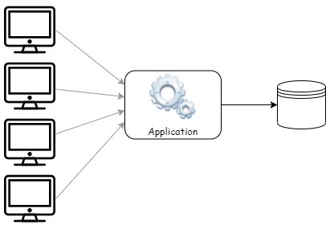
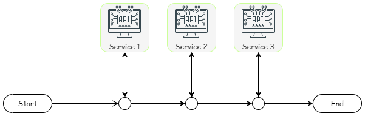
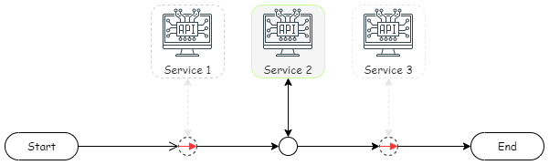

多數的時候，我們可能會將 `負載測試(LOAD TESTING)` 與 `壓力測試 (STRESS TESTING)` 混在一起討論。

無論是那種測試，都是基於特定目的的前提，去進行測試計劃的規劃。不同的測試目的，直接影響到預期的測試作法、條件以及測試系統架構。

透過測試的方式，是將系統效能加以量化。只有量化才有依據，調整或決定後續的處理方式。無論是增加機器、設定監控警告的水位，或是找出品系統瓶頸加以改善優化，

<!--more-->

## 你的目的是什麼?

今天來聊聊負載測試到底要做什麼？經常聽到，為了確保軟體系統的穩定度，所以想要藉由負載測試/壓力測試的方式，進行驗證軟體系統的驗證。

但有趣的是，參與負載測試或壓力測試的成員中，有多少人清楚知道此次測試的目的為何?預期得到何種結果？測試的結果會如何使用？要測試到什麼樣的程度，才算完成？

為了避免在一無所知的情境下，採用無效的測試方法或過多無用的測試案例。在測試開始前，一定要非常明確的了解，壓測的目的為何？期望藉由測試得到的何種問題的答案？

隨著你的問題與目的不同，壓力測試所規劃的測試系統架構、測試案例、準備假資料、作法等等，都會有所不同，無法以一概全。

### 目的一：找出單一機器穩定運行系統的最大乘載量 (壓力測試)

有時，當需要購買新的機器或在雲端開啟新的機器時，有時會遇到有人會詢問，這台機器可以支援多少人同時使用？多大的流量？機器的規格是否可以符合需求？等等。

在沒有數據資料支撐的前提下，很難去評估目前的機器配置到底可以支撐系統到什麼樣的程度。

此時，測試的重點在於 `壓力測試 (STRESS LOADING)`，對於待測目標或系統，藉由不斷的增加壓力的強度，直到系統癱瘓或發生大量異常。並將這些壓力強度、系統當下的運行效能加以量化，找出當下機器可承受的瓶頸以及最大容載量。

假若，此時注重的重點，是單一台機器的效能與情況，測試系統架構圖上會盡可能的讓測試的焦點集中在一台機器。同時，系統中的快取機制，資料庫的存取架構(例如讀取分離)等，都會列入評估範圍。

舉例來說，若是今天的測試目的，是想要找出系統在沒有 cache 的情況下，在單一台機器，可承載的請求數量上限為何？同時到達上限後，遇到系統瓶頸時，問題點是發生在軟體本身？資料庫回應逾時？資料庫 I/O 過高？

此時觀察的不僅僅是請求數量的級別、平均請求響應時間、請求的成功率。此外，也需要觀察受測機器中，CPU 與記憶體的使用率，硬碟 I/O 的存取量。這時候我們才能清楚地去了解，瓶頸發生的位置在哪裡。

唯有收集完這些相關資訊，針對後續的策略規劃才能有所依據。不管是要擴增機器數量、增加控制的水位值或是系統調整等等。

### 目的二：驗證系統架構可符合需求規格 (負載測試)

往往會聽到某某系統可以支援多少人同時上線，或是軟體的需求規格書中，明確要求必須可以支撐多少人同時使用。那麼我們要如何驗證系統是符合要求的呢？

或者，為了驗證在大量請求的情境下，例如同時 1000 人、2000 人、或 5000 人以上，同時進行交易時，系統所處理的數據資料一切正確。

藉由 `負載測試 (LOAD TESTING)` 來驗證大量請求處理的時候，是否符合需求規格書內可承載的最大請求數，或者是用來驗證在龐大交易量的情況下，資料本身是否有發生異常，以確保後續上線之後，重要的資料不會出現異常錯誤。

若是前者，測試系統架構需要盡可能地貼近實際的系統架構。若是為了驗證資料的正確性，需要額外在初期就規劃好資料驗證的方式。

### 目的三：找出目前系統運行的瓶頸，以進行後續改善與優化 (負戴測試/效能測試)

當系統運行已經有很長的時間後，有人反應系統效能不佳時，希望對現有系統進行優化。

在進行系統的改善與優化之前，必須先找出目前軟體遭遇的瓶頸。藉由 `效能測試(PERFORMANCE TESTING)` 將系統效能加以量化，同時**收集、統計、分析**測試過程中的數據資料，試圖找出系統運行間，系統在每個服務之間的轉換、請求響應時間，資料庫的存取耗費時間等等，以便彙整造成瓶頸的問題清單。

此外，若測試的情境案例中，處理流程涉及第三方服務，需要考量第三方服務的效能，是否是壓力測試所在意的地方？

假若想要確認第三方服務的效能，是否是影響系統效能的主要瓶頸點？此時就必須將第三方服務列入測試的範圍內。要特別注意，若測試範圍包括到第三方服務，需特別小心，並需要事前通知第三方服務的供應商，避免造成後續一連串額外的問題。

假若第三方服務的效能不是關注的重點，則會針對軟體內呼叫第三方服務的部分，使用 Mock API 回傳假資料的方式，減少第三方服務對測試結果的影響。

舉例來說，若某個測試案例中，資料處理過程中，將會依序與使用三個第三方服務  `Service 1`、`Service 2`、`Service 3`  。

但 `Service 1`、`Service 3` 不是此時測試的考量重點，就會進行**系統內相關區塊的改寫**或是**指向 Mock Service**，減少非必要因素的影響。

當測試的目的是為系統改善優化，那一定要有一個基準值，基準值不僅僅是規劃優化項目的參考資訊，同時也用來比對優化前後差異。這個基準值可能是上一次測試的結果資訊，也可能是新收集到的資訊。

在這過程中，最花時間的，莫過於收集、分析系統內流程中各階段所耗費時間、資源。這個部分有很多的方式都可以收集到，可以使用 log 收集，也可以採用 Dump 的方式，或是 Application Insight 監控所收集到的系統資訊等等。

接著針對這些資料加以統計分析，就會找到我們所最在意的瓶頸問題，這時候我們會針對收集到的瓶頸問題嚴重性加以排序，列出優化的優先順序，因為我們不可能把全部的瓶頸都調教到非常理想的狀態，根據二八法則，只要處理最重要的兩成，就可以得到 80% 的優化結果。

## 測試的對象/測試案例的選擇

我們常常聽到有人說壓力測試/負載測試不可能全部都測試，只要測試最重要的功能就行。

但可是最重要的功能是什麼？到底要如何麼決定？是工程師決定測試最複雜的部分嗎?還是業務覺得功能最重要？還是想到測什麼就測什麼？其實這個沒有明確的答案，不同利益關係人的回答都會不一樣。

個人的觀點是，在還沒有特定目的和目標之前，從商業情境下手，什麼是最重要的業務情境，那就是最重要的測試情境，接著再針對這個情境下去分析測試方式。

若是有很明確的測試目的，就直接針對目的進行測試，

舉例來說，若今天想要測試購物車結帳流程目前的瓶頸點是什麼。那麼就不會去考量購物車以外的測試案例，更著重於購物車結帳流程中，各階段的效能、與哪些服務有關係、結帳後的資料驗證等等。

## 簡單總結

無論基於何種目的去進行壓力測試/負載測試/效能測試，都必須清楚知道測試的目的與追尋的答案。不同的目的，會影響到測試的案例，測試的架構，是否需要調整程式，都會有所不同。

測試的目的，說穿了就是對軟體系統目前可支援的層級，以及效能加以數值量化，便於後續評估應對策略。是要加開機器？安排資源，進行系統改善與優化？安排自動化系統監控通知的水位。

## 延伸閱讀

1. [Introduction (k6.io)](https://k6.io/docs/test-types/introduction/)
2. [亂聊測試報告的內容]()
