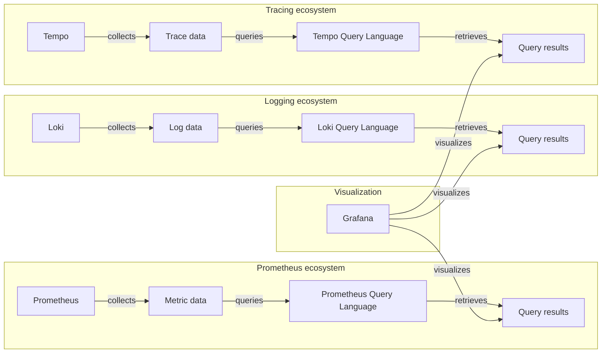

> 🔖 長話短說 🔖
>

<!--more-->

## Dockerfile 簡介

雖然在 [Docker 操作簡介 - command / dockerfile / docker-compose]() 已經有提過，不過還是簡單回顧一下。

### Single-Stage Build

Dockerfile 的設定方式，最基本的就是一個步驟內，完成所有的設定。這種方式，就是 `Single-Stage Build`。

```dockerfile
FROM mcr.microsoft.com/dotnet/sdk:7.0
WORKDIR /src
COPY ["demo/demo.csproj", "demo/"]
RUN dotnet restore "demo/demo.csproj"
WORKDIR /src/demo
RUN dotnet build "demo.csproj" -c Release -o /app/build
RUN dotnet publish "demo.csproj" -c Release -o /app

WORKDIR /app
EXPOSE 80
EXPOSE 443

ENTRYPOINT ["dotnet", "demo.dll"]
```

簡單說明一下指令的意義

- `FROM` 使用的 base Image
- `WORKDIR` 目前 Image 內所在的位置
- `COPY` 把外部資料複制到 Image 內的指定位置
- `RUN` 執行指定的指令
- `EXPOSE` 指定 Image 內的服務埠
- `ENTRYPOINT` 指定 Image 內的執行指令

但要特別注意，若是在 `Single-Stage Build` 中，直接將程式碼進行建置、打裝的方式，會將所有的步驟所使用的工具、中繼檔、程式碼等等，都包含在 Image 內。

導致 Image 內部存在不必要的檔案、多餘資料，除了檔案過大外，還可能造成資料的外洩。

當然，我們也可以建置過程中，加入指令刪除建置過程中，所使用的程式碼與中繼檔，也僅能確保刪除的項目不會被他人看到，至於過程中使用的工具等，可能還是遺留在 Image 內。

Docker 的 [官方文件](https://docs.docker.com/build/building/multi-stage/)，也建議使用 `Multi-Stage Build` 的方式，來建置 Image。除了可以減少 Image 的大小外，也可以確保 Image 內的資料，不會被外洩。

### Multi-Stage Build

在 Visual studio 建立 .NET 專案時，若有勾選 support Docker 的選項。在建立專案的同時，一併建立 `Dockerfile` 的檔案，其內容的編排，就是使用 `Multi-stage` 的方式。

在這個 Dockerfile 內的描述，會分成四個階段來進行建置。

- 首先，建立運行發佈程式所需要的 Base Image。
- 再來，建立建置環境用的影像檔，裡面包含.NET SDK 與 程式碼，並確認程式碼可以正常建置。
- 第三步，將第二步建置過的程式碼，打包成發佈版本。
- 最後，將發佈版本的程式，放入運行環境的 Base Image 內。

```Dockerfile
# 建立一個執行程式的基礎模板 
FROM mcr.microsoft.com/dotnet/aspnet:7.0 AS base  
WORKDIR /app  
EXPOSE 80  
EXPOSE 443  

# 使用 .NET SDK 的 Image, 並程式碼複製到容器內，並執行建置 
FROM mcr.microsoft.com/dotnet/sdk:7.0 AS build  
WORKDIR /src  
COPY ["demo/demo.csproj", "demo/"]  
RUN dotnet restore "demo/demo.csproj"  
COPY . .  
WORKDIR "/src/demo"  
RUN dotnet build "demo.csproj" -c Release -o /app/build  
  
# 使用上一步建立的 Image, 進行發佈版本的建置 
FROM build AS publish  
RUN dotnet publish "demo.csproj" -c Release -o /app/publish  

# 將最後建置的程式，放置到基礎的 Image 內，並設定執行的指令
FROM base AS final  
WORKDIR /app  
COPY --from=publish /app/publish .  
ENTRYPOINT ["dotnet", "demo.dll"]
```

## 機敏資料的處理

```C#
```

### 資料庫的連線字串

```C#
```

### 憑證資料

## FAQ



▶ 站內文章

- [Docker 操作簡介 - command / dockerfile / docker-compose]()
- [使用 Container 建立 CI 所需要的建置環境]()
- [部署新境界 - 使用 Container 簡化流程]()
- [使用 Azure Pipelines / Jenkins 建置 Docker image]()
- [使用 dotnet-ef 建立 PostgreSQL 的 DBContext]()
- [使用 dotnet-ef 建立 SQL Server on Docker 的 DBContext]()
- [Docker | 建立 PostgreSQL 的 container 時，同時完成資料庫的初始化]()
- [基於 Docker 的系統設計 | Part.2 | 站台的監控與 ELK]()
- [基於 Docker 的系統設計 | Part.1 | 網站的基礎建設]()
- [Docker | 使用 Docker 建置 ASP.NET Webapi 的 Image]()
