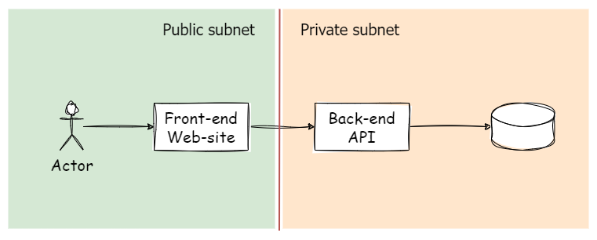

在本篇內容，預計會接觸與應用以下的概念

- Docker bind 與 mount
- Docker Network 的概念
- Docker 內的憑證設定
- Docker 內網段的限制
- CIDR 的概念

> 🔖 長話短說 🔖
>
>

<!--more-->

使用的技術與開發環境

- Windows 11
- Docker
- .NET Core 7
- Vue.js
- PostgreSQL 15.1

## 系統設計

### 要求

- frontend 的 web 只能從 443 連入,
- backend 的 api 只允許從 frontend 連入，其他連線一律拒絕
- db 只允許從 backend 連入 db port, 其他 IP 與 port 一律禁止

### 架構圖



## 網路設定

在這段, 我們需要知道 Docker Network 的基本概念

#### CIDR 觀念

 [CIDR（Classless Inter-Domain Routing）](https://zh.wikipedia.org/wiki/%E6%97%A0%E7%B1%BB%E5%88%AB%E5%9F%9F%E9%97%B4%E8%B7%AF%E7%94%B1)

#### Docker network 設定

簡單說明一下，在 Docker 內的 Network 分為 `bridge`、`overlay`、`ipvlan`、`macvlan`、`none` 等類型。預設是使用 `brige` 的類型。

在建立 Docker 網路時預設使用 172.17.0.0/16 的網段

在這邊, 我們設定兩個網段, 分別是外部網路可以連入的公有網段 `172.20.0.0/16` 與私有網段 `172.100.0.0/16`

```shell
docker network create --driver bridge --subnet 172.20.0.0/16 vue-api-network
docker network create --driver bridge --subnet 172.100.0.0/16 api-db-network

```

```yaml
```

## 結果

最後的 docker-compose.yml 如下

```yaml
version: "3.9"

services:
  frontend-web:
    image: frontend-web
    ports:
      - "443:443"
    networks:
      - vue-api-network

  backend-api:
    image: api
    ports:
      - "80:80"
    volumes:
      - C:\log:/log
    networks:
      - vue-api-network
      - api-db-network

  portgresql-db:
    image: postgres:15.1
    environment:
      POSTGRES_PASSWORD: password
      POSTGRES_DB: database
    volumes:
      - db-data:/var/lib/postgresql/data
    networks:
      - api-db-network

volumes:
  db-data:

networks:
  vue-api-network:
    driver: bridge
    ipam:
      config:
        - subnet: 172.20.0.0/16

  api-db-network:
    driver: bridge
    ipam:
      config:
        - subnet: 172.100.0.0/16
```

```shell
docker ps
```

## 延伸閱讀

▶ 站內文章

-

▶ Docker-Compose

[compose-spec/spec.md at master · compose-spec/compose-spec (github.com)](https://github.com/compose-spec/compose-spec/blob/master/spec.md)
