---
title: 使用 IIS 進行 SSL 憑證的申請與更新的步驟與注意事項
description: 日前在使用 IIS 10 進行 SSL 伺服器憑證的申請與更新作業時，發生 F5
  重整時，伺服器憑證消失的問題。在排查過程中，發現一些有趣的地方，所以將其特別記錄下來。
date: 2023-02-03T11:43:18+08:00
categories:
  - 軟體開發
  - 資訊安全
tags:
  - 資安
  - IIS
keywords:
  - IIS
  - CSR
slug: using-iis-create-and-complete-csr
lastmod: 2023-06-28T10:10:47+08:00
---

日前在使用 IIS 10 進行 SSL 伺服器憑證的申請與更新作業時，發生 IIS `完成憑證請求` 後，進行 F5 重整時，憑證消失的問題。在排查過程中，發現一些有趣的地方，所以將其特別記錄下來。

在這篇文章中，主要使用 IIS 來進行操作，在實務上，也可選擇使用 `openssl` 指令的方式來建立 `csr` 與 `pfx` 檔案。

> 🔖 長話短說 🔖
>
> 使用 IIS 進行`建立憑證請求`與`完成憑證請求`作業，務必使用同一台主機。否則會發生無法`完成憑證請求`的問題。
>
> 若是 SSL 憑證需要安裝到多台主機，在`完成憑證請求`作業後，請到 `主控台\憑證(本機電腦)\個人`的位置，將憑證連同私鑰一同滙出。
>
> 在使用 IIS 完成`建立憑證請求`後，從管理主機台的 `憑證註冊要求` 可以看到 CSR 對應的憑證資料。若是沒有資料，後續 IIS 的 `完成憑證請求` 無法順利完成，會出現重整後就消失的情況。

<!--more-->

## 建立憑證請求 CSR

憑證請求 CSR 檔，全名 `Certificate Signing Request, CSR`，用於向 `數位憑證認證機構(Certificate Authority, CA)` 申請 SSL/TLS 憑證時使用。

CSR 檔的內容是以 Base-64 方式儲存 PEM 格式的資料。檔案格式如下。

```txt
-----BEGIN NEW CERTIFICATE REQUEST-----
MIIETTCCAzUCAQAwYjELMAkGA1UEBhMCVFcxDzANBgNVBAgMBlRhaXdhbjEPMA0G
A1UEBwwGVGFpcGVpMQ0wCwYDVQQKDARzZWxmMQ0wCwYDVQQLDARVbml0MRMwEQYD

...略...

RYCKXw0hM723qKE8m7EpRZFOTlV6zKX+Wbh+ycFtYSX3eaLmj855Yqdfnp/NmSU4
SKriMyeWEIj5Z506JGSOR5jGVqXdib/wFQpN9M73GN9iRG2SbcIEC3gcNt1R4IF4
+w==
-----END NEW CERTIFICATE REQUEST-----
```

在 CSR 之中，包含以下資訊。

- 公司或網站的資訊
- 公鑰
- 憑證演算法與金鑰長度

### 使用 IIS 建立憑證請求

使用 Microsoft 的 Internet Information Services, IIS 來進行 CSR 檔的建立。

首先到 IIS 中，選取 `伺服器憑證`，並進行 `建立憑證要求` 的動作。

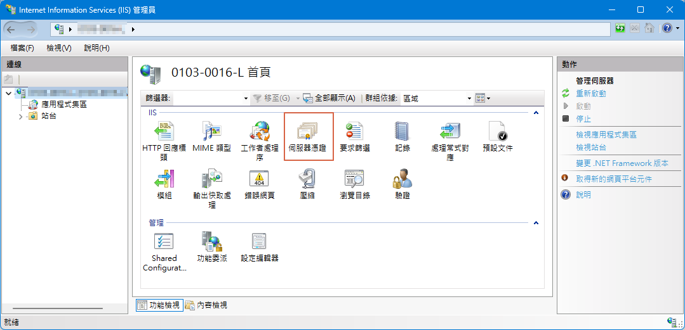

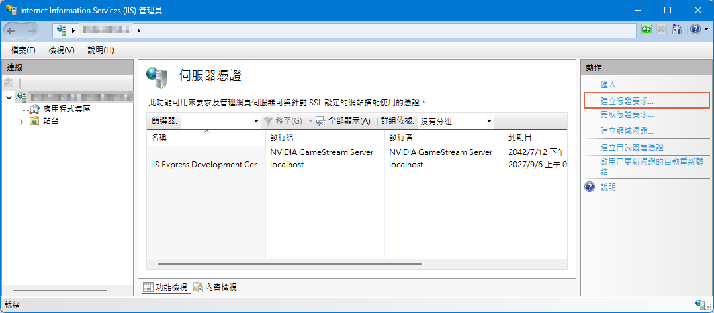

接著，依序填入 `一般名稱`、`組織`、`單位`、`位置`、`國家` 與 `密碼編譯服務提供者`、`金鑰位元長度` 後。

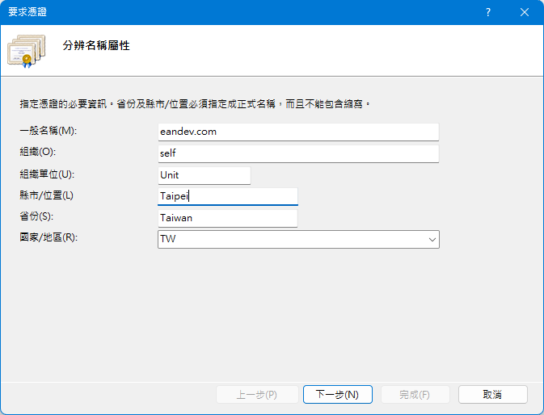

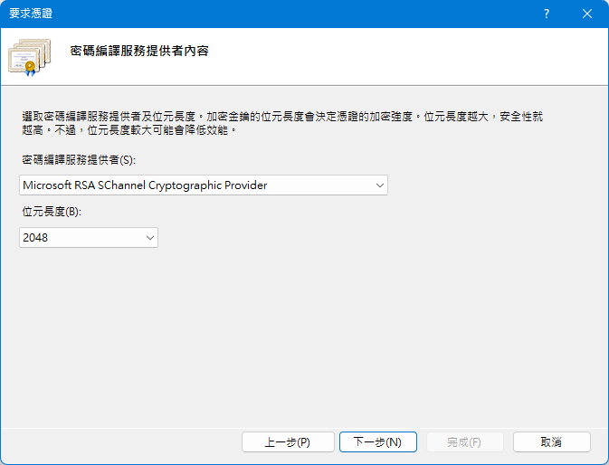

最後，指定好 CSR 輸出位罝後，就可以得到 CSR 檔。

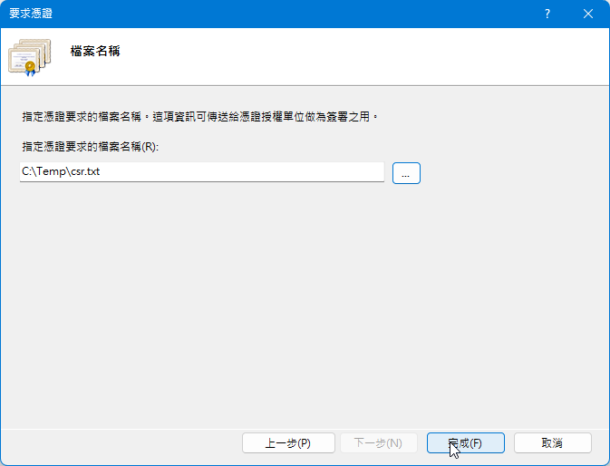

### 主控台的憑證註冊要求清單

我們可以使用 `Win + R`，執行 `mmc` 的方式進入 Microsoft Management Console 管理主控台，來觀察 `建立憑證請求` 前後的變化。

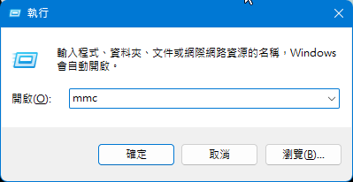

並在 `檔案` \ `新增/移除嵌入式管理單元` 加入 `憑證`，並選擇`電腦帳戶`的憑證類型。
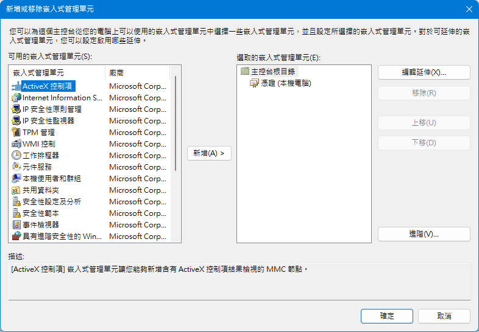

當還沒有利用 IIS `建立憑證請求` 之前，在主控台的憑證註冊要求的內容是空無一物的。

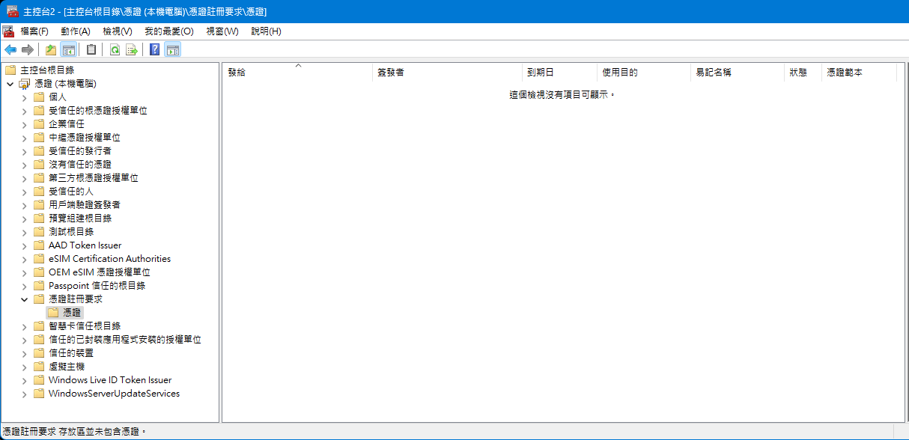

當完成 `建立憑證請求` 後，再重整主控台的畫面，可以看到先前建立的憑證請求資訊。

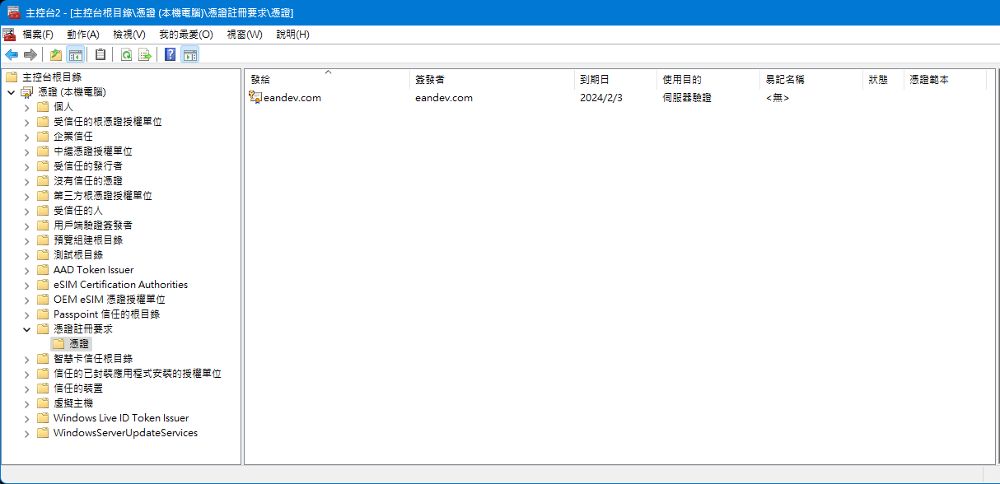

在 主控台的 `憑證(本機電腦)\個人` 之中，此時還只有預設的憑證項目。

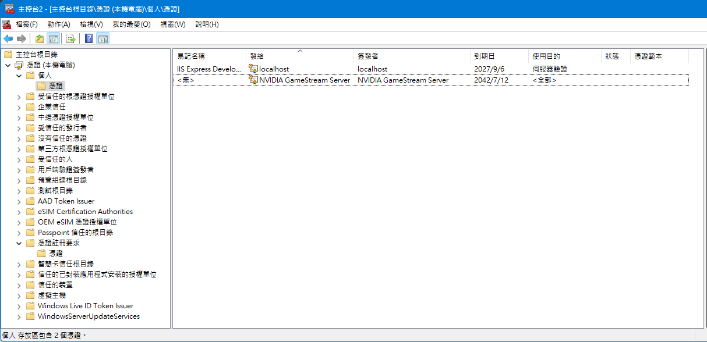

## 完成憑證請求

### 自簽憑證(DEMO 用)

在這邊，使用了一些手法，去建立了一份自簽的憑證。

先是到主控台的憑證註冊要求中，把憑證連同私鑰一並滙出為 `pfx`，再使用 openssl 進行以下操作。(非正規作法)

```shell
# 使用從憑證註冊要求取得的 pfx, 把 private key 取出
openssl pkcs12 -in 123.pfx -nocerts -out server2.key -nodes -password pass:123

# 使用 private key 與 csr, 產生 crt 檔
openssl x509 -req -in eandev.csr -signkey server2.key -out server.crt

# 把 crt 檔轉為 IIS 接受的 cer 檔
openssl x509 -in server.crt -out server.cer -outform DER
```

### 完成憑證要求

在收到 CA 核發憑證後，就可以進行 `完成憑證要求` 的動作。

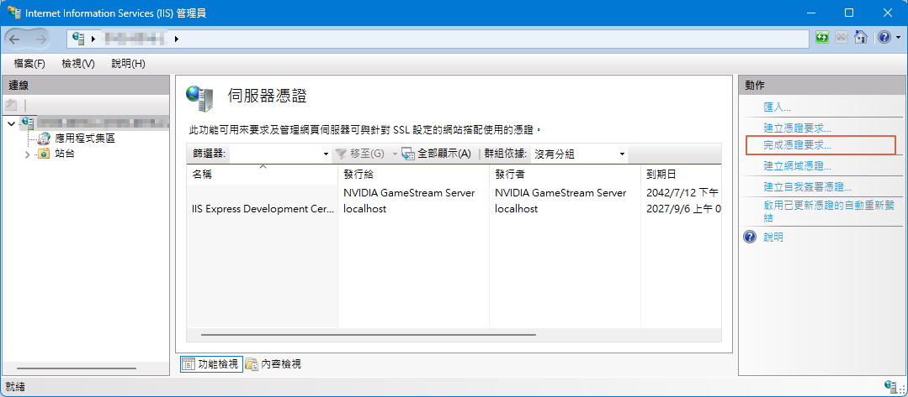

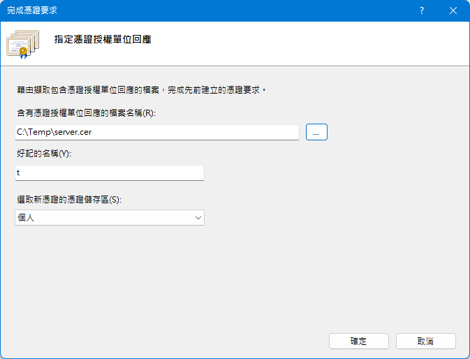

使用 CA 核發的 cert 檔，完成動作後，在 IIS 內的伺服器憑證的清單，就會出現申請的憑證項目。別忘了再重整一次，確保有成功完成動作。

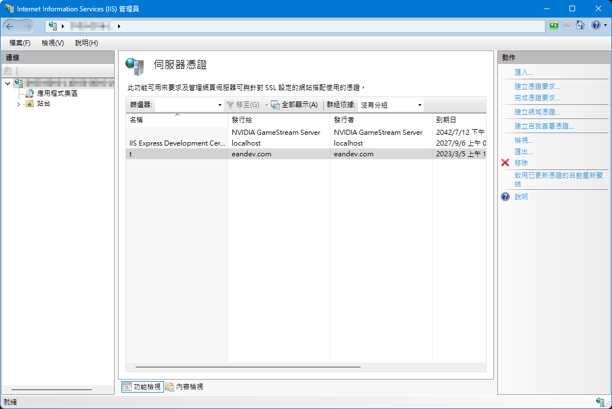

此時，到主控台的 `憑證註冊要求` 列表清單，就會發現先前的註冊憑證已經消失不見。


在主控台的 `個人` 列表清單，發現增加一組新的憑證。

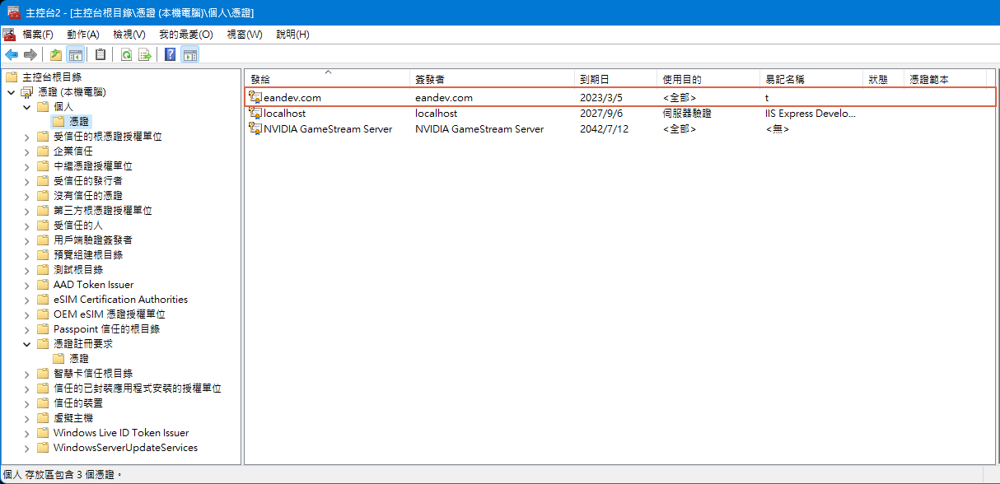

### F5 重新整理後，憑證會消失的問題

若是在 IIS 完成 `完成憑證要求` 的動作後，重整伺服器憑證列表時，發生剛剛加入的憑證消失。有極大的可能是主控台內的`憑證註冊要求`列表內，不存在與 cert 對應的憑證資料。

雖然 IIS 內的伺服器憑證列表清單，不存在剛加入的憑證。

但在主控台的 `個人` 列表清單，依然會發現一組新的憑證，仔細觀察憑證的 ICON，是不包含私鑰的憑證。理所當然，無法匯出 pfx 檔。

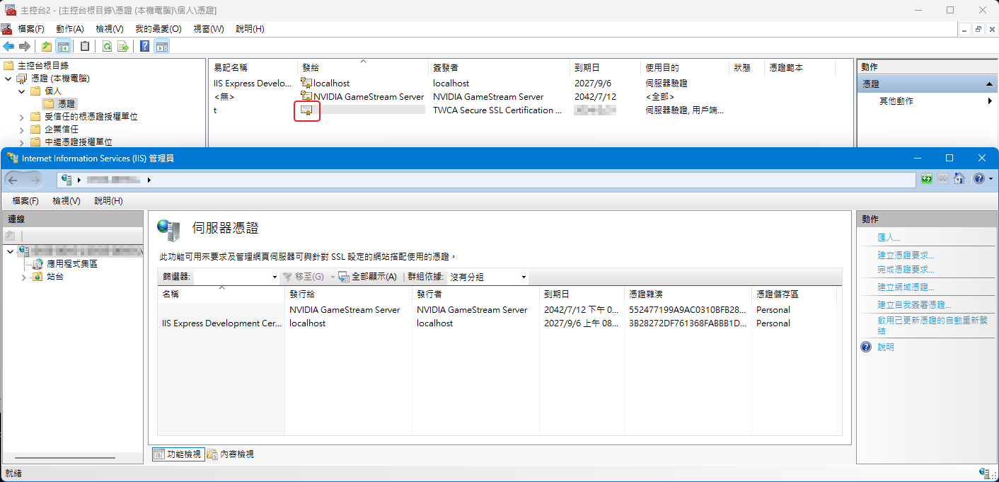

## 取出 SSL 憑證

當順利`完成憑證請求`作業後，可能需要將申請 SSL 憑證需要安裝到多台主機，或是進行 Loading Balance 的設定等等。

此時，可以到 `主控台\憑證(本機電腦)\個人` 的位置，含有私鑰的 SSL 憑證滙出。

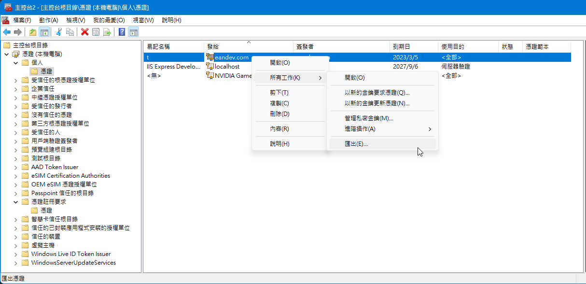

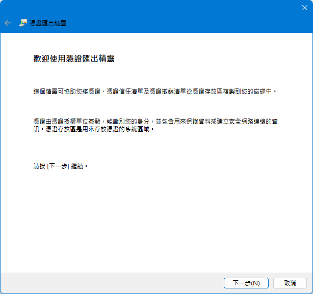

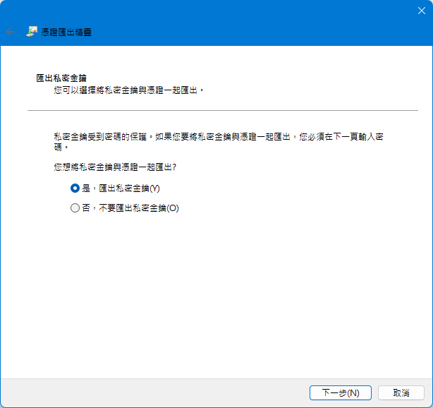

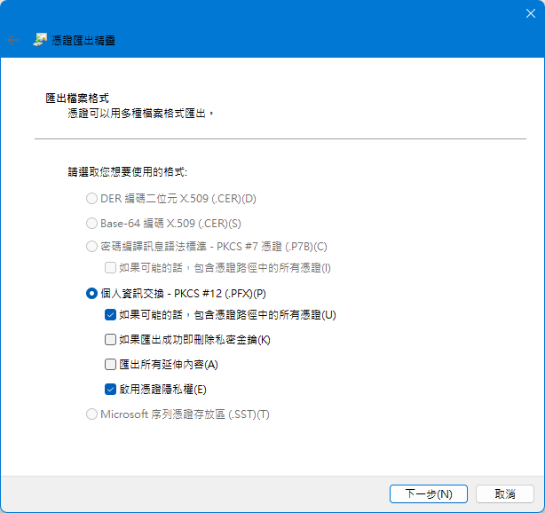

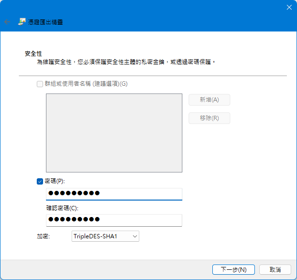

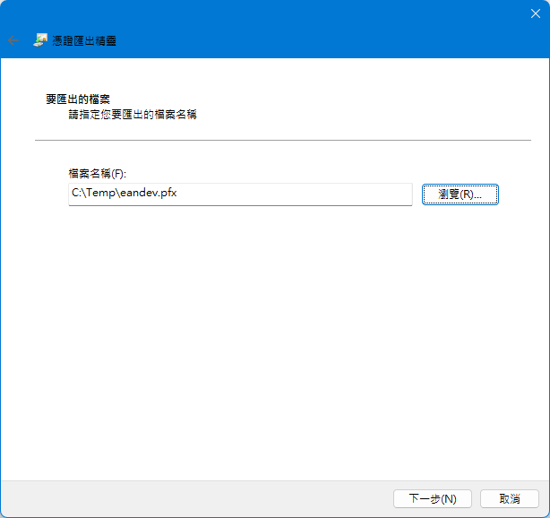

在將憑證匯為 pfx 後，可以使用 openssl 將私鑰取出。

```shell
# 使用 openssl 取得 pfx 內的私鑰
openssl pkcs12 -in <certificate>.pfx -nocerts -out private.key -nodes -password pass:<匯出 pfx 的密碼>
```

## 延伸閱讀

- [[Server] TLS/SSL 憑證 (Certificate) 指南 – 常用指令 | 製作 CSR – YIDAS Code](https://code.yidas.com/tls-ssl-certificate-guide/)
- [如何使用 OpenSSL 工具產製 CSR 憑證要求檔並成功申請正式 TLS 憑證 | The Will Will Web (miniasp.com)](https://blog.miniasp.com/post/2022/06/14/How-to-request-new-tls-certificate-using-OpenSSL)
- [CSR 檔 - 憑證簽名請求檔案格式](https://docs.fileformat.com/web/csr/)
