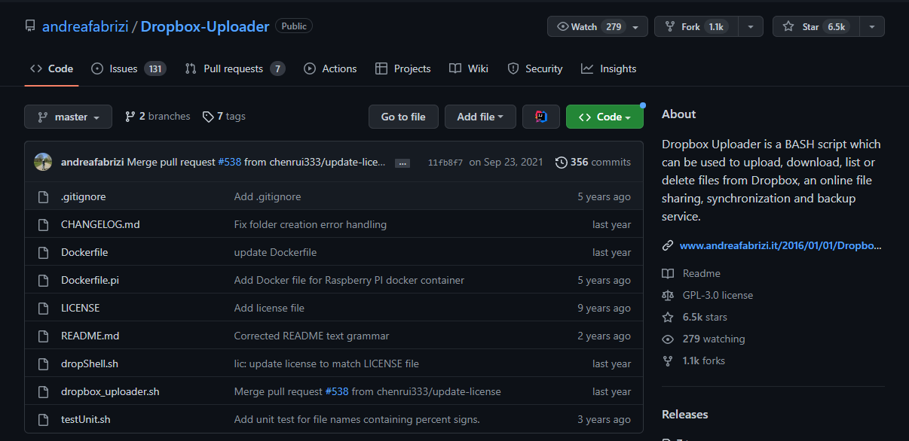
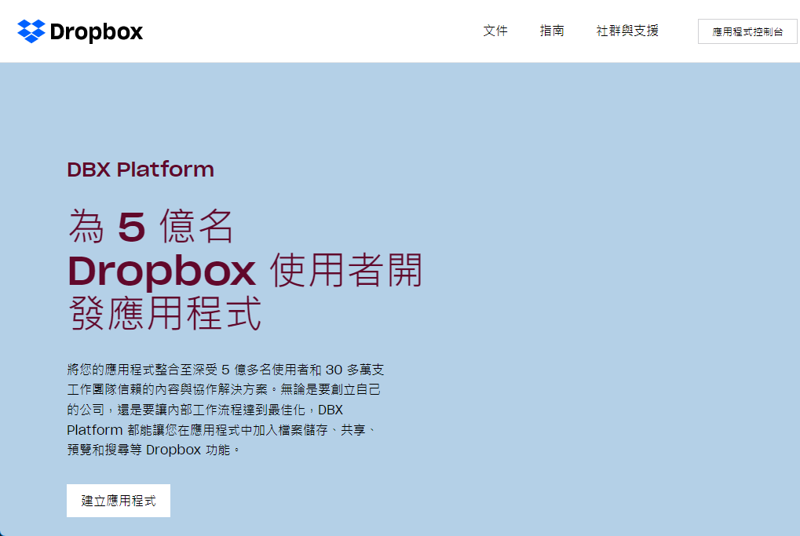
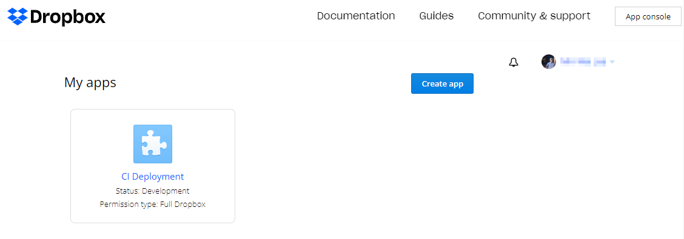
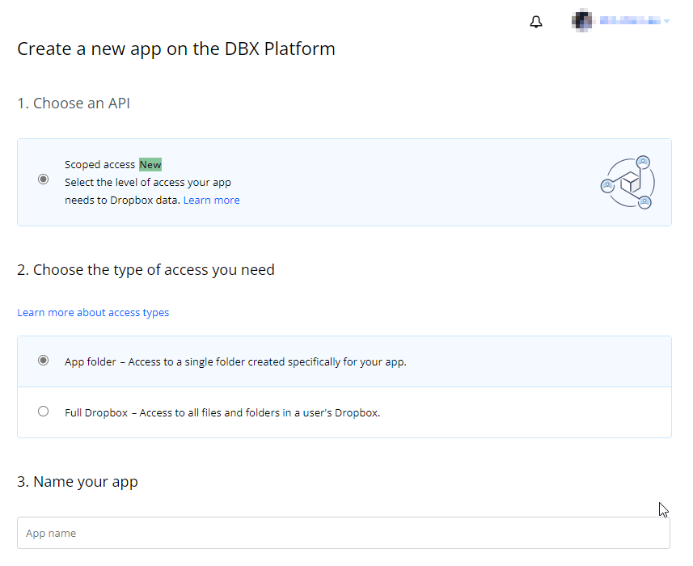
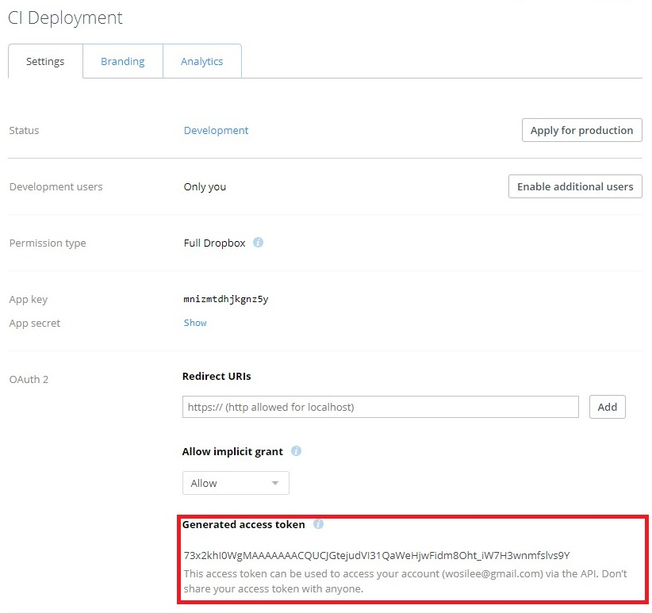
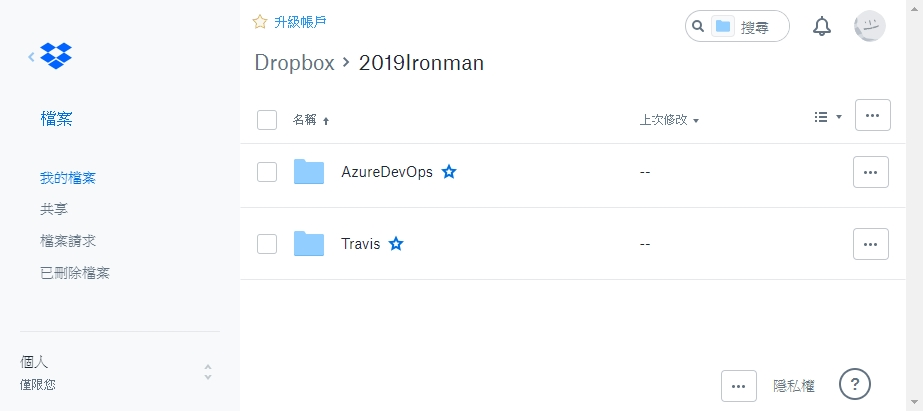

> [2019 iT 邦幫忙鐵人賽](https://ithelp.ithome.com.tw/users/20107551/ironman/1906)文章補完計劃，[從零開始建立自動化發佈的流水線](../build-ci-cd-from-scratch/index.md#持續發佈) 持續發佈篇

在前面 [持續整合(Continuous Integration, CI)](../build-ci-cd-from-scratch/index.md#持續整合) 的文章，初步介紹概念與 Travis CI / Azure Pipeline 的設定方式後，接著要來嘗試`持續部署 (Continuous Deployment, CD)`/`持續交付 (Continuous Delivery, CD)` 的實作。

在這一篇，將試著透過 Travis CI 與 Azure Pipeline 兩種工具，將程式進行自動化測試、建置、並將其建置出來 Artifact 放置於 Dropbx。

<!--more-->

```chat
吉米: 既然，可以運用 CI Server 自動建置、自動測試、發訊息，那再接下來，應該就是自動發佈了吧。

Eric: 沒錯，不過發佈類型不同，設定也有所差異。

吉米: 可以先介紹一下安裝檔的發佈嗎？

Eric: 好啊。
```

由於先前使用的 CI Server 全部是現有的雲端服務，或是自行架構在 Azure 的虛擬機器。

所以期望 CI Server 也可以將檔案，自動發佈到網路空間，以下，筆者試著將軟體發佈到 DropBox 之中。

## 將軟體發佈到 Dropbox

### 開啟 Dropbox 存取權限

檔案上傳到 Dropbox 時，筆者運用 andreafabrizi 在 GitHub ，所分享的 [Dropbox-Uploader](https://github.com/andreafabrizi/Dropbox-Uploader) ，以簡化介接 Dropbox API 的工作量。



首先，先到 [Dorpbox Developers](https://www.dropbox.com/developers)，會看到以下的畫面



在成功註冊/登入後，首先，我們必須在 `Dropbox` 建立 app 專案，讓 Dropbx 開放權限，允許應用程式呼叫 Dropbox API。




> 📝 資訊補充 📝
>
> 在 `Choose an API` 的部份，Dropbox 在 2020 年調整 OAuth2 的授權類型，讓授權的方式更加的多樣化與自由。
>
> 相關資料請見：[Now Available: Scoped apps and enhanced permissions](https://dropbox.tech/developers/now-available--scoped-apps-and-enhanced-permissions)、[Migrating App Permissions and Access Tokens](https://dropbox.tech/developers/migrating-app-permissions-and-access-tokens)

按下 `Create app` 後，創立一個提供 CI Server 使用的 API 存取權限。




完成建立後，直接到 `OAuth 2` 的區域取得 Token 值，這會用在 `Dropbox_Uploader.sh` 之中。



要注意的是，`dropbox_uploader.sh` 中，是將先前取得的 Dropbox OAuth2 的 Token 另存檔案。但這情況不適合用在 CI Server ，所以對 `dropbox_uploader.sh` 進行部份修改。

```shell
# step 1
# 到 #Default values 增加 Token
OAUTH_ACCESS_TOKEN=73x2khI0WgMAAAAAAACQT9o8kMlODtz48GhinV9sq2lRCZq8RzIpLMBkVb2575wy

# Step 2
# 將 SETUP 區域的部份 mark 掉
```

並將修改後的 `dropbox_upload.sh` 放到 Repository 的目錄下。

### 使用 Travis CI 發佈檔案

Travis CI 提供許多現成的發佈方式，例如 GitHub Release, AWS S3, Azure Web App, NPM, …… ，但由於我們要將程式發佈到 DropBox 之中，所以使用 `Custom Deploy`。

```yaml
deploy:
  provider: script
  script: bash scripts/deploy.sh
  on:
    branch: master
```

在 yaml 指令中，看到 `bash scipts/deploy.sh` 這個指令。它的意思是，要去執行 scripts 這個資料夾中，deploy.sh 這個 shell 檔案。

依 Travis CI 建議的做法，是比軟好的方式，但筆者則是採用另一程做法。直接在 `.travis.yml` 的 `script` 區段，執行上傳的動作。

```shell
language: csharp
solution: IronmanDemo.sln

mono: none
dotnet: 2.1.300

script:
    - dotnet restore
    - dotnet build --configuration Release
    - dotnet test Calculate.Tests/Calculate.Tests.csproj
    # 上傳到 dropbox 的檔案清單
    - bash dropbox_uploader.sh upload IronmanDemo/bin/Release 2019Ironman/Travis
```


### 使用 Azure Pipeline 發佈檔案

在 Azure Pipeline 的部份，筆者參考[官方文件](https://docs.microsoft.com/en-us/azure/devops/pipelines/tasks/utility/shell-script?view=vsts)的說明，宣告使用 Shell script 方式執行 `dropbox-uploader.sh`。

```yaml
- task: ShellScript@2
  inputs:
    scriptPath:
    #args: '' # Optional
    #disableAutoCwd: false # Optional
    #cwd: '' # Optional
    #failOnStandardError: false
```

先將 `dropbox-uploader.sh` 放到 repository 之中。

再到 `azure-pipeline.yml` 中，加入 `dropbox-uploader.sh` 的調用。執行 `dropbox-uploader.sh` 上傳所需的參數，放到 `args` 的位置。

說個題外話，當初實作時，沒有注意到參數要使用 `args`，試了很多次，才發現這個錯誤。

```yaml
- task: ShellScript@2
  inputs:
    scriptPath: .\dropbox_uploader.sh 
    args: upload IronmanDemo/bin 2019Ironman/AzureDevOps
```



```chat
吉米: 透過 shell script 的操作，CI Server 的運用，就更加靈活。

Eric: 是啊，也要謝謝 andreafabrizi 分享上傳 dropbox 的 shell，大量簡化了與 Dropbox API 串接的工程。

吉米: 真的。剛剛看了一下 dropbox 的說明文件，如果都自己來，那工可就多了。
```

## 參考資料

- Xmodulo, [How to access Dropbox from the command line in Linux](http://xmodulo.com/access-dropbox-command-line-linux.html)
- MR. 沙先生, [Dropbox API 用 bash 也可以上傳下載 Dropbox](https://shazi.info/dropbox-api-%E7%94%A8-bash-%E4%B9%9F%E5%8F%AF%E4%BB%A5%E4%B8%8A%E5%82%B3%E4%B8%8B%E8%BC%89-dropbox/)
- [Deployment of  website using Visual studio, FTP Tool, Dropbox etc. in Microsoft Azure.](https://rojalinsahoo.wordpress.com/2015/05/05/5/)
- [Dropbox OAuth Guide - Dropbox](https://developers.dropbox.com/zh-tw/oauth-guide)
