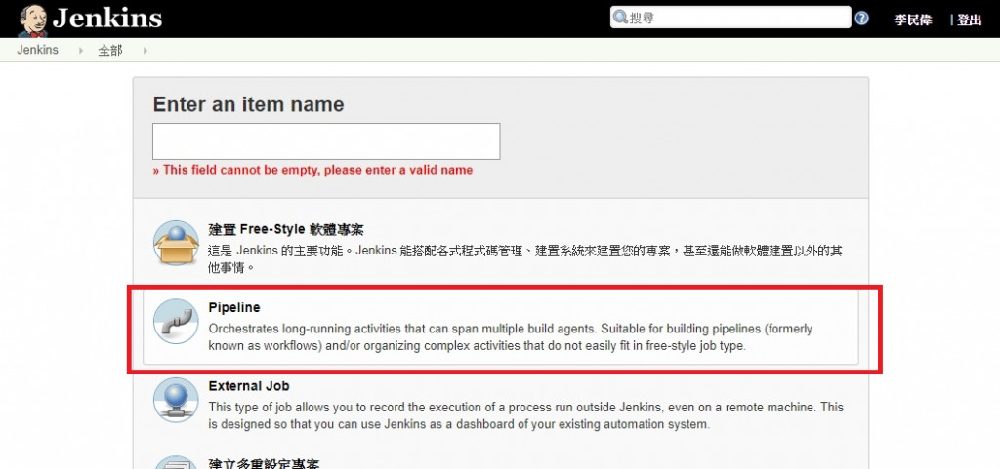

> [2019 iT 邦幫忙鐵人賽](https://ithelp.ithome.com.tw/users/20107551/ironman/1906) 文章補完計劃，[從零開始建立自動化發佈的流水線](../build-ci-cd-from-scratch/index.md#container) Container 篇

在 [Docker 操作簡介](../docker-operate/index.md) 中，初步了解 Docker、dockerfile、docker-compose 的操作方法。

接下來，要與 CI Server 搭配使用，讓 CI Server 可以依據設定檔，使用 docker 的方式，建置出執行 CI 所需要的環境。

<!--more-->

## Travis CI

在 [Travis CI 官方文件](https://docs.travis-ci.com/user/docker/)中，提到使用  `docker` 與 `docker-compose` 兩種建置方式，若想更進一步查看詳細資訊，建議直接進入 Travis CI 官網文件 [Using Docker in Builds](https://docs.travis-ci.com/user/docker/)觀看。

在 Travis CI 的服務，所有與 CI 相關的設定，預設都寫在 `.travis.yml` 之中，所以若要使用 Docker 進行建置，必須在 `.travis.yml` 加入以下設定。

```yaml
services:
  - docker
```

在官方提供的 `travis.yml` 範例中，在 `before_install` 區塊，直接使用 docker command 進行設定與執行。

```yaml
# .travis.yml

sudo: required

language: ruby

services:
  - docker

before_install:
  - docker build -t carlad/sinatra .
  - docker run -d -p 127.0.0.1:80:4567 carlad/sinatra /bin/sh -c "cd /root/sinatra; bundle exec foreman start;"
  - docker ps -a
  - docker run carlad/sinatra /bin/sh -c "cd /root/sinatra; bundle exec rake test"

script:
  - bundle exec rake test
```

同時，Travis CI 預設已經安裝完成 `docker-compose`，所以可以直接使用。

```yaml
services:
  - docker
 
script:
  - docker-compose build
  - docker-compose run test

```

若是想要指定替換特定版本的 `docker-compose`，也可以參考官方提供的 `travis.yml` 範例。

在 `before_install` 區塊，進行 `docker-compose` 的下載與替換。

```yaml
services:
  - docker

env:
  - DOCKER_COMPOSE_VERSION=1.4.2

before_install:
  - sudo rm /usr/local/bin/docker-compose
  - curl -L https://github.com/docker/compose/releases/download/${DOCKER_COMPOSE_VERSION}/docker-compose-`uname -s`-`uname -m` > docker-compose
  - chmod +x docker-compose
  - sudo mv docker-compose /usr/local/bin

script:
  - docker-compose build
  - docker-compose run test
```

## Azure DevOps

在 Azure DevOps 中，Azure Pipelins 負責 CI/CD 的動作。而 CI/CD 的執行動作設定，預設於 `azure-pipelines.yml`。若要在 `azure-pipeline.yml` 使用 docker/container，目前有查到 Microsoft 官方提供三種設定方式。

⚠️ 此三種方式未實際操作，僅提供參考，請小心服用。⚠️

方法一、在 `azure-pipelines.yml` 的 job，直接指定使用 [Container Jobs](https://learn.microsoft.com/en-us/azure/devops/pipelines/process/container-phases?view=azure-devops)。

```yaml
pool:
  vmImage: 'windows-2019'

container: mcr.microsoft.com/windows/servercore:ltsc2019

steps:
- script: set
```

方法二、在 `azure-pipelines.yml` 的 `task` 的宣告，直接告知使用 [`Docker@0`](https://learn.microsoft.com/en-us/azure/devops/pipelines/tasks/reference/docker-v0)、[`Docker@1`](https://learn.microsoft.com/en-us/azure/devops/pipelines/tasks/reference/docker-v2) 或 [`Docker@2`](https://learn.microsoft.com/en-us/azure/devops/pipelines/tasks/reference/docker-v2)，但詳細參數均有所不同，詳細資訊請參閱官方文件。

```yaml
# Docker v1
# Build, tag, push, or run Docker images, or run a Docker command.
- task: Docker@1
  inputs:
  # Container Registry
    containerregistrytype: 'Azure Container Registry' # 'Azure Container Registry' | 'Container Registry'. Required. Container registry type. Default: Azure Container Registry.
    #dockerRegistryEndpoint: # string. Optional. Use when containerregistrytype = Container Registry. Docker registry service connection. 
    #azureSubscriptionEndpoint: # string. Optional. Use when containerregistrytype = Azure Container Registry. Azure subscription. 
    #azureContainerRegistry: # string. Optional. Use when containerregistrytype = Azure Container Registry. Azure container registry. 
  # Commands
    #addBaseImageData: true # boolean. Add base image metadata to image(s). Default: true.
    command: 'Build an image' # 'Build an image' | 'Tag image' | 'Push an image' | 'Run an image' | 'login' | 'logout'. Required. Command. Default: Build an image.
    #dockerFile: '**/Dockerfile' # string. Required when command = Build an image || command = build. Dockerfile. Default: **/Dockerfile.
    #arguments: # string. Optional. Use when command != login && command != logout. Arguments. 
    #pushMultipleImages: false # boolean. Optional. Use when command = Push an image || command = push. Push multiple images. Default: false.
    #tagMultipleImages: false # boolean. Optional. Use when command = Tag image || command = tag. Tag multiple images. Default: false.
    #imageName: '$(Build.Repository.Name):$(Build.BuildId)' # string. Required when command = Build an image || command = build || command = Run an image || command = run || pushMultipleImages = false || tagMultipleImages = false. Image name. Default: $(Build.Repository.Name):$(Build.BuildId).
    #imageNamesPath: # string. Required when tagMultipleImages = true || pushMultipleImages = true. Image names path. 
    #qualifyImageName: true # boolean. Optional. Use when command = Build an image || command = build || command = Tag image || command = tag || command = Push an image || command = push || command = Run an image || command = run. Qualify image name. Default: true.
    #qualifySourceImageName: false # boolean. Optional. Use when command = Tag image || command = tag. Qualify source image name. Default: false.
    #includeSourceTags: false # boolean. Optional. Use when command = Build an image || command = build || command = Tag image || command = tag  || command = Push an image || command = push. Include source tags. Default: false.
    #includeLatestTag: false # boolean. Optional. Use when command = Build an image || command = build. Include latest tag. Default: false.
    #addDefaultLabels: true # boolean. Optional. Use when addDefaultLabels = false. Add default labels. Default: true.
    #useDefaultContext: true # boolean. Optional. Use when command = Build an image || command = build. Use default build context. Default: true.
    #buildContext: # string. Optional. Use when useDefaultContext = false. Build context. 
    #imageDigestFile: # string. Optional. Use when command = Push an image || command = push. Image digest file. 
    #containerName: # string. Optional. Use when command = Run an image || command = run. Container name. 
    #ports: # string. Optional. Use when command = Run an image || command = run. Ports. 
    #volumes: # string. Optional. Use when command = Run an image || command = run. Volumes. 
    #envVars: # string. Optional. Use when command = Run an image || command = run. Environment variables. 
    #workingDirectory: # string. Optional. Use when command = Run an image || command = run. Working directory. 
    #entrypointOverride: # string. Optional. Use when command = Run an image || command = run. Entry point override. 
    #containerCommand: # string. Optional. Use when command = Run an image || command = run. Container command. 
    #runInBackground: true # boolean. Optional. Use when command = Run an image || command = run. Run in background. Default: true.
    restartPolicy: 'no' # 'no' | 'onFailure' | 'always' | 'unlessStopped'. Required when runInBackground = true. Restart policy. Default: no.
    #maxRestartRetries: # string. Optional. Use when runInBackground = true && restartPolicy = onFailure. Maximum restart retries. 
  # Advanced Options
    #dockerHostEndpoint: # string. Docker host service connection. 
    #enforceDockerNamingConvention: true # boolean. Force image name to follow Docker naming convention. Default: true.
    #memoryLimit: # string. Memory limit.
```

作法三、在 `azure-pipelines.yml` 的 `task` 的宣告，直接告知使用 [`DockerCompose@0`](https://learn.microsoft.com/en-us/azure/devops/pipelines/tasks/reference/docker-compose-v0)。

```yaml
- script: |
# Docker Compose v0
# Build, push or run multi-container Docker applications. Task can be used with Docker or Azure Container registry.
- task: DockerCompose@0
  inputs:
    containerregistrytype: 'Azure Container Registry' # 'Azure Container Registry' | 'Container Registry'. Required. Container Registry Type. Default: Azure Container Registry.
    #dockerRegistryEndpoint: # string. Optional. Use when containerregistrytype = Container Registry. Docker Registry Service Connection. 
    #azureSubscription: # string. Alias: azureSubscriptionEndpoint. Optional. Use when containerregistrytype = Azure Container Registry. Azure subscription. 
    #azureContainerRegistry: # string. Optional. Use when containerregistrytype = Azure Container Registry. Azure Container Registry. 
    dockerComposeFile: '**/docker-compose.yml' # string. Required. Docker Compose File. Default: **/docker-compose.yml.
    #additionalDockerComposeFiles: # string. Additional Docker Compose Files. 
    #dockerComposeFileArgs: # string. Environment Variables. 
    #projectName: '$(Build.Repository.Name)' # string. Project Name. Default: $(Build.Repository.Name).
    #qualifyImageNames: true # boolean. Qualify Image Names. Default: true.
    action: 'Run a Docker Compose command' # 'Build services' | 'Push services' | 'Run services' | 'Run a specific service' | 'Lock services' | 'Write service image digests' | 'Combine configuration' | 'Run a Docker Compose command'. Required. Action. Default: Run a Docker Compose command.
    #additionalImageTags: # string. Optional. Use when action = Build services || action = Push services. Additional Image Tags. 
    #includeSourceTags: false # boolean. Optional. Use when action = Build services || action = Push services. Include Source Tags. Default: false.
    #includeLatestTag: false # boolean. Optional. Use when action = Build services || action = Push services. Include Latest Tag. Default: false.
    #buildImages: true # boolean. Optional. Use when action = Run services. Build Images. Default: true.
    #serviceName: # string. Required when action = Run a specific service. Service Name. 
    #containerName: # string. Optional. Use when action = Run a specific service. Container Name. 
    #ports: # string. Optional. Use when action = Run a specific service. Ports. 
    #workingDirectory: # string. Alias: workDir. Optional. Use when action = Run a specific service. Working Directory. 
    #entrypoint: # string. Optional. Use when action = Run a specific service. Entry Point Override. 
    #containerCommand: # string. Optional. Use when action = Run a specific service. Command. 
    #detached: true # boolean. Optional. Use when action = Run services || action = Run a specific service. Run in Background. Default: true.
    #abortOnContainerExit: true # boolean. Optional. Use when action = Run services && detached == false. Abort on Container Exit. Default: true.
    #imageDigestComposeFile: '$(Build.StagingDirectory)/docker-compose.images.yml' # string. Required when action = Write service image digests. Image Digest Compose File. Default: $(Build.StagingDirectory)/docker-compose.images.yml.
    #removeBuildOptions: false # boolean. Optional. Use when action = Lock services || action = Combine configuration. Remove Build Options. Default: false.
    #baseResolveDirectory: # string. Optional. Use when action = Lock services || action = Combine configuration. Base Resolve Directory. 
    #outputDockerComposeFile: '$(Build.StagingDirectory)/docker-compose.yml' # string. Required when action = Lock services || action = Combine configuration. Output Docker Compose File. Default: $(Build.StagingDirectory)/docker-compose.yml.
    #dockerComposeCommand: # string. Required when action = Run a Docker Compose command. Command. 
    #arguments: # string. Optional. Use when action != Lock services && action != Combine configuration && action != Write service image digests. Arguments. 
  # Advanced Options
    #dockerHostEndpoint: # string. Docker Host Service Connection. 
    #nopIfNoDockerComposeFile: false # boolean. No-op if no Docker Compose File. Default: false.
    #requireAdditionalDockerComposeFiles: false # boolean. Require Additional Docker Compose Files. Default: false.
    #currentWorkingDirectory: '$(System.DefaultWorkingDirectory)' # string. Alias: cwd. Working Directory. Default: $(System.DefaultWorkingDirectory).
    #dockerComposePath: # string. Docker Compose executable Path.
```

## Jenkins

如果曾經使用 Jenkins 進行發佈，或許對 pipeline 並不陌生。

在 Pipeline 中，Jenkins 會依據 `jenkinsfile` 內容的指示執行各種動作。運用 Groovy 的格式來撰寫 `jenkinsfile` 讓使用者可以客制化建置的流程與環境。



經由 `jenkinsfile` 與 docker 的配合，我們可以自行訂定各 **階段 (stages)** ，使用不同 Docker Image 建置環境，執行不同的動作。而無需手動配置環境。

下面的範例，將會使用 Nodejs `7-alpine` 版本的 docker image 作為執行環境。並在`測試階段`，執行 node.js 的相關動作。

```groovy
Jenkinsfile (Declarative Pipeline)

pipeline {
    agent {
        docker { image 'node:7-alpine' }
    }
    stages {
        stage('Test') {
            steps {
                sh 'node --version'
            }
        }
    }
}
```

## 延伸閱讀

▶ Travis CI

- Travis CI Document, [Using Docker in Builds](https://docs.travis-ci.com/user/docker/)

▶ Azure Devops

- [Container Jobs in Azure Pipelines and TFS - Azure Pipelines | Microsoft Learn](https://learn.microsoft.com/en-us/azure/devops/pipelines/process/container-phases?view=azure-devops)
- [Build container images to deploy apps - Azure Pipelines | Microsoft Learn](https://learn.microsoft.com/en-us/azure/devops/pipelines/ecosystems/containers/build-image?view=azure-devops&tabs=yaml&viewFallbackFrom=vsts#example)
- [Docker@1 - Docker v1 task | Microsoft Learn](https://learn.microsoft.com/en-us/azure/devops/pipelines/tasks/reference/docker-v1?view=azure-pipelines)
- [DockerCompose@0 - Docker Compose v0 task | Microsoft Learn](https://learn.microsoft.com/en-us/azure/devops/pipelines/tasks/reference/docker-compose-v0?source=recommendations&view=azure-pipelines)

▶ Jenkins

- Jenkins Document, [Using Docker with Pipeline](https://jenkins.io/doc/book/pipeline/docker/)
- Miiro Juuso, [Building your first Docker image with Jenkins 2: Guide for developers](https://getintodevops.com/blog/building-your-first-docker-image-with-jenkins-2-guide-for-developers)
- Gustavo Apolinario, [Jenkins Building Docker Image and Sending to Registry](https://medium.com/@gustavo.guss/jenkins-building-docker-image-and-sending-to-registry-64b84ea45ee9)
- [持续集成之 Jenkins 通过 Deploy 插件热部署 java 程序(九)](http://blog.51cto.com/wzlinux/2166241)
- [A continuous integration pipeline with Jenkins in Docker](https://www.nielsvandermolen.com/continuous-integration-jenkins-docker/)
