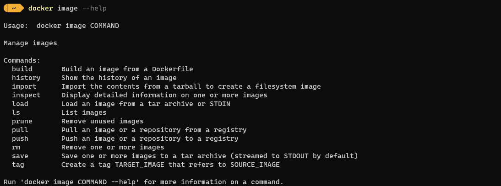
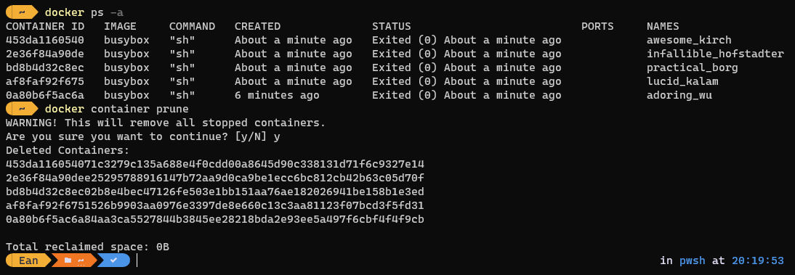

---
title: 靈活運用 Docker - 操作 Docker 與 Container 常用指令
description: 「靈活運用 Docker 打造高效的容器化應用環境」系列的文章之一。本篇文章整理使用 Docker 時，Image 與 Container 常用的基本指令，內容包含查詢、啟動、停止、移除等等。
date: 2023-11-30T18:46:44+08:00
lastmod: 2023-12-03T22:19:03+08:00
tags:
  - Docker
categories:
  - Container
keywords:
  - Docker
slug: docker-base-command-and-argument
series: 靈活運用 Docker 打造高效的容器化應用環境
---

> 本篇為 [靈活運用 Docker 打造高效的容器化應用環境](../flexibly-use-docker-foreword/index.md) 系列的文章之一。內容由現有的文章中，將相關的內容整理於此。後續不定期編修與更新內容。

## Docker command

若需確認機器上運行的 Docker 版本，可以使用以下指令來進行查詢。

```shell
docker --version

# 取回的資料較為詳細
docker version
```


### Image

在建立運行服務的 Container 時，一定要指定使用的 Image。Docker 才有辦法建立基於 Image 的 Container。所以說 Image 是 Docker 的核心，也不為過。

可以使用 `docker image --help` 查詢所有與 Image 相關的操作。



操作 Image 的指令很多，但最常用的指令有四種。

```bash
# 取得本地當下存放的 Image
# 可以檢視到 Image 的名稱、建立時間與大小
docker image ls

# 從 remote repository 下載 image，若沒有指定 Tag，預設會下載 latest
# 預設位置為 Docker Hub，可找到許多現成的 Image。
docker pull NAME:[Tag]

# 執行 Image，建立 Container
docker run NAME:[Tag]

# 移除 image
docker image rm IMAGE
docker rmi IMAGE
```

接著來實際操作指令，進行 Image 的 查詢、下載、移除等動作。


```shell
# create/build image
docker image build [dockerfile path]
```

當發現沒有適合的 Image 時，也可以自行建立 Image。建立 Image 時，Docker 會依據 YAML 格式所撰寫的 Dockerfile 內參數設定，來建立 Image。在 [dockerfile](#建立-docker-image) 會進一步介紹。

### Container

常用的 Container 指令如下

```bash
# 查看目前的 container 清單
docker ps
docker container ls

# 啟動已停止的 Container
docker start [CONTAINER ID]
docker container start [CONTAINER ID]

# 停止執行中的 Container
docker start [CONTAINER ID]
docker container start [CONTAINER ID]
```

先前，已經從 Docker Hub 取得 busybox 的 image，接著，我們使用 `docker run busybox` 的方式，告知 Docker Engine ，以 busybox Image 啟動 container。


在啟動 container 後，可以使用下述的指令，進行確認 container 目前的狀態。

```bash
# 查看目前的 container 清單
# 作法一
docker container ls
# 作法二
docker ps
```

但是，執行上述的指令取得的結果，會發現查不到任何資料，找不到與 busybox 相關的 container。

這是因為 busybox 在完成動作後，就會直接結束。而 `docker ps` 只會列出執行中的 container。所以必需在加上 `-a` 的參數，要求列出所有的 Container。


```bash
# 啟動已停止的 Container
# 作法一
docker start [CONTAINER ID]
# 作法二
docker container start [CONTAINER ID]
```

假若要執行的 container 己經存在，可以運用 `start` 來啟動己經停止的 container。在下圖可以發現的狀態有所變動。


若看到己經執行完成的 container 一直存在清單之中，覺得怪不舒服。可以用 `docker conatiner prune` 將一口氣已停止的 container 刪除。

下這個指令，請**務必、務必、務必確認已停止的 Container 沒有需要保留，不然清除後可是救不回來的。**

```shell
# remove stopped container
docker conatiner prune
```



相同的，如果要一口氣移除無用的 container、Volume、Network，則可以使用 `docker system prune`。

```shell
# remove unused data
docker system prune
```

## 補充資料

▶ 延伸閱讀

- [Docker 操作簡介](../../build-automated-deploy/docker-operate/index.md)
- [靈活運用 Docker - 打造高效的容器化應用環境](../flexibly-use-docker-foreword/index.md)

▶ 外部文章
